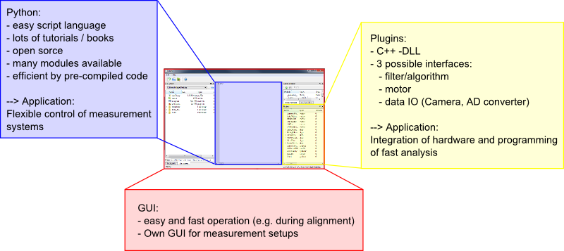

.. include:: ../include/global.inc

Introduction
#########################################

|itom| is a lab automation and measurement software developed, maintained and
provided by the ITO (Institut for Technical Optics, Universität Stuttgart, Germany).
While this software has been designed with an emphasis on developing and
running optical systems, it is not limited to this field of application.
|itom| represents a versatile tool for building the control software for any
measurement setup aimed at a high degree of adaptability to different
parameters and variable hardware. To address these requirements it was decided
to design a powerful and fast core-program, integrating a scripting language in
order to easily modify and transfer code blocks from one part of the program to
another and to provide a simple and unitary interface for controlling
external hardware components. Beyond the control of the physical setup, |itom|
provides a wide variety of features for the analysis and processing of the
acquired data. |itom| is best considered as an open source lab automation
software whose functionalities lie somewhere between commercial software
packages like Matlab or Labview.

The following table shows in which way base requirements to such a software
system have influenced the choice of components during the designing process:

+---------------------------------------------------------------+---------------------------+
| What we wanted                                                | How we did it             |
+===============================================================+===========================+
| fast software, development of fast algorithms                 | C++                       |
+---------------------------------------------------------------+---------------------------+
| modern multi-platform GUI                                     | Qt-Framework              |
+---------------------------------------------------------------+---------------------------+
| easy integration of different hardware (camera, actuator,...) | Plugin system             |
+---------------------------------------------------------------+---------------------------+
| fast, robust and easy-to-learn scriptingnguage                | Python                    |
+---------------------------------------------------------------+---------------------------+

In the figure below you can see the three columns on which |itom| is based:

1. Python
2. Plugins
3. GUI

Based on these three columns you can control measurement applications, basic
setups or scripted image processing.

To learn more about how to control |itom| via script language or the GUI proceed
to :ref:`gettingStarted`.

About us
**************

| Institut für Technische Optik
| Universität Stuttgart
| Pfaffenwaldring 9
| 70569 Stuttgart
|
| **Report issues at:**
| https://github.com/itom-project/itom/issues

This help has been built for itom-version |version| (Git-revision |release|).

Licensing
***********

itom Licensing
===============

The core components and the main application of |itom| are covered by the
**GNU Library General Public Licence** (GNU LGPL). All components belonging to
the SDK of |itom| (e.g. *dataObject*, *pointCloud*, *addInInterface*,...) are
additionally covered by an **itom exception**. The main idea of this exception is
to allow other libraries (e.g. plugins) to include and link against components
of |itom| SDK independent on the specific license model of the respective "other" library.
All files belonging to the |itom| SDK are included in the folder **SDK** that
is shipped with any setup or included in the build directory (when build from sources).

The full text license of **LGPL** and **itom exception** is also included as
file *COPYING* in the source distributions and setups.

All plugins and designer-plugins that can be integrated into |itom| can have
their own licensing. Therefore the user is referred to the specific licensing
documents or statements of each external library (plugin).

itom Exception
=================

All components (source files) which are part of |itom| SDK are not only covered
by the LPGL license but also by the *itom Exception*, that provides further
grants and rights for using these components::

    ITO LGPL Exception version 1.0
    ------------------------------

    Additional rights granted beyond the LGPL (the "Exception").

    As a special exception to the terms and conditions of version 2.0 of the LGPL,
    ITO hereby grants you the rights described below, provided you agree to
    the terms and conditions in this Exception, including its obligations and
    restrictions on use.

    Nothing in this Exception gives you or anyone else the right to change the
    licensing terms of the itom Software.

    Below, "Licensed Software" shall refer to the software licensed under the LGPL
    and this exception.

    1) The right to use Open Source Licenses not compatible with the GNU
    Library General Public License: Your software (hereafter referred to as "Your
    Software") may import the Licensed Software and/or distribute binaries of Your
    Software that imports the Licensed Software.

    2) The right to link non-Open Source applications with pre-installed versions of
    the Licensed Software: You may link applications with binary pre-installed
    versions of the Licensed Software.

    3) The right to subclass from classes of the licensed software: Classes that are
    subclassed from classes of the licensed software are not considered to be
    constituting derivative work and therefore the author of such classes does
    not need to provide source code for this classes.

Package Licences
=================

A standard distribution of |itom| links to or uses the following
third-party libraries (for exact version numbers, see the **About** dialog
of itom):

* The `QT-Framework <https://www.qt.io>`_ by The Qt Company
  under LGPLv3.
* `OpenCV <https://opencv.org>`_ by Intel and Willow Garage
  under BSD-license.
* `point cloud library <http://www.pointclouds.org/>`_ in version 1.9.1 by
  Open Perception Inc. under BSD license.
* `The visualization toolkit (VTK) <https://vtk.org>`_ under the BSD license.
* `Python <https://www.python.org>`_ in version 3.8.7 by Python Software
  Foundation under Python Software Foundation License Version 2
  (similar to BSD license).
* Python-package `NumPy <http://numpy.org/>`_ under BSD compatible license.
* `Oxygen Iconset <https://techbase.kde.org/Projects/Oxygen/Licensing>`_ under
  LGPLv3 license, as part of the `KDE project <http://www.kde.org>`_.
* A modified version of `QPropertyEditor <https://www.linux-apps.com/p/1132202/>`_
  that is licensed under LGPLv2.
* The script editor and console widget is partially based on a C++ port of the
  Python project `PyQode <https://github.com/pyQode/pyQode>`_
  (PyQode.Core, 2.11.0 and PyQode.Python 2.11.1) that are licensed under MIT.
* Some parts of itom are also inspired by the
  `Spyder IDE <https://github.com/spyder-ide>`_ (version 4),
  also licensed under the MIT License and developed by the Spyder Project
  Contributors. Some code snippets from Spyder have been ported to C++.
* `Google test framework <https://github.com/google/googletest>`_ by Google
  under New BSD-license. This is not part of any itom binary distribution.
* Some parts of the python binding and conversion classes are inspired by
  `PythonQt <https://mevislab.github.io/pythonqt>`_ (under LGPLv2.1).
* Many widgets, that are provided via the itomWidgets library, are (modified)
  versions from the `Common Toolkit project <http://www.commontk.org/docs/html/index.html>`_,
  licensed under Apache 2.0.
* itom uses a modified version of the `Property Browser <https://github.com/qtproject/qt-solutions/tree/master/qtpropertybrowser>`_,
  a part of the
  `Qt Solutions Components <https://github.com/qtproject/qt-solutions>`_,
  licensed under the BSD license. For more details about
  3rd party licenses, see the text documents in the licenses folder.

Python packages
---------------
A minimal installation of itom requires Python including its numeric package
Numpy (see above). Furthermore, it is possible to install other python packages
(like Scipy, Matplotlib...). For a list of installed packages including their
specific licenses, see the **Package Manager** dialog in the menu **Scripts**.

Up to itom 4.3.0, only Numpy < 2.0 is supported. Support for Numpy 2.0 or above will
be added later on.

Usage of 3rd party libraries in plugins and designer plugins (plots...)
------------------------------------------------------------------------
Plugins and designer plugins (plots...) can make use of further 3rd party
libraries. The following list contains some libraries which are often used in
a standard installation of itom. For more information about used libraries, see
the specific plugin documentation or the about / license strings of every plugin.

* The designer plugins ``itom1dqwtplot`` and ``itom2dqwtplot`` are based on
  the library `QwtPlot <http://qwt.sourceforge.net>`_ by Uwe Rathmann and
  Josef Wilgen under LGPLv2.1 with additional exceptions.
* The ``vtk3dvisualizer`` designer plugin is based on the
  `The visualization toolkit (VTK) <https://vtk.org>`_ under the BSD license.
* OpenMP, see http://openmp.org/wp/
* Hardware dependent third party driver and SDKs with different license models
  may be published under different terms or conditions than the main
  itom-program. So please check the plugin-license before distributing plugins.
