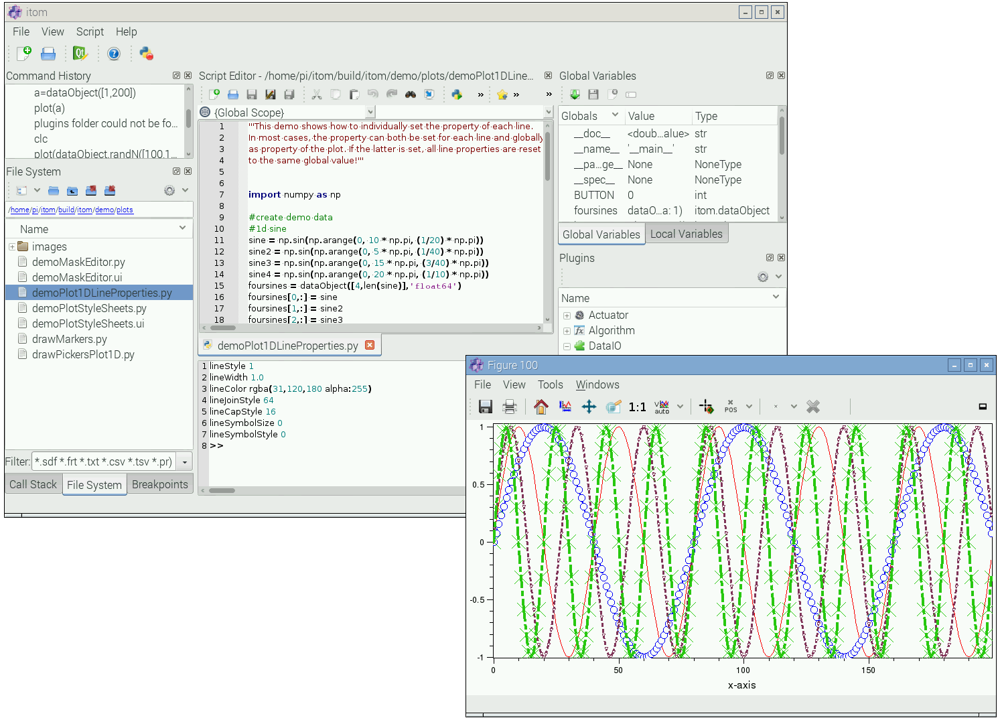

.. include:: ../include/global.inc

.. _build-debian:

Build on Ubuntu(22.04 LTS)/Debian/Raspberry Pi
================================================================================

This section describes how |itom| and its plugins are built on a Debian-based
operating system, like Debian itself, Ubuntu or any of its derivates or even
the Raspberry Pi (Raspbian) operation system.

Steps are as usual:

*  obtain dependencies
*  obtain sources
*  configure projects
*  compile projects
*  ->test/use project?

Necessary packages
-------------------------------------------------------------------------------

Most necessary packages can be obtained by the package manager of your solution 
(Synaptic Package Manager, command *sudo apt*...).
The following list describe packages that are required or recommended for building |itom|:

Required:

* **Qt5** (libqtcore*, libqt*-dev, libqt*-...)
* **OpenCV** (libopencv-core* libopencv-core-dev, libopencv-imgproc, libopencv-highgui...)
* **Python3** (python3, python3-dev, python3-dbg)
* **Numpy** (python3-numpy, python3-numpy-dbg)
* **git** (git)
* **Cmake** (cmake, cmake-gui/ccmake)

Recommended (optional):

* The IDE **QtCreator** (qtcreator)
* **PointCloudLibrary** (minimum version 1.6, >= 1.8 recommended.
  see http://pointclouds.org/downloads. The PCL is an optional dependency.)
* **Scipy** (python3-scipy, python3-scipy-dbg), 
* **Sphinx** (python3-sphinx) + **numpydoc** + **breathe**, 
* **Matplotlib**
* **Doxygen** (doxygen, doxygen-gui)
* Any git client (e.g. SmartGit (requires java) or git-cola or Guitar)
* glew (libglew*-dev or something similar, required by some plugins)
* fftw (libfftw3-dev or something similar, required by some plugins)
* python-opencv python bindings for opencv. Make sure to install them with the 
  same version/from the same source as opencv itself. use sudo apt install opencv-python 
  instead of pip3 if you installed opencv using apt.

Recommended folder structure
-------------------------------------------------------------------------------

Similar to Windows, the following folder structure is recommended:

.. code-block:: bash
    
    ./sources
        ./itom    # cloned repository of core
        ./plugins # cloned sources of plugins
        ./designerPlugins # cloned sources of designerPlugins
        ...
    # base folder for compilation. The makefiles should 
    # be stored in the following subfolders (depending on project):
    ./build       
        ./itom    # ...core
        ./plugins # ...plugins
        ./designerPlugins # ...designer plugins
        ...
    #Optionally, if you want to do debug and release builds separately:
    # base folder for debug compilation (if desired). The makefiles 
    # should be stored in the following subfolders (depending on project):
    ./build_debug 
        ./itom    # ...core
        ./plugins # ...plugins
        ./designerPlugins # ...designer plugins
        ...
    # base folder for release compilation (if desired). The makefiles should 
    # be stored in the following subfolders (depending on project):
    ./build_release 
        ./itom      # ...core
        ./plugins   # ...plugins
        ./designerPlugins # ...designer plugins
        ...
        
        
Copy code to make folder structure:

.. code-block:: bash
    
    mkdir itom \ mkdir -p itom/{sources,build_debug,build_release}/{itom,plugins,designerplugins}

Obtain the Dependencies
-------------------------------------------------------------------------------

In the following, all required steps are indicated to get the dependencies, get 
the sources and compile itom by the command line.

Please execute the following commands in the command line to get the dependencies 
for |itom| (comments after the hash-tag should not be copied to the command line):

.. code-block:: bash
      
    sudo apt update
    sudo apt install build-essential cmake cmake-qt-gui git python3 python3-dev python3-numpy python3-pip python3-apt-dbg \
        libqt5webkit5 libqt5webkit5-dev libqt5widgets5 libqt5xml5 libqt5svg5 libqt5svg5-dev libqt5gui5 libqt5designer5 libqt5concurrent5 qttools5-dev-tools qttools5-dev
    sudo apt install libopencv-dev python3-opencv libv4l-dev xsdcxx libxerces-c3.2 libxerces-c-dev #these are optional
    sudo apt install qtwebengine5-dev libqt5webengine5 libqt5webenginewidgets5 # not possible on raspbian
    sudo apt install libv4l-dev #this is optional to get the video for linux drivers

Since the Qt webengine is not available (yet) on **Rasbpian** (at least for Raspbian buster or older),
you cannot get the webengine libraries. Therfore the update commands look like this:

.. code-block:: bash
    
    sudo apt update
    sudo apt install build-essential cmake cmake-qt-gui git python3 python3-dev python3-numpy python3-pip python3-apt-dbg \
        libqt5webkit5 libqt5webkit5-dev libqt5widgets5 libqt5xml5 libqt5svg5 libqt5svg5-dev libqt5gui5 libqt5designer5 libqt5concurrent5 qttools5-dev-tools qttools5-dev
    sudo apt install libopencv-dev python3-opencv libv4l-dev xsdcxx libxerces-c3.2 libxerces-c-dev #these are optional
    sudo apt install freeglut3-dev #if the itomIsoGlWidget (designerplugin) should be compiled

The packages *xsdcxx* and *libxerces-c-dev* are only required for building the optional plugin *x3p*. Usually, *libxerces-c-dev*
should install its runtime package *libxerces-c3.2* (or similar).

If you want to compile |itom| with support from the Point Cloud Library, also get the following packages:

.. code-block:: bash
    
    sudo apt install libpcl-dev libproj-dev

Now, change to the base directory, where the sources and builds of itom and its 
plugins should be placed. The following commands are not executed
with super-user rights; prepend *sudo* if this is required:

Obtain the sources
-------------------------------------------------------------------------------

.. code-block:: bash
    
    git clone https://bitbucket.org/itom/itom.git ./itom/sources/itom
    git clone https://bitbucket.org/itom/plugins.git ./itom/sources/plugins
    git clone https://bitbucket.org/itom/designerplugins.git ./itom/sources/designerplugins
    
    cd itom/build_release/itom
    cmake -G "Unix Makefiles" -DBUILD_WITH_PCL=OFF -DCMAKE_BUILD_TYPE=Release ../../sources/itom  #If PCL-support should be enabled, replace OFF by ON
    make -j4
    cd ../designerPlugins
    cmake -G "Unix Makefiles" -DBUILD_WITH_PCL=OFF -DCMAKE_BUILD_TYPE=Release -DITOM_SDK_DIR=../itom/SDK ../../sources/designerPlugins #If PCL-support should be enabled, replace OFF by ON
    make -j4
    cd ../plugins
    cmake -G "Unix Makefiles" -DBUILD_WITH_PCL=OFF -DCMAKE_BUILD_TYPE=Release -DITOM_SDK_DIR=../itom/SDK ../../sources/plugins #If PCL-support should be enabled, replace OFF by ON
    make -j4
    
If you want to compile **itom** under **Raspbian** add **BUILD_WITH_HELPVIEWER=OFF** to the **cmake**
command of the itom project (necessary due to unavailable webengine package of Qt):

.. code-block:: bash
    
    cd itom/build/itom
    cmake -G "Unix Makefiles" -DBUILD_WITH_PCL=OFF -DBUILD_WITH_HELPVIEWER=OFF ../../sources/itom
    make -j4
    
Configuration process
-------------------------------------------------------------------------------

Use **CMake** to create the necessary makefiles for debug and/or release:
Most IDEs don't follow the concept of having different configurations for Debug/Release.
So you need to separate Debug builds from release builds, if required. But you can also mix these,
e.g. for Debugging some plugin, you don't necessarily need a Debug Version of itom.
If this step fails, use ccmake or cmake-gui toi manually fix errors.

1. Indicate the folder **sources/itom** as source folder
2. Indicate either the folder **build_debug/itom** or **build_release/itom** as 
    build folder. If the build folder already contains configured makefiles, 
    the last configuration will automatically loaded into the CMake gui.
3. Set the following variables:
    * **CMAKE_BUILD_TYPE** to either **Debug** or **Release**
    * **BUILD_TARGET64** to ON if you want to build a 64bit version.
      (actually not needed, forces void* size to differ from the selected generator's one)
    * **BUILD_WITH_PCL** to ON if you have the point cloud library available on your 
      computer and want to compile |itom| with support for point clouds and polygon meshes.
    
4. Push the configure button
5. Usually, CMake should find most of the necessary third-party libraries, however you should check the following things:
    * OpenCV: OpenCV is located by the file **OpenCVConfig.cmake** in the directory **OpenCV_DIR**. 
      Usually this is automatically detected in **usr/share/OpenCV**. 
      If this is not the case, set **OpenCV_DIR** to the correct directory and press configure.
    * Python3: On some linux distributions, CMake always finds the Python version 2 as default version. 
      This is wrong. Therefore set the following variables to the right pathes: 
      PYTHON_EXECUTABLE to /usr/bin/python3.2, PYTHON_INCLUDE_DIR to /usr/include/python3.2, 
      PYTHON_LIBRARY to /usr/lib/libpython3.2mu.so.1.0 . The suffix 1.0 might also be different. 
      It is also supported to use any other version of Python 3.
6. Push the configure button again and then generate.
7. Now you can build |itom| by the **make** command or using **QtDesigner**:
    * **make**: Open a command line and switch to the **build_debug/itom** directory. 
      Simply call **make** such that the file **qitom** or **qitomd** (debug) is built. 
      Start this application in order to run |itom|.
    * **QtCreator**: Open QtCreator and open a new project. Indicate the file 
      **CMakeList.txt** of **sources/itom** as project file. Now QtCreator asks 
      where to build the binaries. Indicate the existing and pre-configured 
      directory **build_debug/itom** or **build_release/itom**. The existing CMake 
      cache files will be read and you can simply run CMake from QtCreator that 
      should not fail. If so, re-open CMake and fix it. In the project settings 
      of QtCreator you can finally clone the current configuration and indicate 
      the second build-folder for the release version.
    
    
Build itom/plugins/designerplugins
-------------------------------------------------------------------------------

Build the plugins, designerPlugins... in the same way than |itom| but make sure 
that you compiled |itom| at least once before you start configuring and compiling 
any plugin. In CMake, you need to indicate the same variables than above, but you 
also need to set the variable **ITOM_SDK_DIR** to the **sdk** folder 
in **build_debug/itom/sdk** or **build_release/itom/sdk** depending whether you 
want to compile a debug or release version (please don't forget to set **CMAKE_BUILD_TYPE**). 

If you don't want to have some of the plugins, simply uncheck them in CMake under the group **Plugin**.

The plugins and designerPlugins will finally be compiled and then copy their 
resulting library files into the **designer** and **plugins** subfolder of |itom|. 
Restart |itom| and you the plugin will be loaded.
If **itom** is build with Point Cloud Library and you want to build the **Vtk3dVisualizer** 
with **vtk 6.2** you may come up with a linker exception: **cannot find -lvtkproj4**
This can be fixed by generating a sybolic link to any vtk .so file as followed:

.. code-block:: bash

    ln -s /usr/lib/x86_64-linux-gnu/libvtkCommonCore-6.2.so /usr/lib/libvtkproj4.so

QtCreator
-------------------------------------------------------------------------------

Qtcreator may create its projects from CMakelists.txt files and use the given generator/toolchain
you already specified in the **CMake** generation process. On the lower left side there are project properties.
You can specify an executable that should be started using the current project.
So debugging your plugins may trigger the startup of itom projects, if you set the startup to some itom exec.

Hints
-------------------------------------------------------------------------------

If there is an SSL certificate error in the git clone process, try to add::
    
    git -c http.sslVerify=false clone ...

to the *clone* command

Execute
-------------------------------------------------------------------------------

Run the file **qitom** in the *build/itom* directory. Please give itom the rights 
to write files in the directory, e.g. the settings.ini file.

Camera of Raspberry Pi
-------------------------------------------------------------------------------

If you want to access the optional camera of the Raspberry Pi, you can do 
this using the **v4l2** or **OpenCVGrabber** plugins. Before doing this, you have
to start the v4l2 camera driver process (every time the raspi is started, or 
place it in the autostart script)::
    
    sudo modprobe bcm2835-v4l2

This should be checked with your raspi's current's documentation.
https://www.raspberrypi.org/documentation/raspbian/applications/camera.md
Could also be::
    
    sudo modprobe v4l2_common

Keyboard issues with remote desktop
-------------------------------------------------------------------------------

If the keyboard layout does not correctly work, especially in a remote desktop 
environment, try to apply the following command in a shell before
starting itom (from the same shell)::
    
    export XKB_DEFAULT_RULES=base
    
To enable ssh by default, put a file named ssh or ssh.txt in the /boot directory.

