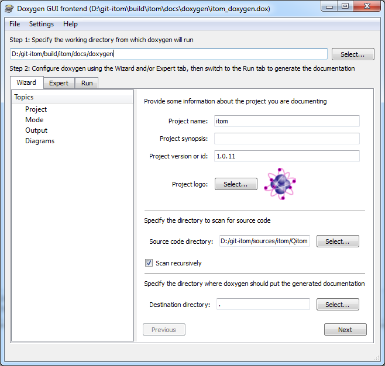

.. include:: ../include/global.inc

.. _buildDocumentation:

Build documentation
==========================

Necessary tools
-----------------

In order to be able to build the documentation, you need to have some tools 
installed on your computer. The main applications are:

1. Doxygen
    
    Doxygen is a source code documentation tool, that parses your C++-source 
    code and extracts the documentation strings for all methods.
    Additionally, it displays the entire class- and file-structure of your 
    project. |itom|'s user documentation sometimes uses results
    from Doxygen in order to show relevant C++-structures for programming plugins.
    
    Windows users can download the binaries as setup from http://www.doxygen.nl/download.html. 
    Under linux the easiest way is to get the latest
    doxygen package that is available for your distribution.

2. Python-Package Sphinx
    
    The real user documentation is created in |itom| using a python script that 
    needs the |Python| package **Sphinx** (http://sphinx-doc.org/).
    **Sphinx** itself requires other python packages to be installed on your 
    computer. For windows users, we therefore suggest to obtain **Sphinx** via
    the python package manager, using **pip**.
    
    The easiest way to obtain **Sphinx** is using the :ref:`Python package 
    manager <gui-pipmanager>` in the *script* menu of |itom|. Choose
    **install** and then **Sphinx** from the Python package index to obtain 
    Sphinx including all depending packages. Select the **Upgrade** checkbox
    if you want to upgrade **Sphinx** to a newer version.
    
    You can also manually download and install Sphinx and its depending packages. 
    However, you 
    then need to separately install all depending packages of **Sphinx**.

3. Python-Packages and Sphinx extensions

    In the |itom| sources folder **itom/docs/userDoc**, you can find a 
    **requirements.txt** file containing all further necessary python packages 
    and Sphinx extensions. Install them by using **pip**:
    
    .. code-block: bat
        
        python.exe -m pip install -r requirements.txt
        
    Following packages will be installed: 
    
    * `breathe <https://pypi.org/project/breathe/>`_
    * `matplotlib <https://pypi.org/project/matplotlib/>`_
    * `numpy <https://pypi.org/project/numpy/>`_
    * `numpydoc <https://pypi.org/project/numpydoc/>`_
    * `openpyxl <https://pypi.org/project/openpyxl/>`_
    * `pandas <https://pypi.org/project/pandas/>`_
    * `plotly <https://pypi.org/project/plotly/>`_
    * `tables <https://pypi.org/project/tables/>`_
    * `scikit learn <https://pypi.org/project/scikit-learn/>`_
    * `scipy <https://pypi.org/project/scipy/>`_
    * `seaborn <https://pypi.org/project/seaborn/>`_
    * `sphinx <https://pypi.org/project/Sphinx/>`_
    
    To create the demo chapter documentation, the Sphinx extension:
    
    * `sphinx_gallery <https://pypi.org/project/sphinx-gallery/>`__
    
    is needed. See in chapter :ref:`add-demo-label`, how a demo must be formatted
    to build the it into the documentation. 

    For the html builder the following packages are installed, too.
    
    * `sphinx-copybutton <https://pypi.org/project/sphinx-copybutton/>`_
    * `sphinx-rtd-theme <https://pypi.org/project/sphinx-rtd-theme/>`_ 

Run doxygen
---------------
.. doxygenLabel:

In your build-directory of |itom|, you will find a folder **docs**. Open its 
subfolder **doxygen**. There you will find a document
**itom_doxygen.dox**. This document contains absolute paths to the source 
directories of |itom|'s sources. Run doxygen with this document
in order to create the source code documentation. 

You can also run the **create_doc.py** script explained in :ref:`sphinxLabel` section. 
First of all it will ask you if you want to run doxygen, too. 

On Windows computers, the easiest way to do this is open **itom_doxygen.dox** 
with the tool **doxywizard** that is located in the **bin**-folder 
of your **doxygen** installation. In **doxywizard** go to the *run*-tab and 
click on the *run*-button.

After the build process, a folder **xml** is created in the **doxygen** 
sub-folder of the **docs** folder. This **xml** folder is required afterwards.

.. _sphinxLabel:

Run Sphinx
--------------

Now, open |itom| and execute the script **create_doc.py** in the folder **docs/userDoc** 
of the build-directory. The default-builder of the
documentation is **qthelp**. If you also want to build the documentation for other 
builders, you can change the list *buildernames*. The following
values are possible::
    
    qthelp -> default qthelp format for opening the documentation within itom
    html -> creates the help for the homepage
    htmlhelp -> creates a chm-help format on Windows only
    latex -> creates a pdf-document using latex. You need to have latex 
      installed on your computer

The output of all build processes are located in the folder **docs/userDoc/build/<buildername>**. 
The locations of the Windows html-help generator or
the latex interpreter are detected when running **CMake** for the |itom|-project. 
The absolute paths to these tools are automatically
inserted into the script **create_doc.py**.

Show documentation in |itom|
-----------------------------

When clicking the *help*-button in |itom| or pressing **F1**, |Qt|'s assistant
is opened with a set of documentation files. At first, |itom| checks your |itom|
installation for various documentation files. Their latest version is then
copied into the **help** folder of the build-directory. The search is executed
for all **.qch**-files in the following subdirectories of the **docs**
directory:

* **userDoc**: The user documentation for itom.
* **pluginDoc**: The plugin documentation for all currently available plugins.
* **additionalDocs**: Additional **.qch**-files can be placed here and will be appended to the documentation.

After having copied the files, a collection-file is generated (containing all qch-files) 
and displayed in the assistant. If you have a setup version of |itom|, the help-folder 
already contains a compiled documentation file, that is displayed in this case. 
Please note that the file check is only execute once per |itom| session. 
Restart it in order to redo the check.

.. _add-demo-label:

Add a demo script to the documentation
--------------------------------------

The demo documentation chapter is build using the Sphinx extension `sphinx_gallery <https://sphinx-gallery.github.io/stable/index.html>`__, 
which auto-generates the documentation necessary files from the python script. This adds the demo to the :ref:`itom demo gallery <gallery-demos-label>` , 
which is divided into **itom** , **python** and **python-packages**. The demo page is divided accordingly 
into code blocks and documentation markdowns, similar to a Juypter notebook. For this, each script must contain a header, 
as described in the `Sphinx Gallery documentation <https://sphinx-gallery.github.io/stable/getting_started.html#creating-a-basic-gallery>`__.

`sphinx_gallery <https://sphinx-gallery.github.io/stable/index.html>`__ can also integrate **print outputs** and **plots** into the documentation. 

.. important::

    If the demo script filename contains the prefix **demo_**, this script will be executed 
    when creating the documentation and the print outputs and plots will be generated and added. 
