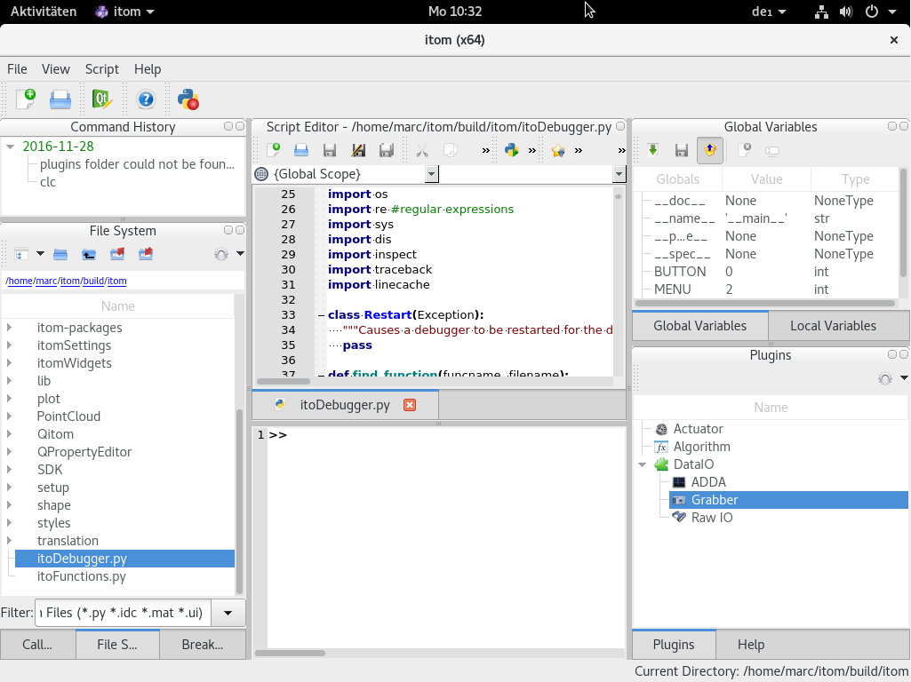

.. include:: ../include/global.inc

.. _build-fedora:

Build on Fedora
======================

This section describes how |itom| and its plugins are built on Fedora (tested with Fedora 25).
For general information about building |itom| under linux, see the :ref:`build instructions for linux <build-Debian>`.

In the following, all required steps are indicated to get the dependencies, get the sources and compile itom by the command line.
The folder structure is chosen to be equal than the one from the linux instructions, however itom will only be build in a release version.

Please execute the following commands in the command line to get the dependencies
for |itom| (comments after the hash-tag should not be copied to the command line):

.. code-block:: bash

    sudo dnf install cmake cmake-gui git
    sudo dnf install gcc gcc-c++
    sudo dnf install python3 python3-devel python3-numpy python3-pip #problem: python3-dev
    sudo dnf install qt5 qt5-devel  # only Fedora < 35
    sudo dnf install qt5-qtbase-devel qt5-qtbase-static qt5-qttools-devel qt5-qttools-static qt5-qtwebengine-devel qt5-qtsvg-devel  # Fedora >= 35
    sudo dnf install opencv opencv-devel

    sudo dnf install libv4l libv4l-devel #this is optional to get the video for linux drivers
    sudo dnf install libusb-devel systemd-devel #this is optional to get the libusb drivers
    sudo dnf install xerces-c xerces-c-devel xsd #this is optional to being able to compile the x3p plugin

In one line, the packages above are equal to (for Fedora >= 35):

.. code-block:: bash

    sudo dnf install cmake cmake-gui git gcc gcc-c++ python3 python3-devel python3-numpy python3-pip qt5-qtbase-devel qt5-qtbase-static qt5-qttools-devel qt5-qttools-static qt5-qtwebengine-devel qt5-qtsvg-devel opencv opencv-devel libv4l libv4l-devel xerces-c xerces-c-devel xsd

If you want to compile |itom| with support from the Point Cloud Library, also get the following packages:

.. code-block:: bash

    sudo dnf install pcl pcl-devel proj-devel boost boost-devel

Now, change to the base directory, where the sources and builds of itom and its plugins should be placed. The following commands are not executed
with super-user rights; prepend *sudo* if this is required.

**Fedora version < 35**

In comparison to building *itom* under Debian based Linux versions, the CMake
configuration process under Fedora needs some more *hints* about where to find some libraries etc. Therefore, it might be, that you have
to adjust some paths below. Currently, Qt5 is still built without webkit-support under Fedora, such that the WebEngine-support is not available.
Therefore, the built-in helpviewer of itom has to be disabled. For building itom **without** point cloud support use:

.. code-block:: bash
    git clone --recursive --remote git@github.com:itom-project/itomProject.git
    cd itomproject
    git submodule foreach --recursive git checkout master
    mkdir -p ./{build_debug,build_release}
    cd ./build_release
    cmake -G "Unix Makefiles" -DBUILD_WITH_PCL=OFF -PYTHON_LIBRARY=/usr/lib64/libpython3.5m.so -PYTHON_INCLUDE_DIR=/usr/include/python3.5m -DQt_Prefix_DIR=/usr/lib64 -BUILD_WITH_HELPVIEWER=OFF ../
    make -j4

**Fedora >= 35**

For these versions, CMake is able to detect Qt5 and Python automatically. Additionally, the qt5 webengine is available:

.. code-block:: bash
    cmake -G "Unix Makefiles" -DBUILD_WITH_PCL=OFF ../

**With** point cloud support use:

.. code-block:: bash
    cmake -G "Unix Makefiles" -DBUILD_WITH_PCL=ON -DPYTHON_LIBRARY=/usr/lib64/libpython3.5m.so -DPYTHON_INCLUDE_DIR=/usr/include/python3.5m -DQt_Prefix_DIR=/usr/lib64 -DBUILD_WITH_HELPVIEWER=OFF -DPCL_DIR=/usr/lib64/cmake/pcl -DBOOST_INCLUDEDIR=/usr/include -DBOOST_LIBRARYDIR=/usr/lib64 -DITOM_SDK_DIR=../itom/SDK ../

Hints
--------------

If there is an SSL certificate error in the git clone process, try to add::

    git -c http.sslVerify=false clone ...

to the *clone* command

Execute
--------------

Run the file **qitom** in the *build/itom* directory. Please give itom the rights to write files in the directory, e.g. the settings.ini file.

