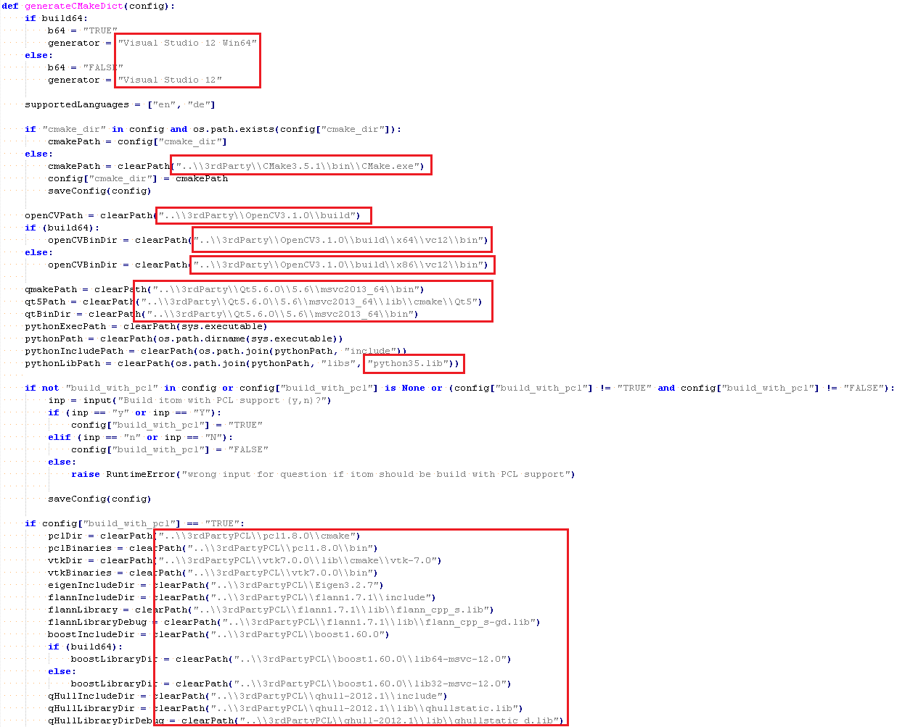
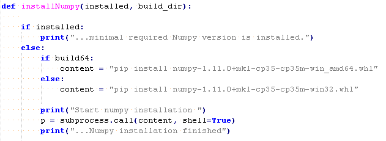

.. include:: ../include/global.inc

.. _install-all-in-one-dev-setup_creation:

All-In-One development creation
*******************************

This chapter here shows how the all-in-one develoment setup is created. In this setup all required components for the |itom| development environment are installed/compiled. The following steps must be executed in the given procedure. In the chapter about :ref:`install_all-in-one_development_setup <install-all-in-one-dev-setup>` you find how the development environment is installed. 

Download all required software/packages for 64-bit version/ 32-bit version
---------------------------------------------------------------------------

All these steps here are shown for a 64-bit version of the all-in-one development setup. A 32-bit version is created in the same way with the corresponding 32-bit software/packages. 

Download minimum required software/packages
===========================================

First download alle the needed software and packages. This download links are for the current availabe software versions (April 2016). 

* `MS Visual Studio 2013 Community <http://myprodscussu1.app.vssubscriptions.visualstudio.com/Downloads?pid=1901>`_ (en_visual_studio_community_2013_with_update_5_x86_dvd_6816332.iso) 
* `Qt Visual Studio Add-in 1.2.5 <http://www.qt.io/download-open-source/#section-2/>`_ (qt-vs-addin-1.2.5.exe)
* `Qt 5.6.0 for Windows 64-bit (VS 2013) Offline Installer <http://www.qt.io/download-open-source/#section-2/>`_ (qt-opensource-windows-x86-msvc2013_64-5.6.0.exe)
* `CMake 3.5.1 <http://cmake.org/download/>`_ (cmake-3.5.2-win32-x86.msi)
* `Python 3.5.1 Windows x85-64 executable installer <http://www.python.org/downloads/windows/>`_ (python-3.5.1-amd64.exe) 
* `Numpy 1.11.0 cp35 win_amd64 <http://www.lfd.uci.edu/~gohlke/pythonlibs/#numpy/>`_ (numpy-1.11.0+mkl-cp35-cp35m-win_amd64.whl) 
* `Git 2.8.1 64-bit <http://git-scm.com/download/win/>`_ (Git-2.8.1-64-bit.exe)
* `TortoiseGit 2.1.0.0 <http://tortoisegit.org/download/>`_ (TortoiseGit-2.1.0.0-64bit.msi)
* `Doxygen 1.8.11 <https://sourceforge.net/projects/doxygen/files/rel-1.8.11/>`_ (doxygen-1.8.11.windows.x64.bin.zip)
* `QScintilla 2.9.2 <http://www.riverbankcomputing.com/software/qscintilla/download/>`_ (QScintilla_gpl-2.9.2.zip)

Download packages for the 3rdPartyPCL tools
===========================================

* `OpenCV 3.1 source <http://github.com/itseez/opencv/>`_ (opencv-master.zip)
* `Boost 1.60.0 binaries <http://sourceforge.net/projects/boost/files/boost-binaries/1.60.0/>`_ (boost_1_60_0-msvc-12.0-64.exe) 
* `Eigen 3.2.7 repository <http://bitbucket.org/eigen/eigen/downloads/>`_ (eigen-eigen-af907dececc0.zip)
* `VTK 7.0.0 source <http://www.vtk.org/download/>`_ (VTK-7.0.0.zip)
* `PCL 1.8.0 source <http://github.com/PointCloudLibrary/pcl/>`_ (pcl-master.zip)
* `Glew 1.13.0 binaries <http://glew.sourceforge.net/>`_ (glew-1.13.0-win32.zip)
* FLANN and QHULL can be copied from the current all-in-one development version. 

Install Visual Studio 2013
---------------------------

Install Visual Studio 2013 Community without optional features. 

Creating the _install_ and 3rdParty folder
----------------------------------------

Create a path on your hard drive with a long, long path name called **${MAINDIR}**. Later, the all-in-one path on the destination computer must be shorter than this path name, due to the Qt patching. For example your path can be called: E:\\itom_all-in-one_development\\itom_all-in-one_development\\vs2013_qt5.6.0_x64\\. Than create the following paths relative to the **${MAINDIR}**. 3rdPartyPCL is not necessary to create a working |itom|. 

.. figure:: images/all-in-one-create/folder_structure.png

   :scale: 100$
   :align: center

_install_ folder
================

The _install_ folder is used to execute the installation procedure of the all-in-one development. Copy the following files into **${MAINDIR}**/_install_ folder

.. figure:: images/all-in-one-create/folder_install.png

   :scale: 100$
   :align: center

optional folder
````````````````

This folder is for optional software, which is not necessary to build and compile a working |itom|. This software is required further for development purposes. Copy the following files into **${MAINDIR}**/_install_/optional folder

.. figure:: images/all-in-one-create/folder_optional.png

   :scale: 100$
   :align: center

qpatch folder
``````````````

The folder *qpatch* contains the files, which are needed to patch the prebuild version of Qt version. Copy following files into **${MAINDIR}**/_install_/qpatch folder.

.. figure:: images/all-in-one-create/folder_qpatch.png

   :scale: 100$
   :align: center

3rdParty folder
===============

Creating prebuild version of Qt
````````````````````````````````

For a working |itom| development environment only a prebuild version of Qt is necessary. 

* Install Qt into the **${MAINDIR}**/3rdParty/Qt5.6.0 with the components msvc2013 64-bit, Qt WebView, Qt WebEngine. Qt Creator is not necessary, but can not be unchecked
* After the installation copy the folder to another location (**${MAINDIR}**/3rdParty/Qt5.6.0_backup) and uninstall Qt in the Windows program settings
* Rename Qt5.6.0_backup back to Qt5.6.0
* From Qt5.6.0/Docs/Qt-5.6 copy all *.qch files (only in the main folder) to Qt5.6.0/5.6/msvc2013_64/doc 
* From Qt5.6.0 delete the following things: 
    * folder: dist, Examples, Tools, vcredist, Docs (after having copied the qch files)
    * files: all files in the main folder, e. g. components.xml...

.. note: 

    Create a path on your hard drive with a long, long path name (called ${MAINDIR}) (later, the all-in-one path on destination computers must be shorter than this path name, due to the Qt patching)

Compile OpenCV
````````````````

OpenCV must be build from the source files. You should create following folder structure: **source, build_x64, install_x64**. Than open CMake and set the source and build path. Configure the CMake file with following options:

* CMAKE_INSTALL_SUFFIX: absolute path to **install_x64**. 
* BUILD options:

.. figure:: images/all-in-one-create/CMake_BUILD_OPENCV.png

   :scale: 100$
   :align: center
       
* WITH options:

.. figure:: images/all-in-one-create/CMake_WITH_OPENCV.png

   :scale: 100$
   :align: center
       
* optional install CUDA Toolkit (e.g. 7.0, supported by OptiX as well). Is need for Macrosim, which runs with |itom|


Compile QScintilla
``````````````````

First copy the **qscintilla_install.bat** file into the QScintilla folder. Open the **${MAINDIR}\\QScintilla-gpl-2.9.1\\Qt4Qt5\\qscintilla.pro** file with the editor. 

Replace in the line 27 **CONFIG** by:

    CONFIG += qt warn_off debug_and_release build_all dll thread exceptions
    
    CONFIG(debug, debug|release){ TARGET = $$join(TARGET,,,d) }
    
Open the native Visual Studio 2013 64-bit COMMAND PROMPT (or 32-bit). Set the QScintilla folder. Set the $QTDIR$ variable to the Qt Folder ${MAINDIR}\\3rxdParty\\Qt5.6.0\\msvc2013_x64. 

.. note: 

    example: SET QTDIR= E:\itom_all-in-one_development\itom_all-in-one_development\vs2013_qt5.6.0\3rdParty\Qt5.6.0\5.6\msvc2013

Execute the **qscintilla_install.bat** file. After the successfull compilation, delete form the QScintilla folder following folder: example, doc, python, Qt4Qt5/debug, Qt4QT5/release. 


Creating the 3rdPartyPCL folder
-------------------------------

For the 3rdPartyPCL folder the software packages Boost, Eigen, Flann, QHull and Glew can be downloaded as binaries. VTK and PCL must be compiled on your computer. 


Create Boost, Eigen, Flann, QHull, Glew
========================================

Execute the **boost_1_60_0-msvc-12.0-64.exe** file and install boost on your hard drive. Copy than the folders **boost** and **lib** into **${MAINDIR}/3rdPartyPCL/boost1.60.0-64**. 

Unzip from the Eigen zip-file the folders **Eigen** and **unupported** into the **${MAINDIR}/3rdPartyPCL/Eigen3.2.7/**. 

* Copy flann1.7.1 into **${MAINDIR}/3rdPartyPCL/flann1.7.12**. 
* Copy qhull-2012.1 into **${MAINDIR}/3rdPartyPCL/qhull-2012.1**. 
* Unzip the Glew folders into **${MAINDIR}/3rdPartyPCL/glew-1.13.0**. 

Compile VTK
===========

Unzip the VTK source on your hard drive. Create a build_x64/build_x86 folder and execute than CMake with this two folders. 

* Uncheck BUILD_EXAMPLES, BUILD_TESTING AND BUILD_SHARED_LIBS. 
* Check Module_vtkGUISupportGt, Module_vtkGUISupportQtOpenGL, Module_vtkGUISupportQtSQL, Module_vtkGUISupportWebkit, Module_vtkRenderingQT and Module_vtkViewsQt. 
* Add a new entry in CMAKE name = **"CMAKE_DEBUG_POSTFIX"**, type = **"STRING"** with the value = **"-gd"**
* Change **CMAKE_INSTALL_PREFIX** to **${MAINDIR}/3rdPartyPCL/vtk7.0.0**
* If an error occures with wrong Qt Version, change **VTK_QT_VERSION** to **5**
* delete variable of **CMAKE_RC_FLAGS**, **CMAKE_STATIC_LINKER_FLAGS**

.. note::

    Check the Entries **Qt5_DIR**, **Qt5Core_DIR**..., if they are set to the right path. 

.. note::

    1. Before starting the compilation open in the folder **VTK\build\GUISupport\Qt** the **PluginInstall.cmake** file and change in line **5** **"QVTKWidgetPlugin.dll"** to **"QVTKWidgetPlugin-gd.dll"**
    2. Start **DEBUG** compilation in Visual Studio
    3. Change the **"QVTKWidgetPlugin-gd.dll"** back to **"QVTKWidgetPlugin.dll"** and start **RELEASE** compilation

Compile PCL
===========

Unpack the PCL source on your hard drive. Create a build_x64/build_x86 folder and execute CMake with this folders. After each step, you must start the CMake configuration, otherwise the new entries will not be added. 

* Set **EIGEN_INCLUDE_DIR** to ${MAINDIR}/3rdPartyPCL/Eigen3.2.8
* Set **FLANN_INCLUDE_DIR** to ${MAINDIR}/3rdPartyPCL/flann1.7.1/include
* Set **LANN_LIBRARY** to ${MAINDIR}/3rdPartyPCL/flann1.7.1/lib/flann_cpp_s.lib
* set **FLANN_LIBRARAY_DEBUG** to ${MAINDIR}/3rdPartyPCL/flann1.7.1/lib/flann_cpp_s-gd.lib

* Set **Boost_INCLUDE_DIR** to ${MAINDIR}/3rdPartyPCL/boost1.60.0 (Boost libraray must be named libboost... *.lib) 
* Add new entry: **Boost_LIBRARY_DIR** with path ${MAINDIR}/3rdParty/boost1.60.0/lib64-msvc-12.0

* Set **QHULL_INCLUDE_DIR** include dir to ${MAINDIR}/3rdPartyPCL/qhull-2012.1/include
* Set **QHULL_LIBRARY** dir to ${MAINDIR}/3rdPartyPCL/qhull-2012.1/lib/qhullstatic.lib
* Set **QHULL_LIBRARY_DEBURG** dir to ${MAINDIR}/3rdPartyPCL/qhull-2012.1/lib/qhullstatic_d.lib

* Set **GLEW_GLEW_LIBRARY** ${MAINDIR}/3rdPartyPCL/glew-1.13.0/lib/Release/x64/glew32.lib
* Set **GLEW_INCLUDE_DIR*** ${MAINDIR}/3rdParty/glew-1.13.0/include

* Set **VTK_DIR** to ${MAINDIR}/3rdPartyPCL/vtk7.0.0/lib/cmake/vtk-7.0
* Add new entry: **QVTK_LIBRARY_DEBUG** with **FILEPATH** ${MAINDIR}/3rdPartyPCL/vtk7.0.0/lib/vtkGUISupportQtOpenGL-7.0-gd.lib
* Add new entry: **QVTK_LIBRARY_RELEASE** with **FILEPATH** ${MAINDIR}/3rdPartyPCL/vtk7.0.0/lib/vtkGUISupportQtOpenGL-7.0.lib

* Set **Qt5Concurrent_DIR** to ${MAINDIR}/3rdParty/Qt5.6.0/5.6/msvc2013/lib/cmake/Qt5Concurrent
* Set **Qt5OpenGl_DIR** to ${MAINDIR}/3rdParty/Qt5.6.0/5.6/msvc2013/lib/cmake/Qt5OpenGl_DIR
* Set **Qt5Widgets_DIR** to ${MAINDIR}/3rdParty/Qt5.6.0/5.6/msvc2013/lib/cmake/Qt5Widgets_DIR

* Set **CMAKE_INSTALL_PREFIX** ${MAINDIR}/3rdPartyPCL/pcl1.8.0
* check **BUILD_surface_on_nurbs** and **BUILD_visualization**
* check **CUDA_ATTACH_VS_BUILD_RULE_TO_CUDA_FILE**
* uncheck **BUILD_global_tests**, **BUILD_examples**, **BUILD_apps**, **BUILD_simulation**

* delete variable of **CMAKE_RC_FLAGS**

.. note::

    PCL compiles only with Eigen3.2.7 version. Version 3.2.8 does not work. 

Changes in the setup.py file
-----------------------------

The setup.py file needs some changes to work with the new version of the software/packages. The setup checks, if the packages are given in the right version. 

First set the following variables in the beginning of the file. 

* Set the **qtOriginalBuildPath**. E. g.: "E:\\itom_all-in-one_development\\itom_all-in-one_development\\vs2013_qt5.6.0_x64\\3rdParty\\Qt5.6.0\\5.6\\msvc2013_64"
* Set the **qtNewBuildPath**. E. g.: "../3rdParty/Qt5.6.0/5.6/msvc2013_64"
* Set the **numpyRequiredVersion** to the Numpy version, which is attached to the all-in-one development setup. E. g.: "1.11.0"
* Set the **pythonRequiredVersion** to the python version, which is attached to the all-in-one development setup. E. g.: "3.5."

Check in the function **generateCMakeDict** the version of Visual Studio and the paths of **CMake, OpenCV, Python library version, VTK, PCL, Eigen, Flann, QHull**.



   :scale: 100$
   :align: center
   
Check in the function **installNumpy**, if the numpy whl file names are right. 



   :scale: 100$
   :align: center