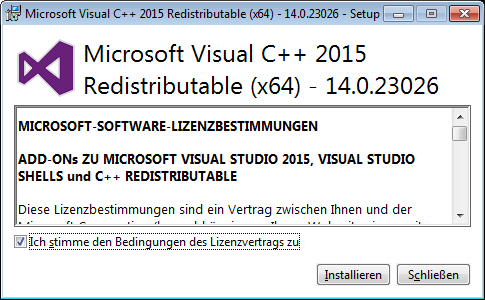

.. include:: ../include/global.inc

Installation from setup
************************

There is a *64bit* setup version of |itom| available (Windows only). For linux users there is no pre-compiled package available.
The use of the setup version is recommended for users that mainly want to work with |itom| without developing new algorithms or plugins. The setup
can be downloaded from https://bitbucket.org/itom/itom/downloads. The setup installs the core application, a number of useful hardware plugins and the designer plugins which provide plotting functionalities to |itom|.

In the course of installation, a large number of third-party components will be installed along with |itom|. The most important ones are listed in the following:

**Mandatory:**

* Microsoft Visual C++ 2017 Runtime Libraries (x64)
* Qt 5.12.6
* OpenCV 4.2.0
* Point Cloud Library 1.10.0
* VTK 8.2.0 
* Python 3.8.10 (as sub directory of itom)
* Python package *NumPy* 1.23.1
* Python package *Jedi* 0.18.1

**Optional:**

* Python package *SciPy* 1.8.1
* Python package *Matplotlib* 3.5.2
* Python package *Scikit-image* 0.19.3
* Python package *Scikit-learn* 1.1.1
* Python package *OpenCV-Python* 4.6.0.66
* Python package *Pandas* 1.4.3
* Python package *Plotly* 5.9.0
* Python package *Openpyxl* 3.0.10
* Python package *Tables* 3.7.0
* Python package *Seaborn* 0.11.2

In the following we will guide you through the installation setup with a couple of screenshots:

.. figure:: images/itom_install/setup01.png
    :alt: Language selection
    :scale: 80%
    :align: center
    
    Please select your desired language for the setup.

.. figure:: images/itom_install/setup02.png
    :scale: 80%
    :align: center
    
    Read the license text and agree to it.

.. figure:: images/itom_install/setup03.png
    :alt: Path selection
    :scale: 80%
    :align: center
    
    Select the path where you want to install |itom|. If you press next, the installer checks if the chosen directory already exists and warns if so. Please agree if you want to install |itom| in the existing directory.

.. figure:: images/itom_install/setup04.png
    :alt: Feature selection
    :scale: 80%
    :align: center
    
    Select the components you want to install with Itom. If you want to install all optional Python packages, select "Optional Python packages". You can also manually install and/or update pakages before or after this setup.
    Note that some components require the "Microsoft Visual C++ Redistributable". We recommend to always install this if it is not already installed on your computer. 
    The SDK is important if you want to develop your own plugins for |itom|.

    Select a start menu folder in which you want to create a program shortcut. 

.. figure:: images/itom_install/setup06.png
    :alt: Additional tasks
    :scale: 80%
    :align: center

    Choose whether you want a desktop icon or not.

.. figure:: images/itom_install/setup07.png
    :alt: overview
    :scale: 80%
    :align: center
    
    Now everything is ready for installation. Before you start with a click on install, the most important options are summarized again.

    
    The installation is executed now. |itom| is not copying any files in another folder than the indicated program
    folder. However this setup creates an application entry in the Windows
    registry in order to allow an uninstall by the default Windows control panel and to check if any version of 
    |itom| already has been installed. When uninstalling |itom|, the registry entry is removed, too.

.. figure:: images/itom_install/setup12.png
    :scale: 80%
    :align: center
.. figure:: images/itom_install/setup13.png
    :scale: 80%
    :align: center
    
    If not already available and if selected, the Microsoft Visual C++ Redistributable is installed now.

.. figure:: images/itom_install/setup09.png
    :scale: 80%
    :align: center
    
    Finally, the entire setup is finished. You can select if you want to start |itom| afterwards.

.. figure:: images/itom_install/itomGui.png
    :width: 100%
    :align: center

This is |itom|!

