.. include:: ../include/global.inc

Windows Setup Installation
==========================

For your convenience you can download an installer package for Microsoft Windows from `<https://bitbucket.org/itom/itom/downloads>`.
There are several different types of setups available:

* Windows, 32bit, |itom| only
* Windows, 64bit, |itom| only
* Windows, 32bit, |itom|, Python + packages: numpy, scipy, matplotlib, PIL (optional)
* Windows, 64bit, |itom|, Python + packages: numpy, scipy, matplotlib, PIL (optional)

These setups do not contain any plugins or designer-plugins.

In the course of the installation, the following third-party componenents will be installed along with |itom|:

1. Microsoft Visual C++ 2010 Runtime Libraries (x86 or x64)
2. Python 3.2.3 (optional)
3. Python package *numpy* 1.6.2(optional)
4. Python package *scipy* 0.10.1 (optional)
5. Python package *matplotlib* 1.2.x (optional)
6. Python package *PIL* 1.1.7 (optional)

In the following we will guide you through the installation setup with a couple of screenshots:

.. figure:: images/itom_install/setup01.jpg
    :alt: Language selection
    :scale: 70%
    
    Please select your desired language for the setup.

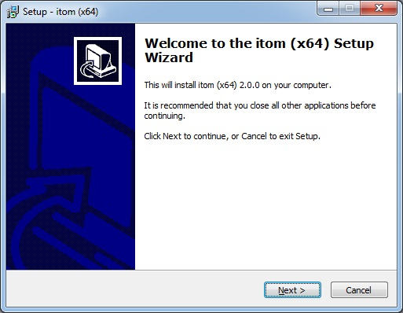
    
    The start screen of the setup will appear.

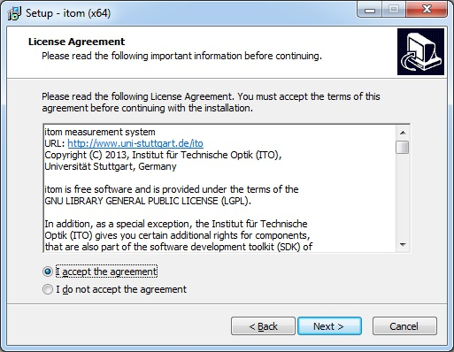
    
    Read the license text and agree to it.

.. figure:: images/itom_install/setup04.jpg
    :scale: 70%
    
    Choose where to install |itom| on your file system.

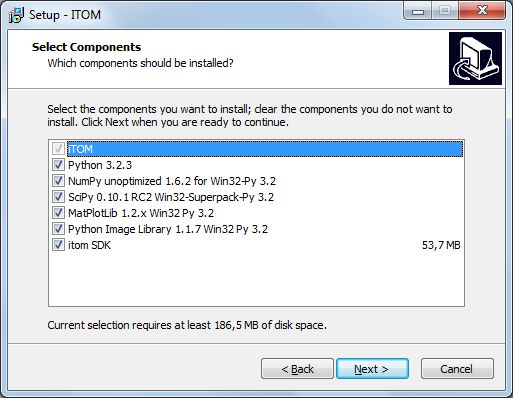
    
    Depending on your version of the setup, you now need to (de)select some optional components.
    The SDK is important if you want to develop your own plugins for |itom|. If you have the extended
    setup version, you can also select that python including some important packages is directly installed.
    This is only recommended, if you do not have python in a similar version already installed on your
    computer. You can also manually install and/or update python or its packages before or after this
    setup.

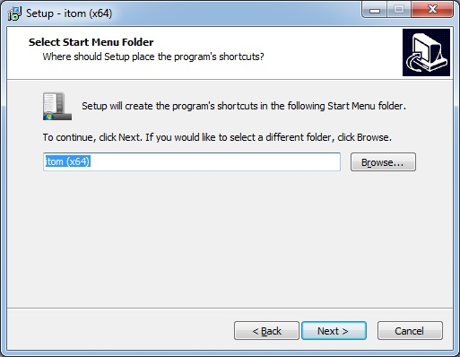
    
    Select the name of |itom| in your Windows start menu.

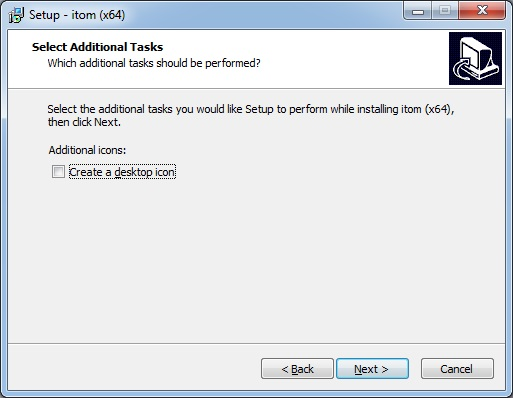
    
    Choose whether you want to have an |itom| shortcut on your desktop

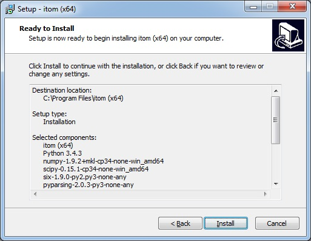
    
    Now, a summary of the installation steps is given. Press next if you want to start the installation...

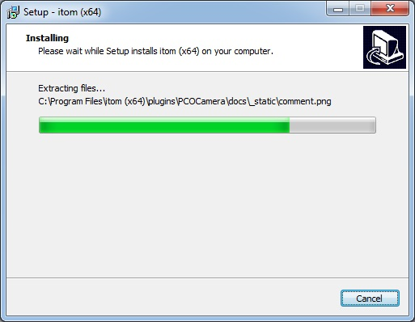
    
    The installation is executed now. |itom| is not copying any files in another folder than the indicated program
    folder (besides python or any python-packages). However this setup creates an application entry in the Windows
    registry in order to allow an uninstall by the default Windows control panel and to check if any version of 
    |itom| already has been installed. When uninstalling |itom|, the registry entry is removed, too.

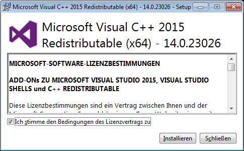
    
    If not already available, the Microsoft Visual C++ 2010 Runtime Libraries are installed now. 

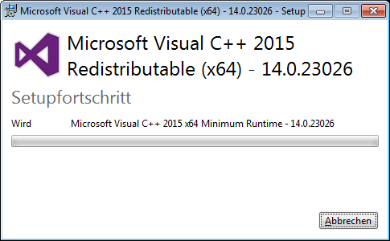
    
Depending on your selected components, python and/or any python packages are now installed:

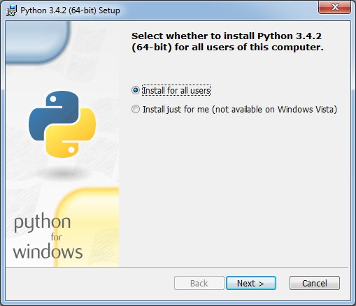
    
    Install Python 3.2.1 for the current user or for all users.

.. figure:: images/itom_install/install10.png
    :scale: 70%
    
    Customize your Python installation. We recommend leaving everything as is.

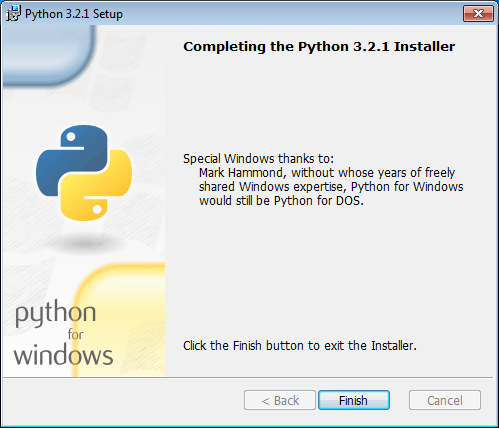
    
    You've completed the Python installation as well. We're getting getting closer.

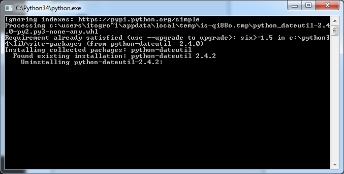
    
    Continue with the installation of NumPy.

.. figure:: images/itom_install/install13.png
    :scale: 70%
    
    You should be able to continue right away.

.. figure:: images/itom_install/install14.png
    :scale: 70%
    
    Start the NumPy installation.

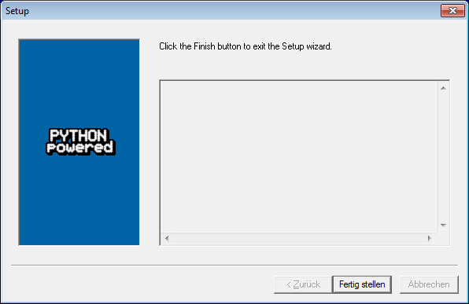
    
    Confirm that NumPy was successfully installed.

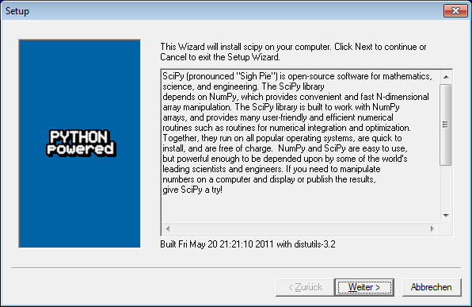
    
    Eventually, we have to install scipy, press "Next" to continue

.. figure:: images/itom_install/install17.png
    :scale: 70%
    
    Continue.

.. figure:: images/itom_install/install18.png
    :alt: alternate text
    :scale: 70%
    
    Yes, we are ready to install. Proceed please.

    
    Another confirmation, now scipy has been installed successfully.

Finally, the entire setup is finished:

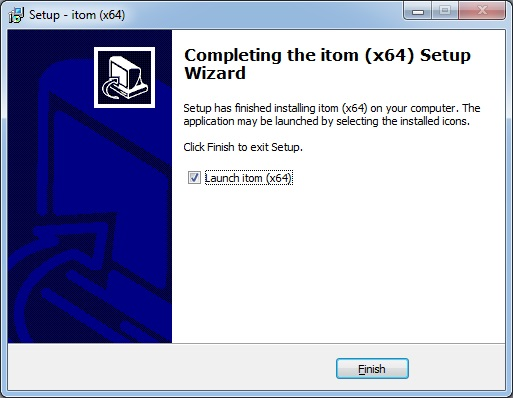
    
That's it:

.. figure:: images/itom_install/install21.png
    :width: 800px
	
    This is |itom|!

