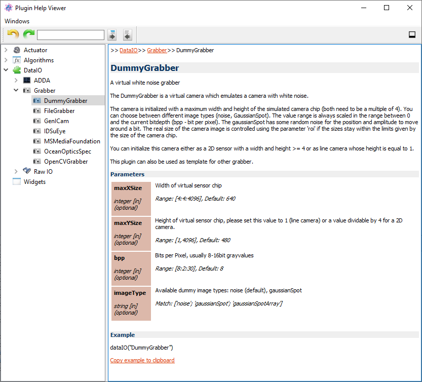
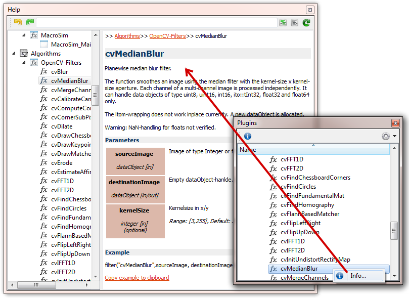

.. include:: ../include/global.inc

.. moduleauthor:: PSchau, WLyda
.. sectionauthor:: PSchau, WLyda

.. _gettingStarted:

Getting Started
###################

Read the following chapter in order to get a first introduction about the main functionalities of |itom|.

.. This chapter is structure as follows:

    * At first you become acquainted with the main features of the user interface.
    * Then you learn about to open, operate and close a *virtual* motor stage provided by a hardware plugin.
    * Afterwards you will write your first small script snippet using the console and do the same stage operation using a script based approach.
    * 

Quick Start
*********************

The GUI
===========

If you open |itom| for the first time, the main graphical user interface will look like the following screenshot:

.. figure:: images/itom_layout.png
    :width: 70%
    
The main components are highlighted with different colors and numbers. These components are:

1. The menu bar gives you access to the script management, the :ref:`script execution and debugging <gui-editor>`, the windowing system and help features. You can :ref:`add your own menus <toolbar-createmenu>` to this bar.
2. The most common commands are also accessible via the main toolbar of |itom|. :ref:`Add your own toolbars <toolbar-addtoolbar>` and connect them with user defined scripts to adapt |itom| to your personal needs.
3. The :ref:`file system toolbox <gui-filesystem>` gives you access to script files (written in Python 3) or other files that can be loaded with |itom| (e.g. bmp, png, gif, tif, Matlab files... - depending on the installed plugins)
4. The :ref:`console (command line) <console>` allows you directly executing single or multiline script commands.
5. The current set of global (or local) variables in the Python workspace is listed in the :ref:`corresponding toolboxes <gui-workspace>`.
6. All available hardware and software plugins are listed in the :ref:`plugin toolbox <gui-plugins>`. Use this toolbox to connect to your cameras or actuators or get informed about available software filters or algorithms. If you miss a plugin whose library file exists, check the menu **file >> loaded plugins...** so see if the library has been found and / or why this library could not been loaded.

Connected hardware components can be operated either by script commands or directly by the GUI. The following sections show you examples for both approaches.

Connect to a hardware plugin using the GUI
===========================================

|itom| comes with a set of different plugins that are used to connect to various cameras, AD-converters or actuators of different manufacturers. You can implement your own plugin (written in C++) in order to make your specific hardware component accessible via |itom|. By default, |itom| is shipped with a virtual actuator and virtual camera in order to simulate hardware on any computer without a real camera being connected.

.. note::
    
    In this example, an approach is shown how to connect to an actuator instance using the GUI functionalities of |itom|. This approach is very similar for camera plugins.

In the following example, we will connect to such a virtual actuator, move single axes and finally close the actuator. This is all done by the graphical user interface of |itom|. Later we will learn, how to do this by the help of script commands. For this example, you need to have the hardware plugin **DummyMotor** which should be listed in the plugin toolbox as child of the **actuators** group.

.. figure:: images/openDummyMotor1.png
    :width: 70 %

Every entry in this toolbox corresponds to one library file (Windows: *.dll, Linux: *.so), located in any subfolder of the **plugins** subfolder of your |itom| installation path. If the library could be loaded, you can connect to one or multiple instances of its represented hardware (e.g. you can connect to various motors of the same type that are connected to the computer). If you don't find the desired library in the :ref:`plugins toolbox <gui-plugins>`, you either don't have the library in the plugins subfolder or the library could not be loaded. This can have various reasons. See the **loaded plugins...** dialog in the menu **file** to check why the plugin could not be loaded.

Here, we want to create one instance of the **DummyMotor** plugin which simulates a motor stage with up to 10 axes. In order to create an instance, choose **New Instance...** from the context menu of the corresponding **DummyMotor** library entry (see figure above).

Usually, you have to pass multiple mandatory or optional parameters when connecting to a hardware instance (e.g. a port number, IP address, color space, identification string...). In order to pass these parameters, a dialog is opened:

.. figure:: images/openDummyMotor3.png
    :scale: 70%
    
This dialog is automatically configured depending on the needs of the specific plugin. The tab **mandatory parameters** lists all parameters that you have to pass, the tab **optional parameters** all optional ones. If one tab is disabled, no parameters are required in this section. In case of the dummy motor, no mandatory parameters are required. However, you may change the number of virtual axes or set the internal name of the motor instance.

Each parameter has already a default value and a description, that is available when moving the mouse over the information icon at the end of the line. Additionally, parameters can have meta information that may restrict the allowed value range or the string values that are accepted. These restrictions are available via the tooltip text of the corresponding input field.

Press OK to accept the dialog and create the motor instance. If no error message occurs during initialisation a child entry is added to the **DummyMotor** item in the tree view of the plugin toolbox. This indicates that an instance of the plugin has been created and is ready for use. The name of this child either corresponds to the optional name of the motor instance or an auto-incremented ID if no name has been given.

Now, you can work with this motor instance. The necessary functions are either available by the context menu of the item or by the toolbar of the plugin toolbox that is always related to the currently selected item (therefore click on the instance's item to get the necessary toolbar):

.. figure:: images/openDummyMotor4.png
    :scale: 70%

* **Configuration Dialog**: This opens a modal configuration dialog to configure the actuator or camera instance.
* **Show Plugin Toolbox**: Every plugin can provide a toolbox that is integrated in the main window of |itom| and usually provides commonly used features of the plugin (e.g. the motor movement)
* Click **Close instance** to close the plugin's instance again.
* **Send to python**: If you want to access the plugin's instance by a Python script after having connected it via the GUI, use this command.

The individual (but optional) **Configuration Dialog** of every plugin allows changing relevant parameters of the plugin. Open this modal dialog by clicking the corresponding menu button:

.. figure:: images/dummyMotorDialog.png
    :scale: 70%

As long as this window is opened, |itom| is blocked for further user input. The configuration dialog is assumed to only contain parameters or functions that are rarely used.

In the next step, we want to move the virtual stage. For this purpose, plugins can provide their specific **toolbox**, that is integrated as dockable widget into the main window of |itom|. Click **Show Plugin Toolbox** to open the toolbox of the **DummyMotor**:

.. figure:: images/dummyMotorWidget.png
    :scale: 70%
    
Toolboxes are always non-blocking items that can be arbitrarily placed in the main window and usually contain often used methods and functions. In case of the dummy motor, you can use the toolbox to relatively or absolutely move one or multiple axes. During the movement, related axes are marked with a yellow background color. In case of an error, the background turns to red. The dummy motor instance simulates the movements using a speed value, that is adjustable via the configuration dialog.

Once you are done with the plugin, close the connection to the instance by clicking the **Close instance** button in the context menu or toolbar.

.. note::
    
    Once you opened the instance by the GUI approach, shown in the recent section, you also need to close the instance by the GUI. The entry in the plugin toolbox is then marked with a gray background. Later, you will see how you can connect to the instance by a Python script or how you can later grant access to the instance to Python scripts. Then the background color
    turns to yellow. This means, that you have to delete all Python script variables that point to the hardware instance. Once this is done, the instance is automatically closed. For more information, read the help about the :ref:`plugin toolbox <gui-plugins>`.
    
Scripting
===================

In the next section of the **getting started** we will learn how to execute our first lines of Python code. Python is an open-source and commonly used script language which is fully embedded into |itom|. You can therefore use |itom| to execute arbitrary Python commands or scripts, but you can also use Python to control |itom| and its plugins.

Hello World!
---------------

You can get the famous \"hello world!\" in a very simple way. Just write in the console:

.. code-block:: python
    :linenos:
    
    print("hello world!")

The command is executed immediately and prints the text *hello world!* to the command line. Let us proceed to a more advanced example involving a camera.

Get a camera snapshot
----------------------

In this example we will explain step by step how to open a camera and make a snapshot. Python code can be written and executed in two different ways, either directly, line by line, using the console, or in the form of complete scripts. In this example we will use the console and will directly type our commands. Later you can write your code in executable scripts or functions and you can control these functions with your own GUI elements.

You will need the **DummyGrabber**-plugin for this script to work. This plugin is a virtual camera plugin that provides noise images in order to simulate a real camera.

Step 1: Open the camera
^^^^^^^^^^^^^^^^^^^^^^^^^

First you have to start your camera device using the respective :py:class:`~itom.dataIO` plugin. In our example we use the plugin *DummyGrabber*, but in general you can use any camera connected to your computer for which you have an |itom| plugin. Similarly to the previous example of the **DummyMotor** we need to create an instance of the **DummyGrabber**. However, we will create this instance using Python script commands instead: 

.. code-block:: python
    :linenos:
    
    camera = dataIO("DummyGrabber", 1024, 800)
    
How did we know what to write there? Select **Info...** from the context menu of *DummyGrabber* in order to show the help page about the *DummyGrabber* plugin:

    
.. note::
    
    If you don't see the help page, go to the properties dialog of |itom| (menu **File >> Properties**) and select the checkbox **Show DataIO and Actuator** in the tab **General >> Help Viewer**.
    
In the help page, all mandatory and optional parameters are listed and described that are needed to instantiate one camera (the same holds for motors). If you remember the connection to the motor above, these parameters have been added to the dialog for the motor's initialization. In case of the camera, there are up to three optional parameters. The first two describe the virtual chip size of the camera, the third one is the desired bit depth, whose default ist 8 bit.

In order to create an instance of the camera, we create an object of the Python class :py:class:`~itom.dataIO`, which is part of the module :py:mod:`itom`. Since this module has been globally imported at startup of |itom| using::
    
    from itom import *
    
it is allowed to directly write **dataIO** instead of **itom.dataIO**. The constructor of this class requires the name of the plugin (as string) as first parameter. The following parameters are all mandatory parameters followed by the optional ones. You don't need to indicate all optional ones. Therefore, the example only set the parameters *maxXSize* and *maxYSize*. The bitdepth *bpp* was omitted, hence, its default value is assumed.

After initialization, one instance of the camera has been created and is listed in the plugin's toolbox (with a yellow background, saying that it has been created via Python). Additionally, you will find the variable **camera** in the global workspace toolbox of |itom|. Use this variable in order to work with the camera.

Step 2: Get the list of parameters
^^^^^^^^^^^^^^^^^^^^^^^^^^^^^^^^^^^

Every hardware plugin (dataIO or actuator) has a set of parameters. You can read the current value, the allowed range or values and a description of each parameter using Python.

With the following command you get a list with all available parameters for your device.

.. code-block:: python
    :linenos:
    
    print(camera.getParamList())
    
A full list of all parameters including their current value and description is obtained via:

.. code-block:: python
    :linenos:
    
    camera.getParamListInfo()
    
In the printed list you can also see if the parameter is read-only (r) or can also be set (rw) like shown in the next step.

Step 3: Setting Parameters
^^^^^^^^^^^^^^^^^^^^^^^^^^^^^

Parameters of the device that are not marked as read-only can be set as you need it. For example, we might wish to set the upper left corner of the ROI, the integration time (in seconds) of the capturing process or the bit-depth of the captured signal:

.. code-block:: python
    :linenos:
    
    camera.setParam("x0",0)
    camera.setParam("integration_time",0.05)
    camera.setParam("bpp",8)

Step 4: Getting Parameters
^^^^^^^^^^^^^^^^^^^^^^^^^^^^^^^^

If you are interested in the current value of a parameter you can use the following code to retrieve it.

.. code-block:: python
    :linenos:
    
    sizex = camera.getParam("sizex")
    print("DummyGrabber width: " + str(sizex))

Step 5: Taking a snapshot
^^^^^^^^^^^^^^^^^^^^^^^^^^^^^^^^

Before you can use the camera you have to start it (this must be done only once).

.. code-block:: python
    :linenos:
    
    camera.startDevice()

Afterwards, acquire a new image. This is the time when the acquisition starts.

.. code-block:: python
    :linenos:
    
    camera.acquire()

If you then want to store the image you have to create a new empty dataObject (the dataObject will resize to the correct dimensions later) and save the values of the image in this dataObject.

.. code-block:: python
    :linenos:
    
    data = dataObject()
    camera.getVal(data)

Here you have to be careful, because data is just a reference (**shallow copy!**, no actual data is copied from the camera's memory) to the internal camera memory. If you want to have a deep copy of the image you should use the copy command.

.. code-block:: python
    :linenos:
    
    dataCopy = data.copy()
    
Alternatively, you can also use the command :py:meth:`~itom.dataIO.copyVal` to directly get a copy of the object from the camera:

.. code-block:: python
    :linenos:
    
    camera.copyVal(data)

Step 6: Displaying the image
^^^^^^^^^^^^^^^^^^^^^^^^^^^^^^^^

Up to now you have not seen any image. You can plot your acquired image using

.. code-block:: python
    :linenos:
    
    plot(data)

or you can watch the live image of the camera using

.. code-block:: python
    :linenos:
    
    liveImage(camera)

Step 7: Stop/delete the camera
^^^^^^^^^^^^^^^^^^^^^^^^^^^^^^^^^^^^^

At the end you should stop the camera device. And if you don't need it any more you can delete the instance of the camera plug-in.

.. code-block:: python
    :linenos:
    
    camera.stopDevice()
    del camera

Alternative Step 1: Open the camera
^^^^^^^^^^^^^^^^^^^^^^^^^^^^^^^^^^^^^^^^^^^

We can also open the camera via the GUI and make the new instance available for access from python.

Therefore we select the **DummyGrabber** within the **Plugins-Browser** (GUI No. 6). We right-click and select 'newInstance'.

.. figure:: images/openDummyGrabber1.png
    :scale: 70%

The window with initialisation parameters of the plugIn opens. Select the tab **optional parameters** and insert maxXSize = 800, maxYSize = 600, bpp == 8. 

.. figure:: images/openDummyGrabber2.png
    :scale: 70%

Than check **Access instance with python** and type 'camera' into the field **variable name**. Press ok. Now you can proceed with step 2 but since you already set the grabber parameters you can also proceed with step 4.   

Apply a median-filter to a snap shot 
-----------------------------------------

In the next step, we want to explain how to use filters provided as itom-plugins on the dataObject using the example of a median filter. 
Instead of executing single python commands from the console, we will now utilize the itom script editor for the first time.

For this example, you will need the **OpenCV-filters-Plugin** and the **DummyGrabber-Plugin**.

Step 1: Open a script editor window
^^^^^^^^^^^^^^^^^^^^^^^^^^^^^^^^^^^^^^^^^^

First we open the script editor by left-clicking the **new Script**-button in the button-bar or in the menu\file\new Script. 

.. figure:: images/newScript.png

Step 2: Write a simple snap routine
^^^^^^^^^^^^^^^^^^^^^^^^^^^^^^^^^^^^^^^^^^

We insert the following code into the editor window. You will recognize the python commands from the previous section.

.. code-block:: python
    :linenos:
    
    camera = dataIO("DummyGrabber")
    camera.startDevice()
    camera.acquire()
    
    dataSnap = dataObject()
    
    camera.getVal(dataSnap)
    camera.stopDevice()
    ...
    ...

Step 3: Retrieve the call for the median filter
^^^^^^^^^^^^^^^^^^^^^^^^^^^^^^^^^^^^^^^^^^^^^^^^^^^^^^ 

What we need in the next step is the correct call for the median-filter, which is defined within the **OpenCV-Filters** plugin. Each plugin provides information concerning its usage that is accessible from python. Therefore we switch to the itom-console and type in

.. code-block:: python
    :linenos:
    
    filterHelp("cvMedianBlur")

You can see a detailed description of the filter "cvMedianBlur". An alternative approach is to right click on the filter name in the plugin toolbox and to choose **Info...**. Then, the |itom| help widget is automatically opened with the help about the filter as current page:

    
This help gives you information about the purpose of the filter and its mandatory and optional parameters that are required to apply the filter. At the bottom of the help page, you see an examplary Python string that shows how to call the filter (only mandatory parameters are included in this example). Click **Copy example to clipboard** in order to simply paste the example into your script or the command line.

Step 4: Insert the filter-call into the script
^^^^^^^^^^^^^^^^^^^^^^^^^^^^^^^^^^^^^^^^^^^^^^^^^^^^^^ 

We use this information and append our script in the script editor with

.. code-block:: python
    :linenos:
    
    dataFiltered = dataObject() #Destination image
    
    filter("cvMedianBlur", dataSnap, dataFiltered, 5)
    
to filter the content dataSnap into the new object dataFiltered with a 5 x 5 filter kernel.

The filter also works inplace. That means we can use the input object as the output object, overwriting the input data.
To show how this works we add 

.. code-block:: python
    :linenos:
    
    filter("cvMedianBlur", dataSnap, dataSnap, 5)
  
  
Step 5: Add plot commands
^^^^^^^^^^^^^^^^^^^^^^^^^^^^^^^^^^^^^^^^^^^^^^^^^ 

To view the results we add

.. code-block:: python
    :linenos:
    
    plot(dataFiltered)
    plot(dataSnap)

to the script.

Step 5: Run the script
^^^^^^^^^^^^^^^^^^^^^^^^^^^^^^^^^^^^^^^^^^^^^^^^^ 

To run the script, we press the run button or "F5" on the keyboard. If we have unsaved changes in our script, we are asked to save it.

.. figure:: images/runScript.png

You should see two 2D-Plots.

 
Getting online help
------------------------

The python script language has a lot of methods and classes and |itom| expands these functionalities even further. To retain an overview, python provides a built-in online help. You can type help(class or method). For example:

.. code-block:: python
    :linenos:
    
    help(dataIO)

gives a complete help for the class **itom.dataIO**, which is the python-represention for various data communication plugIns (e.g. the dummyGrabber).

By typing 
    
.. code-block:: python
    :linenos:
    
    help(dataIO.getParamListInfo)

you get the help for this subfunction of dataIO.

To get an overview over the different itom-plugin functions you can use one of several options. 

For Plugin-Initialisation, e.g. the DummyGrabber from the last example, use **pluginHelp("pluginName")**.

.. code-block:: python
    :linenos:
    
    pluginHelp("DummyGrabber")

For information concerning an already initialized plugIns, e.g. the camera / DummyGrabber from the last example use the member function **.getParamListInfo()**

.. code-block:: python
    :linenos:
    
    camera = dataIO("DummyGrabber")
    camera.getParamListInfo() 
 
To get a list of available (installed and loaded but not necessary instantiated) itom plug-ins of the type filter, use the methond **filterHelp()**

.. code-block:: python
    :linenos:
    
    filterHelp() 
 
If you want detailed information about one **itomfilter** use filterHelp("filterName")

.. code-block:: python
    :linenos:
    
    filterHelp("lowFilter") 

For user-defined GUI-Elements from plugIns use the function widgetHelp().   
    

Further Information
*********************

For additional information on the features and usage of the |itom| GUI, see
GUI :ref:`gui`
For a short introduction to the Python scripting language and use of the |itom| internal dataObject, refer to: :ref:`scriptLanguage` with more information about the dataObject :ref:`itomDataObject`

Tutorials
****************

You can find all scripts used here in the **demo** folder. In the :ref:`demoScripts` section of this manual you can find the overview of all demoscripts which are located in this folder and a short summary what is covered in these scripts.

 

