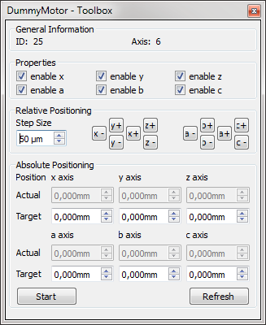

.. include:: ../include/global.inc

.. moduleauthor:: PSchau, WLyda
.. sectionauthor:: PSchau, WLyda

.. _gettingStarted:

Getting Started
###################

The following chapter is an introduction into the functionalities of |itom| with a number of hands-on examples. 

Quick Start
*********************

The GUI
===========

In this section will help you with your first steps in using |itom|. We will start with the main GUI, the standard starting point of your interaction with the software. After startup the |itom| GUI is by default divided into the following parts:

1. Menu bar
2. Quickstart bar
3. File System / Breakpoints
4. Console
5. Global Variables / Local Variables
6. Plugins-Browser

GUI-Operations
===================
   
The first examples will show you the basic GUI operations together with plugin-handling, data acquisition and saving this data to the harddrive.

Open and move a virtual stage
----------------------------------

Let us learn more about the |itom| -GUI-PlugIn-Interaction using the example of the **DummyMotor**. You will require the **DummyMotor** plug-in. 

At first, we have to initialize the stage. The **Plugins-Browser** (No. 6) displays a list of all available Plug-ins, sorted by type. These DLL's are already loaded but not instantiated. To access the functionality of a plug-in we need to create an instance of it. To this end, we select the **DummyMotor** within the **Plugins-Browser** (No. 6). If the **DummyMotor** is not displayed, you need to get or build the plug-in first (refer to :ref:`install-cmake`). We right-click and select 'newInstance'.

.. figure:: images/openDummyMotor1.png
    :width: 70 %

A window with initialisation parameters of the plugIn opens.

.. figure:: images/openDummyMotor3.png
    :scale: 70%

This PlugIn has requires no parameters, so we press OK. More complex plug-ins will require any number of mandatory and optional parameters for correct instantiation at this stage. 

If no error message occurs during initialisation we will see a '+' before the **DummyMotor** in the **Plugins-Browser**. This indicates that an instance of the plug-in has been created and is ready for use. We expand the entry **DummyMotor**.
We can see the index of the initialised plugin (first time == ID: 1). 

If we right-click again on  **DummyMotor ID 1**, a contrex menu opens with the entries:

.. figure:: images/openDummyMotor4.png
    :scale: 70%

* Configuration dialog
* Show plugIn Toolbox
* Close instance
* Sent to python

By left-clicking **Configuration dialog**, a window with basic parameter setup functions for this special plugin opens. 

.. figure:: images/dummyMotorDialog.png
    :scale: 70%

As long as this window is open, iTOM will be blocked. So we close this window with the 'ok'-Button.

To move this virtual stage, this plugIn comes with a **Toolbox**. We open this by right-clicking again on **DummyMotor ID 1** and than left-click on **Show plugIn Toolbox**.

This opens a non blocking widget usally docked to the GUI-Window with basic control-buttons for moving the motor to the desired position.

At the end we close theplugIn by right-clicking again on **DummyMotor ID 1** and than left-click on **Close instance**.
   
Scripting
===================

In the second part of this **getting startet** we will focus on the script language based on python.
The instructions are without lengthy explanations. Use the **tutorial** for more detailed information.

Hello World!
---------------

You can get the famous \"hello world!\" in a very simple way. Just write in the console:

.. code-block:: python
    :linenos:
	
	print("hello world!")
	
The command is executed immediately. Let us proceed to a more advanced example involving a camera.

Getting a snapshot
--------------------

In this example we will explain how you can open a camera and make a snapshot step by step. Python code can be written and executed in two differnt ways, either directly, line by line, using the console, or in the form of complete scripts and fucntions, executed as small programs. In this example we will use the console and will type in our commands directly. Later you can write your code in executable scripts or functions and you can control these functions with your own GUI elements.

You will need the **DummyGrabber**-PlugIn for this script to work.

Step 1: Open the camera
^^^^^^^^^^^^^^^^^^^^^^^^^

First you have to start your camera device using the respective dataIO plugin. In our example we use the DummyGrabber, but in principle you can use any camera connected to your computer for which you have an |itom| plugin. Similarly to the previous example of the **DummyMotor** we need to create an instance of the **DummyGrabber**, only this time, we will instantiate from python instead of from the GUI. 

.. code-block:: python
    :linenos:
	
    camera = dataIO("DummyGrabber", 1024, 800)
	
Step 2: Get the list of paramters
^^^^^^^^^^^^^^^^^^^^^^^^^^^^^^^^^^^

With the following command you get a list with all available paramters for your device.

.. code-block:: python
    :linenos:
	
    print(camera.getParamList())
	
Step 3: Setting Parameters
^^^^^^^^^^^^^^^^^^^^^^^^^^^^^

You can set the parameters of the camera as you need it. For example, we might wish to set the upper left corner of the ROI, the integration time (in seconds) of the capturing process or the bit-depth of the captured signal:

.. code-block:: python
    :linenos:
	
    camera.setParam("x0",0)
    camera.setParam("integration_time",0.05)
    camera.setParam("bpp",8)
	
Step 4: Getting Parameters
^^^^^^^^^^^^^^^^^^^^^^^^^^^^^^^^

If you are interested in the current value of a paramter you can use the following code to retrieve it.

.. code-block:: python
    :linenos:
	
	sizex = camera.getParam("sizex")
	print("DummyGrabber width: " + str(sizex))
	
Step 5: Taking a snapshot
^^^^^^^^^^^^^^^^^^^^^^^^^^^^^^^^

Before you can use the camera you have to start it.

.. code-block:: python
    :linenos:
	
    camera.startDevice()

Following that you can acquire an image.

.. code-block:: python
    :linenos:
	
	camera.acquire()
	
If you then want to store the image you have to create a new empty dataObject (the dataObject will resize to the correct dimensions later) and save the values of the image in this dataObject.

.. code-block:: python
    :linenos:
	
	data = dataObject()
	camera.getVal(data)
	
Here you have to be careful, because data is just a reference (**shallow copy!**, no actual data is copied from the camera's memory) to the internal camera memory. If you want to have a deep copy of the image you should use the copy command.
	
.. code-block:: python
    :linenos:
	
	dataCopy = data.copy()
	
Step 6: Displaying the image
^^^^^^^^^^^^^^^^^^^^^^^^^^^^^^^^

Up to now you have not seen any image. You can plot your acquired image using

.. code-block:: python
    :linenos:
	
	plot(data)
	
or you can watch the live image of the camera using

.. code-block:: python
    :linenos:
	
	liveImage(camera)

Step 7: Stop/delete the camera
^^^^^^^^^^^^^^^^^^^^^^^^^^^^^^^^^^^^^

At the end you should stop the camera device. And if you don't need it anymore you can delete the instance of the camera plug-in.

.. code-block:: python
    :linenos:
	
    camera.stopDevice()
    del camera
	
Alternative Step 1: Open the camera
^^^^^^^^^^^^^^^^^^^^^^^^^^^^^^^^^^^^^^^^^^^

We can also open the camera via the GUI and make the new instance available for access from python.

Therefore we select the **DummyGrabber** within the **Plugins-Browser** (GUI No. 6). We right-click and select 'newInstance'.

.. figure:: images/openDummyGrabber1.png
    :scale: 70%

The window with initialisation parameters of the plugIn opens. Select the tab **optional parameters** and insert maxXSize = 800, maxYSize = 600, bpp == 8. 

.. figure:: images/openDummyGrabber2.png
    :scale: 70%

Than check **Access instance with python** and type 'camera' into the field **variable name**. Press ok. Now you can proceed with step 2 but since you already set the grabber parameters you can also proceed with step 4.   

Apply a median-filter to a snap shot 
-----------------------------------------

In the next step, we want to explain how to use filters provided as itom-plugins on the dataObject using the example of a median filter. 
Instead of executing single python commands from the console, we will now utilize the iTOM script editor for the first time.

For this exampe, you will need the **OpenCV-filters-Plugin** and the **DummyGrabber-Plugin**.

Step 1: Open a script editor window
^^^^^^^^^^^^^^^^^^^^^^^^^^^^^^^^^^^^^^^^^^

First we open the script editor by left-clicking the **new Script**-button in the button-bar or in the menu\file\new Script. 

Step 2: Write a simple snap routine
^^^^^^^^^^^^^^^^^^^^^^^^^^^^^^^^^^^^^^^^^^

We insert the following code into the editor window. You will recognize the python commands from the previous section.

.. code-block:: python
    :linenos:
	
    camera = dataIO("DummyGrabber")
    camera.startDevice()
    camera.acquire()
    
    dataSnap = dataObject()
    
    camera.getVal(dataSnap)
    camera.stopDevice()
    ...
    ...

Step 3: Retrieve the call for the median filter
^^^^^^^^^^^^^^^^^^^^^^^^^^^^^^^^^^^^^^^^^^^^^^^^^^^^^^ 

What we need in the next step is the correct call for the median-filter which is defined within the **m++Filter-PlugIn**. Each plug-in provides information concerning its usage that is accessible from python.which is defined within the **m++Filter-PlugIn**. |itom| provides 
Therefore we switch to the itom-console and type in

.. code-block:: python
    :linenos:
	
    filterHelp("cvMedianBlur")

You can see a detailed description of the filter "medianFilter".

Step 4: Insert the filter-call into the script
^^^^^^^^^^^^^^^^^^^^^^^^^^^^^^^^^^^^^^^^^^^^^^^^^^^^^^ 

We use this information and append our script in the script editor with

.. code-block:: python
    :linenos:
	
    dataFiltered = dataObject() #Destination image
    
    filter("cvMedianBlur", dataSnap, dataFiltered, 5)
    
to filter the content dataSnap into the new object dataFiltered with a 5 x 5 filter kernel.

The filter also works inplace. That means we can use the input object as the output object, overwriting the input data.
To show how this works we add 

.. code-block:: python
    :linenos:
	  
    filter("cvMedianBlur", dataSnap, dataSnap, 5)
  
  
Step 5: Add plot commands
^^^^^^^^^^^^^^^^^^^^^^^^^^^^^^^^^^^^^^^^^^^^^^^^^ 

To view the results we add

.. code-block:: python
    :linenos:
	  
    plot(dataFiltered)
    plot(dataSnap)

to the script.

Step 5: Run the script
^^^^^^^^^^^^^^^^^^^^^^^^^^^^^^^^^^^^^^^^^^^^^^^^^ 

To run the script, we press the run button or "F5" on the keyboard. If we have unsaved changes in our script, we are asked to save it.

.. figure:: images/runScript.png

You should see two 2D-Plots.

 
Getting online help
------------------------

The python script language has a lot of methods and classes and |itom| expands these functionalities even further. To retain an overview, python provides a built-in online help. You can type help(class or method). For example:

.. code-block:: python
    :linenos:
	
	help(dataIO)

gives a complete help for the class **itom.dataIO** which is the python-represention for various data communication plugIns (e.g. the dummyGrabber).

By typing 
    
.. code-block:: python
    :linenos:
	
    help(dataIO.getParamListInfo)

you get the help for this subfunction of dataIO.

To get an overview over the different itom-plugin functions you can use one of several options. 

For Plugin-Initialisation, e.g. the DummyGrabber from the last example, use **pluginHelp("pluginName")**.

.. code-block:: python
    :linenos:
	
    pluginHelp("DummyGrabber")

For information concerning an already initialized plugIns, e.g. the camera / DummyGrabber from the last example use the member function **.getParamListInfo()**

.. code-block:: python
    :linenos:
	
    camera = dataIO("DummyGrabber")
    camera.getParamListInfo() 
 
To get a list of available (installed and loaded but not necessary instantiated) itom plug-ins of the type filter, use the methond **filterHelp()**

.. code-block:: python
    :linenos:
	
    filterHelp() 
 
If you want detailed information about one **itomfilter** use filterHelp("filterName")

.. code-block:: python
    :linenos:
	
    filterHelp("lowFilter") 

For user-defined GUI-Elements from plugIns use the function widgetHelp().   
    

Further Information
*********************

For additional information on the features and usage of the |itom| GUI, see
GUI :ref:`gui`
For a short introduction to the Python scripting language and use of the |itom| internal dataObject, refer to: :ref:`scriptLanguage` with more information about the dataObject :ref:`itomDataObject`

Tutorials
****************

You can find all scripts used here in the **demo** folder. In the :ref:`demoScripts` section of this manual you can find the overview of all demoscripts which are located in this folder and a short summary what is covered in these scripts.

 

