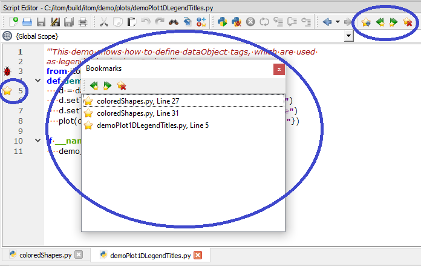

.. include:: ../include/global.inc

.. _gui-bookmarks:

Bookmarks
************

|itom| provide the possibility to set bookmarks in different lines of desired Python scripts.
This list is globally managed and reloaded until the next startup of |itom|.

The overall list of all current bookmarks is shown in the bookmark toolbox:

The toolbox provide the following features:

    * Double click on a bookmark to display the bookmarked line in the corresponding script. The script
      is opened, if it is not opened yet.
    * Navigate to the next or previous bookmark: There is a current bookmark index. Depending on this index,
      it is possible to either navigate to the following or previous bookmark. Once the end of the list is reached,
      the first bookmark is shown.
    * Clear all bookmarks: This will remove all bookmarks.

To create a bookmark either click in the most-left column of the desired line in a Python script or
click the **Toggle bookmark** button in a script editor. This will add a new bookmark in the line of the current cursor
or remove a bookmark, if there is already one.

For more information about the usage of bookmarks in a script editor, see this :ref:`documentation <gui-editor-bookmarks>`.
