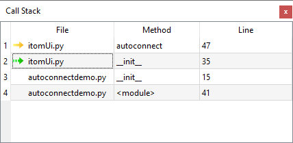
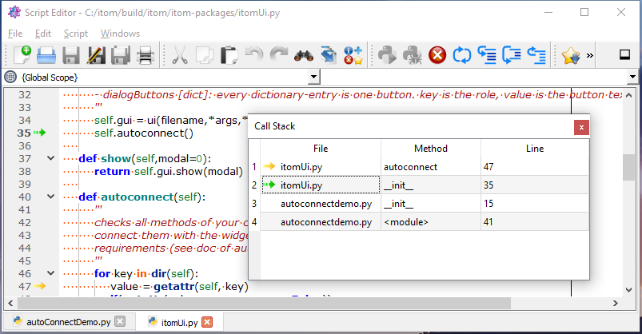

.. include:: ../include/global.inc

Call Stack
***************************

The call stack toolbox is only active and useful when debugging any python script with |itom|.

The usage of the call stack should be presented using one simple example. The script **autoConnectDemo.py** from the itom demo folder
is executed in debug mode and the debugger is currently waiting in the method **autoconnect** of the class **ItomUi**
of the module **itomUi.py** (see folder *itom-packages*).
When opening this file in |itom|, a yellow array shows the current position of the debugger in line 47 of the file **itomUi.py**.

The corresponding call stack is then visible in the toolbox, like depicted below:

    
A call stack shows the current function stack, which is a nested list of method and function calls. Whenever a method
or function is called from any part of a script and the debugger stops within this called function, a new line
is added on top of the callstack. Therefore, the bottom row of the callstack shows the outermost entry. Once 
a method or function is finished (e.g. by a return statement), the corresponding line is removed from the callstack.

By double-clicking on any enabled entry of the call stack, the corresponding python script is opened in |itom| and the position of the debugger
becomes the current line. The currently executed line will always be marked by a yellow arrow, while any other
double clicked line will be marked in the callstack toolbox as well as the script with a green arrow in the same
column than the breakpoints:

.. note::
    
    If you think, that the debugger shows another line in the script that does not correspond to the real executed code, you may need to reload this
    or further scripts. Python has an improved caching mechanism for all modules and packages that have been imported at any place of your script.
    Once imported, the modules and packages are translated in an intermediate file that is cached and saved in a **__pycache__** folder. Further changes
    in any related script file are not executed if the old files are still cached. In order to force |itom| reloading any modules, either delete the
    cache folders, use the **reload** method from the module **imp** or use the dialog **reloadModules** from |itom|. For more information about reloading
    plugins see :ref:`here <script-language-reload-modules>`.