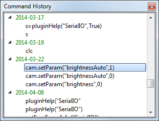

.. include:: ../include/global.inc

.. _gui-commandhistory:

Command History
***************************

If the command history option is enabled in the properties of |itom|, every script command that is executed via the command line,
is chronologically saved in the command history toolbox. Depending on the properties, all entries can also be grouped by the day
of their execution. There is a limit of saved commands (default: 100), such that older commands are automatically deleted from
the toolbox if the maximum number of commands is reached. At shutdown of |itom| the current list of commands is saved and reloaded
at the next startup.

In the properties of |itom| there is another option, that forces |itom| not to display multiple equal commands in one sequence. Only
the first command is saved then.

To clear the entire history, choose **clear list** from the context menu of the command history.

It is possible to drag&drop one or multiple commands from the history to either any script window or the command line. For selecting
multiple commands, use either the shift-key (adjacent commands) or the ctrl-key for selecting single commands.

.. note::

    When dropping one or multiple commands onto the command line, they are not directly executed. Therefore press the return key in order
    to start the execution.
