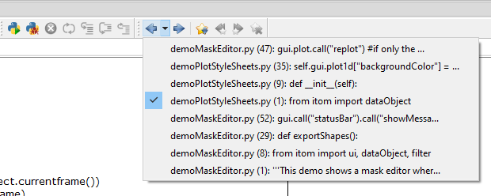
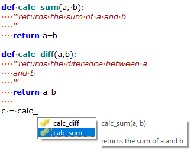
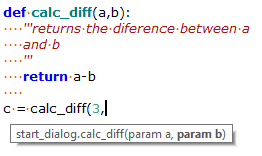
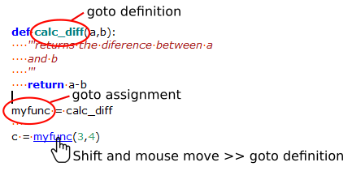
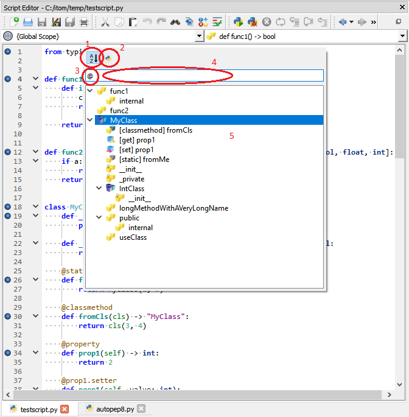
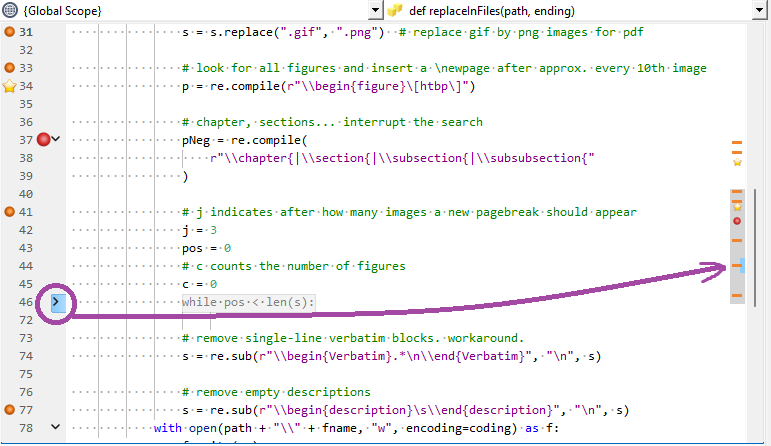
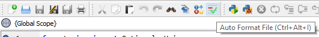
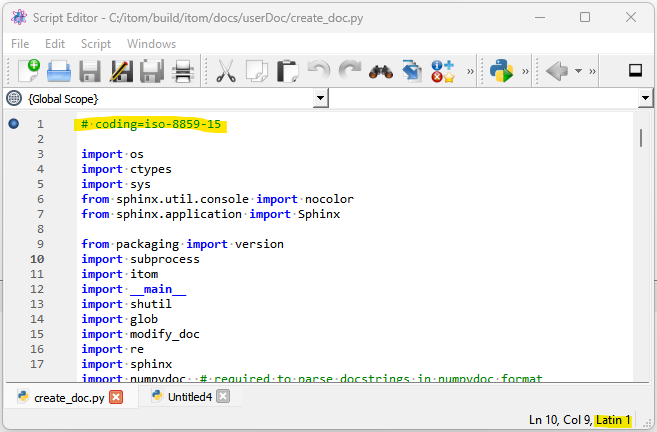
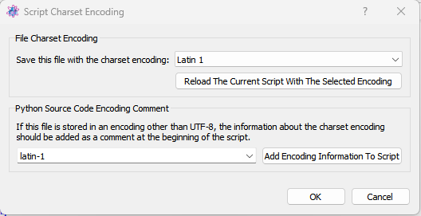

.. include:: ../include/global.inc

.. _gui-editor:

Script Editor
**************

The script editor is one of the main windows of |itom| and allows creating, 
modifying and executing one or several python scripts.

.. figure:: images/scripteditor.png
    :width: 881px
    :align: center

Every script editor window can display one or multiple script files that 
are separated in different tabs at the bottom of the window. Click a tab 
to show the corresponding script in the center of the window. You can 
close, save, reorder or (un-)dock every single tab by its context menu.

.. figure:: images/scripteditor-tab-context.png
    :scale: 100%
    :align: center

The content of the current script file is displayed in the center of the 
script editor window. Use this text editor to write or modify a script
that can then be run or debugged. The menus of the script editor window 
provide many possibilities to edit and finally run or debug the script. 
The most important functions are also accessible via the toolbar and / or 
the context menu of the script area.

Basic functions
========================

The file menu gives the opportunity to open an existing script or create 
a new one, to save the current script or to print or close the script.

Basic and advanced functions to edit the current script are contained in 
the **edit** menu. These are:

* cut, copy and paste parts of the script.
* comment (Ctrl+R) the selected lines using the #-character or uncomment 
  lines (Ctrl+Shift+R).
* indent or unindent the selected lines.
* open a search bar at the bottom of the script to search for a string 
  (quick search) (Ctrl+F).
* open a search and replace dialog (Ctrl+H).
* open a goto-dialog (Ctrl+G) where you can enter a specific line number 
  the cursor should be moved to.
* open the :ref:`icon browser <gui-editor-iconbrowser>` to search internal 
  icons of itom and loaded plugins that can also be used for specific user 
  interfaces.
* You can set bookmarks by clicking the left margin (left from the line numbers). 
  A star icon indicates a bookmarked line. Modify the bookmarks or jump 
  to the next by clicking the corresponding menu entries.

.. _gui-editor-run-debug-script:

Run or debug the script
========================

In order to run or debug the script, use the functions given in the **script** 
menu.

.. figure:: images/editor_run_debug.png
    :scale: 100%
    :align: center

These are:

* **Run Script** (F5): Click this to run the current script. This is the default 
  way to execute a script.
* **Run Selection**: If you mark a specific part of the script and choose 
  **run selection**, this selection is copied into the command line and executed. 
  Please notice, that the number of leading spaces of the first selected line 
  is also removed from the following lines. If no selection is active in the script,
  the current line of the cursor is executed and the cursor jumps to the same
  position in the next line.
* **Debug** (F6): Click this to debug the current script such that you can jump 
  from line to line or breakpoint and see the state of the script and all global 
  or local variables. The line where the debugger is currently stopped is marked 
  with a yellow arrow. Then, the debugger waits for your input how to proceed. 
  The options are...
* **Continue** (F6): Continue the script execution until the next valid 
  breakpoint or the end of the script.
* **Step** (F11): The script executes the following line or jumps into the first 
  line of the function that should be executed in the currently marked line.
* **Step Over** (F10): Almost the same than **step** besides that the debugger 
  always executes the script until the next line in the current function or the 
  main script. Further function calls are entirely executed.
* **Step Out** (Shift+F11): Executes the script until the end of the current 
  function and stops in the next line of the caller.
* **Stop** (Shift+F10 or Ctrl+C): Stops a currently running script (run or debug 
  mode). Please notice, that the script can not always be stopped immediately. 
  For instance, the stop flag is not checked when a sleep command from python's 
  time module is executed.

The functions **continue**, **step**, **step over**, **step out** and **stop** 
are only enabled if a script is currently debugged or run (stop only). These 
functions are also accessible via the script menu of the |itom| 
:ref:`main window <gui-mainwindow>`.

More information about breakpoints are given in the next section.

.. _gui-editor-breakpoints:

Breakpoints
========================

Breakpoints are red or gray points in the right side of the margin of a script 
window. In every valid script line, there can be at most one breakpoint.
A breakpoint is added to a specific line by clicking the margin at the right 
side of the line numbers. You cannot add a breakpoint to a commented or empty 
line. If you clear or comment a line that already contains a breakpoint, the 
script debugger will fail with a corresponding error message.

.. figure:: images/editor-breakpoints.png
    :scale: 100%
    :align: center

There are three different types of breakpoints:

* Red point: This is an enabled, standard breakpoint. Once the script is 
  debugged, it will always stop at this breakpoint.
* Gray point: Disabled breakpoint. This breakpoint is currently inactive. You 
  can enable or disable a breakpoint by clicking it or via its context menu.
* Red point with white cross: Special breakpoint. Right click on a breakpoint 
  and choose **edit breakpoint** to set further settings to the breakpoints behaviour.

.. figure:: images/editor-edit-breakpoints.png
    :scale: 100%
    :align: center

The **edit breakpoint** dialog allows configuring the following properties of a 
breakpoint:

* Condition: Indicate a python statement that is evaluated once the debugger 
  comes to the corresponding line. It will only stop at this line of the condition 
  returns true. You can use any global or active local variables inside of 
  the condition.
* Ignore Count: If this number is bigger than zero, the debugger ignores this 
  breakpoint for the first n times, where n is the value of **ignore count**.
* Temporary Breakpoint: The debugger only stops at this breakpoint once and 
  ignores it after having stopped there for the first time.
* Enabled: En/Disables the breakpoint.

The breakpoints of this and other scripts are all listed in the 
:ref:`breakpoint toolbox <gui-breakpoints>` of |itom|. If |itom| is closed, all 
current active and inactive breakpoints are saved and restored once |itom| is started 
again. Breakpoints are also active if the corresponding script is currently not 
visible in any script editor window.

.. note::
    
    In order to stop the script execution in a debug-mode in any method that is 
    for instance called by clicking a button in an user-defined interface or via 
    a timer event, you need to set a breakpoint in the corresponding line in the 
    script and toggle the button |vardebugpython| **Run Python in debug mode** 
    in the main window of |itom| (toolbar or menu **script**). The same holds 
    for a method that you call from the command line. Toggle this button and set 
    a breakpoint in the method in order to run this method in debug-mode and let 
    the debugger stop in the line marked with the breakpoint.

.. _gui-editor-bookmarks:

Bookmarks
============

It is possible to mark certain lines in a or multiple scripts with bookmarks, 
displayed as star icon in the most-left column (left to the column numbers).
The list of all bookmarks is then visible in the 
:ref:`bookmarks <gui-bookmarks>` toolbox of |itom|. To add a bookmark to a 
line, which is not decorated with a bookmark yet, either click in the 
most-left column in the desired line or click at any character in the desired 
line to move the cursor there and click the **toggle bookmark** button in 
the toolbar.

To remove a bookmark, click on an existing bookmark icon in the editor again 
or click the **toggle bookmark** button again, if the cursor is currently in the 
line of a bookmark. It is additionally possible to clear all existing bookmarks.

Using the **previous bookmark** and **next bookmark** buttons (in the toolbar 
of the editor, in the context menu of the most-left column or via the bookmark toolbox) 
it is possible to jump to the previous or next bookmark in the global list of bookmarks.

Bookmarks are persisted at shutdown of |itom| and reloaded at the next startup. 
Bookmarks, that belong to non-existing Python scripts will not be persisted or reloaded.

Navigate forward and backward
===============================

|itom| stores a list of last cursor positions in any scripts. This list is 
limited to 20 entries and can be accessed via the **Navigate Backward** or 
**Navigate Forward** buttons in the toolbar of any script editor. This allows 
jumping from the current cursor position to a previous or a following position. 
The full stack is contained in the submenu of the **Navigate Backward** button:

Select one entry to directly jump to this file and line number. New items are 
added to this list in the following cases (among others):

* the cursor has been moved into another script or more than 10 lines in the 
  current script
* the cursor was moved to a new location using the **Go to...** dialog or the 
  search functionality
* A destructive action (like hitting Backspace) was executed after having 
  moved the cursor to a new location

Syntax highlighting and indentation
=====================================

A script highlighting mechanism is implemented to simplify the reading and 
programming of the script. You can change the styles of the syntax highlighting 
in the :ref:`property dialog <gui-prop-py-styles>` (tab *styles*) of |itom|.

Another big feature is the additional help for working with indentations using 
spaces or tabs. The python language is structured using indentation. Each 
indentation level always needs to consist of the same amount of spaces or tabs; 
additionally you must not switch between tabs and spaces for the indentation 
within your scripts. The script editor has a feature to automatically replace 
tabs by a certain amount of spaces (it is recommended to set this feature and use 
four spaces for one tab). Additionally, you can display spaces or tabs and be 
warned if you switch between both. All these features are configurable in the 
:ref:`tab general <gui-prop-py-general>` of the property dialog.

If you press the return key after the begin of a new indented block (usually 
indicated by a colon character), the next
line is automatically indented.

Auto completion and calltips
===================================================

Auto completion and calltips provide two mechanisms for an easier and faster scripting.

Once you typed a certain number of characters of a new statement, a check for 
possible auto completions is started in the background. Once the results are 
available, they are displayed as list. Select the right item from the list using
the arrow keys and press Tab or Return to select the word. Quit the auto 
completion list with Esc.

The auto completion can be configured by the 
:ref:`tab auto completion <gui-prop-auto-completion>` of the property dialog.

Calltips always appear if you open a rounded bracket to give the arguments of a 
function call. 

If the statement before the bracket corresponds to a detectable method, the list 
of arguments of this method is shown as a tooltip, such that all arguments are 
clearly visible during coding. Configure the calltip behaviour in the 
:ref:`tab calltips <gui-prop-calltips>` of the property dialog.

The introspection for auto completions and calltips uses an offline parsing of 
the current script as well as all imported packages. This might take some time, 
when a new package is imported and analzyed for the first time (e.g. for numpy).

.. note::
    
    Auto completion and calltips require the Python package **jedi** to be 
    installed. **jedi** itself depends on the package **parso**. Please install 
    both packages to benefit from all features of the script editor (*new in **itom** 3.2).

Goto definition or assignment
================================================

The script editor allows navigating to the definitions (or assignments) 
of function calls, used variables etc. in a script. You can either call the 
context menu over the word, to whose definition you would like to go to, or 
you press the shift-key and move the cursor over a specific word. If a 
definition (or assignment) can be found for this word, it is underlined 
after a short moment. Click the click to jump to the definition. A jump 
can be done within the same script, else the requested script is opened.

The difference between an assignment and a definition is shown with respect 
to the image above. In the depicted sample, the definition of the call to 
**myfunc** is the original definition of the method, here this is the 
method **calc_diff**. The assignment however is the place, where the 
variable **myfunc** is introduced for the first time.

**New in |itom| 3.2**

.. _gui-editor-outline-navigator:

Code Outline
================================================

When a script is loaded or changed, an outline of all methods, classes
is created. This outline can then be used for multiple purposes.
Many features can be parameterized by the :
ref:`script editors <gui-prop-script-editors>` subpage of the property dialog.

One feature is the code navigation bar above each script editor. Its
visibility can be set by a checkbox in the property dialog. If visible,
it looks like this:

.. figure:: images/editor-class-navigator.png
    :scale: 100%
    :align: center

The left combo box shows a **globals** section for all methods,
that are not part of any classes, as well a list of all classes,
detected in the current script. If one of these values is selected,
the cursor is moved to the line, where the class is defined (if it is
a class) and the right combo box shows all methods, functions, properties...
that belong to this class or the globals section of the script.
Again, you can jump to the definition of such a method by selecting an
entry from the combo box. 

If one moves the cursor into a line, that belongs to a method or
class, the corresponding entries are immediately displayed in both
combo boxes.

In general, the outline is updated whenever a script is updated whenever
a tab is changed or a script is loaded. However, it can also be automatically
updated after a short delay after the last key press in the editor. This
delay can also be adjusted in the property dialog.

Fast symbol search popup
=========================

From **itom 4.1**, another option to easily jump to methods or classes in
the current script or any opened scripts is provided. To show this popup dialog,
either select the item **Fast symbol search...** from the **edit** menu of
the script window or from the context menu of the script editor. Alternatively,
simply use the **Ctrl + D** shortcut to open the popup.

The popup looks like this:

It can be closed again by pressing **Esc** or by clicking anywhere outside of the
popup. Per default, this popup shows the outline of the current script in the
tree widget (5). This is also indicated by the leading **@** sign in the filtering
text box (3) or by the unchecked action (2). If you remove the **@** sign or toggle
the action, the outlines of all opened scripts is displayed, where the top level
items of the tree widget are the filenames.

The entries in the tree widget are usually sorted by their order in the script(s).
However, it is also possible to sort them alphabetically in ascending order, if the
action (1) is checked.

To jump to any symbol, either double click the symbol (class, method...) or
use the up / down key arrows to select the desired item and press **Return** or
**Enter**. This will also close the dialog.

It is also possible to filter the displayed values by typing a part of the names
in the text box (4).

.. _gui-editor-syntax-check:

Automatic syntax and code check
=================================

If desired, all opened scripts can be continuously be checked for syntax
and other errors or hints, like the compliance with the Python style guide
(PEP8) or the style guide for docstrings (PEP257).

Basic checks can already be provided, if the python package 
`pyflakes`_ is installed. 

Style guide checks etc. (denoted as extended checks) 
are only available if the package `flake8 <https://flake8.pycqa.org/en/latest/>`_, 
that depends on `pyflakes`_, 
`pycodestyle <https://pypi.org/project/pycodestyle/>`_ 
and `mccabe <https://github.com/pycqa/mccabe>`_.

.. _pyflakes: https://pypi.python.org/pypi/pyflakes

You need to have these packages installed in order to benefit from the desired service.
If the necessary packages could not be found, the service is deactivated and a warning
appears at startup or if you changed the properties.

The check mode (no check, basic checks, extended checks) as well as the detailed
configuration can be done in the corresponding page of the 
:ref:`property dialog of itom <gui-prop-py-code-checkers>`.

Any kind of message has one of the three possible levels **info**, **warning** or **error**.
It is then displayed via one of three possible bug symbols in the left-most margin
of the script editor window (blue dot: info, orange dot: warning, red ladybug: error):

.. figure:: images/propEditorCodeCheckers.png
    :scale: 100%
    :align: center

The tooltip text of every bug icon displays the reason for the bug. Since the bug 
icon is displayed in the same margin column than the bookmarks, there is also a 
combined icon for a bug and a bookmark in one line. 

.. figure:: images/editor-syntax-check.png
    :scale: 100%
    :align: center

Please note, that one line can also contain multiple syntax hints, they are 
displayed in multiple lines in the tooltip text.

.. note::
    
    You can automatically download and install **pyflakes**, **flake8**, **pycodestyle** 
    etc. using the :ref:`python package manager <gui-pipmanager>` of |itom| accessible 
    via the *Script* menu of the main window.
    
    Click *install* in the manager and search the python package index for the 
    package **pyflakes** (or others). Try to call::
        
        import pyflakes
        
    to check if pyflakes is installed correctly.
    
    The bug icons are then available after a restart of itom.

Global checker panel
=====================

For a total overview about all available indicators for different annotations,
a small column panel is located left to the scrollbar.

The vertical axis of this panel is aligned with the scrollbar, such that the
active area represents all lines of the script, that are currently not collapsed.

The following annotations are visualized:

* All outputs of the syntax check and code check by blue, orange and red horizontal lines
  in the bar.
* All breakpoints (independent on their subtypes) by a red dot
* All bookmarks by a yellow star

You can click at any location in this panel and the cursor jumps to the corresponding
line in the script.

Whenever the user clicks a fold (in the left panel), parts of the script can be
collapsed (or uncollapsed again). In this case, the collapsed lines are not visualized
any more in the panel, since the scrollbar excludes them as well. However, the position
of the collapsed fold is marked by a vertical blue light line. This gives a hint, that part
of the code is collapsed here. Additionally, the last line above the collapsed block 
contains the most severe annotations in all lines of the collapsed block. Hence, if there
is any breakpoint or bookmark in the collapsed part, this last visible line contains a 
bookmark or breakpoint mark. The same hold for informations, warnings and errors from
the style and syntax check (errors are more severe than warnings, and warnings beat infos).

.. _gui-editor-iconbrowser:

Icon-Browser
========================

To help adding icons to user defined buttons, menus or user interfaces, the icon 
browser of the script editor window shows a list of icons that come with |itom| 
or loaded plugins. The icon browser is opened via the menu 
**edit >> icon browser...** of any script editor window or the keyboard 
shortcut **Ctrl + B**.

.. figure:: images/editorIconBrowser.png
    :scale: 100%
    :align: center

These icons can directly be used inside of any script by their *virtual icon path*. 
If you choose a specific icon, you have the following options via the buttons on 
the right side:

* **Insert and close**: The *virtual icon path* of the selected icon is inserted 
  at the current cursor position in the script and the icon browser is closed.
* **Copy to clipboard**: The path is copied to the clipboard. The browser stays open.
* **Cancel**: Hides the dialog without further action.

.. |vardebugpython| image:: images/pythonDebug.png

Since there are a lot of icons, it is possible to filter the list by typing parts 
of an icon filename into the search box on top of the icon list. Instead of using 
the **Copy to clipboard** button, it is also possible to copy the 
path of the selected icon from the textbox below the icon list.

.. _gui-editor-auto-code-formatter:

Auto Code Formatting
========================

itom provides the possibility to call an auto code formatting tool, that get the
current script as input stream and returns the formatted version. If this version
is different than the initial version, the code is replaced by the formatted
code and the current script is marked as changed. The changed version can be reverted
via the undo button.

The auto code formatting feature can either be run by a button in the toolbar of
a script, by the menu **edit** of a script editor window or by the shortcut 
**Ctrl + Alt + I**.

Usually, the auto code formatting tool depends on further 3rd party Python packages.
In general it is possible to use any loadable module, that accepts a code string
via its input stream and returns the result via the output stream. Common packages are
**black**, **yapf** or **autopep8**.

If the button is pressed, and the auto formatting cannot be executed successfully,
an error message appears and (if sufficient user rights are available) the user
can check to disable this option for the future. 

For configuring the auto code formatting, please see the 
:ref:`auto code formatting <gui-prop-auto-code-format>`
page of the itom property dialog.

.. _gui-editor-docstring-generator:

Automatic Docstring Generator
==============================

Another feature in the script editor of itom, is the automatic insertion of a 
pre-filled docstring template for functions, methods and properties. 

This feature
can be configured in the :ref:`docstring generator page <gui-prop-docstring-generator>`
of the itom property dialog. You can for instance choose between the Google style
or the Numpy docstring style. Furthermore it is possible to define, whether three
double quotes (""") or three apostrophes (''') should be used for the docstring.

To add such a docstring, there are three different possibilities:

1. Choose **Generate Docstring** from the context menu of the script editor, when
   clicking the signature of the body of a function or method.

2. Press **Ctrl+Alt+D** if the cursor is located somewhere in the function or method
   or click the action **Generate Docstring** from the **Edit** menu.

3. Enter three double quotes (""") or three apostropes (''') in the line after the
   signature. Then, a menu popup appears, where you can choose **Generate Docstring**
   by pressing Return or Enter. If you press any other key, the popup automatically
   disappears.

.. _gui-editor-charset-encoding:

Charset Encoding
=================

If not otherwise stated, Python (since Python 3.7) assumes, that a script file is
stored with the charset encoding **UTF-8**. Before, the local encoding was used (at least
for Windows). If the script file is stored with another encoding, it is possible to
name this encoding in the first or second line, using the **coding** statement
(see `PEP 263 <https://peps.python.org/pep-0263/>`_).

itom is able to load and save scripts with different typical encodings. The current
encoding for every script can be different and will be displayed in the status bar of
the script window, if the script is undocked from the main window, or in the status bar
of the main window:

Offically supported encodings are:

* UTF-8
* latin1
* UTF-8 with BOM (byte order mark)

Byte order mark means, that the file starts with some magic characters, that indicates
the encoding of this file.

When a script is loaded, the default encoding, that can be selected in the **Editor >> General**
tab of the itom property editor, is usually assumed and the script is loaded with this
charset encoding. However, it is also possible to let itom guess the encoding, if possible.
This can also be set in the same page of the property dialog. If set, the script is either scanned
for a possible byte-order-mark or the first or second line is scanned for a **coding** statement
and this encoding is assumed, if it is supported.

The encoding, used to load a script, is also the current encoding of this script. If changes
to the script are stored, this current encoding is used to save the file. It is not checked, if
the **coding** statement is added as comment in the first or second line, at least if this is different
to the Python standard **UTF-8**. The following coding values in the script are supported and
mapped to the indicated charset encoding (see `this link <https://docs.python.org/3.11/library/codecs.html#standard-encodings>`_):

* latin-1, latin1, latin_1, iso-8859-15, iso8859-1, 8859, cp819, latin, L1 --> Latin1
* utf8, utf-8, utf_8, u8, utf, cp650001 --> utf-8
* utf_8_sig --> utf-8 with BOM

itom allows changing the current encoding of this script. This can be selected by the item
**Charset Encoding...** of the context menu or the **Edit** menu of the script editor.
This menu action opens the following dialog:

This dialog provides two features: On the one hand, one can select another encoding, that is used as future charset
encoding for saving the file. However, it is also possible to reload the current script using this encoding. This can
be useful if the script has been loaded with a wrong encoding and strange characters are visible.

If the script is encoded in a charset encoding different than **UTF-8**, it is highly recommended to indicate
this encoding using the **coding** comment in the first or second line of the script, as described in 
`PEP 263 <https://peps.python.org/pep-0263/>`_. It is possible to insert the specific comment line by selecting the
desired encoding in the dialog and press the button to insert it in the first line of the dialog.

