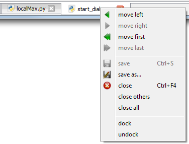
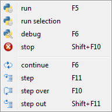
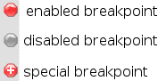
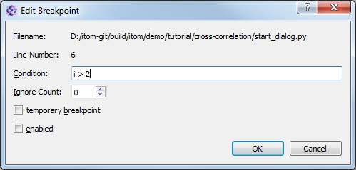
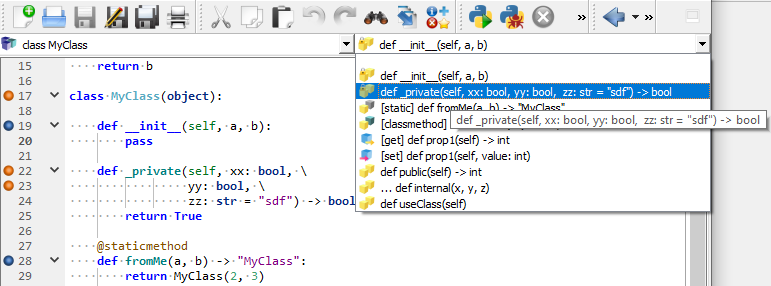
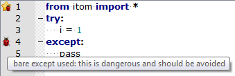

.. include:: ../include/global.inc

.. _gui-editor:

Script-Editor
**************

The script editor is one of the main windows of |itom| and allows creating, modifying and executing one or several python scripts.

.. figure:: images/scripteditor.png
	:scale: 100%
	:align: left

Every script editor window can display one or multiple script files that are separated in different tabs at the bottom of the window.
Click a tab to show the corresponding script in the center of the window. You can close, save, reorder or (un-)dock every single tab
by its context menu.

The content of the current script file is displayed in the center of the script editor window. Use this text editor to write or modify a script
that can then be run or debugged. The menus of the script editor window provide many possibilities to edit and finally run or debug the script. The most important
functions are also accessible via the toolbar and / or the context menu of the script area.

Basic functions
~~~~~~~~~~~~~~~~

The file menu gives the opportunity to open an existing script or create a new one, to save the current script or to print or close the script.

Basic and advanced functions to edit the current script are contained in the **edit** menu. These are:

* cut, copy and paste parts of the script.
* comment (Ctrl+R) the selected lines using the #-character or uncomment lines (Ctrl+Shift+R).
* indent or unindent the selected lines.
* open a search bar at the bottom of the script to search for a string (quick search).
* open a search and replace dialog.
* open a goto-dialog (Ctrl+G) where you can enter a specific line number the cursor should be moved to.
* open the :ref:`icon browser <gui-editor-iconbrowser>` to search internal icons of itom and loaded plugins that can also be used for specific user interfaces.
* You can set bookmarks by clicking the left margin (left from the line numbers). A star icon indicates a bookmarked line. Modify the bookmarks or jump to the next by clicking the corresponding menu entries.

.. _gui-editor-run-debug-script:

Run or debug the script
~~~~~~~~~~~~~~~~~~~~~~~~

In order to run or debug the script, use the functions given in the **script** menu.

These are:

* **Run Script** (F5): Click this to run the current script. This is the default way to execute a script.
* **Run Selection**: If you mark a specific part of the script and choose **run selection**, this selection is copied into the command line and executed. Please notice, that the number of leading spaces of the first selected line is also removed from the following lines.
* **Debug** (F6): Click this to debug the current script such that you can jump from line to line or breakpoint and see the state of the script and all global or local variables. The line where the debugger is currently stopped is marked with a yellow arrow. Then, the debugger waits for your input how to proceed. The options are...
* **Continue** (F6): Continue the script execution until the next valid breakpoint or the end of the script.
* **Step** (F11): The script executes the following line or jumps into the first line of the function that should be executed in the currently marked line.
* **Step Over** (F10): Almost the same than **step** besides that the debugger always executes the script until the next line in the current function or the main script. Further function calls are entirely executed.
* **Step Out** (Shift+F11): Executes the script until the end of the current function and stops in the next line of the caller.
* **Stop** (Shift+F10 or Ctrl+C): Stops a currently running script (run or debug mode). Please notice, that the script can not always be stopped immediately. For instance, the stop flag is not checked when a sleep command from python's time module is executed.

The functions **continue**, **step**, **step over**, **step out** and **stop** are only active if a script is currently debugged or run (stop only). These functions are also accessible via the script menu of the |itom| :ref:`main window <gui-mainwindow>`.

More information about breakpoints are given in the next section.

.. _gui-editor-breakpoints:

Breakpoints
~~~~~~~~~~~~

Breakpoints are red or gray points in the right side of the margin of a script window. In every valid script line, there can be at most one breakpoint.
A breakpoint is added to a specific line by clicking the margin at the right side of the line numbers. You cannot add a breakpoint to a commented or empty line.
If you clear or comment a line that already contains a breakpoint, the script debugger will fail with a corresponding error message.

There are three different types of breakpoints:

* Red point: This is an enabled, standard breakpoint. Once the script is debugged, it will always stop at this breakpoint.
* Gray point: Disabled breakpoint. This breakpoint is currently inactive. You can enable or disable a breakpoint by clicking it or via its context menu.
* Red point with white cross: Special breakpoint. Right click on a breakpoint and choose **edit breakpoint** to set further settings to the breakpoints behaviour.

The **edit breakpoint** dialog allows configuring the following properties of a breakpoint:

* Condition: Indicate a python statement that is evaluated once the debugger comes to the corresponding line. It will only stop at this line of the condition returns true. You can use any global or active local variables inside of the condition.
* Ignore Count: If this number is bigger than zero, the debugger ignores this breakpoint for the first n times, where n is the value of **ignore count**.
* Temporary Breakpoint: The debugger only stops at this breakpoint once and ignores it after having stopped there for the first time.
* Enabled: En/Disables the breakpoint.

The breakpoints of this and other scripts are all listed in the :ref:`breakpoint toolbox <gui-breakpoints>` of |itom|. If |itom| is closed, all current active and inactive breakpoints are saved and restored once |itom| is started again. Breakpoints are also active if the corresponding script is currently not visible in any script editor window.

.. note::
    
    In order to stop the script execution in a debug-mode in any method that is for instance called by clicking a button in an user-defined interface or via a timer event, you need to set a breakpoint in the corresponding line in the script and toggle the button |vardebugpython| **Run Python in debug mode** in the main window of |itom| (toolbar or menu **script**). The same holds for a method that you call from the command line. Toggle this button and set a breakpoint in the method in order to run this method in debug-mode and let the debugger stop in the line marked with the breakpoint.

Syntax highlighting and auto completion
~~~~~~~~~~~~~~~~~~~~~~~~~~~~~~~~~~~~~~~~

A script highlighting mechanism is implemented to simplify the reading and programming of the script. You can change the styles of the syntax highlighting in the :ref:`property dialog <gui-prop-py-styles>` (tab *styles*) of |itom|.

Another big feature is the right handling and help for working with indentations using spaces or tabs. The python language is structured using indentation. Each indentation level always needs to consist of the same amount of spaces or tabs; additionally you must not switch between tabs and spaces for the indentation within your scripts. The script editor has a feature to automatically replace tabs by a certain amount of spaces (it is recommended to set this feature and use four spaces for one tab). Additionally, you can display spaces or tabs and be warned if you switch between both. All these features are configurable in the :ref:`tab general <gui-prop-py-general>` of the property dialog.

When you start typing a new command in the editor window or the command line, it is possible to display either an auto completion list or calltips. The auto completion list appears after having typed a certain amount of characters of a new word and displays similar commands or keywords. You can choose from this list using the tab-key. It is possible to choose the sources for this list:

* Use the recently typed words as sources
* Use words contained in so called API files as sources. The API files can be set in the :ref:`tab API <gui-prop-py-api>` of the property dialog.
* Use both sources

The auto completion list settings are listed in the :ref:`tab auto completion <gui-prop-auto-completion>` of the property dialog.

Calltips always appear if you open a rounded bracket to give the arguments of a function call. Then the first line of the docstring of all functions that are listed in any loaded API file and have the same name than the written function are displayed. Configure the calltip behaviour in the :ref:`tab calltips <gui-prop-calltips>` of the property dialog.

.. _gui-editor-class-navigator:

Direction class and method navigator
~~~~~~~~~~~~~~~~~~~~~~~~~~~~~~~~~~~~~

Above every script, there are two combo boxes that are part of a class and method navigator. If these combo boxes are not available, you need to enable this navigator in the property dialog, :ref:`tab general <gui-prop-py-general>`. After a configurable number of seconds after the last change in the script, it is analyzed and the combo boxes are adapted with respect to the current structure of the script.

The left combobox displays all classes and the global namespace of the script. By clicking on any class name, the cursor jumps to the class and the name is highlighted. The right combobox shows the sub-items that belong
to the chosen class or namespace.

The navigator can distinguish between public and private methods, static methods (with the decorator **@staticmethod**) and specially marked class methods (decorator **@classmethod**). All globally defined methods are
categorized into the global namespace (**Global Scope**).

.. _gui-editor-syntax-check:

Automatic syntax check
~~~~~~~~~~~~~~~~~~~~~~~

If desired, the current script can be checked for syntax and other errors or hints. This is done using the python package **frosted** (https://pypi.python.org/pypi/frosted/).
You need to have this package installed in order to benefit from this service. If **frosted** is not installed, the syntax check is automatically disabled.

If **frosted** is installed, the syntax and style check can be dis- or enabled and configured via the :ref:`property dialog of itom <gui-prop-py-styles>`. Syntax bugs or other
hints, warnings or errors detected by **frosted** will be displayed via a bug symbol in the left margin of the script editor window:

The tooltip text of every bug icon displays the reason for the bug. Since the bug icon is displayed in the same margin column than the bookmarks, there is also a combined icon
for a bug and a bookmark in one line. Please note, that one line can also contain multiple syntax hints, they are displayed in multiple lines in the tooltip text.

.. note::
    
    You can automatically download and install **frosted** using the :ref:`python package manager <gui-pipmanager>` of |itom| accessible via the *Script* menu of the main window.
    Click *install* in the manager and search the python package index for the package **frosted**. Try to call::
        
        import frosted
        
    to check if frosted is installed correctly.
    

.. _gui-editor-iconbrowser:

Icon-Browser
~~~~~~~~~~~~~~~~

To help adding icons to user defined buttons, menus or user interfaces, the icon browser of the script editor window shows a list of icons that come with |itom| or loaded plugins.
The icon browser is opened via the menu **edit >> icon browser...** of any script editor window or the keyboard shortcut **Ctrl + B**.

.. figure:: images/editorIconBrowser.png
	:scale: 100%
	:align: left

These icons can directly be used inside of any script by their *virtual icon path*. If you choose a specific icon, you have the following options via the buttons on the right side:

* **Insert and close**: The *virtual icon path* of the selected icon is inserted at the current cursor position in the script and the icon browser is closed.
* **Copy to clipboard**: The path is copied to the clipboard. The browser stays open.
* **Cancel**: Hides the dialog without further action.

.. |vardebugpython| image:: images/pythonDebug.png  