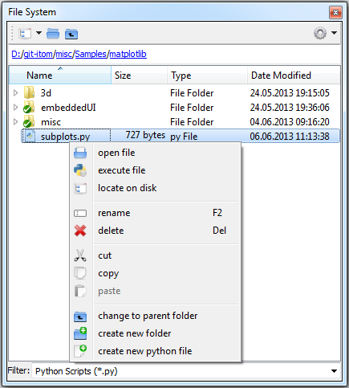

.. include:: ../include/global.inc

.. _gui-filesystem:

File System
*************

The file system toolbox gives you access to the file system of your harddrive.

Below the toolbar, a breadcrumb menu allows seeing the current path, where a click to any parent folder changes the current path to that folder. The current path is also printed at the right
side of |itom|'s statusbar and also corresponds to the current, active directory of python. The filter below the file system, contains file filters to all file formats that are recognized by |itom|,
either by a direct way (Python files, itom data collection, ...) or by algorithms implemented in any algorithm plugins. However you can also type your own filters in order to filter the file system
tree.

The first combo box in the toolbar gives you access to the last ten current directories, that are also saved at termination of |itom| and are available at the next startup. The context menu of every item
depends on the type of the item (file, folder, empty space in the tree). A right click on a python file for instance allows to open that file or to directly execute the script. The command **locate on disk**
opens an external exporer with the current directory as start directory. Additionally, you can always create a new directory or python script in the current folder.

The file system toolbox also provides the common drag&drop functionalities allowing to move or copy files from and to another application, like the explorer. You can even drag a data file, that is known by
|itom| onto a workspace toolbox in order to import that file in the workspace.
