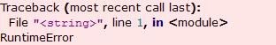
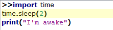

.. include:: ../include/global.inc

.. _gui-mainwindow:

Main Window
****************

During the startup of |itom| a splash screen shows the current state of the load process. After having finished, the |itom| main window appears like in the following screenshot:

.. figure:: images/iTOM.png
    :scale: 100%
    :align: center

The appearance of the application after its start may vary with respect to the depicted screenshot, since the current position, size and visibility of many toolboxes and other components of the overall graphical user interface as stored in the settings at shutdown. They are reloaded at the next startup.

In general, the GUI consists of a command line widget (console_) in the center and several toolboxes_ that can be 
arbitrarily positioned as well as moved out of the main window itself (floated state). The toolboxes provide access 
to many main functionalities of |itom|. Additionally, every opened hardware plugin may provide its own toolbox, that 
can also be docked into |itom|'s main window.

Further functionalities of |itom| are reached by the menu or the toolbars. It is possible to add further user defined 
menus and toolbars using the python scripting language (see :ref:`toolbar-start`).

.. _console:

Command Line
========================

The command line in the center of the main window allows executing single or multi-line python commands. Additionally 
all messages, warnings and errors coming from python method calls or |itom| itself are printed in the command line 
widget. Errors are highlighted with a red background:

Usually, the last line of the command line shows the ">>" sign, that indicates that the console is ready for a new 
input. You can either write a single python command and press the return key in order to execute it or you can write 
multiline commands. In order to create a new line for this, press the Shift + Return (smooth line break). After the 
final command simply press the return key such that the whole command block is executed.

The current line or code-block that is executed is highlighted with a yellow background. For multi-line commands, 
|itom| parses the whole command block and divides it into logical blocks, such that the highlighted background 
switches from one block to the other one.

In the command line you can use every python command. For inputs you can either use the :py:meth:`input` method or
consider using the input dialog mechanism of |itom| (see :ref:`msgInputBoxes`). Additionally you can use one of 
the following keywords in order to clear the command line::
    
    clc
    clear
    
To clear the command line from an ordinary script, use the command :py:meth:`itom.clc`.

Instead of typing all commands in the console, write your entire python scripts in the :doc:`editor`.

Usually, the command line automatically scrolls to the last line. However, if you use the mouse wheel during a
script execution in order to navigate to a certain line in the command line, the auto-scroll option will be disabled
until the command line is cleared again.

Main menus and toolbars
========================

This is an overview about the menu structure of itom

+------------+--------------------+----------------------+--------------------------------------------------------------------------------------------+
| **Structure**                                                                                                                                       |
+============+====================+======================+============================================================================================+
| **File**   | New Script         | |mainnew| Ctrl+N     | Opens a new Python script in the :doc:`editor`                                             |
+------------+--------------------+----------------------+--------------------------------------------------------------------------------------------+
|            | Open File          | |mainopen| Ctrl+O    | Opens a saved Python script in the :doc:`editor`                                           |
+------------+--------------------+----------------------+--------------------------------------------------------------------------------------------+
|            | Properties...      |                      | property dialog for important settings of itom                                             |
+------------+--------------------+----------------------+--------------------------------------------------------------------------------------------+
|            | User Management... |                      | organizing the user dependent appearance of itom                                           |
+------------+--------------------+----------------------+--------------------------------------------------------------------------------------------+
|            | Loaded plugins...  |                      | opens dialog to see the load status of all plugins                                         |
+------------+--------------------+----------------------+--------------------------------------------------------------------------------------------+
|            | Exit               |                      | terminates and quits itom                                                                  |
+------------+--------------------+----------------------+--------------------------------------------------------------------------------------------+
| **View**   | Toolboxes          |                      | In the submenu you can toggle the visibility of all toolbars and -boxes                    |
+------------+--------------------+----------------------+--------------------------------------------------------------------------------------------+
| **Script** | stop               | Shift+F10            | Stop currently running python code                                                         |
+------------+--------------------+----------------------+--------------------------------------------------------------------------------------------+
|            | continue           | F6                   | Run till end or next break point                                                           |
+------------+--------------------+----------------------+--------------------------------------------------------------------------------------------+
|            | Step               | F11                  | Step into call or if not possible make a stepover                                          |
+------------+--------------------+----------------------+--------------------------------------------------------------------------------------------+
|            | Step over          | F10                  | Step to next call in the current function                                                  |
+------------+--------------------+----------------------+--------------------------------------------------------------------------------------------+
|            | Step out           | Shift+F11            | Go on with code till next method call outside current function                             |
+------------+--------------------+----------------------+--------------------------------------------------------------------------------------------+
|            | Run ... debug      | |debugOn|            | If toggled python methods triggered by user interfaces is executed in debug.               |
+------------+--------------------+----------------------+--------------------------------------------------------------------------------------------+
|            | Reload modules     |                      | :ref:`Reload imported python packages <script-language-reload-modules>` (e.g. import numpy)|
+------------+--------------------+----------------------+--------------------------------------------------------------------------------------------+
|            | Timer Manager...   |                      | :ref:`timer manager <gui-timermanager>` to list, stop or restart timer instances           |
+------------+--------------------+----------------------+--------------------------------------------------------------------------------------------+
|            | Package Manager... |                      | :ref:`python package manager <gui-pipmanager>` to install python packages                  |
+------------+--------------------+----------------------+--------------------------------------------------------------------------------------------+
| **Help**   | Assistant          | |mainhelp| F1        | Opens this documentation                                                                   |
+------------+--------------------+----------------------+--------------------------------------------------------------------------------------------+
|            | About Qt           |                      | Information about Qt                                                                       |
+------------+--------------------+----------------------+--------------------------------------------------------------------------------------------+
|            | About Itom         |                      | Information about your current itom-Version                                                |
+------------+--------------------+----------------------+--------------------------------------------------------------------------------------------+
| **Tools**  | UI Designer        | |mainqtdesigner|     | Opens the Qt Designer (see :ref:`qtdesigner`)                                              |
+------------+--------------------+----------------------+--------------------------------------------------------------------------------------------+

.. |mainsymbols| image:: images/mainsymbols.png  
.. |mainnew| image:: images/mainnew.png  
.. |mainopen| image:: images/mainopen.png  
.. |mainqtdesigner| image:: images/mainqtdesigner.png  
.. |mainhelp| image:: images/mainhelp.png
.. |debugOn| image:: images/pythonDebug.png 

All the actions mentioned in the table above are accessible by either the menu of |itom| or some of them are also available in some main toolbars that come with |itom|.
   
Toolboxes
========================

Content:

.. toctree::
   :maxdepth: 1

   workspace
   plugins
   filesystem
   breakpoints
   bookmarks
   commandHistory
   callStack

The core application of |itom| already comes with a set of different toolboxes. Additionally, many plugins provide the 
possibility to open a toolbox for every opened hardware instance, like actuators or cameras. These toolboxes are then 
also inserted into the main window of |itom|. Usually toolboxes can be docked into the main window or be in a floating 
state, such they appear like an unresizable window. If docked, they can be positioned at the left or right side or the 
top or bottom of the main window. Some of them however are limited with respect to the dockable positions.

All available toolboxes are listed in the menu **View >> Toolboxes**, where hidden toolboxes can be shown again. 
Additionally, a right click to any place in the toolbar opens the following context menu where the first items also access 
the loaded toolboxes. The items after the separator correspond to the toolbars, such that they can be hidden or shown:

.. figure:: images/toolboxmenu.png
    :scale: 100%
    :align: center

| It is possible to (un)dock the Toolboxes to the main frame at different positions. This is done by simple drag 
| and drop of the titel bar of the toolboxes. Another way of (un)docking can be realized by double-clicking on the title bar.
| At the startup of the iTOM software all 5 Toolboxes are activated, which are:

The following main toolbars are available:

- :doc:`workspace` shows the global and local workspaces of Python.
- :doc:`plugins` shows all loaded plugins including opened instances.
- :doc:`filesystem` gives you access to the file system of your harddrive.
- :doc:`breakpoints` shows all breakpoints added to Python scripts.
- :doc:`callStack` shows the callstack when the Python script execution stops at a breakpoint.
- :doc:`bookmarks` shows all bookmarks added to any Python scripts.
