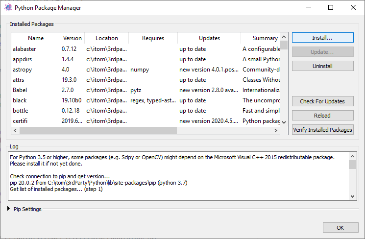

.. include:: ../include/global.inc

.. _gui-pipmanager:

Python Package Manager
**************************

Python is a very modular script language. Its functionality can be enhanced by so called packages. One package has a certain name and a version number, such that updates 
are possible. Furthermore, a package might dependent on multiple other packages that have to be installed in order to run the package.

|itom| provides a package manager, that is accessible via the **Script** menu of the main window:

    
This package manager is a graphical user interface for the python package installation and administration tool **pip** (see https://pip.pypa.io/). Pip itself is a
package of python and comes with a python installation from python 3.4 on. For earlier versions of python it is necessary to install pip first (see https://pip.pypa.io/en/stable/installing.html#install-pip).

Once the package manager is started, pip is detected and the version is checked. Then pip is asked to provide a list of currently installed packages that are listed in the
list widget of the package manager. For this purpose an active internet connection is required. The connection can be further configured by enlarging the *pip settings* group box. All these configurations
are also available when directly calling *pip* from the command line. The log window shows the output of pip. This output is finally parsed and leads to the content of the table *installed packages*. In case
of a problem, text might also appear with red color in the log.
    
.. figure:: images/pipManager2.png
    :scale: 100%
    :align: center
    
Depending on the version of pip, each package is described by

* its name
* its current version
* the location where the package is locally installed
* dependent packages that are required to run this package (comma-separated)
* information about possible updates in the internet (click *check for updates* to obtain this information)
* the package's summary
* a homepage about the package
* the package's license

Click the *check for updates* button, to screen the official python package index (https://pypi.python.org) for newer versions of the installed packages. *pip* itself is also listed as package.

If you want to install new packages or update an existing package, click the *install...* button:
    

    
You have three possibilities to install a package. Choose if you want to install a package from a modern python wheel archive file (*whl*) or from a tar.gz archive. In both cases, chose the archive by clicking
the tool button below. If you want to search the official python package index (https://pypi.python.org) for a specific package name and if found download and install, type the package name in the text field.
See the next section for more information about the ideal package source.

If you want to upgrade an existing package, it is necessary to click the corresponding check box. If you want to also download all required packages, click the appropriate check box. Finally you can also indicate
an alternative search location for packages using the *find links* option. Click OK to start the search and installation. Its progress is then shown in the log and the list of packages is updated at the end.
    
It is also possible to uninstall an installed package (however if no other package depends on this package). If desired, click a package and click then the *uninstall* button.

Package Sources
====================

If you look for small packages (e.g. :ref:`frosted <gui-editor-syntax-check>`), the easiest way of installing them is the direct download from the python package index. However, there exist also more complex packages that contain for instance a huge number of
C files. These packages require a compiler on your computer, since the source code of the C files is compiled to binary files (that can be used by the python package) at installation time at your computer. Sometimes
these packages also required further 3rd party libraries (e.g. Numpy, Scipy or Matplotlib). If so, it might be easier to directly get pre-compiled packages from the internet. One source for such precompiled packages is the
website http://www.lfd.uci.edu/~gohlke/pythonlibs/:

.. figure:: images/pipManager4.png
    :scale: 100%
    :align: center

The packages listed by this website are only available for Windows but different versions of Python in 32bit and 64bit. Download the corresponding wheel file and use the |itom| python package manager to install it (don't forget to mark the upgrade check box if you want to update an existing package). An advantage of this site is also, that some libraries are compiled using the fast MKL compiler from Intel. Please notice that you also need to install updates for packages obtained from Gohlke by downloading the updated version as wheel file and install it. Do not mix the source from Gohlke and the python package index.

Under Linux, it is also worth and possible to install common packages, like Numpy, Scipy or Matplotlib from the package managers of your Linux distribution. This is the way to obtain prebuild binaries under Linux. The above mentioned website only provides Windows binaries.

Start Package Manager only
==============================

It is possible to directly start the Pip Package Manager without the GUI of itom.
This is useful especially if you want to upgrade or re-install Numpy, since Numpy is used by itom and can therefore not be changed after that
Python has been loaded in itom. If you want to directly start the package manager, call the application **qitom** or **qitom.exe** with 
the argument **pipManager**:

.. code-block::
    
    qitom.exe pipManager
    
Under Windows, you can also create a shortcut of the **qitom.exe** application. Then right-click the shortcut, choose *properties* and append
*pipManager* to the path in the text field *destination* (e.g. C:/itom/qitom.exe pipManager). Double-click the shortcut to open the package manager.

Alternatively, put an empty file **restart_itom_with_pip_manager.txt** into the temp folder of your operating system (e.g. C:/Users/username/AppData/Local/Temp). The package manager is then started
at the next startup of *itom*. Afterwards the file is automatically removed. This is done, once you try to install *Numpy* in an ordinary instance
of itom. Then, this text file is created and you have to restart itom in order to get a pure instance of the package manager.