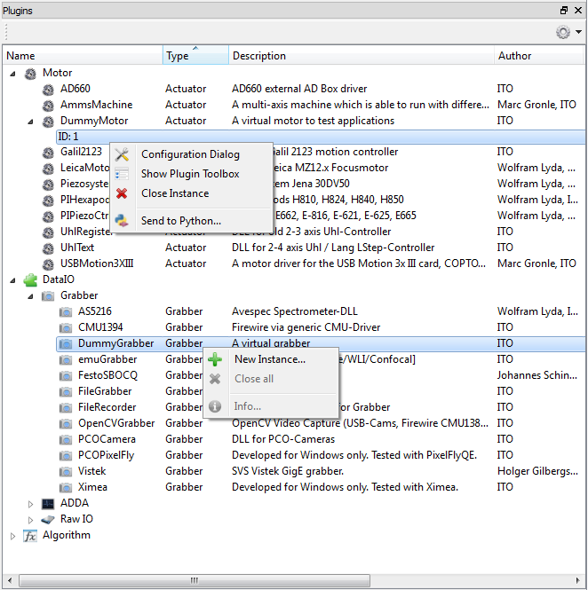

.. include:: ../include/global.inc

.. _gui-plugins:

Plugins
********

The plugin toolbox shows all loaded plugins included any opened instances. The plugins are divided into the following types:

* Actuator (Motor) -> any actuator plugins.
* DataIO >> Grabber -> any cameras.
* DataIO >> ADDA -> any analog-to-digital or digital-to-analog converters.
* DataIO >> RawIO -> further input/output plugins.
* Algorithm -> all algorithm and extended-widget plugins.

The plugins of type **actuator** or **dataIO** behave in the way, that it is possible to open one or multiple instances 
of every plugin, while all :ref:`algorithm plugins <getStartFilter>` always provide a set of multiple algorithms 
(filters) or user interfaces.

At startup of |itom| all plugin libraries, located somewhere in the subfolder **plugins** of |itom| are loaded. If the 
load fails (for instance due to missing 3rd party libraries), their load is aborted and the reason can be seen in the 
dialog **loaded plugins...** (menu **file >> loaded plugins**). A right click to any hardware plugin opens the second 
context menu, depicted in the figure above. There you have the possibility to open a **new instance** of this plugin. 
After having created this instance, the plugin instance is unfolded an you see the instance by its identifier or ID like 
in it is the case for the plugin **DummyMotor** in the figure above. The context menu of an instance is also depicted in 
the figure.

Depending on the implementation of the plugin you have the following possibilities:

===================== =================================================================================================================================================================
Name                  Description
===================== =================================================================================================================================================================
Configuration Dialog  If the plugin provides this a configuration dialog is started (else: disabled)
Show Plugin Toolbox   If provided, the instance's toolbox is shown in the main window (else: disabled)
Close Instance        closes this instance (see note below)
Send to Python...     You can access this plugin's instance by a global variable in Python under the name that you give in the input box that appears after clicking on this action.
===================== =================================================================================================================================================================

.. note::
    
    If you want to close an instance of a plugin by this toolbox, you need to consider the following remarks:
    
    * If you opened the instance by the toolbox and no python variable is created for this plugin, you can simply close it by the GUI
    * If you created the instance by the GUI, however created a python variable, a click on **close instance** deletes the reference, the GUI is holding to the plugin's instance. However, the instance is only closed if all Python references are deleted as well.
    * If you created the instance by Python, you cannot delete it by the GUI.