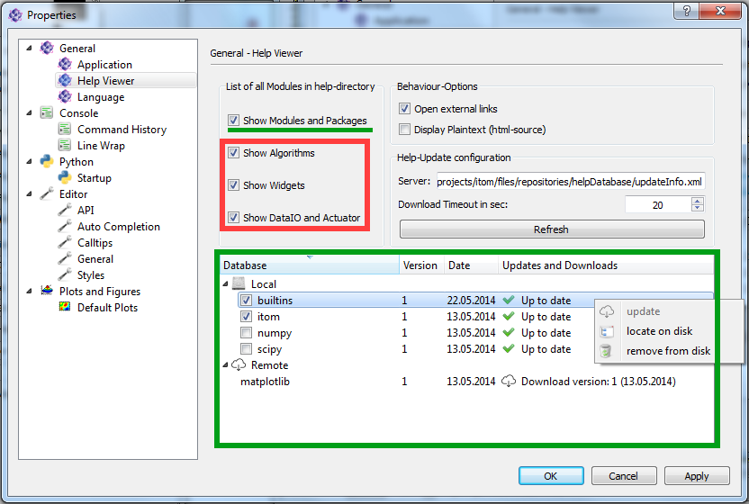
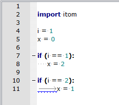

.. include:: ../include/global.inc

.. _gui-propertydialog:

Property Dialog
******************

The property dialog stores the main itom settings, including all the widgets settings. The p
roperty dialog can be found by clicking "File -> "Properties...". It has different sections with 
subsections corresponding to the sections on this help page. 

itom and its settings
======================

itom saves all settings (including the current state of toolboxes, windows...) in one local **ini** file,
that is located in the *itomSettings* subfolder. Each registered user of |itom| has its own settings file.
Many possible configurations of |itom| can be controlled and adjusted by the property dialog.

Section General
=================

**Application**

* If the "show message before closing the application" checkbox is checked, the application will ask you if you really want to close |itom|.
* itom is created as multi-threaded application. For instance, every hardware instance runs in its own thread and can therefore run in parallel to the main application.
  Timeout values control the sychronization process between all these threads. Timeout values for different situations can be adjusted using the spin boxes in the group *Timeouts*.
* Library paths: Before itom starts loading all plugin and designer plugin libraries, the local PATH environment variable of |itom| can be extended by further values.
  This gives the possibility to add further search pathes for 3rd party libraries (e.g. required by plugins) without the need to globally changing the environment variables of
  the operating system. Hereby, the entry *pathes from global PATH variable* is a placeholder for the global PATH variable such that you can define whether a new path
  is prepended or appended to the existing list.
  
**Language**

The default language of |itom| including |Python| is English. However, it is possible to add further translations for texts of the graphical user interface and further messages.
Select the desired language in this section and restart |itom| to load the new language strings.

**Help Viewer**

This property section is responsible for the behaviour of the "Help" dialog. If the help widget is hidden in you main window, go to View -> Toolboxes -> Help in the main toolbar.

    
**Styles and Themes**

Usually, |itom| is started with a look that depends on the default look of the operating system. However, this look can be changed by specific style sheets (named qss files of
Qt). In this property page, it is possible to select between the following style sheet options:

* no stylesheet (default look)
* some pre-defined stylesheets (located in the **styles/stylesheets**-folder of |itom|), e.g. a dark theme
* use-defined stylesheet (indicate a qss style sheet file and an optional rcc resource file)

Some icons have two different representations, one for bright themes and one for dark themes. It is possible to switch between both themes by the drop-down box. 
Changes to style-sheets and icons are only effectuated after a restart of |itom|.

*Local and remote databases*

Most help files are organized in databases. To display these files, the green underlined checkbox has to be checked. To manage, update and load new databases the green box offers a variety of options. Each database listed underneath "Local" are saved on the harddrive. The last column shows if there are any online updates available. To refresh the updatestate of the databases, just click the "refresh" button above. 

If the the internet connection is very slow a timeout error might appear during updates. In this case increase the timeout time and check you internet connection.

*Generated help files*

The Algorithms, Widgets, DataIO and Actuator help files are dynamically created during runtime. These help files are displayed when the corresponding checkboxes in the red box are checked.

**Language**

By selecting a language inside the list box and clicking the "Apply" button a new language for itom is selected. Itom must be restarted to load the new language.

Console
===============

**General**

This tab provides options to decide how text is processed before copying it to the clipboard or before pasting it from the clipboard to the command line.

**Line Wrap**

The first three radio buttons manage when a line is wrapped. The group box underneath offers the possibility to display small icons at a line wrap and to indent the next line. The lowest group box offers three modes how to indent the wrapped line.  

**Command History**

These options refer to the command history widget that is available under View -> Toolboxes -> Command History. 

Python
===============

**General**

* Use the drop-down menu to define if changes in scripts should automatically be saved before executing the script
* If python is started, it tries to find its internal directory for the built-in modules of |Python|. This directory is called PYTHONHOME. Usually, this
  directory is set during the setup process of |Python|. However, this may fail (e.g. if Python has been installed with another user account). Then, itom might
  crash at startup since |Python| got a wrong home directory. If this is the case, indicate the right base directory of |Python| and restart |itom|.

**Startup** 

By "Add File" is is possible to add python files that are executed when itom is started. It is kind of like the autostart folder in Windows.

Editor
===============

.. _gui-prop-py-general:
    
**General**

The first group box manages the indentation. 

* "Auto indentation" automatically indents a new block after an "if ():" or a for loop occurred. 
* if "Use tabs for indentation" is checked, tabs are used, otherwise spaces.
* "Show Whitespaces" displays small light grey dots in each indentation.
* The "Indentation Width" spinbox sets the standard width for the indentation

Inside the "Indentation Warning" group box it is possible to select which kind of indentation is marked as wrong. 
Make sure to not create a conflict with the checkboxes listed above ("use Tabs for Indentation"). 
The following image shows a warning caused by wrong indentation (tabs).

The radio buttons inside the "End-of-line (EOL) mode" group box decide whether to use "", "" or "" as eol, depending on your operating system.

On some linux systems, the line spacing of the editors and command line seems to be to thin. If this is the case, extend
the line spacing by adding some extra ascent or descent above or below each line.

**Script Editors**

The **Python Syntax Checker** checks the code inside the editor widget for bugs. If there are bug, 
a small red ladybug is shown besides the line numbers. If the cursor is moved over a ladybug, a 
tooltip shows the error (for more information see the help about the :ref:`script editor window <gui-editor-syntax-check>`).

* The Itom module is always included in every script. This causes wrong bugs appearances because the checking module (frosted) is not able to see the itom inclusion. To avoid these errors check the "Automatically include itom module..." check box. It includes "include itom" in every header before checking the code to avoid wrong bugs. 

* The "Check interval" check box sets the interval the code is send to "frosted" for syntax checks. 

The **Class Navigator** feature allows configuring the :ref:`class navigator <gui-editor-class-navigator>` 
of any script editor window. The checkbox of the entire groupbox en- or disables this feature. 
Use the timer to recheck the script structure after a certain amount of seconds since the last change of the script. 
If the timer is disabled, the structure is only analyzed when the script is shown or loaded.

As last option in this property page, you can optionally choose if a vertical line should be displayed in the background
of the script editor windows after a user-defined number of columns. This line can for instance be used to keep the
script thin and be remembered to add a line break instead of generating long lines that force the reader to horizontally
scroll in case of smaller displays.

.. _gui-prop-py-api:

**API**

The api files listed in the checkbox are necessary for syntax highlighting. New api files can be added by clicking on the "Add API" button on the right side.

.. _gui-prop-auto-completion:

**Auto Completion**

.. figure:: images/propEditorAutoCompletion.png
    :scale: 100%
    :align: center

The auto completion has two main functions. It offers available commands after entering some characters (number of minimum characters can be set in the "threshold" spin box).

.. figure:: images/propEditorAutoCompletion_2.png
    :scale: 100%
    :align: center

The other function  shows a list of available members of classes after entering a dot. 

.. figure:: images/propEditorAutoCompletion_3.png
    :scale: 100%
    :align: center

The three radio buttons in the group box at the bottom of the page set the source of the auto completion. Therefore take a look at API.

.. _gui-prop-calltips:

**Calltips**

Calltips are tooltips that appear to display arguments of functions. They appear after entering "(". The number of calltips is important if there are overloaded functions with different parameter sets.

.. figure:: images/propEditorCalltips.png
    :scale: 100%
    :align: center

.. _gui-prop-py-styles:

**Styles**

This page is responsible for the highlighting of reserved words, comments, identifier and so on. The style for each type of text, listed in the listbox, can be set individually. 
It is possible to export all styles to an **ini** file that can be imported again. Furthermore, the editor styles of |itom| are mostly compatible
with the xml-style files of the open source project **Notepad++**, such that these xml files can be imported, too. Some xml style files are located
in the **styles/editorThemes** folder.

Plugins
==========

**Algorithms and Filters**

Some algorithms or filters, programmed in algorithm plugins, use parallelization techniques like OpenMP. Usually they use the maximum number of processors that are
available on the machine. However, it is sometimes more powerful to reduce this maximum number of available threads such that other applications as well as the
operating system still can use some processors for their work. Especially old computers might run faster if algorithms are limited to less threads than available.
This maximum number can be controlled by this property page.

Plots and Figures
==============================

.. _gui-default-plots:

**Default Plots**

* The first table lists all available plugins to plot data. The different columns show what kind of input data they accept and what they should be used for.
* The second table shows different categories for plots. For each category a default plugin can be selected. This default plugin will be used to plot the incoming data. To change the standard plugin, double click the last column. 

.. figure:: images/propPlotsDefaultPlots.png
    :scale: 80%
    :align: center
    
.

