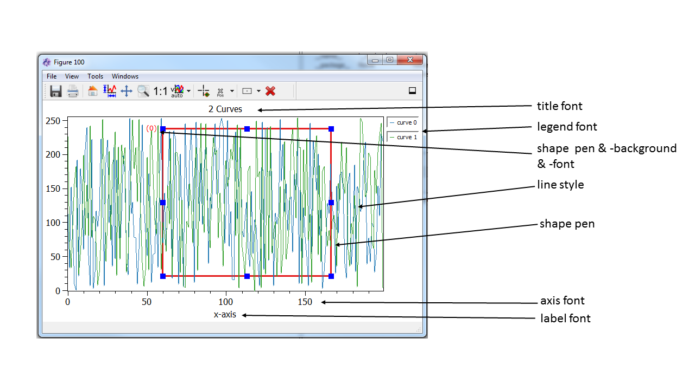

.. include:: ../include/global.inc

.. _gui-propertydialog:

Property Dialog
******************

The property dialog of itom provides an overview of many basic itom settings, as well as global settings for many plots etc.
It can be found by clicking **Properties...** in the **File** menu of itom. It consists of different sections with
several subsections. Each of these subsections referes to a specific group of settings. In the following list you will
get more information about the specific sections and subsections.

itom, its settings and the user management
===========================================

In itom, all settings are stored in an **ini** file in the **itomSettings** folder. The default settings file is **itom.ini**.
If this file does not exist, a copy of **itomDefault.ini** in the same folder is tried to be created and used as initial guess
for the **itom.ini** file.

Such an **ini**-file does not only contain the settings, that are adjustable via the property dialog, but also the current state
and / or geometry of windows, toolboxes etc. This state is always stored if itom is closed and restored during a restart of the application.

Using the :ref:`user management system <gui-user-management>` of |itom|, it is possible to create new users. Each user then gets
its own **ini** settings file in the folder **itomSettings**. If more users than the default users are available, |itom| starts with a user
selection dialog, where you can choose the appropriate user and |itom| loads the settings from the corresponding settings file.

Section General
=================

Application
---------------

* If the "show message before closing the application" checkbox is checked, the application will ask you if you really want to close |itom| before it is really closed.

* |itom| is created as multi-threaded application. For instance, every hardware instance runs in its own thread and can therefore run parallely to the main application.
  Timeout values control the sychronization process between all these threads. Timeout values for different situations can be adjusted using the spin boxes in the group *Timeouts*.
  
  There are two specific timeout values for initializing or closing a plugin as well as loading or saving data from or to files. All other timeouts are handled by the general
  timeout value.
  
* Library paths: Before itom starts loading all plugin and designer plugin libraries, the local PATH environment variable of |itom| can be extended by further values.
  This gives the possibility to add further search pathes for 3rd party libraries (e.g. required by plugins) without the need to globally changing the environment variables of
  the operating system. Hereby, the entry *pathes from global PATH variable* is a placeholder for the global PATH variable such that you can define whether a new path
  is prepended or appended to the existing list.
  
Language
----------------

The default language of |itom| including |Python| is English. However, it is possible to add further translations for texts of the graphical user interface and further messages.
Select the desired language in this section and restart |itom| to load the new languages.

.. note::
    
    Hint: Strings, which are related to script commands are usually not translated, since the Python script language itself is always in English.

Help Viewer
----------------

This property section is responsible for the behaviour of the "Help" dialog. If the help widget is hidden in you main window, go to View -> Toolboxes -> Help in the main toolbar.

.. figure:: images/propGeneralHelpViewer.png
    :scale: 100%
    :align: center
    
*Local and remote databases*

Most help files are organized in databases. To display these files, the green underlined checkbox has to be checked. To manage, update and load new databases the green box offers a variety of options. Each database listed underneath "Local" are saved on the harddrive. The last column shows if there are any online updates available. To refresh the updatestate of the databases, just click the "refresh" button above. 

If the the internet connection is very slow a timeout error might appear during updates. In this case increase the timeout time and check you internet connection.

*Generated help files*

The Algorithms, Widgets, DataIO and Actuator help files are dynamically created during runtime. These help files are displayed when the corresponding checkboxes in the red box are checked.

Styles and Themes
----------------------

Usually, |itom| is started with a look that depends on the default stylesheet of the operating system. However, this look can be changed by specific style sheets (named qss files of
Qt). In this property page, it is possible to select between the following style sheet options:

* no stylesheet (default look)
* some pre-defined stylesheets (located in the **styles/stylesheets**-folder of |itom| or its subfolders). For a dark theme, the theme in the **darkStyle** subfolder is recommended.
* use-defined stylesheet (indicate a qss style sheet file and an optional rcc resource file)

Some icons have two different representations, one for bright themes and one for dark themes. It is possible to switch between both themes by the drop-down box. 
Changes to style-sheets and icons are only effectuated after a restart of |itom|.

Section Console
=================

General
---------------------

This tab provides options to decide how text is processed before copying it to the clipboard or before pasting it from the clipboard to the command line.

Line Wrap
---------------------

At first, it is possible to define the general line wrap mode. You have the possibility to disable the line wrap, or enable a line wrap at a word or character boundary.

The performance of the editor decreases for very long lines. Additionally, the readability can be increased, if the text is additionally wrapped after a certain
number of characters. Enable the **long line** wrap by the checkbox **Split long lines** and define the number of characters, after which the wrap occurs. Wrapped
lines will start with three leading dots (...).

Command History
---------------------

These options refer to the command history widget that is available under View -> Toolboxes -> Command History. 

Section Python
===============

General
----------------

* Use the drop-down menu to define if changes in scripts should automatically be saved before executing the script.
* Every version of |itom| is compiled against a certain version of Python. At runtime, Python can be loaded from different directories, which can be given in the 2nd part of this
  property page. Per default, Python is located in the **python3** subdirectory of your |itom| installation. However, if Python is installed as stand-alone application, it also might
  publish its root dir in the registry (Windows) or in the environment variable PYTHONHOME. Choose the second option to force itom to look for one of these directories. Via the third
  option is it also possible to indicate a user-defined directory, where the Python installation is located.
  You have to restart |itom| such that these changes are applied.

Startup
--------------------

It is possible to indicate one or several python scripts, which will executed after the startup of |itom|. These files can be indicated in this property page. Another possiblity to
define this list is by editing a user role in the :ref:`user management system <gui-user-management>` of |itom|. You can load new files, remove existing files from the list or change the
order of execution. 

Usually, all files are stored as absolute path in the settings file. However, it is also possible to let |itom| shorten newly loaded files to a relative path with respect to the root directory
of |itom|. This option can be enabled by the checkbox below the file list.

Section Editor
================

.. _gui-prop-py-general:
    
General
----------------------

In this tab, you can mainly set all settings that are related to indentation:

* **Auto indentation** automatically indents the next block after a colon at the end of a line, like after a "if (...):" statement, a method definition or a for loop (among others). 
* If the **Use tabs for indentation** checkbox is not checked, every tab is automatically replaced by N spaces (N is adjustable by the spinbox below).
* **Show Whitespaces** displays small dots in each indentation. The color of these dots can be adjusted by the style **whitespace color**
* The **Indentation Width** spinbox sets the standard width for the indentation. This is the number of spaces which are inserted if a tab is inserted (only if the **Use tabs for indentation** checkbox is unchecked.
* **Show indentation guides** defines if small, dotted vertical lines should be displayed in front of indented blocks. The spacing between these vertical lines corresponds to the indentation width, too.

Script Editors
----------------------

|itom| provides the possiblity to regularily check a script for syntax errors (by means of a code analysis only - the script(s) is / are not executed for this check).
Enable this syntax check by the checkbox related to the group **Python Syntax Checker**. This feature is only available if either the Python package **pyflakes** or
**frosted** (legacy) are available. If enabled, one of these packages can be used to check the code for bugs or other syntax-related styles.

If there are any bugs, a small red ladybug is shown besides the line numbers. If the cursor is moved over a ladybug, a 
tooltip shows the error (for more information see the help about the :ref:`script editor window <gui-editor-syntax-check>`).

At startup of |itom|, the module :py:mod:`itom` is globally imported (*from itom import ``*``*). This holds for any commands, executed in the console widget or
for scripts, which are directly executed. In order to tell *pyflakes* or *frosted* about this imported module :py:mod:`itom`, check the corresponding checkbox.
Additionally, you can decide when the next check should be executed. This is given in a number of seconds after the last key press in any script editor.

The **Class Navigator** feature allows configuring the :ref:`class navigator <gui-editor-class-navigator>` 
of any script editor window. The checkbox of the entire groupbox en- or disables this feature. 
Use the timer to recheck the script structure after a certain amount of seconds since the last change of the script. 
If the timer is disabled, the structure is only analyzed when the script is shown or loaded.

As last option in this property page, you can optionally choose if a vertical line should be displayed in the background
of the script editor windows after a user-defined number of columns. This line can for instance be used to keep the
script thin and be remembered to add a line break instead of generating long lines that force the reader to horizontally
scroll in case of smaller displays.

.. _gui-prop-calltips:

Calltips
----------------------

Calltips can provide information about possible arguments of a function that is currently typed into the command line or a python script.
A check for possible calltips is started once the opening brace "(" is entered. If the checkbox is disabled, no check for calltips is executed.

.. figure:: images/propEditorCalltips.png
    :scale: 100%
    :align: center

The highlighted argument of a calltip indicates the argument, that corresponds to the current position of the cursor in the script.

.. note::
    
    Calltips can only be checked, if both the Python packages **jedi** (version >= 0.12) and **parso** are installed.

.. _gui-prop-auto-completion:

Auto Completion
----------------------

The auto completion functionality shows context-related options about possible methods, variable names, module names... that could correspond
to the current text at the cursor's position. These hint can simplify the coding, since you can always select an entry from the list by selecting
the entry with the arrow key and press return. All displayed hints are based on a static code analysis and can take methods and variables from any
available module and package as well as of the current script into account.

The completion popup is shown when the user press **Ctrl+Space** or automatically while the user is typing some code. The possible settings are:

.. figure:: images/propEditorAutoCompletion.png
    :scale: 100%
    :align: center

* **Threshold** indicates the number of characters with respect to each new word in a script, after which an auto completion check is requested.
* **Filter method**: Select the mode, how the auto completion check is executed:
    
    1. Filter completion based on the prefix (fast method)
    2. Filter completions based on whether the prefix is contained in the suggestion (fast method)
    3. Fuzzy filtering, using the subsequence matcher. This is the most powerful filter mode but also the SLOWEST.

* **case sensitivity**: select whether the search is case sensitive (or not)
* **show tooltips**: select if a tooltip is shown next to the currently selected item in the auto completion list. This tooltip contains an additional information string about this entry.

This example shows an example for an auto completion list, with an additional tooltip:

.. figure:: images/propEditorAutoCompletion_2.png
    :scale: 100%
    :align: center

The other function  shows a list of available members of classes after entering a dot.:

.. figure:: images/propEditorAutoCompletion_3.png
    :scale: 100%
    :align: center

.. note::
    
    Auto completion hints can only be checked and displayed, if both the Python packages **jedi** (version >= 0.12) and **parso** are installed.

.. _gui-prop-py-styles:

Styles
----------------

All visible python scripts as well as commands, written to the console widget, are parsed by a syntax highlighter, that visualizes the
components of the code with different styles.

.. figure:: images/propEditorStyles.png
    :scale: 100%
    :align: center

This property page is divided into the following parts:

1. Select the style type, that you want to edit using the group 2. The first part of the list contains styles for specific parts of a code, whereas the second part
   of the list also contains generals styles, like the page style itself.
2. Setting of the selected style. Depending of the style, you can select the foreground color (text color), the background color (use a transparent color, to use the paper color instead) or the font.
3. Some general settings: Change the overall font size for all styles, reset all styles to the default values or set all background colors of text to transparent, such that the paper color is the only
   valid background color.
4. It is possible to export all styles to an **ini** file that can be imported again. Furthermore, the editor styles of |itom| are mostly compatible
   with the xml-style files of the open source project **Notepad++**, such that these xml files can be imported, too. Some xml style files are located
   in the **styles/editorThemes** folder.
5. This sample text can be used to see the style of the currently selected style category.

.. note::
    
    From |itom| 3.2 on, text, that is printed to the console widget (or error texts), are not parsed by the python syntax highlighted, but they are
    styled with the specific styles **Stream Output** or **Stream Error**.

Section Workspace
===================

The properties with this section allow modifying features in the workspace widget. Currently, this is one feature:

Unpack imported files
---------------------------

Data container files like ``*``.idc or ``*``.mat contain a main dictionary with one or several items. By this option, you can choose the import behaviour of these file types.
If the option is checked, the main dictionary in the file is unpacked and all direct children are put as separate variables to the workspace. If unchecked, the main dictionary
itself with all its children is put as one variable into the workspace where the user is asked for the name of this major dictionary if the file is imported.

.. note::
    
    This behaviour can also be changed by the unpack toggle button in the toolbar of the workspace toolbox.

Section Plugins
==================

Algorithms and Filters
------------------------------

Some algorithms or filters, programmed in algorithm plugins, use parallelization techniques like OpenMP. Usually they use the maximum number of processors that are
available on the machine. However, it is sometimes more powerful to reduce this maximum number of available threads such that other applications as well as the
operating system still can use some processors for their work. Especially old computers might run faster if algorithms are limited to less threads than available.
This maximum number can be controlled by this property page.

Section Plots and Figures
==============================

.. _gui-default-plots:

Default Plots
------------------

* The first table lists all available plugins to plot data. The different columns show what kind of input data they accept and what they should be used for.
* The second table shows different categories for plots. For each category a default plugin can be selected. This default plugin will be used to plot the incoming data. To change the standard plugin, double click the last column. 

.. figure:: images/propPlotsDefaultPlots.png
    :scale: 80%
    :align: center
    
Default Style Settings
------------------------

Here you have the possibility to set global plot settings like e.g. the legend font. If a setting is not provided by any plot type the setting will be ignored. 
The figures below are showing some examples of the different settings. 

.. figure:: images/generalPlotSettings.png
    :scale: 80%
    :align: center
	

Palette Settings
-------------------

The standard plots of |itom| (e.g. *itom2dqwtplot*, ...) provide different color maps, which can be choosen to visualize the data. There is a default list of 
color palettes, which is pre-defined for each |itom| installation. Using the color palette property page, it is possible to add additional color palettes.
These palettes can also be exported and / or imported, such that a backup of user-defined palettes is possible. 

An |itom| color palette is defined by an array of 256 colors, which are mainly defined by a number of color stops. Each color stop consists of a position and
a color value. The array values inbetween two color stops are calculated by means of a linear interpolation.

If you want to create a new color palette, you can either start from scratch and add a new palette, or you duplicate an existing palette. All user-defined palettes
can be freely adjusted, indicated by the missing key icon in the list view above.

If you change any option of the selected color palette, you have to apply these changes by clicking the corresponding button. In the options area below, you will
find the following features:

* **name**: every color palette must have an unique name. This name will be displayed in any newly opened plot.
* **inverse colors**: Every color does not only consist of an array of colors, but also of two inverse colors (colors with a high contrast with respect to the available
    colors in the palette itself), as well as of an invalid color, which is used to visualize NaN values. Change these colors by clicking the appropriate color button.
* **color stops**: Click on any color stop in the line plot to see the color and position (normalized between 0 and 1) of the color stop. Move a color stop with the mouse
    to change the position or enter a new position in the text field. You can also remove a selected color stop or insert a new color stop right of the currently selected
    color stop. Furthermore there is a possibility to change the positions of all color stops such that an equidistant distribution is obtained.
* **toggle color buttons**: You can toggle the red, green and blue color button in order to display or hide the specific red, green and blue line.

Using Python, it is also possible to get a list of all available color palette names, using the method :py:meth:`itom.getPaletteList`. In order to obtain a dictionary
with all relevant data of one specific color palette, use the method :py:meth:`itom.getPalette` and pass the name of the requested color palette.

