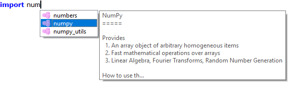

.. include:: ../include/global.inc

.. _gui-propertydialog:

Property Dialog
******************

The property dialog of itom provides an overview of many basic itom settings,
as well as global settings for many plots etc.
It can be found by clicking **Properties...** in the **File** menu of itom.
It consists of different sections with
several subsections. Each of these subsections refers to a specific group of
settings. In the following list you will
get more information about the specific sections and subsections.

itom, its settings and the user management
===========================================

In itom, all settings are stored in an **ini** file in the **itomSettings**
folder. The default settings file is **itom.ini**.
If this file does not exist, a copy of **itomDefault.ini** in the same folder
is tried to be created and used as initial guess
for the **itom.ini** file.

Such an **ini**-file does not only contain the settings, that are adjustable
via the property dialog, but also the current state
and / or geometry of windows, toolboxes etc. This state is always stored if
itom is closed and restored during a restart of the application.

Using the :ref:`user management system <gui-user-management>` of |itom|, it is
possible to create new users. Each user then gets
its own **ini** settings file in the folder **itomSettings**. If more users
than the default users are available, |itom| starts with a user
selection dialog, where you can choose the appropriate user and |itom| loads
the settings from the corresponding settings file.

Section General
=================

Application
---------------

* If the "show message before closing the application" checkbox is checked, the
  application will ask you if you really want to close |itom| before it is
  really closed.

* |itom| is created as multi-threaded application. For instance, every hardware
  instance runs in its own thread and can therefore run parallelly to the main
  application. Timeout values control the synchronization process between all
  these threads. Timeout values for different situations can be adjusted using
  the spin boxes in the group *Timeouts*.

  There are two specific timeout values for initializing or closing a plugin as
  well as loading or saving data from or to files. All other timeouts are handled
  by the general timeout value.

* Library paths: Before itom starts loading all plugin and designer plugin
  libraries, the local PATH environment variable of |itom| can be extended by further values.
  This gives the possibility to add further search paths for 3rd party libraries
  (e.g. required by plugins) without the need to globally changing the environment variables of
  the operating system. Hereby, the entry *paths from global PATH variable*
  is a placeholder for the global PATH variable such that you can define whether a new path
  is prepended or appended to the existing list.

.. _gui-propertydialog-language:

Language
----------------

The default language of |itom| including |Python| is English. However, it is
possible to add further translations for texts of the graphical user interface
and further messages. Select the desired language in this section and restart |itom|
to load the new languages. See :ref:`here <translations>` for more information about how
to create new translations for itom.

.. note::

    Hint: Strings, which are related to script commands are usually not translated,
    since the Python script language itself is always in English.

Plugin Help Viewer
----------------------------------------

This property section is responsible for the behaviour of the "Plugin Help Viewer"
window, accessible via the help menu of itom. If the help widget is hidden in the
main window, go to View -> Toolboxes -> Plugin Help Viewer in the main toolbar.

The **plugin help viewer** displays information about all actuator, dataIO and algorithm
plugins of itom. The information is automatically generated from the plugin libraries.

In the properties, you can select if the information is properly rendered or if
you want to display the html raw text (e.g. for debugging purposes).

Styles and Themes
----------------------

Usually, |itom| is started with a look that depends on the default stylesheet of
the operating system. However, this look can be changed by specific style sheets
(named qss files of Qt). In this property page, it is possible to select
between the following style sheet options:

* no stylesheet (default look)
* some pre-defined stylesheets (located in the **styles/stylesheets**-folder
  of |itom| or its subfolders). For a dark theme, the theme in the **darkStyle**
  subfolder is recommended.
* use-defined stylesheet (indicate a qss style sheet file and an optional rcc resource file)

Some icons have two different representations, one for bright themes and
one for dark themes. It is possible to switch between both themes by the drop-down box.
Set this value to automatic, if the icon theme should be chosen automatically
based on the selected style. If the basic background color is rather dark, the dark
theme is chosen, else the bright theme.

Changes to style-sheets and icons are only effectuated after a restart of |itom|.

Section Console
=================

General
---------------------

This tab provides options to decide how text is processed before copying it
to the clipboard or before pasting it from the clipboard to the command line.
Furthermore, you can decide if optional ANSI Escape Sequences are identified in
output or error texts, removed and - if possible - applied as formatting instructions.
This means, that the text or background color, as well as features like bold, italic
or underline can be set and reset by these special commands.

Line Wrap
---------------------

At first, it is possible to define the general line wrap mode. You have the
possibility to disable the line wrap, or enable a line wrap at a word or
character boundary.

The performance of the editor decreases for very long lines. Additionally,
the readability can be increased, if the text is additionally wrapped after a certain
number of characters. Enable the **long line** wrap by the
checkbox **Split long lines** and define the number of characters,
after which the wrap occurs. Wrapped lines will start with three leading dots (...).

Command History
---------------------

These options refer to the command history widget that is available under
View -> Toolboxes -> Command History.

Section Python
===============

General
----------------

* Use the drop-down menu to define if changes in scripts should automatically
  be saved before executing the script.

* You can select if a Python **SystemExit** exception, triggered by **exit()**, **sys.exit()** or **quit()**,
  will totally close the itom application or if the script execution is only stopped.

* Every version of |itom| is compiled against a certain version of Python.
  At runtime, Python can be loaded from different directories, which
  can be given in the 2nd part of this
  property page. Per default, Python is located in the **python3** subdirectory
  of your |itom| installation. However, if Python is installed as stand-alone
  application, it also might publish its root dir in the registry (Windows) or
  in the environment variable PYTHONHOME. Choose the second option to force itom
  to look for one of these directories. Via the third option is it also possible
  to indicate a user-defined directory, where the Python installation is located.
  You have to restart |itom| such that these changes are applied.

* Python does have a very huge help system which can also launch 3rd party
  programs to view the output of help() internal command. You can specify the
  command which is passed a file to containing the output of help() via PAGER enver.
  The help system is very OS specific, and the commandpresets are only tested on win10.
  It uses the SystemEnvironment's variables. You can test the command using the
  cmd shell. win10: use setx instead of set for setting environment variables.

* The default charset encoding, used to open a Python script can be selected in the
  **File** section of this property page. Officially supported encodings are **Latin1**,
  **UTF-8** and **UTF-8 with byte-order-mark (BOM)**, where **UTF-8** is the Python
  standard encoding, if not otherwise stated in the script. It is further possible to
  allow itom to automatically guess the encoding of a newly loaded script, if possible.
  For further information about this, see the section :ref:`charset encoding <gui-editor-charset-encoding>`
  of the script editor documentation page.

Startup
--------------------

It is possible to indicate one or several python scripts, which will executed
after the startup of |itom|. These files can be indicated in this property page.
Another possibility to define this list is by editing a user role in the
:ref:`user management system <gui-user-management>` of |itom|. You can load new
files, remove existing files from the list or change the order of execution.

Usually, all files are stored as absolute path in the settings file. However, it
is also possible to let |itom| shorten newly loaded files to a relative path with
respect to the root directory of |itom|. This option can be enabled by the
checkbox below the file list.

Section Editor
================

The editor section covers all properties, that are related to the
:ref:`script editor windows <gui-editor>`.

.. _gui-prop-py-general:

General
----------------------

In this tab, you can mainly set all settings that are related to indentation:

* **Auto indentation** automatically indents the next block after a colon at the
  end of a line, like after a "if (...):" statement, a method definition or a
  for loop (among others).
* If the **Use tabs for indentation** checkbox is not checked, every tab is
  automatically replaced by N spaces (N is adjustable by the spinbox below).
* The **Indentation Width** spinbox sets the standard width for the indentation.
  This is the number of spaces which are inserted if a tab is inserted (only if the
  **Use tabs for indentation** checkbox is unchecked.
* **Show Whitespaces** displays small dots in each indentation. The color of
  these dots can be adjusted by the style **whitespace color**
* **Show indentation guides** defines if small, dotted vertical lines should be
  displayed in front of indented blocks. The spacing between these vertical
  lines corresponds to the indentation width, too.
* In the group **Cut, Copy, Paste Behaviour** you can select how the script editor
  should behave if code is copied / cut or if code
  should be pasted from the clipboard. In the first case, you can select if the
  cut or copy operation is available if no text is currently selected, since it
  is possible to entirely copy or cut the current line instead. Another option
  controls a smart paste behaviour if indented code, that has possibly been
  removed from a block with another initial indentation level, should be adapted
  to the current indentation level of the current cursor position.

.. _gui-prop-py-code-checkers:

Code Checkers
----------------------

|itom| provides the possibility to regularly check a script for syntax errors,
code style errors, docstring style errors or other linter hints in any scripts.
All these checks are done by means of a code analysis only, the script(s) is / are
not executed for these checks.

|itom| supports three different modes of code checks, that can be selected as major
options in this property page:

* **No code checks**: nothing is checked
* **Basic code checks**: This requires the python package
  `pyflakes <https://github.com/PyCQA/pyflakes>`_. Using this package general
  code errors and syntax errors are checked.
* **Extended code checks**: This requires the python package
  `flake8 <https://flake8.pycqa.org/en/latest/>`_. **Flake8** depends on
  **pyflakes**, **pycodestyle** and **mccabe**. However it can be extended by further
  plugins, like for instance **flake8-docstrings**. Therefore **flake8** can
  check for various things whichextends the features of **pyflakes**. For
  instance it can give hints if the Python standard style guide **pep8**
  is violated, it can check for the complexity of methods and so on.
* **Automatic mode selection**: This automatically selects one of the options
  above. If the python package **flake8** (including its required packages)
  could be loaded, the extended code check is enabled. Else if only the python
  package **pyflakes** could be loaded, the basic code check is enabled. In any
  other case, no code checks are enabled.

If any code checker is activated, a check for a script is executed whenever the
properties have been changed or after a certain amount of time after the last
key press in the corresponding script. This amount of time can be configured at
the top of the property page.

Since |itom| automatically imports all methods, classes and modules of the module
:py:mod:`itom` globally at startup (**from itom import \***), scripts that are
directly executed via the run or debug button do not require explicit import
statements for components, that belong to the itom package.

The code checkers would however complain, that some itom-related references are
not imported in a script. To avoid these messages, you can enable the first
check box, such that all the code checkers consider parts of the itom module as
globally imported.

All messages, returned by the code checkers, will be categorized by itom into
the three categories **information**, **warning** and **error**. You can define
the minimum level, that is displayed in the scripts via the combobox in the
general section of the code checker property page.

.. figure:: images/propEditorCodeCheckers.png
    :scale: 100%
    :align: center

Messages of type **info** are displayed with a blue dot in the most-left column
of the affected line in the script editor. By hovering over the icon, the
message text is displayed as tooltip text. Messages of type **warning** are
displayed with an orange dot and **error** messages are displayed by a red
ladybug (for more information see the help about the
:ref:`script editor window <gui-editor-syntax-check>`).

Depending on the selected checker mode, there are different options, which
are only active for the corresponding mode:

Pyflakes options (basic checks)
^^^^^^^^^^^^^^^^^^^^^^^^^^^^^^^^^

Pyflakes will either return a syntax error, if the current script can not be
fully parsed due to a syntax error. These syntax errors will always be displayed
as message type **error**.

All other check results, returned by pyflakes can be assigned to one of the
message types **info**, **warning** or **error**. Chose the preferred category
from the combobox (category of other messages).

Further sub-categories are not available if the basic checks are enabled only.

Flake8 options
^^^^^^^^^^^^^^^

Flake8 provides many options, that can be set to configure all checks. Only the
most important subset of options can be configured via given fields in the
property dialog. For further options, the optional text box can be used.

Nevertheless, flake8 provides different possibilities to configure options. This
can be an ini configuration file (tox.ini, .flake8 or setup.cfg) in the user
directory of your operating system, or such an ini configuration file in the
directory of your project (e.g. the directory, where the scripts are located or
one of its parent directories, stopped if for instance a .git folder is detected).
For more information see the `documentation of flake8 <https://flake8.pycqa.org/en/latest/user/configuration.html>`_.

When flake8 is used within itom, the ranking of these configuration files are:

1. flake8 default options
2. user folder
3. itom settings in itom properties dialog
4. project folder

This means, that options, set in the project configuration files, will always
overwrite any other options. The **flake8 options section** in the itom property
dialog provides several options, that are covered by a checkbox. If the checkbox
is not set, the respective option is considered to be not active, hence it will
not overwrite the same option from the flake8 defaults or the user configuration
file (if it exists).

Flake8 provides error codes, starting with a character and followed by a number,
for each message. The character always describes the underlying package, that
produced this message, e.g. **F** originates from **pyflakes**, **E** from
**pycodestyle** or **C** from **mccabe**. Other letters might appear if further
flake8 plugin packages are installed. The number (three digits) describes the
specific error message, however all numbers starting with 1, with 2 and so on,
belong to a specific sub-category of messages.

Within itom you can set the following options:

1. **Maximum allowed line length**: This is the maximum number of characters
   for one line before flake8 will return a warning, that the line should better
   be split into several lines. The default from PEP8 is usually 79,
   however auto-style correction packages like **black** recommend a number of 88.
2. **Show the following errors or warning**: If the checkbox is clicked, indicate
   a comma-separated list of error codes that should be considered. This affects
   the option **--select** of flake8. You can either indicate one specific error
   code, or only the major character to consider all messages from this major
   category, or it is also possible to write for instance **E1** to select all
   error codes starting with **E1**.
3. **Ignore the following errors or warning**: Similar to the option above,
   however this overwrites the option **--ignore**, and let itom ignore certain
   error codes.
4. **Extend the (default) ignore list**: This is similar than no 3, however it
   affects the flake8 option **--extend-ignore**. This means, that the ignored
   error codes are only appended to the defaults from flake8 or the user
   configuration files, without fully replacing them. Itom defaults here to
   **W293**, which ignores lines, that consist of spaces only.
5. **Docstyle convention**: This is only important, if the plugin package
   **flake8-docstrings** is installed and will then indicate the default style
   guide that is applied to check the docstrings of any functions and classes.
6. **Max complexity**: By this option, you can enable the code complexity checks
   from **mccabe**. Enable it by checking the checkbox and setting the value
   to anything >= 0.
7. **Message codes, displayed as errors**: Indicate here error codes (again a
   character or a character followed by 1-3 digits) as comma-separated list.
   All messages that belong to error codes in this list, will be shown as errors
   (ladybug icon).
8. **Message codes, displayed as warnings**: See no. 7, however the affected
   messages will be displayed as warnings. All other messages will be displayed
   as info.
9. **Further options**: You can indicate here further options, that should be
   passed to flake8. Every option must be on a separate line. See
   `the flake8 documentation <https://flake8.pycqa.org/en/latest/user/options.html>`_
   for a list of options. Further plugins can append more options. Indicate
   here the option (without the -- characters), optionally followed by an equal
   sign and the value. If no value is given, True is assumed. Examples are:

        max-doc-length=79
        disable-noqa

.. _gui-prop-script-editors:

Script Editors
----------------------

The **Code Outline** feature allows configuring the
:ref:`code outline <gui-editor-outline-navigator>` of any script editor.
The outline contains the start and end of all functions, class and methods of
a script. It can for instance be used as content for the code navigation bar
above each script editor. It is for instance possible to show or hide this
navigation bar. The outline is usually determined once a script is loaded
or if a tab is changed. However, you can also enable an automatic update
mechanism, such that the outline is updated after that the last key has
been pressed in a script. The delay can be configured in this property page, too.

As next option in this property page, you can optionally choose if a
vertical line should be displayed in the background of the script editor windows
after a user-defined number of columns. This line can for instance be used to
keep the script thin and be remembered to add a line break instead of generating
long lines that force the reader to horizontally scroll in case of smaller
displays.

Finally, the last option configures the way how the filenames in the tabs of
the script areas are shortened, if there is not enough space. The first three
options define a way to shorten the filenames, such that all currently opened
tabs are still visible, whereas the last option forces a display of the full
filename (without path) and arrows are shown to scroll through the tabs,
if there is not enough space. The last option is the default.

.. _gui-prop-calltips:

Calltips and Help Tooltips
----------------------------

Calltips can provide information about possible arguments of a function that
is currently typed into the command line or a python script. A check for possible
calltips is started once the opening brace "(" is entered. If the checkbox is
disabled, no check for calltips is executed.

.. figure:: images/propEditorCalltips.png
    :width: 100%
    :align: center

The highlighted argument of a calltip indicates the argument, that corresponds
to the current position of the cursor in the script.

Additionally, it is possible to generate a information tooltip about the word
under the mouse cursor. This help string is generated if the mouse remains for
a while (400 ms) over a word. If this feature is enabled, a tooltip is displayed
with the information string, if it could be fetched.

.. note::

    These features can only be checked, if both the Python packages **jedi**
    (version >= 0.12) and **parso** are installed.

.. _gui-prop-auto-completion:

Auto Completion
----------------------

The auto completion functionality shows context-related options about possible
methods, variable names, module names... that could correspond to the current
text at the cursor's position. These hint can simplify the coding, since you
can always select an entry from the list by selecting the entry with the arrow
key and press return. All displayed hints are based on a static code analysis
and can take methods and variables from any available module and package as
well as of the current script into account.

The completion popup is shown when the user press **Ctrl+Space** or
automatically while the user is typing some code. The possible settings are:

* **Threshold** indicates the number of characters with respect to each new word
  in a script, after which an auto completion check is requested.
* **Filter method**: Select the mode, how the auto completion check is executed:

    1. Filter completion based on the prefix (fast method)
    2. Filter completions based on whether the prefix is contained in the
       suggestion (fast method)
    3. Fuzzy filtering, using the subsequence matcher. This is the most powerful
       filter mode but also the SLOWEST.

* **case sensitivity**: select whether the search is case sensitive (or not)
* **show tooltips**: select if a tooltip is shown next to the currently selected
  item in the auto completion list. This tooltip contains an additional
  information string about this entry.

This example shows an example for an auto completion list, with an additional tooltip:

The other function  shows a list of available members of classes after entering
a dot.:

.. figure:: images/propEditorAutoCompletion_3.png
    :scale: 100%
    :align: center

.. note::

    Auto completion hints can only be checked and displayed, if both the Python
    packages **jedi** (version >= 0.12) and **parso** are installed.

.. _gui-prop-auto-code-format:

Auto Code Formatting
--------------------

There are several modules in Python available, that allow automatically
formatting Python scripts based on style guides. The most important style
guide document is `PEP8 <https://www.python.org/dev/peps/pep-0008/>`_.

Popular auto formatting modules are

* `black <https://pypi.org/project/black/>`_
* `yapf <https://pypi.org/project/yapf/>`_
* `autopep8 <https://pypi.org/project/autopep8/>`_

You can select one of these or any other module as automatic python code
formatter in itom. If this feature is enabled, a button is added to the
edit toolbar of any script editor as well as an entry in the edit menu and
the context menu (see :ref:`gui-editor-auto-code-formatter`).
If the user presses this button, the current script is
passed to the selected auto formatting module and the script is modified
by the corrected version.

In the property page, you can enable or disable this feature in general.
Additionally, you have to indicate a command string, such that your desired
module is correctly called. The full call is always::

    python -m <cmd>

where **<cmd>** is the command that has to be inserted in the text box.
You can also select from a given list of pre-defined commands with respect
to the three exemplary code formatting modules above.

itom will always call this command and pass the content of the current script
via the **standard in** stream to the called process. Therefore, always make
sure, that the command allows this.

You can test your inserted command using the test button, where a demo code
snippet is called. If this test passes, a valid command is given.

One major parameter of many code formatting packages is the maximum desired line
length. Usually, the formatter tries to wrap code longer than this maximum.
It is recommended to set this value to the same value that is also set to
optionally display a vertical line or different background color in the itom
editor (see :ref:`gui-prop-script-editors`) as well as the maximum line
length used in the :ref:`code checker <gui-prop-py-code-checkers>`.

Before starting the auto code formatter, it is also possible to execute a
previous step, that is designed to sort the import statements in a script.
For this, the package `isort <https://pypi.org/project/isort/>`_ can be used.
You can enable to start this pre-step by activating the group box in the
corresponding tab. Additionally, you can configure the command. This time,
the current script is copied to a temporary python script, whose path is
passed at last statement to the user-defined command::

    python -m <cmd> <filename>

where **<cmd>** can be fully configured. An example is **isort --py 3 --profile black**,
which prepares **isort** to be compatible with any Python 3 version and
configure itself to be compatible with the auto formatter **black**. If you
want to use another auto code formatter, it might be useful to change the profile
accordingly.

.. _gui-prop-py-styles:

Styles
----------------

All visible python scripts as well as commands, written to the console widget,
are parsed by a syntax highlighter, that visualizes the
components of the code with different styles.

.. figure:: images/propEditorStyles.png
    :width: 778px
    :align: center

This property page is divided into the following parts:

1. Select the style type, that you want to edit using the group 2. The first
   part of the list contains styles for specific parts of a code, whereas the
   second part of the list also contains generals styles, like the page style
   itself.
2. Setting of the selected style. Depending of the style, you can select the
   foreground color (text color), the background color (use a transparent
   color, to use the paper color instead) or the font.
3. Some general settings: Change the overall font size for all styles,
   reset all styles to the default values or set all background colors of
   text to transparent, such that the paper color is the only valid
   background color.
4. It is possible to export all styles to an **ini** file that can be
   imported again. Furthermore, the editor styles of |itom| are mostly
   compatible with the xml-style files of the open source project **Notepad++**,
   such that these xml files can be imported, too. Some xml style files are
   located in the **styles/editorThemes** folder.
5. This sample text can be used to see the style of the currently selected
   style category.

.. note::

    From |itom| 3.2 on, text, that is printed to the console widget (or error
    texts), are not parsed by the python syntax highlighted, but they are
    styled with the specific styles **Stream Output** or **Stream Error**.

.. _gui-prop-docstring-generator:

Docstring Generator
--------------------

In the section :ref:`docstring generator <gui-editor-docstring-generator>` of the
script editor, there is explained how to automatically insert a pre-filled
docstring for methods, functions or properties.

In this property page, this feature can be configured:

1. Style: Choose if the **Google Style** or **Numpy Docstring Style** should
   be applied. For more information see
   `here <https://www.sphinx-doc.org/en/master/usage/extensions/napoleon.html>`_.
2. Quote characters: Choose between if the docstring should be wrapped by
   three double quotes (""") or by three apostrophes (''').

Section Workspace
===================

The properties with this section allow modifying features in the workspace
widget. Currently, this is one feature:

Unpack imported files
---------------------------

Data container files like ``*``.idc or ``*``.mat contain a main dictionary with
one or several items. By this option, you can choose the import behaviour of
these file types. If the option is checked, the main dictionary in the file
is unpacked and all direct children are put as separate variables to the
workspace. If unchecked, the main dictionary itself with all its children is put
as one variable into the workspace where the user is asked for the name of
this major dictionary if the file is imported.

.. note::

    This behaviour can also be changed by the unpack toggle button in the toolbar
    of the workspace toolbox.

Section Plugins
==================

Algorithms and Filters
------------------------------

Some algorithms or filters, programmed in algorithm plugins, use parallelization
techniques like OpenMP. Usually they use the maximum number of processors that are
available on the machine. However, it is sometimes more powerful to reduce this
maximum number of available threads such that other applications as well as the
operating system still can use some processors for their work. Especially old
computers might run faster if algorithms are limited to less threads than available.
This maximum number can be controlled by this property page.

Actuators
------------------------------
Moving actuators can be interrupted by setting an **interrupt** flag. Depending
on the implementation of the specific actuator plugin, it continuously checks
if this flag is set during a movement. If this is the case, the movement is
stopped and the state switches to **interrupted**.

In this property page, it can be selected if the interrupt flag should be set
for all actuator instances if the user stops any python script execution.

Section Plots and Figures
==============================

.. _gui-default-plots:

Default Plots
------------------

* The first table lists all available plugins to plot data. The different
  columns show what kind of input data they accept and what they should
  be used for.
* The second table shows different categories for plots. For each category
  a default plugin can be selected. This default plugin will be used to plot
  the incoming data. To change the standard plugin, double click the last
  column.

Default Style Settings
------------------------

Here you have the possibility to set global plot settings like e.g. the legend
font. If a setting is not provided by any plot type the setting will be ignored.
The figures below are showing some examples of the different settings.

.. figure:: images/1dLineElements.png
    :width: 100%
    :align: center

.. _gui-color-palette-editor:

Palette Settings
-------------------

The standard plots of |itom| (e.g. *itom2dqwtplot*, ...) provide different color
maps, which can be chosen to visualize the data. There is a default list of
color palettes, which is pre-defined for each |itom| installation. Using the
color palette property page, it is possible to add additional color palettes.
These palettes can also be exported and / or imported, such that a backup of
user-defined palettes is possible.

.. figure:: images/propEditorColorPalette.png
    :width: 778px
    :align: center

An |itom| color palette is defined by an array of 256 colors, which are mainly
defined by a number of color stops. Each color stop consists of a position and
a color value. The array values in between two color stops are calculated by
means of a linear interpolation.

If you want to create a new color palette, you can either start from scratch and
add a new palette, or you duplicate an existing palette. All user-defined palettes
can be freely adjusted, indicated by the missing key icon in the list view above.

If you change any option of the selected color palette, you have to apply these
changes by clicking the corresponding button. In the options area below, you will
find the following features:

* **name**: every color palette must have an unique name. This name will be
  displayed in any newly opened plot.
* **inverse colors**: Every color does not only consist of an array of colors,
  but also of two inverse colors (colors with a high contrast with respect to
  the available colors in the palette itself), as well as of an invalid color,
  which is used to visualize NaN values. Change these colors by clicking the
  appropriate color button.
* **color stops**: Click on any color stop in the line plot to see the color
  and position (normalized between 0 and 1) of the color stop. Move a color
  stop with the mouse to change the position or enter a new position in the
  text field. You can also remove a selected color stop or insert a new color
  stop right of the currently selected
  color stop. Furthermore there is a possibility to change the positions of
  all color stops such that an equidistant distribution is obtained.
* **toggle color buttons**: You can toggle the red, green and blue color button
  in order to display or hide the specific red, green and blue line.

Using Python, it is also possible to get a list of all available color palette
names, using the method :py:meth:`itom.getPaletteList`. In order to obtain a
dictionary with all relevant data of one specific color palette, use the method
:py:meth:`itom.getPalette` and pass the name of the requested color palette.
