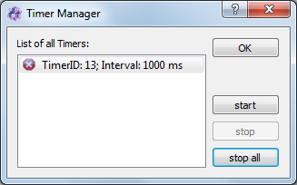

.. include:: ../include/global.inc

.. _gui-timermanager:

Python Timer Manager
**************************

The python class :py:class:`itom.timer` can be used to repeatedly call a certain method or function with a given interval or
call such a method once after a certain delay. In order to stop such a registered timer process, it is either required to
explicitly call the :py:meth:`~itom.timer.stop` method or delete all variables referencing this timer. Sometimes, however,
the timer instance is hidden within some class definitions or anything else, such that it becomes difficult to directly stop
or control the timer. Therefore, |itom| provides a timer manager, that is accessible via the **Script** menu of the main window:

This dialog lists all current timer instances and gives information about the current state of the timer (active, disabled,
continuous function call, single shot timer...). The buttons allow stopping or re-starting a single timer instances or stopping
all active timers with one click.
