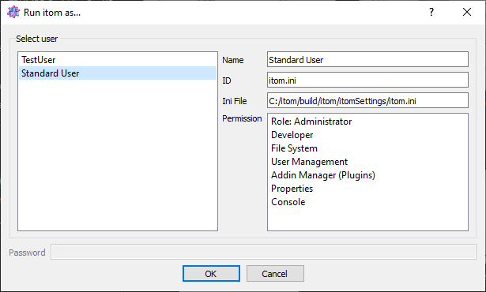
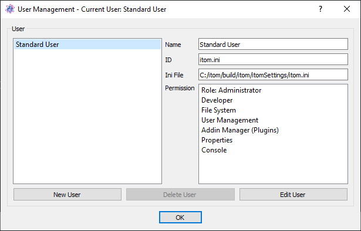
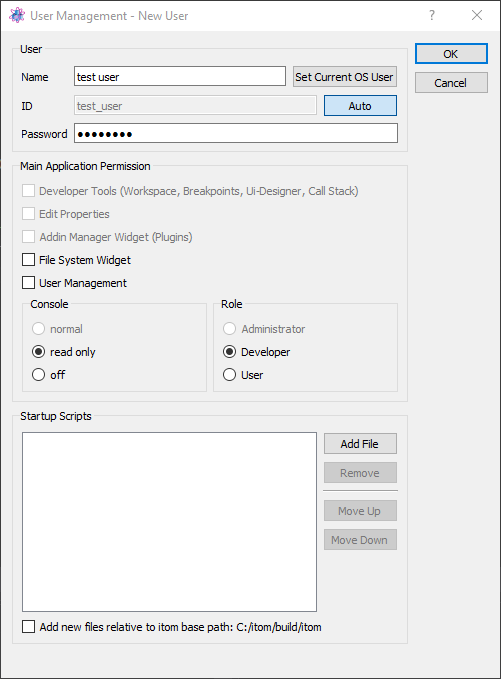

.. include:: ../include/global.inc

.. _gui-user-management:

User Management
******************

|itom| can be adjusted and configured for different users. As default, there exists one **Standard user**, which can be
considered to be an administrator with all rights. Every user is assigned a certain :ref:`settings file
<gui-propertydialog>`, located in the folder **itomSettings** of the |itom| installation.

If more than user is currently registered for your |itom| installation, itom starts with a special user selection dialog:

If a user name is equal to the current OS (Windows, Linux, Apple) username, this entry is selected as default. Else, the
previously used user name is pre-selected.

Select your desired user and click OK to start itom with the settings loaded from the user's setting file. If a password
has been assigned to this user, you have to enter this password first.

.. note::

    Please consider that the user system of |itom| does not provide a real protection. By creating, removing or changing the
    **ini** settings files of any user, it is always possible to remotely create new users, remove a user, set or unset a
    password or change the rights of a user. The user management system is intended to provide different representations of
    |itom| such that developers can for instance create scripts whereas default users only get a basic GUI with a minimal
    set of widgets, which they need to fulfill their tasks.

Display, edit and create new users
====================================

The user management can be opened by the menu **File >> User Management...**. At first you will see a list of currently
registered users:

The **Standard user** is the default user, which exists in every |itom| installation and cannot be removed. This user is
related to the default settings file **itom.ini** in the folder **itomSettings**. The standard user can be considered to
be an administrator with all rights.

The overview dialog provides the ability to create a new user, remove an existing user (besides the standard user) or
edit any user. If a user is selected, basic properties are displayed on the right side of the dialog, like the name of
the user, its unique ID, the related settings file (the filename usually is 'itom\_' + ID + '.ini') as well as basic
permissions. The permissions indicate which toolboxes, widgets and functionalities the user is granted once itom is
opened with its user rights. For instance, an user can only open the user management, if the permission 'User
Management' is granted to this user.

Click **New User** or **Edit User** to open another dialog, where you can change the specific permission of the existing
or new user. Depending on the current user role and features permission, new user can only be created (editing existing
users also) with the same or less role and permission. The hierarchy is that an administrator role can create/edit
another user with the role`*administrator*, *developer* or *user*. If the current user is a *developer*, he can only
edit properties of a user whose role is *developer* or *user*. A current user with the *user* role, can only create or
edit other users with the *user* role.

The dialog consists of the following properties:

* **name**: The desired name of the user. If the user name is equal to the login username of your computer
  (Windows, Linux or iOS user), it is pre-selected in the user startup dialog.
* **ID**: The user ID must be a unique id. If you create a new user, the filename of the user's settings
  file is 'itom\_' + ID + '.ini'. Check the auto button to let itom propose a default ID based on the current user name.
* **Password**: an optional password, one has to enter if itom should be started with this user. If the current
  user has not enough rights, the password of another user cannot be edited.
* **Main Application Permissions**: Select any type of permission you would like to give to the user.
  See the list below for permissions. A user can only set permissions of another user, if he has the same or a higher
  user role. In case of the same role, only permissions can be selected, that the current user has, too.
* **Startup Scripts**: Insert some python scripts which will be executed in the given order once |itom| is started.
  These scripts are inserted into the appropriate settings file and can also be changed in the
  :ref:`property dialog <gui-propertydialog>` (if the user has access to it). An user can only change startup scripts,
  if he has the permission to change properties.

The available permissions are divided into three groups:

1. Main application permissions

    These permissions indicate which functionality and / or widget the user has access to. There exists the following individual permission which can be selected:

    * **Developer Tools**: If selected, the user can create new scripts, open scripts, run and debug scripts and see the corresponding toolboxes like the callstack, the breakpoints dialog... The python package manager is also only visible if this permission is granted.
    * **Edit Properties**: If selected, the user has access to the :ref:`property dialog <gui-propertydialog>`.
    * **Add In Manager Widget**: A user only can see the plugin toolbox if this option is selected.
    * **File System Widget**: The file system toolbox is only visible if this option is checked. Some functionality, like executing a script from the file system widget, also depends on the first permission 'developer tools'.
    * **User Management**: The user can only open the user management if this option is selected.

2. Console

    Here you can decide, how the user can operate with the console. You can select between a fully working console where the user can execute python commands. Alternatively you can
    only display the console as read-only command line, such that only error messages etc. are displayed or you can fully hide the console.

3. Role

    You can assign a certain role to the user. This is one of the possible roles 'Administrator', 'Developer' or 'User'. These roles have no impact on the basic features of |itom| itself or any kind of visible or non-visible toolboxes or widgets.
    However, it is possible to check for the assigned role using the python methods :py:meth:`itom.userIsUser`, :py:meth:`itom.userIsDeveloper` or :py:meth:`itom.userIsAdmin`.

In order to remove a user, click the button **Delete User** in the **user management** dialog. The standard user cannot
be deleted. Furthermore a user can only delete users, whose role is equal or lower than the role of the current user.
