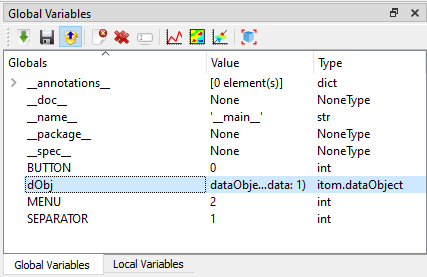

.. include:: ../include/global.inc

.. _gui-workspace:

Global and Local Workspace
***************************

In Python, every loaded package has a global workspace, where all global variables are saved. The main workspace of |itom| is a huge
dictionary, containing all variables as well as method and function pointers and loaded packages and modules. The content of this global
workspace is listed in the toolbox **Global Variables**. There is a filter, such that all variables of type **method**, **function** and
**type** (classes...) are not listed in that overview. If you want to access items of this global workspace you can directly access them
by their variable name, e.g.::
    
    >>print(__name__)
    '__main__' #answer

However, this is only possible if you work in the command line or a script that is not part of a separate module. In this case, you can
access items of |itom|'s global workspace by importing the module **__main__**:

.. code-block:: python
    
    import __main__
    print(__main__.__dict__["__name__"])

.. note::
    
    In Python, every module or package has its own global workspace. The main global workspace depicted in the toolbox is related to the
    global workspace of |itom| that is always accessible by other modules using the dictionary **__dict__** of the **__main__**-module.

The toolbox **local variables** is only enabled if you are currently debugging a python script and the execution is stopped at a breakpoint or in
a certain line. Then, the current workspace (local scope) of the method, where the debugger has been stopped, is shown. If the debugger currently processes
any code not contained in a method, no local workspace is available.

Double-clicking on an item opens an small dialog where the content of the variable is printed. This is the same result as::
    
    print(VARIABLENAME)

The context menu, depicted in the figure above, shows some important methods of this toolbox. Most of them are also accessible by the toolboxes
toolbar. You can always delete |vardelete| one or multiple selected variables or you can rename |varrename| one selected variable. Additionally, there is the possibility
to import |varimport| or export |varexport| variables to or from this workspace.

A click on **import** |varimport| opens a file dialog where you can choose a specific file to import. The following file formats are loadable:

* itom data collection (.idc). This is a pickled file, that may contain several python variables and is loaded using the module **pickle** of python.
* Matlab file (.mat). You can load matlab files in |itom| if you have the Python package **scipy** installed.
* Several itom algorithm-plugins contain methods that implement one of the following interfaces: **iReadDataObject**, **iReadPointCloud**, **iReadPolygonMesh**. Then the data formats that these methods can load are accessible in the dialog as well for loading.

.. note::
    
    Existing variable names will be replaced unless the variable points to a class, method or function.

If you selected one or multiple variables and click on **export** |varexport|, another file save dialog is shown where you can choose a specific filename in order to export
the variables. You can export into the following file formats:

* itom data collection (.idc) [multiple files]. The variables are pickled (python module **pickle**) to the file.
* Matlab file (.mat). [multiple files, Python package **scipy** required]. 
* If you have itom algorithm-plugins installed that implement one of the following interfaces: **iWriteDataObject**, **iWritePointCloud**, **iWritePolygonMesh**, then you can also export dataObjects, pointClouds or polygonMeshes into the specific file formats. [single variable only].

In both the file open and save dialogs, the filter list always considers all file formats that are available for import and export on your computer.

All variables which are defined in python console or in any python script are stored as global variables.
These can be seen in the Global Variables Toolbox.

In order to insert the name of a variable into the :ref:`command line <console>` or a :ref:`script editor widget <gui-editor>` you can drag-and-drop a root-level variable into the destination widget. Currently, the drag-and-drop is only available for root-level variables. In any other cases you can access the entire string to the variable or its subitems (for lists, tuples, dictionaries, classes...) by double-clicking on the item. Then, a dialog is opened that shows details about the clicked item. Click the copy-icon next to the name of the variable in order to copy the name string into the clipboard.

.. |varexport| image:: images/varexport.png  
.. |varimport| image:: images/varimport.png
.. |vardelete| image:: images/vardelete.png
.. |varrename| image:: images/varrename.png

