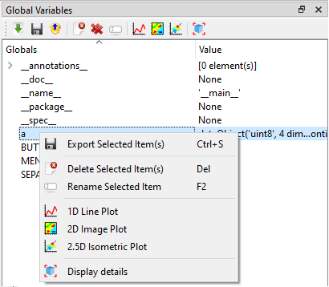
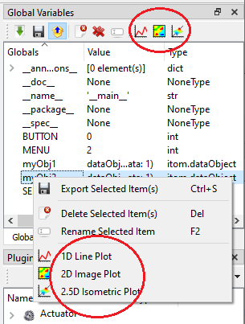

.. include:: ../include/global.inc

.. _gui-workspace:

Global and Local Workspace
***************************

In Python, every loaded module has its own variable workspaces. The main workspace of |itom|
is the one used when Python is instantiated.

Every workspace is a dictionary, containing all variables as well as method and function 
references and imported packages or modules. The content of the top-most global
workspace is listed in the toolbox **Global Variables**. There is a filter, such that all 
variables of type **method**, **function** and **type** (classes...) are not listed in that 
overview. If you want to access items of this global workspace you can directly access them
by their variable name, e.g.::
    
    >>print(__name__)
    '__main__' # answer

However, this is only possible if you work in the command line or a script that is not part of 
a separate module. In this case, you can access items of |itom|'s global workspace by importing 
the module **__main__**:

.. code-block:: python
    
    import __main__
    print(__main__.__dict__["__name__"])

.. note::
    
    In Python, every module or package has its own global workspace. The main global workspace 
    depicted in the toolbox is related to the     global workspace of |itom| that is always 
    accessible by other modules using the dictionary **__dict__** of the **__main__**-module.

The toolbox **local variables** is only enabled if you are currently debugging a python script 
and the execution is stopped (for instance at a breakpoint). Then, the current workspace 
(local scope) of the method, where the debugger has been stopped, is shown. If the debugger 
currently processes any code not contained in a method, no local workspace is available.

The toolbar of the toolbox as well as the context menu of every item is context-sensitive.
This means, that the available actions depend on the type and / or number of selected variables.
General actions are among others: You can always delete |vardelete| 
one or multiple selected variables or you can rename |varrename| one selected variable. 
Additionally, there is the possibility to import |varimport| or export |varexport| variables to 
or from this workspace.

A click on **import** |varimport| opens a file dialog where you can choose a specific file to 
import. The following file formats are loadable:

* itom data collection (.idc). This is a pickled file, that may contain several python 
  variables and is loaded using the module :py:mod:`pickle` of python.
* Matlab file (.mat). You can load matlab files in |itom| if you have the Python package 
  :py:mod:`scipy` installed.
* Several itom algorithm-plugins contain methods that implement one of the following 
  interfaces: **iReadDataObject**, **iReadPointCloud**, **iReadPolygonMesh**. Then the data 
  formats that these methods can load are accessible in the dialog as well for loading.

.. note::
    
    Existing variable names will be replaced unless the variable points to a class, method or 
    function.

If you selected one or multiple variables and click on **export** |varexport|, another file 
save dialog is shown where you can choose a specific filename in order to export the variables. 
You can export into the following file formats:

* itom data collection (.idc) [multiple files]. The variables are pickled (python module 
  :py:mod:`pickle`) to the file.
* Matlab file (.mat). [multiple files, Python package :py:mod:`scipy` required]. 
* If you have itom algorithm-plugins installed that implement one of the following 
  interfaces: **iWriteDataObject**, **iWritePointCloud**, **iWritePolygonMesh**, then 
  you can also export dataObjects, pointClouds or polygonMeshes into the specific file 
  formats. [single variable only].

In both the file open and save dialogs, the filter list always considers all file formats that 
are available for import and export on your computer.

All variables which are defined in python console or in any python script are stored as global 
variables.
These can be seen in the **Global Variables Toolbox**.

In order to insert the name of a variable into the :ref:`command line <console>` or a 
:ref:`script editor widget <gui-editor>` you can drag-and-drop a variable or its child into
the command line or any script. For standard data types, the correct command to access that
variable is copied. There are rare situations, where the copied name cannot be directly used
to access the desired item, e.g. if there is a dictionary lookup involved, whose key has
another type than a number or a string (e.g. enumeration). The same name can also be accessed
via the "variable detail dialog" (see below).

The toolbar of the workspaces toolbox contain a special toggle button |varunpack|, that
defines how to proceed with imported container files (e.g. **idc files**). If the button
is pressed, the content of the loaded **idc** file is unpacked at the top level and all
key-value pairs are loaded a separated variables to the workspace. Else, an input box
is opened and you can give a new variable name. Then, the entire dictionary of the **idc**
file is set as value of one single variable with the given name.

.. |varexport| image:: images/varexport.png  
.. |varimport| image:: images/varimport.png
.. |vardelete| image:: images/vardelete.png
.. |varrename| image:: images/varrename.png

Variable detail dialog
=========================

Whenever a variable of a workspace is double-clicked or the |vardetails| action of the toolbar 
is clicked, a **variable detail** dialog is opened. For most variables, this dialog is a simple 
dialog, that shows the name, the type and the content of the variable. The content is usually 
the result of its :py:meth:`__repr__` method:

.. figure:: images/dialogDetails.png
    :scale: 100%
    :align: center

The name can be copied to the clipboard by clicking the copy button on the top right side.

For variables of type :py:class:`~itom.dataObject` and :py:class:`numpy.ndarray` a special
extended dialog is available:

.. figure:: images/dialogDetailsDataObjectTable.png
    :scale: 100%
    :align: center

This dialog shows a 2d table view of the dataObject or numpy array. On the top, the same
basic information are available, than in the standard dialog (see above), extended by
the shape and data type of the array. If the array has two or less dimensions, its
content is fully displayed in the table in the center area of the dialog. For higher dimensions,
only a 2d slice of the entire array can be shown in the table. This slice can then be
selected by the optional drop down menus and the spin box(es) in the ``slices`` area below
the standard information. This row is only available for arrays with more than two dimensions.

.. note::
    
    Currently, this dialog can only show arrays of type **(u)int8**, **(u)int16**,
    **int32**, **float32**, **float64**, **complex64**, **complex128** or **rgba32**.
    For other types, the standard dialog is shown.

Various configurations and features of the table view are available via the toolbar on top
of the table as well via its context menu. The following features are available (among others):

* Copies the displayed table (or the current selection) to the clipboard. This is done as tab-separated (csv-like)
  plain text as well as html table, that can also contain the current background colors if
  a heatmap (or similar) is currently enabled. Floating point numbers are copied in the local
  representation, such that pasting this text to applications, like Microsoft Excel or Libre
  Office Calc, can directly display the table. If parts of the table are currently selected, only
  the selected items will be copied.
* Exports the displayed table (or the current selection) to a CSV file. During the export,
  many configurations for the export can be set in a configuration dialog.
* Clears an active selection (if available).
* The number of visible decimal digits can be changed, as well as the representation of
  decimal numbers can be selected (Standard: -12.45769, Scientific: -1.245e1 or Auto for the
  more appropriate representation).
* The width of all columns can be automatically adjusted such that all numbers are fully visible.
* A heatmap can be displayed as background color, such that the entire table is coloured
  depending on the current values of each cell. The min / max range of this heatmap can be 
  adjusted, too. Rgba32 `~itom.dataObject` will display their real color information as background
  color.
* It is possible to plot the entire table or selected cells, rows or columns are 2D or 1D plots.
  This is only possible, if all selected ranges span either the same rows or columns.

:py:class:`dataObject` come with a lot of meta information, like axis or value descriptions 
or units, axis scales or offsets, a tag dictionary etc. All this meta information is displayed
in the tab ``meta information``:

.. figure:: images/dialogDetailsDataObjectMetaTable.png
    :scale: 100%
    :align: center

Plot from workspace
======================

It is possible to directly plot variables of type :py:class:`~itom.dataObject`, 
:py:class:`numpy.ndarray`, :py:class:`~itom.pointCloud` or :py:class:`~itom.polygonMesh` from 
the workspace. Open the context menu of any variable or click the variable and see the 
context-sensitive toolbar of the workspace.

    
The last entries of this context menu or the toolbar are sensitive to the corresponding type of 
the variable. For :py:class:`~itom.dataObject` (or :py:class:`numpy.ndarray`), the following 
options are available:

* 1D line plot (corresponds to the script command *itom.plot1(object)*)
* 2D image plot (corresponds to the script command *itom.plot2(object)*)
* 2.5D isometric plot (corresponds to the script command *itom.plot25(object)*)

For :py:class:`~itom.pointCloud` or  :py:class:`~itom.polygonMesh`, the available options are:

* 3D cloud or mesh visualization (corresponds to the script command *plot25(object)*)

