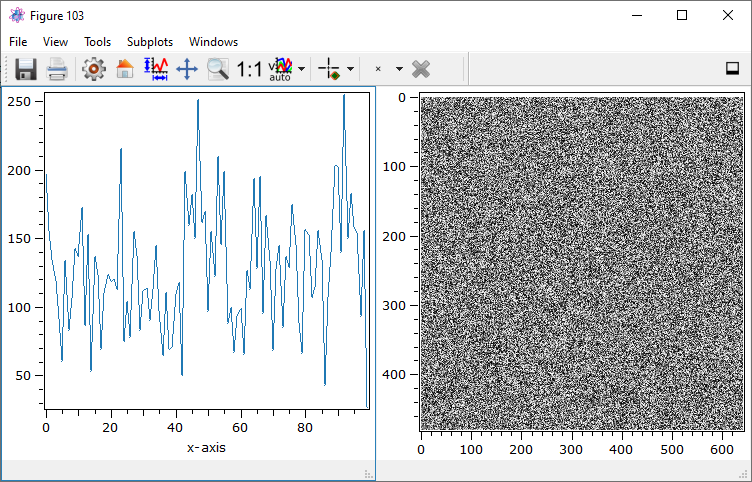

Figure Management
*****************

Technically, every plot widget, hence the plot containing the axes and the content, is represented as an instance of :py:class:`~itom.plotItem`.
If you show the plot in its own window, this window is called figure and represented as an instance of :py:class:`~itom.figure`.
Every figure is also able to show various sub-plots arranged in a regular grid of *m* rows and *n* columns. Plots, integrated in an user-defined
interface, are directly integrated there without being part of a special figure.

If you want to continuously use the same figure window for sequentially plotting different data or if you want to use the sub-plot mechanism,
it is useful to firstly create or access a specific figure and then plot data objects or camera live images using the specific commands of this figure.

Every figure has a specific handle (integer value). Therefore you can have access to any figure by its figure instance or via the handle value.

In the following example, a new figure is created and opened. The instance is saved in the variable *fig*:

.. code-block:: python
    
    fig = figure()

Assuming, that you want to access an already existing figure or create a new figure with your desired handle number, give the handle as first argument (keyword: *handle*):

.. code-block:: python
    
    fig = figure(1)
    #or
    fig = figure(handle = 1)

*fig* is then an instance of :py:class:`~itom.figure`. This class is derived from :py:class:`~itom.uiItem` and therefore has the same functionality like any other widget
that is represented by :py:class:`~itom.uiItem` (see :ref:`qtdesigner`). If you provide no further parameter (besides *handle*) to the figure constructor, a figure with one
plot area is created. If you want to create a grid of more plot areas, you need to give the number of rows and columns as argument to the constructor:

.. code-block:: python
    
    fig = figure(rows = 2, cols = 3)
    
Not only the module :py:mod:`itom` has the methods :py:meth:`~itom.plot`and :py:meth:`~itom.liveImage` in order to plot data objects or camera streams. In the same way, the
class :py:class:`~itom.figure` has these methods, too:

With method signature:

.. autosummary::
    :toctree: generated
    
    itom.figure.plot
    itom.figure.liveImage

Both have the optional keyword parameter *areaIndex*, such that you define in which sub-plotting area the requested plot or live image should be depicted. If you don't provide
the *areaIndex* parameter, the first area (top, left) is assumed (this is also the default in case that you don't use subplots). The *areaIndex* value is a fixed-point number
beginning with 0 for the top-left area of the figure. Then, the index iterates row-wise through the entire grid of sub-plots.

In the following example, a 1x2 grid is created where the left plot shows a 1D data object and the right plot contains the live stream of the dummy grabber camera instance:

.. code-block:: python
    
    fig = figure(rows = 1, cols = 2)
    data1d = dataObject.randN([1,100])
    fig.plot(data1d, 0)
    cam = dataIO("DummyGrabber")
    fig.liveImage(cam, 1)
    
The result looks like this:

The currently depicted toolbar is provided by the active subplot, marked by a border. You can switch the active subplot by choosing your desired one in the figure's menu *subplot*.
In order to get the instance of :py:class:`itom.plotItem` of any sublot, use the following command:

.. code-block:: python  
    
    plotLeft = fig.subplot(0)
    plotRight = fig.subplot(1)

.. note::
    
    If you have an instance to a plotItem only in python and the window is closed, the window is finally deleted and the plotItem becomes invalid. In difference, a handle to a figure
    keeps the figure alive until all references to the figure's instance are deleted. Therefore you can always show or hide a figure using its instance and the methods :py:meth:`~itom.figure.show()` or :py:meth:`~itom.figure.hide()`.

The :py:class:`~itom.figure` also provides a static method :py:meth:`~itom.figure.close` to close and delete a figure defined by its specific integer handle or to close all figures using the string 'all' as parameter. Please note, that only these figures are finally deleted where no other python references exist to them.

.. code-block:: python
    
    #close figure with handle 7
    figure.close(7)
    
    #close all figures
    figure.close('all')