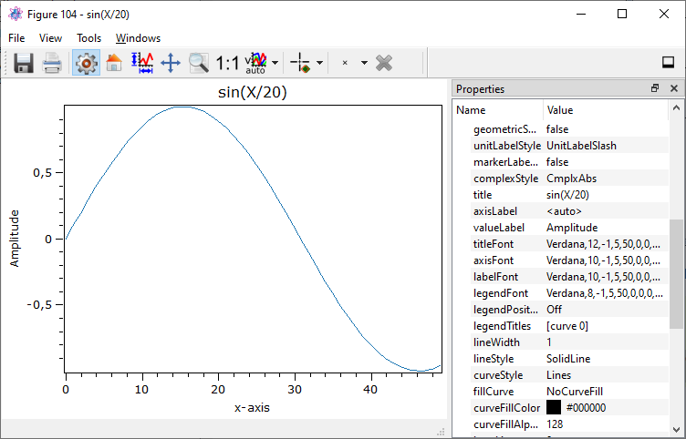

.. _plot-line:

line plots (1D)
******************

In order to plot a 1D line (1 x M or M x 1 DataObject) or multiple lines in a line plot, the designer plugin **Itom1DQwtPlot** is
the recommended visualization tool. You can either add this class name (*itom1dqwtplot*) to any :py:meth:`~itom.plot` or :py:meth:`~itom.liveImage`
command in order to force the data to be plotted in this plot type and / or set this plugin to be the default plot for 1D static and live plots.

The latter can be done in the property dialog or itom, tab **Plots and Figures >> Default Plots**. Set there the *default figure plot* to *Itom1DQwtPlot* for the
categories

* DObjLiveLine (live 1D visualization of a dataObject)
* DObjStaticLine (static 1D visualization of a dataObject)

    
This plot has been created by the following code snippet:

.. code-block:: python
    
    import numpy as np
    X = np.linspace(0,100)
    Y = np.sin(X/20)
    plot(Y, className = 'itom1dqwtplot', \
        properties = {"title":"sin(X/20)", "valueLabel":"Amplitude"})
        
.. _itom1dqwtplot:
        
Itom1dQwtPlot
==========================

If you choose *itom1dqwtplot* as className for the :py:meth:`~itom.plot` command with a 2D data object as argument,
is it also possible to plot multiple lines. The plot plugin accepts all available data types, including colors and complex values.

Data is plotted as follows:

* Real data types: One or multiple lines are plotted where the horizontal axis corresponds to the grid of the data object considering possible scaling and offset values. The line(s) have different colours. The colour of one line can also be adjusted.
* Complex types: This is the same than for real data types, however you can choose whether the *absolute*, *phase*, *real* or *imaginary* part of the complex values is plotted.
* color type: Coloured data objects will be represented by either 3 or 4 lines (red, green and blue, alpha optional) that correspond to the three colour channels or by one line representing the converted gray values.

Using Python or the properties toolbox (View >> properties or via right click on the toolbar), it is possible to adjust many properties like stated in the section Properties below.

The plot allows value and min/max-picking via place-able marker.

The plot supports geometric element and marker interaction via **drawAndPickElements(...)** and **call("userInteractionStart",...)**. See section :ref:`primitives` for a short introduction.

You can also use the "matplotlib"-backend to plot slices or xy-coordinates. See section :ref:`pymod-matplotlib` for more information about how to use "matplotlib".

The plot-canvas can be exported to vector and bitmap-graphics via button or menu entry or it can be exported to clipBoard via ctrl-c or a public slot.

Setting properties
-------------------------

If you want to modify the lines, ploted in the :ref:`itom1dqwtplot`, individually you can do this with the help of Python or the curve properties widget (View >> curve properties or via right click on the toolbar).
The following line properties are acessable via Python:

* **visible**
* **lineStyle**
* **lineWidth**
* **lineColor**
* **lineJoinStyle**
* **lineCapStyle**
* **lineSymbolSize**
* **lineSymbolStyle**
* **legendVisible**

A propertie of a line can be acessed as followed:

.. code-block:: python
    
    plotHandle.call("setCurveProperty", index, property, value) 

with the *index* (int) of the curve, the name of the *property* (str) and the value (various) the property will be set to. For a detailed description of the properties read the section below. In the file :file:`itom/demo/plots/demoPlot1DLineProperties.py` 
a short demonstration of how to set the properties is given.

For acessing the propties via the user interface the line properties widget can be used. Additional to the properties listed above the legend name, the legend visibility and the symbol color can be set.  

.. figure:: images/curveProperties.png
    :scale: 100%
    :align: center
This shows the curve Properties widget.

If you want to set a propertie global for all curves you can also use the properties widget (View >> properties or via right click on the toolbar)
	
 

.. _itom1dqwtplot-ref:

.. BEGIN The following part is obtained by the script plot_help_to_rst_format.py from the designer plugin itom1dqwtplot

Properties
-------------------------

.. py:attribute:: valueScale : ItomQwtPlotEnums::ScaleEngine 
    :noindex:
    
    linear or logarithmic scale (various bases) can be chosen for the vertical axis (y-axis). Please consider, that a logarithmic scale can only display values > 1e-100.
    
    The type 'ItomQwtPlotEnums::ScaleEngine' is an enumeration that can have one of the following values (str or int):
    
    * 'Linear' (1)
    * 'Log2' (2)
    * 'Log10' (10)
    * 'Log16' (16)
    * 'LogLog2' (1002)
    * 'LogLog10' (1010)
    * 'LogLog16' (1016)

.. py:attribute:: lineSymbolSize : int 
    :noindex:
    
    Get / Set the current line symbol size

.. py:attribute:: geometricShapesCount : int (readonly)
    :noindex:
    
    Number of currently existing geometric shapes.

.. py:attribute:: toolbarVisible : bool 
    :noindex:
    
    Toggles the visibility of the toolbar of the plot.

.. py:attribute:: legendPosition : LegendPos 
    :noindex:
    
    Position of the legend (Off, Left, Top, Right, Bottom)
    
    The type 'LegendPos' is an enumeration that can have one of the following values (str or int):
    
    * 'Off' (0)
    * 'Left' (1)
    * 'Top' (2)
    * 'Right' (3)
    * 'Bottom' (4)

.. py:attribute:: titleFont : font 
    :noindex:
    
    Font for title.

.. py:attribute:: lineSymbol : Symbol 
    :noindex:
    
    Get / Set the current line symbol type
    
    The type 'Symbol' is an enumeration that can have one of the following values (str or int):
    
    * 'NoSymbol' (0)
    * 'Ellipse' (1)
    * 'Rect' (2)
    * 'Diamond' (3)
    * 'Triangle' (4)
    * 'DTriangle' (5)
    * 'UTriangle' (6)
    * 'LTriangle' (7)
    * 'RTriangle' (8)
    * 'Cross' (9)
    * 'XCross' (10)
    * 'HLine' (11)
    * 'VLine' (12)
    * 'Star1' (13)
    * 'Star2' (14)
    * 'Hexagon' (15)

.. py:attribute:: pickerCount : int (readonly)
    :noindex:
    
    Number of picker within the plot.

.. py:attribute:: buttonSet : ButtonStyle 
    :noindex:
    
    Get/set the button set used (normal or light color for dark themes).
    
    The type 'ButtonStyle' is an enumeration that can have one of the following values (str or int):
    
    * 'StyleBright' (0)
    * 'StyleDark' (1)

.. py:attribute:: labelFont : font 
    :noindex:
    
    Font for axes descriptions.

.. py:attribute:: legendFont : font 
    :noindex:
    
    Font for legend entries

.. py:attribute:: xAxisInterval : autoInterval 
    :noindex:
    
    Sets the visible range of the displayed x-axis (in coordinates of the data object). Set it to 'auto' if range should be automatically set [default].

.. py:attribute:: geometricShapesDrawingEnabled : bool 
    :noindex:
    
    Enable and disable internal plotting functions and GUI-elements for geometric elements.

.. py:attribute:: colorMap : str 
    :noindex:
    
    Color map (string) that should be used to colorize a non-color data object.

.. py:attribute:: geometryModificationModes : ItomQwtPlotEnums::ModificationModes 
    :noindex:
    
    Bitmask to globally change how geometric shapes can be modified. The possible modes of a shape are both restricted by the shape's flags and the allowed modes of the plot (move: 0x01, rotate: 0x02, resize: 0x04)
    
    The type 'ItomQwtPlotEnums::ModificationModes' is a flag mask that can be a combination of one or several of the following values (or-combination number values or semicolon separated strings):
    
    * 'Move' (1)
    * 'Rotate' (2)
    * 'Resize' (4)

.. py:attribute:: columnInterpretation : ItomQwtPlotEnums::MultiLineMode 
    :noindex:
    
    Define the interpretation of M x N objects as Auto, FirstRow, FirstCol, MultiRows, MultiCols.
    
    The type 'ItomQwtPlotEnums::MultiLineMode' is an enumeration that can have one of the following values (str or int):
    
    * 'AutoRowCol' (0)
    * 'FirstRow' (1)
    * 'FirstCol' (2)
    * 'MultiRows' (3)
    * 'MultiCols' (4)
    * 'MultiLayerAuto' (5)
    * 'MultiLayerCols' (6)
    * 'MultiLayerRows' (7)

.. py:attribute:: curveFillAlpha : int 
    :noindex:
    
    set the alpha value for the curve fill color seperatly.

.. py:attribute:: valueLabel : str 
    :noindex:
    
    Label of the value axis (y-axis) or '<auto>' if the description should be used from data object.

.. py:attribute:: zAxisInterval : autoInterval 
    :noindex:
    
    Sets the visible range of the displayed z-axis (in coordinates of the data object). Set it to 'auto' if range should be automatically set [default].

.. py:attribute:: renderLegend : bool 
    :noindex:
    
    If this property is true, the legend are included in pixelmaps renderings.

.. py:attribute:: geometricShapesFillOpacitySelected : int 
    :noindex:
    
    Opacity for the selected geometric shapes with an area > 0. This value ranges from 0 (not filled) to 255 (opaque).

.. py:attribute:: lineStyle : Qt::PenStyle 
    :noindex:
    
    style of all lines.
    
    The type 'Qt::PenStyle' is an enumeration that can have one of the following values (str or int):
    
    * 'NoPen' (0)
    * 'SolidLine' (1)
    * 'DashLine' (2)
    * 'DotLine' (3)
    * 'DashDotLine' (4)
    * 'DashDotDotLine' (5)
    * 'CustomDashLine' (6)

.. py:attribute:: geometricShapesFillOpacity : int 
    :noindex:
    
    Opacity for geometric shapes with an area > 0. This value ranges from 0 (not filled) to 255 (opaque).

.. py:attribute:: picker : dataObject (readonly)
    :noindex:
    
    Get picker defined by a Mx4 float32 data object. Each row represents one picker and contains the following information: [pixelIndex, physIndex, value, curveIndex]. PixelIndex and physIndex are equal if axisScale = 1 and axisOffset = 0 for the corresponding dataObject.

.. py:attribute:: unitLabelStyle : ito::AbstractFigure::UnitLabelStyle 
    :noindex:
    
    style of the axes label (slash: 'name / unit', keyword-in: 'name in unit', square brackets: 'name [unit]'
    
    The type 'ito::AbstractFigure::UnitLabelStyle' is an enumeration that can have one of the following values (str or int):
    
    * 'UnitLabelSlash' (0)
    * 'UnitLabelKeywordIn' (1)
    * 'UnitLabelSquareBrackets' (2)

.. py:attribute:: contextMenuEnabled : bool 
    :noindex:
    
    Defines whether the context menu of the plot should be enabled or not.

.. py:attribute:: selectedGeometricShape : int 
    :noindex:
    
    Get or set the currently highlighted geometric shape. After manipulation the last element stays selected.

.. py:attribute:: selectedGeometricShape : int 
    :noindex:
    
    Get or set the currently highlighted geometric shape. After manipulation the last element stays selected.

.. py:attribute:: axisFont : font 
    :noindex:
    
    Font for axes tick values.

.. py:attribute:: curveStyle : ItomQwtPlotEnums::CurveStyle 
    :noindex:
    
    set the style of the qwt-plot according to curve styles.
    
    The type 'ItomQwtPlotEnums::CurveStyle' is an enumeration that can have one of the following values (str or int):
    
    * 'NoCurve' (-1)
    * 'Lines' (0)
    * 'FittedLines' (1)
    * 'Sticks' (2)
    * 'SticksHorizontal' (3)
    * 'SticksVertical' (4)
    * 'Steps' (5)
    * 'StepsRight' (6)
    * 'StepsLeft' (7)
    * 'Dots' (8)

.. py:attribute:: geometricShapes : seq. of shape 
    :noindex:
    
    Get or set the geometric shapes on the canvas, they are set as a sequence of itom.shape for each shape.

.. py:attribute:: backgroundColor : color str, rgba or hex 
    :noindex:
    
    Get/set the background color.

.. py:attribute:: pickerLabelVisible : bool 
    :noindex:
    
    Enable and disable the labels next to each picker.

.. py:attribute:: displayed : dataObject (readonly)
    :noindex:
    
    This returns the currently displayed data object [read only].

.. py:attribute:: yAxisInterval : autoInterval 
    :noindex:
    
    Sets the visible range of the displayed y-axis (in coordinates of the data object). Set it to 'auto' if range should be automatically set [default].

.. py:attribute:: geometricShapesLabelsVisible : bool 
    :noindex:
    
    Toggle visibility of shape labels, the label is the name of the shape.

.. py:attribute:: canvasColor : color str, rgba or hex 
    :noindex:
    
    Get/set the color of the canvas.

.. py:attribute:: legendTitles : seq. of str 
    :noindex:
    
    Seq. of strings with the legend titles for all curves. If the list has less entries than curves, the last curves don't have any title. If no legends are given, the data object is checked for tags named 'legendTitle0', 'legendTitle1'... If these tags are not given, the default titles 'curve 0', 'curve 1'... are taken.

.. py:attribute:: pickerLimit : int 
    :noindex:
    
    Define the maximal number of picker for this plot.

.. py:attribute:: pickerLabelOrientation : Qt::Orientation 
    :noindex:
    
    Get / set the label orientation for the picker labels.
    
    The type 'Qt::Orientation' is an enumeration that can have one of the following values (str or int):
    
    * 'Horizontal' (1)
    * 'Vertical' (2)

.. py:attribute:: textColor : color str, rgba or hex 
    :noindex:
    
    Get/set the color of text and tick-numbers.

.. py:attribute:: pickerLabelAlignment : Qt::Alignment 
    :noindex:
    
    Get / set label alignment for the picker labels.
    
    The type 'Qt::Alignment' is a flag mask that can be a combination of one or several of the following values (or-combination number values or semicolon separated strings):
    
    * 'AlignLeft' (1)
    * 'AlignLeading' (1)
    * 'AlignRight' (2)
    * 'AlignTrailing' (2)
    * 'AlignHCenter' (4)
    * 'AlignJustify' (8)
    * 'AlignAbsolute' (16)
    * 'AlignHorizontal_Mask' (31)
    * 'AlignTop' (32)
    * 'AlignBottom' (64)
    * 'AlignVCenter' (128)
    * 'AlignBaseline' (256)
    * 'AlignVertical_Mask' (480)
    * 'AlignCenter' (132)

.. py:attribute:: grid : GridStyle 
    :noindex:
    
    Style of the grid ('GridNo', 'GridMajorXY', 'GridMajorX', 'GridMajorY', 'GridMinorXY', 'GridMinorX', 'GridMinorY').
    
    The type 'GridStyle' is an enumeration that can have one of the following values (str or int):
    
    * 'GridNo' (0)
    * 'GridMajorXY' (1)
    * 'GridMajorX' (2)
    * 'GridMajorY' (3)
    * 'GridMinorXY' (4)
    * 'GridMinorX' (5)
    * 'GridMinorY' (6)

.. py:attribute:: axisLabel : str 
    :noindex:
    
    Label of the direction (x/y) axis or '<auto>' if the descriptions from the data object should be used.

.. py:attribute:: camera : dataIO 
    :noindex:
    
    Use this property to set a camera/grabber to this plot (live image).

.. py:attribute:: lineWidth : float 
    :noindex:
    
    width of all curves in pixel.

.. py:attribute:: source : dataObject 
    :noindex:
    
    Sets the input data object for this plot.

.. py:attribute:: curveFillColor : color str, rgba or hex 
    :noindex:
    
    the fill color for the curve, invalid color leads to line color selection.

.. py:attribute:: enableBoxFrame : bool 
    :noindex:
    
    If true, a 1px solid border is drawn as a boxed rectangle around the canvas, else no margin is visible on the upper and right side.

.. py:attribute:: allowedGeometricShapes : ItomQwtPlotEnums::ShapeTypes 
    :noindex:
    
    Combination of values of enumeration ShapeType to decide which types of geometric shapes are allowed (default: all shape types are allowed)
    
    The type 'ItomQwtPlotEnums::ShapeTypes' is a flag mask that can be a combination of one or several of the following values (or-combination number values or semicolon separated strings):
    
    * 'MultiPointPick' (1)
    * 'Point' (2)
    * 'Line' (4)
    * 'Rectangle' (8)
    * 'Square' (16)
    * 'Ellipse' (32)
    * 'Circle' (64)
    * 'Polygon' (128)

.. py:attribute:: keepAspectRatio : bool 
    :noindex:
    
    Enable or disable a fixed 1:1 aspect ratio between x and y axis.

.. py:attribute:: title : str 
    :noindex:
    
    Title of the plot or '<auto>' if the title of the data object should be used.

.. py:attribute:: axisColor : color str, rgba or hex 
    :noindex:
    
    Get/set the color of the axis.

.. py:attribute:: antiAliased : bool 
    :noindex:
    
    True, if all curves should be plot with an anti-aliased render mode (slower) or False if not (faster).

.. py:attribute:: fillCurve : ItomQwtPlotEnums::FillCurveStyle 
    :noindex:
    
    fill curve below / above or according to baseline.
    
    The type 'ItomQwtPlotEnums::FillCurveStyle' is an enumeration that can have one of the following values (str or int):
    
    * 'NoCurveFill' (-1)
    * 'FillBaseLine' (0)
    * 'FillFromTop' (1)
    * 'FillFromBottom' (2)

.. py:attribute:: markerLabelsVisible : bool 
    :noindex:
    
    Toggle visibility of marker labels, the label is the set name of the marker.

.. py:attribute:: pickerType : ItomQwtPlotEnums::PlotPickerType 
    :noindex:
    
    Get / set the current picker type ('DefaultMarker', 'RangeMarker', 'ValueRangeMarker', 'AxisRangeMarker')
    
    The type 'ItomQwtPlotEnums::PlotPickerType' is an enumeration that can have one of the following values (str or int):
    
    * 'DefaultMarker' (0)
    * 'RangeMarker' (1)
    * 'ValueRangeMarker' (2)
    * 'AxisRangeMarker' (3)

.. py:attribute:: axisScale : ItomQwtPlotEnums::ScaleEngine 
    :noindex:
    
    linear or logarithmic scale (various bases) can be chosen for the horizontal axis (x-axis). Please consider, that a logarithmic scale can only display values > 1e-100.
    
    The type 'ItomQwtPlotEnums::ScaleEngine' is an enumeration that can have one of the following values (str or int):
    
    * 'Linear' (1)
    * 'Log2' (2)
    * 'Log10' (10)
    * 'Log16' (16)
    * 'LogLog2' (1002)
    * 'LogLog10' (1010)
    * 'LogLog16' (1016)

.. py:attribute:: baseLine : float 
    :noindex:
    
    the position of the baseline if curveStyle is set to 'Sticks', 'SticksVertical' or 'SticksHorizontal'.

Slots
-------------------------

.. py:function:: clearGeometricShapes() [slot]
    :noindex:
    
    
    removes all geometric shapes from the canvas.
    
    .. index:: 

.. py:function:: savePlot(filename, xsize, ysize, resolution) [slot]
    :noindex:
    
    
    saves the plot as image, pdf or svg file (the supported file formats are listed in the save dialog of the plot)
    
    :param filename: absolute or relative filename whose suffix defines the file format
    :type filename: str
    :param xsize: x-size of the canvas in mm. If 0.0 [default], the size of the canvas is determined by the current size of the figure
    :type xsize: float
    :param ysize: y-size of the canvas in mm. If 0.0 [default], the size of the canvas is determined by the current size of the figure
    :type ysize: float
    :param resolution: resolution of image components in the plot in dpi (default: 300dpi)
    :type resolution: int
    
    .. index:: 

.. py:function:: setCurveProperty(index, property, value) [slot]
    :noindex:
    
    
    Set a property of a specific curve
    
    Some curve properties can be changed globally for all curves using the global properties. However, it is also possible to
    set a property to different values for each curve.
    
    :param index: zero-based index of the curve whose property should be changed.
    :type index: int
    :param property: name of the property to be changed
    :type property: str
    :param value: value of the property
    :type value: various
    
    .. index:: 

.. py:function:: copyToClipBoard() [slot]
    :noindex:
    
    
    copies the entire plot to the clipboard as bitmap data.
    
    .. index:: 

.. py:function:: setGeometricShapeLabelVisible(idx, visible) [slot]
    :noindex:
    
    
    Set the visibility of the label of a geometric shape with the given index.
    
    :param idx: index of the shape
    :type idx: int
    :param visible: True if the label should be displayed close to the shape, else False
    :type visible: bool
    
    .. index:: 

.. py:function:: appendPicker(coordinates, curveIndex, physicalCoordinates) [slot]
    :noindex:
    
    
    Append plot pickers to a specific curve either in physical (axis) or in pixel coordinates.
    
    The pixel coordinates are the pixels of the currently displayed dataObject. The coordinates are the axis positions only, 
    the values are chosen from the curve values. Existing pickers are not removed before this operation.
    
    :param coordinates: x-coordinates of each picker, the y-coordinate is automatically chosen from the shape of the curve. If the size of the sequence plus the number of existing pickers exceed the 'pickerLimit', a RuntimeError is thrown.curveIndex : {int} index of the curve where the pickers should be attached to (optional, default: 0 - first curve)
    :type coordinates: seq. of float
    :param physicalCoordinates: optional, if True (default), 'coordinates' are given in axis coordinates of the plot (hence, physical coordinates of the dataObject; False: 'coordinates' are given in pixel coordinates of the dataObject
    :type physicalCoordinates: bool
    
    .. index:: 

.. py:function:: getDisplayed() [slot]
    :noindex:
    
    
    returns the currently displayed dataObject.
    
    .. index:: 

.. py:function:: updateGeometricShape(geometricShape) [slot]
    :noindex:
    
    
    Updates an existing geometric shape by the new shape if the index of the shape already exists, else add the new shape to the canvas (similar to 'addGeometricShape'. 
    
    If the index of the new shape is -1 (default), the next free auto-incremented index will be set for this shape. (C++ only: this new index ist
    stored in the optional 'newIndex' parameter).
    
    :param geometricShape: new geometric shape
    :type geometricShape: shape
    
    .. index:: 

.. py:function:: refreshPlot() [slot]
    :noindex:
    
    
    Triggers an update of the current plot window.
    
    .. index:: 

.. py:function:: getCurveProperty(index, property) [slot]
    :noindex:
    
    
    Get a property of a specific curve
    
    Get the value of a property of a specific curve (see slot 'setCurveProperty').
    
    :param index: zero-based index of the curve whose property should be changed.
    :type index: int
    :param property: name of the property to be changed
    :type property: str
    
    :return: value -> value of the requested property
    :rtype: variant
    
    .. index:: 

.. py:function:: setPicker(coordinates, curveIndex, physicalCoordinates) [slot]
    :noindex:
    
    
    Set plot pickers to a specific curve either in physical (axis) or in pixel coordinates.
    
    The pixel coordinates are the pixels of the currently displayed dataObject. The coordinates are the axis positions only, 
    the values are chosen from the curve values. Existing pickers are deleted at first.
    
    :param coordinates: x-coordinates of each picker, the y-coordinate is automatically chosen from the shape of the curve. If the size of the sequence exceeds the 'pickerLimit', a RuntimeError is thrown.curveIndex : {int} index of the curve where the pickers should be attached to (optional, default: 0 - first curve)
    :type coordinates: seq. of float
    :param physicalCoordinates: optional, if True (default), 'coordinates' are given in axis coordinates of the plot (hence, physical coordinates of the dataObject; False: 'coordinates' are given in pixel coordinates of the dataObject
    :type physicalCoordinates: bool
    
    .. index:: 

.. py:function:: setGeometricShapes(geometricShapes) [slot]
    :noindex:
    
    
    This slot is the same than assigning a sequence of shape to the property 'geometricShapes'. It replaces all existing shapes by the new set of shapes.
    
    :param geometricShapes: Sequence (e.g tuple or list) of shapes that replace all existing shapes by this new set.
    :type geometricShapes: seq. of shapes
    
    .. index:: 

.. py:function:: showCurveProperties() [slot]
    :noindex:
    
    
    .. index:: 

.. py:function:: deleteMarkers(id) [slot]
    :noindex:
    
    
    Delete all sets of markers with the given id or all markers if no or an empty id is passed.
    
    :param id: name of the marker set that should be removed (optional)
    :type id: str
    
    .. index:: 

.. py:function:: plotMarkers(coordinates, style, id, plane) [slot]
    :noindex:
    
    
    Draws sub-pixel wise markers to the canvas of the plot
    
    :param coordinates: 2xN data object with the 2D coordinates of the markers (first row: X, second row: Y coordinates in axis coordinates of the plot)
    :type coordinates: dataObject
    :param style: Style string for the set of markers (e.g. 'r+20' for red crosses with a size of 20px)
    :type style: str
    :param id: Name of the set of added markers (optional, default='')
    :type id: str
    :param plane: If the dataObject has more than 2 dimensions, it is possible to add the markers to a specific plane only (optional, default=-1 -> all planes)
    :type plane: int
    
    .. index:: 

.. py:function:: deletePicker(id) [slot]
    :noindex:
    
    
    Delete the i-th picker (id >= 0) or all pickers (id = -1)
    
    :param id: zero-based index of the picker to be deleted, or -1 if all pickers should be deleted (default). This parameter is optional.
    :type id: int
    
    .. index:: 

.. py:function:: replot() [slot]
    :noindex:
    
    
    Force a replot which is for instance necessary if values of the displayed data object changed and you want to update the plot, too.
    
    .. index:: 

.. py:function:: setLinePlot(x0, y0, x1, y1, destID) [slot]
    :noindex:
    
    
    This slot can be implemented by any plot plugin to force the plot to open a line plot. Here it is not required and therefore not implemented.
    
    .. index:: 

.. py:function:: getPlotID() [slot]
    :noindex:
    
    
    Return window ID of this plot {int}.
    
    .. index:: 

.. py:function:: userInteractionStart(type, start, maxNrOfPoints) [slot]
    :noindex:
    
    
    starts or aborts the process to let the user add a certain number of geometric shapes to the canvas.
    
    :param type: type of the geometric shape the user should add (e.g. shape.Line, shape.Point, shape.Rectangle, shape.Square...
    :type type: int
    :param start: True if the interaction should be started, False if a running interaction process should be aborted
    :type start: bool
    :param maxNrOfPoints: number of shapes that should be added, the user can quit earlier by pressing Esc (optional, default: -1 -> infinite number of shapes)
    :type maxNrOfPoints: int
    
    .. index:: 

.. py:function:: renderToPixMap(xsize, ysize, resolution) [slot]
    :noindex:
    
    
    returns a QPixmap with the content of the plot
    
    :param xsize: width of the pixmap
    :type xsize: int
    :param ysize: height of the pixmap
    :type ysize: int
    :param resolution: resolution of the pixmap in dpi
    :type resolution: int
    
    .. index:: 

.. py:function:: deleteGeometricShape(idx) [slot]
    :noindex:
    
    
    deletes the geometric shape with the given index.
    
    :param idx: idx is the index of the shape to be removed. This is the index of the shape instance itself and must not always correspond to the index-position of the shape within the tuple of all shapes
    :type idx: int
    
    .. index:: 

.. py:function:: addGeometricShape(geometricShape) [slot]
    :noindex:
    
    
    Add a new geometric shape to the canvas if no shape with the same index already exists. 
    
    If the index of the new shape is -1 (default), the next free auto-incremented index will be set for this shape. (C++ only: this new index ist
    stored in the optional 'newIndex' parameter).
    
    :param geometricShape: new geometric shape
    :type geometricShape: shape
    
    :raises RuntimeError: if the index of the shape is != -1 and does already exist
    
    .. index:: 

.. py:function:: setGeometricShapeLabel(idx, label) [slot]
    :noindex:
    
    
    Set the label of geometric shape with the index idx.
    
    :param idx: index of the shape
    :type idx: int
    :param label: new label of the shape
    :type label: str
    
    .. index:: 

Signals
-------------------------

.. py:function:: geometricShapeFinished(shapes, aborted) [signal]
    :noindex:
    
    
    This signal is emitted whenever one or multiple geometric shapes have been added, removed or modified
    
    :param shapes: A tuple containing all shapes that have been modified
    :type shapes: tuple of shape
    :param aborted: True if the modification process has been aborted, else False
    :type aborted: bool
    
    .. note::
    
        To connect to this signal use the following signature::
        
            yourItem.connect('geometricShapeFinished(QVector<ito::Shape>,bool)', yourMethod)
    
    .. index:: 

.. py:function:: geometricShapesDeleted() [signal]
    :noindex:
    
    
    This signal is emitted when the last geometric shape has been deleted or removed.
    
    .. note::
    
        To connect to this signal use the following signature::
        
            yourItem.connect('geometricShapesDeleted()', yourMethod)
    
    .. index:: 

.. py:function:: geometricShapeDeleted(idx) [signal]
    :noindex:
    
    
    This signal is emitted whenever a geometric shape has been deleted
    
    :param idx: index of the deleted shape
    :type idx: int
    
    .. note::
    
        To connect to this signal use the following signature::
        
            yourItem.connect('geometricShapeDeleted(int)', yourMethod)
    
    .. index:: 

.. py:function:: geometricShapeAdded(idx, shape) [signal]
    :noindex:
    
    
    This signal is emitted whenever a geometric shape has been added
    
    :param idx: index of the new shape (this is the index of the second parameter 'shape')
    :type idx: int
    :param shape: new shape
    :type shape: shape
    
    .. note::
    
        To connect to this signal use the following signature::
        
            yourItem.connect('geometricShapeAdded(int,ito::Shape)', yourMethod)
    
    .. index:: 

.. py:function:: geometricShapeChanged(idx, shape) [signal]
    :noindex:
    
    
    This signal is emitted whenever a geometric shape has been changed (e.g. its position or form has been changed)
    
    :param idx: index of the changed shape (this is the index of the second parameter 'shape')
    :type idx: int
    :param shape: shape that has been changed
    :type shape: shape
    
    .. note::
    
        To connect to this signal use the following signature::
        
            yourItem.connect('geometricShapeChanged(int,ito::Shape)', yourMethod)
    
    .. index:: 

.. py:function:: geometricShapeStartUserInput(type, userInteractionReason) [signal]
    :noindex:
    
    
    This signal is emitted whenever the plot enters a mode where the user can add a new geometric shape using the mouse
    
    :param type: Type of the shape that could be added by the user, this is one of the constants shape.Circle, shape.Ellipse, shape.Line...
    :type type: int
    :param userInteractionReason: True if the process to add a new shape has been initialized by a script-base call, False if it has been started by a button in the toolbar or menu of the plot
    :type userInteractionReason: bool
    
    .. note::
    
        To connect to this signal use the following signature::
        
            yourItem.connect('geometricShapeStartUserInput(int,bool)', yourMethod)
    
    .. index:: 

.. py:function:: geometricShapeCurrentChanged(currentShape) [signal]
    :noindex:
    
    
    This signal is emitted whenever the currently selected geometric has been changed
    
    :param currentShape: new current shape or an invalid shape if the current shape has been deleted and no other shape is selected now
    :type currentShape: shape
    
    .. note::
    
        To connect to this signal use the following signature::
        
            yourItem.connect('geometricShapeCurrentChanged(ito::Shape)', yourMethod)
    
    .. index:: 

.. py:function:: userInteractionDone(type, aborted, shapes) [signal]
    :noindex:
    
    
    This signal is emitted if the user finished adding the requested number of shapes or aborted the process by pressing the Esc key
    
    This signal is only emitted if the user interaction has been started by the slot *userInteractionStart* or by plotItem.drawAndPickElements.
    
    :param type: type of the shapes that have been recently added (e.g. shape.Line, shape.Point, shape.Rectangle, ...)
    :type type: int
    :param aborted: True if the user aborted the process by pressing the Esc key before having added the total number of requested shapesshapes : {list of shape} list of shapes that have been added.
    :type aborted: bool
    
    .. note::
    
        To connect to this signal use the following signature::
        
            yourItem.connect('userInteractionDone(int,bool,QVector<ito::Shape>)', yourMethod)
    
    .. index:: 

.. END plot_help_to_rst_format.py: itom1dqwtplot

Deprecated figures
==========================
 
The plot-dll "itom1DQWTFigure"  is deprecated and has been replaced by  "Itom1DQwtPlot".

