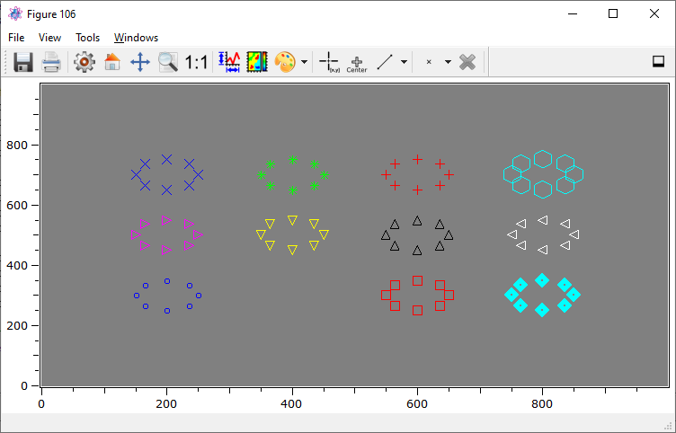

.. include:: ../include/global.inc

.. _plot-markers:

Markers in plots
**************************************************

Sometimes, it is required to place marker symbols in a plot canvas with subpixel precision. This can for instance be the case,
if detected features or calibration marks should be indicated in the plot. Currently, the Qwt-based plot plugins 
:ref:`itom1dqwtplot <itom1dqwtplot (1D)>` and :ref:`itom2dqwtplot <itom2dqwtplot (2D)>` support drawing markers.

It is possible to group one or multiple markers in one set that can be assigned a set name. Afterwards it is possible to also
delete single sets based on their name or to show the name of the set next to each marker. All markers in one set can have a certain color, shape
and size (in pixels). These three properties are given by one style-string of the following form:

.. code-block:: python
    :linenos:
    
    styleString = "CFS"
    #where C is the color character,
    #F is the form or shape character and
    #S is the size as pixel value (optional, default: 5px)
    
    #Additionally, the line width W can be set by
    styleString2 = "CFS;W" #default W = 1px
    

Colors can be:

======== =========== ======== ===========
Color    character   Color    character
======== =========== ======== ===========
Blue     b           Magenta  m
Green    g           Yellow   y
Red      r           Black    k
Cyan     c           White    w
======== =========== ======== ===========

The shapes can be:

=============== =========== =============== ===========
Symbol          character   Symbol          character
=============== =========== =============== ===========
Dot             .           Hexagon         h          
Circle          o           Plus            \+
Square          s           Star            \*
Diamond         d           Cross           x
Triangle right  >           Triangle left   <     
Triangle up     ^           Triangle down   v
=============== =========== =============== ===========

To put a set of markers to an existing plot handle, call the slot **plotMarkers** of the Qwt designer plugins:

.. code-block:: python
    
    plotHandle.call("plotMarkers", points, styleString [, setName])

Hereby, *points* is a *2xN*, float32, dataObject where the first row are the x-coordinates of the markers (in physical or scale
coordinates of the plot), and the second row are the y-coordinates. *setName* is an optional string as name for the added set of points.

.. note::
    
    If the origin of the variable *plotHandle* in the examples does not tell you something, just a reminder:
    The commands :py:meth:`itom.plot` and :py:meth:`itom.liveImage` return a tuple (index, plotHandle), where
    *index* is the figure index of the opened plot window and *plotHandle* is an instance of :py:class:`itom.plotItem` that
    is used to set properties of the plot, connect to its signals or call slots of the plot. Dedicated information about the features
    of a plot can be obtained by typing::
        
        plotHandle.info()

To delete an existing set of markers, use the slot **deleteMarkers**:

.. code-block:: python
    :linenos:
    
    plotHandle.call("deleteMarkers", setName) #delete markers within given set
    #or
    plotHandle.call("deleteMarkers") #delete all markers

An example with different style strings can be found in the demo script **demo/demoMarkers.py**:

.. code-block:: python
    :linenos:
    
    import numpy as np

    obj = dataObject.zeros([1000,1000])
    [nr,h] = plot(obj, "itom2dqwtplot")
    angles = np.arange(0, 2*np.pi, np.pi/4)
    circles = np.vstack([50 * np.sin(angles), 50 * np.cos(angles)])

    def move(points, centerX, centerY):
        output = dataObject(points).copy()
        output[0,:] += centerX
        output[1,:] += centerY
        return output

    #create various markers of different shapes. All markers sets represent a circle whose center is set to different positions.
    h.call("plotMarkers", move(circles,200,300), "b.", "blue, dot, default size: 5, default line width: 1")
    h.call("plotMarkers", move(circles,400,300), "go10", "green, circle") #equal to dot
    h.call("plotMarkers", move(circles,600,300), "rs10", "red, square")
    h.call("plotMarkers", move(circles,800,300), "cd10;5", "cyan, diamond, line width: 5")

    h.call("plotMarkers", move(circles,200,500), "m>10", "magenta, triangle right")
    h.call("plotMarkers", move(circles,400,500), "yv10", "yellow, triangle down")
    h.call("plotMarkers", move(circles,600,500), "k^10", "black, triangle up")
    h.call("plotMarkers", move(circles,800,500), "w<10", "white, triangle left")

    h.call("plotMarkers", move(circles,200,700), "bx10", "blue, x")
    h.call("plotMarkers", move(circles,400,700), "g*10", "green, star")
    h.call("plotMarkers", move(circles,600,700), "r+10", "red, plus")
    h.call("plotMarkers", move(circles,800,700), "ch20", "cyan, hexagon, size: 20")

    #delete the marker set with the name 'green, circle':
    h.call("deleteMarkers", "green, circle")
    
The result is as follows:

If you want to display the set-name next to each marker, set the property **markerLabelsVisible** to True:

.. code-block:: python
    
    plotHandle["markerLabelsVisible"] = True