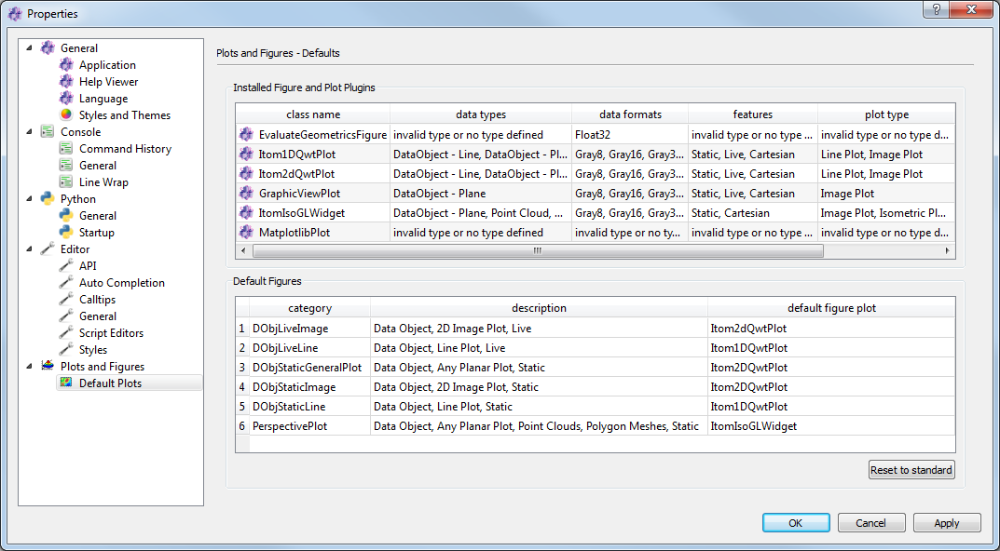

.. _plot-classes:

Plot classes and default plots
*******************************

Per default, itom comes with a set of various plot types allowing to show data as 1D line plot, 2D image plot with scaled colors,
2.5D isometric plot, 3D plot of point clouds and polygon meshes among others. However, itom is designed such that arbitrary plot
plugins can be created and integrated. Every plot plugin is programmed in a similar way than other itom plugins, but follows the
rules of a Qt designer plugin, such that the plot can also be integrated in user defined GUIs.

In order to keep this plot plugins organized, itom comes with a set of plot categories which define some common types of data and
visualization. Every plot plugin has to indicate the categories it belongs to and is able to show data that corresponds to the
requirements of a category. While it is possible to independently choose a plot plugin as argument of every plot command, it is also
possible to define default plot plugins for every category, such that these defaults are always chosen if a certain type of data
should be visualized without further information about the desired plot plugin.

A list of all available plot plugins can be found in the section **Plots and Figures >> Default Plots** of the :ref:`property dialog <gui-propertydialog>`
of itom.

The list **Installed Figure and Plot Plugins** list all plot plugins (library files within the folder **designer** of the itom build or
installation directory). Every row stands for one detected plot plugin with the following meaning:

* class name: This is the class name of the plot which can be used for instance in the commands :py:meth:`~itom.plot` or :py:meth:`~itom.liveImage` to select
   this plot plugin for visualizing the required data (if the plot plugin supports the given input data)
* data types: Data types, the plot plugin supports (e.g. *DataObject - Line*, *DataObject - Plane*, *Point Cloud* ...)
* data formats: The point type of a dataObject or pointCloud that is supported by the plot
* features: Features the plot plugin is able to display, for instance the type of coordinate system is indicated or if the plot is able to show static data or live data from grabbers, too.

If a library file in the **designer** folder does not appear in this list, it can have two reasons:

1. The library is a Qt designer plugin, but does not implement the interface for itom plot plugins. Then, it can be used as general widget in
   user defined GUIs, but not as plot class.
2. There might be any load issue (for instance, the plot plugin depends on other libraries that could not be found...). In this case, see
   the load state in the dialog **Loaded plugins** (menu **file** in the main window of itom).

In the second table (**Default figures**), there are six different categories together with the current default plot class that is used if input
data, that fits to a certain category, should be displayed and no specific plot class is indicated. To change the default plot class of any category, click the cell
in the last column and select a plot class from the displayed combo box. If no entry is visible in the combo box, no plot plugin is available, that pretends to support
the required features, data types and formats of the category.

Plot class selection
----------------------

If one of the commands :py:meth:`~itom.plot` or :py:meth:`~itom.liveImage` are used to visualize a static :py:class:`~itom.dataObject`, :py:class:`~itom.pointCloud` ... or
to show a live image of any camera, it is possible to let itom automatically choose the right plot class or one can select a plot class:

**Automatic selection**

If the commands are used without indicating the optional parameter *className*, itom analyzes the given data and tries to find the right category. Then, the plot
is opened with the corresponding default plot class. If no possible plot class could be found, an error is displayed.

**Plot class selection**

Set the optional parameter **className** to a specific *class name* of a plot plugin. If the data can be opened by this plot class (depending on data type, data format and features),
it is shown using the desired plot class. Else, the default plot class for the given type of data is used (a warning is displayed in this case). In the following example
a random 2D dataObject with *float32* is created and should be displayed using the plot class *itom2dqwtplot*. This is possible, since *itom2dqwtplot* is able to display dataObjects
in an image (plane) representation.

.. code-block:: python
    :linenos:

    data = dataObject.randN([124,124],'float32')
    plot(data, 'itom2dqwtplot')
    #the class name is case insensitive

**Category selection**

In order to simplify the selection of plot classes, it is also possible to use the abbreviations for some categories. Possible keywords are:

* '1d' for the categories *DObjLiveLine* or *DObjStaticLine* (hence displaying any live or static dataObject in a line plot with one or more lines)
* '2d' for the categories *DObjLiveImage* or *DObjStaticImage* (the same in a 2D image plot)
* '2.5d' for the category *PerspectivePlot* which visualizes dataObjects in a 2.5D representation (isometric plot)

In the following example, the dataObject with two rows should be visualized in a 1D plot, such that both rows are displayed as two lines. If the *className* parameter
would have been omitted, itom would have recognized the dataObject as 2D matrix and use the default plot from the category **DObjStaticImage** as plot plugin. Here,
the keyword '1d' forces itom to use the default from the category **DObjStaticLine** instead:

.. code-block:: python
    :linenos:

    data = dataObject.randN([2,200],'float32')
    plot(data, '1d')
