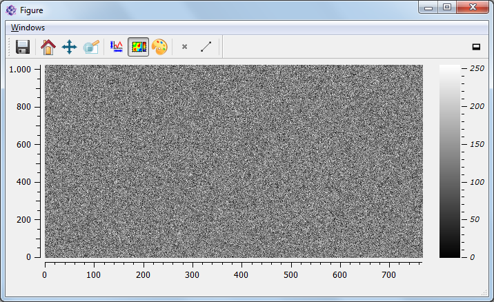
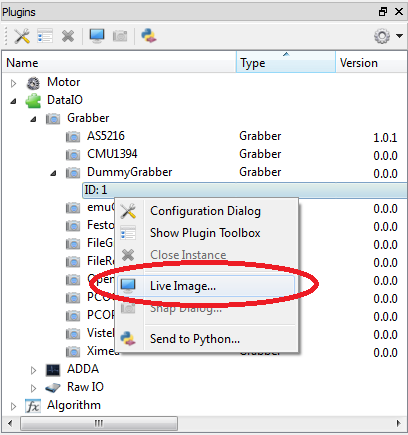

Quick tutorial to plots and figures
====================================

Plots of data objects
----------------------

The most common way to plot an arbitrary data object is the :py:meth:`~itom.plot` command contained in the module :py:mod:`itom`.

In the first example, we create an one-dimensional data object with random values (16bit, signed, fixed point precision) and simple want
to visualize this data object in a line plot. itom is able to recognize the type of plot you desire and uses the plot plugin which is
set to be default for this type of plot (static, line plot). The defaults can be set in the property dialog of itom.

.. code-block:: python
    
    data1d = dataObject.randN([1,100],'int16')
    plot(data1d)

.. note::
    
    Please consider that any one-dimensional data object is always exposed as two-dimensional data object, where the first (y) dimension is
    set to 1.

If you have various plot plugins available that can handle that type of data object, you can also force the plot command to use your
specific plugin, which is defined by its class name (see itom's property dialog for the class name). If the class name cannot be found
or is not able to plot the type of data object, itom falls back to the default plot plugin:

.. code-block:: python
    
    plot(data1d, "Itom1DQwtFigure")

The result of both examples can be like this:

.. figure:: images/plot1d.png
    :scale: 70%

Equivalent to the one-dimensional case, the following example shows how to simply plot a two-dimensional data object also using the command
:py:meth:`~itom.plot`.

.. code-block:: python
    
    data2d = dataObject.randN([1024,768],'uint8')
    plot(data2d)

Then, you obtain a figure that looks like this:

If you not only work with data objects but also with numpy

If the plot is opened in its own figure window, you have a dock-button in the toolbar on the right side. Click on this button in order to dock
the plot into the main window of itom.

Live images of cameras and grabbers
------------------------------------

itom is not only able to plot data objects but can also show live streams of connected and opened cameras. Cameras can be all plugins of type
dataIO that also have the grabber-type flag defined (see the section grabbers of your plugin toolbox in itom). If a live image of a specific camera
should be created, the following process is started:

1. The camera is asked for its parameters *sizex* and *sizey*. If one of these dimensions is equal to one, a live line image is opened, else a two-dimensional live image is opened.
2. The command :py:meth:`~itom.dataIO.startDevice` of the camera is called (idle command if the camera is already started)
3. A timer continuously triggers the image acquisition of the camera and sends the result to all currently connected live images. However the timer is not started or stopped whenever the auto-grabbing property of the camera is disabled. This is useful, if you are in the middle of measurement process. Then you don't want the timer to force the image acquisition but your process. Therefore, disable to auto-grabbing property before starting your measurement and reset it to its previous status afterwards. In any case, whenever any prcoess triggers an image acquisition, all results will always be sent to connected live images.
4. When the live plot is closed or deconnected, the command :py:meth:ìtom.dataIO.stopDevice` is called (this is again an idle command if the camera is still used by other live images or has been started by any python script and not stopped yet).

In the following example, the dummy grabber camera is started and the live image is opened using the command :py:meth:`~itom.liveImage`. The auto-grabbing property
is set to True (which is also the default case):

.. code-block:: python
    
    cam = dataIO("DummyGrabber")
    cam.setAutoGrabbing(True)
    liveImage(cam)

You can also show the live image of any camera using the GUI. Right-click on the opened camera instance in the plugin toolbox and choose **live image**:

Changing properties of plots
-----------------------------

Any plots have properties defined, which indicate the appearance or currently depicted data object or camera. To access these cameras you need to get the
instance of the plot or live image item. This is always an instance of the class :py:class:`~itom.plotItem`. This class is inherited by `~itom.uiItem` which
finally provides the access to the properties by the functionalities described in :ref:`qtdesigner`.

In order to access the necessary instance of :py:class:`~itom.plotItem`, you will see that the return value of the commands :py:meth:`~itom.plot` or :py:meth:`~itom.liveImage`
is a tuple consisting of a number of the overall figure (window), where the plot is print and of the requested instance as second value.

In the next example, the title of a two-dimensional data object plot is changed:

.. code-block:: python
    
    data2d = dataObject.randN([100,100])
    [idx,h] = plot(data2d)
    h["title"] = "new title"

.. note::
    
    Not all plot plugins have the same properties defined, since this also depends on their type and special features. However it is intended to use the same property names
    for the same meaning in the different plugins.

.. note::
    
    If the figure closed while you still have a reference to its instance, any method of this instance will raise an error saying that the plot does not exist any more.

In order to get a list of all properties of a plot, call the method :py:meth:`~itom.uiItem.info` of the plot instance. This method prints a list of available properties as well as
slots and signals.

.. code-block:: python
    
    h.info()

There are two other important properties that let you change the displayed data object or camera:

.. code-block:: python
    
    #set new data object
    h["source"] = dataObject.randN([100,100])
    
    #assign new camera
    h["camera"] = dataIO("DummyGrabber")

These properties are also the way to set the content of plot widgets, that are integrated in your user-defined GUIs.