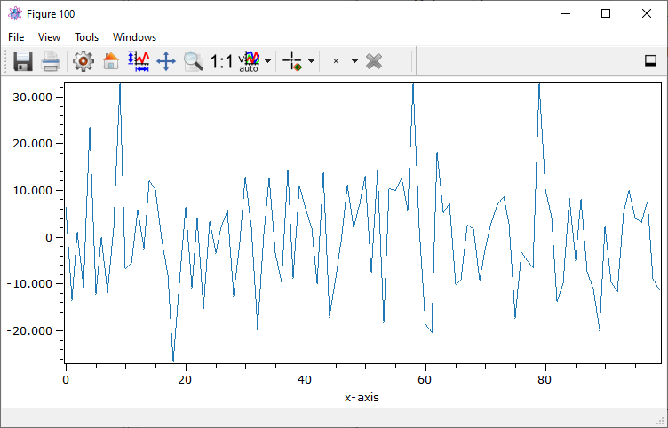
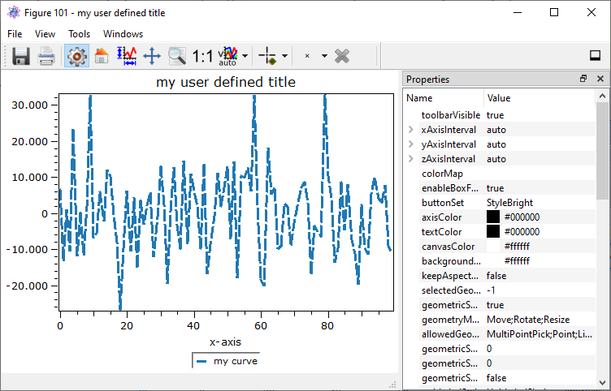
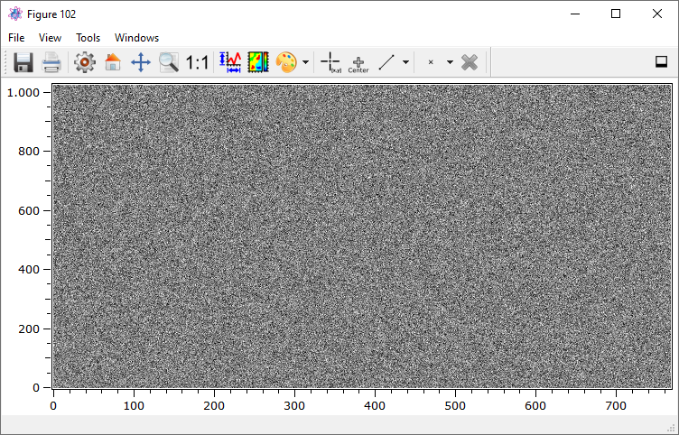

Quick tutorial to plots and figures
******************************************

Plots of data objects
==========================

The most common way to plot an arbitrary data object is the :py:meth:`~itom.plot` command contained in the module :py:mod:`itom`.

In the first example, we create an one-dimensional data object with random values (16bit, signed, fixed point precision) and then want
to visualize this data object in a line plot. itom is able to recognize the type of plot you desire and uses the plot plugin which is
set to be default for this type of plot (static, line plot). The defaults can be set in the :ref:`property dialog <gui-propertydialog>` of itom.

.. code-block:: python

    data1d = dataObject.randN([1,100],'int16')
    plot(data1d)

.. note::

    Please consider that any one-dimensional data object is always exposed as two-dimensional data object, where the first (y) dimension is
    set to 1.

If you have various plot plugins available that can handle that type of data object, you can also force the plot command to use your
specific plugin, which is defined by its class name (see itom's :ref:`property dialog <gui-propertydialog>` for the class name).
If the class name cannot be found or if it is not able to plot the type of data object, itom falls back to the default plot plugin (and prints a warning into the console):

.. code-block:: python

    plot(data1d, "itom1DQwtPlot") #case insensitive plot class name

The result of both examples looks like this (if no other default plot class has been chosen for 1D static plots):

Instead of writing the full class name of a plot plugin that you want to use, you can also set the parameter *className* to some short-hand aliases.
Depending on the alias, the default plot class (see itom's :ref:`property dialog <gui-propertydialog>`) is chosen. Possible aliases are:

* dataObject: **1D, 2D, 2.5D**
* pointCloud: **2.5D**
* polygonMesh: **2.5D**

Example:

.. code-block:: python

    plot(data1d, '1D') #plot data1d in default plot for 1D, static plots

In the following sections, you will see that any plot has various properties that can be set in the property dialog or using square brackets in Python. However, you can also
pass various properties to the :py:meth:`~itom.plot` command such that your customized plot is displayed.

.. code-block:: python

    plot(data1d, properties={"title":"my user defined title","lineWidth":3, \
         "lineStyle":"DashLine","legendPosition":"Bottom", \
         "legendTitles":"my curve"})

Then, the plot looks like thies:

Passing a dictionary with various properties works with all types of plots. However, the list of available properties might change and can be obtained either using the Python
command :py:meth:`~uiItem.info` or displaying the properties toolbox of the plot. For more information see also :ref:`PlotsProperties` below.

Equivalent to the one-dimensional case, the following example shows how to simply plot a two-dimensional data object also using the command
:py:meth:`~itom.plot`.

.. code-block:: python

    data2d = dataObject.randN([1024,768],'uint8')
    plot(data2d)

Then, you obtain a figure that looks like this:

If you not only work with data objects but also with numpy you can also pass numpy arrays to the :py:meth:`~itom.plot` command. An implicit shallow
copy in terms of a :py:class:`itom.dataObject` is then created and passed to the plots.

If the plot is opened in its own figure window, you have a dock-button in the toolbar on the right side. Click on this button in order to dock
the plot into the main window of itom.

Live images of cameras and grabbers
=========================================

itom is not only able to plot data objects but can also show live streams of connected and opened cameras. Cameras are implemented as plugins of type
dataIO that also have the grabber-type flag defined (see the section grabbers of your :ref:`plugin toolbox <gui-plugins>` in itom). If a live image of a specific camera
should be created, the following process is started:

1. The camera is asked for its parameters *sizex* and *sizey*. If one of these dimensions is equal to one, a live line image is opened, else a two-dimensional live image is opened.
2. The command :py:meth:`~itom.dataIO.startDevice` of the camera is called (idle command if the camera is already started)
3. A timer continuously triggers the image acquisition of the camera and sends the result to all currently connected live images. However the timer is not started or stopped whenever the auto-grabbing property of the camera is disabled. This is useful, if you are in the middle of measurement process. Then you don't want the timer to force the image acquisition but your process. Therefore, disable to auto-grabbing property before starting your measurement and reset it to its previous status afterwards. In any case, whenever any process triggers an image acquisition, all results will always be sent to connected live images.
4. When the live plot is closed or deconnected, the command :py:meth:`itom.dataIO.stopDevice` is called (this is again an idle command if the camera is still used by other live images or has been started by any python script and not stopped yet).

In the following example, the dummy grabber camera is started and the live image is opened using the command :py:meth:`~itom.liveImage`. The auto-grabbing property
is set to True (which is also the default case):

.. code-block:: python

    cam = dataIO("DummyGrabber")
    cam.setAutoGrabbing(True) #can be omitted if auto grabbing already enabled
    liveImage(cam)

The command :py:meth:`itom.liveImage` has almost the same arguments than :py:meth:`itom.plot`. You can also set a desired plot plugin using the argument *className*.
Similar to the command :py:meth:`itom.plot`, described above, there are also aliases available that describe the desired plot style of the camera's live image:

* dataObject: 1D, 2D

You can also show the live image of any camera using the GUI. Right-click on the opened camera instance in the plugin toolbox and choose **live image**:

.. figure:: images/liveImageGUI.png
    :scale: 100%
    :align: center

.. _PlotsProperties:

Properties of plots
=========================================

Any plots have properties defined, which indicate the appearance or currently depicted data object or camera. To access these cameras you need to get the
instance of the plot or live image item. This is always an instance of the class :py:class:`~itom.plotItem`. This class is inherited by `~itom.uiItem` which
finally provides the access to the properties by the functionalities described in :ref:`qtdesigner`.

In order to access the necessary instance of :py:class:`~itom.plotItem`, you will see that the return value of the commands :py:meth:`~itom.plot` or :py:meth:`~itom.liveImage`
is a tuple consisting of a number of the overall figure (window), where the plot is print and of the requested instance as second value.

In the next example, the title of a two-dimensional data object plot is changed:

.. code-block:: python

    data2d = dataObject.randN([100,100])
    [idx,h] = plot(data2d)
    h["title"] = "new title"

.. note::

    Not all plot plugins have the same properties defined, since this also depends on their type and special features. However it is intended to use the same property names
    for the same meaning in the different plugins.

.. note::

    If the figure closed while you still have a reference to its instance, any method of this instance will raise an error saying that the plot does not exist any more.

In order to get a list of all properties of a plot, call the method :py:meth:`~itom.uiItem.info` of the plot instance. This method prints a list of available properties as well as
slots and signals.

.. code-block:: python

    h.info()

There are two other important properties that let you change the displayed data object or camera:

.. code-block:: python

    #set new data object
    h["source"] = dataObject.randN([100,100])

    #assign new camera
    h["camera"] = dataIO("DummyGrabber")

These properties are also the way to set the content of plot widgets, that are integrated in your user-defined GUIs.

The properties can also be changed using the properties toolbox of each plot or live image that is accessible via the menu *View >> Properties*. Furthermore it is possible to directly
set some properties by passing a dictionary with all name, values pairs to the 'properties' argument of commands :py:meth:`~itom.plot` or :py:meth:`~itom.liveImage`:

.. code-block:: python

    plot(data2d, properties={"yAxisFlipped":True, "title":"My self configured plot"})

Tags and attributes of dataObjects in plots
===================================================

Many plots, especially the 1D and 2D plots (type *itom1dQwtPlot*, *itom2dQwtPlot*), can read several tags and attributes from the plotted dataObject. This is in detail:

1. The axes of the plot always show so called *physical units*. Their relationship to the pixel-coordinate system of a data object is defined by the scale and offset value
    of each axis. If the offset is 0 and the scale is 1 (default), both the physical and pixel unit is the same and the plot displays a data objects with axes beginning
    with zero::

        phys = (pix - offset) * scaling

2. The label of each axis is mainly defined by the properties **valueLabel**, **xAxisLabel** or **yAxisLabel**. If one of these properties is set to **<auto>** (default),
    the attributes **valueUnit**, **valueDescription**, **axisUnits** or **axisDescriptions** of the data object are requested. The style of the label is defined by the property
    **unitLabelStyle** ::

        obj = dataObject.zeros([10,10],'uint8')
        obj.axisUnits = ('mm','mm')
        obj.axisDescriptions = ('y','x')
        obj.valueUnit = ('rad')
        obj.valueDescription = 'phase'
        plot(obj, "2D", properties = {"unitLabelStyle":"UnitLabelKeywordIn"})

    If a property is set to something different than **<auto>**, the corresponding attribute from the data object is ignored and the property value is displayed instead.

3. Usually, the title of a plot is set by its property **title**. However, if **title** is set to **<auto>** (default), the tag-space of the data object is searched for a tag
    with the keyword **title**. If this is given, the title-tag is displayed::

        obj = dataObject.zeros([10,10],'complex64')
        obj.setTag("title", "complex object")
        print("title-tag:", obj.tags["title"])
        plot(obj, "2D")

    If the title property is set to something different than **<auto>**, the tag is ignored and the value of the property is displayed as title.
