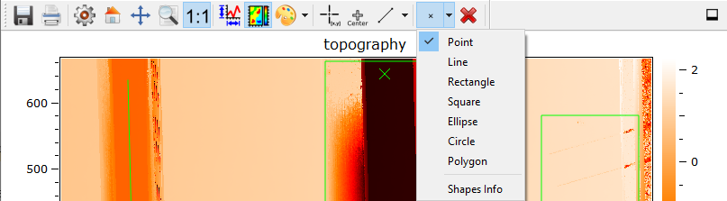
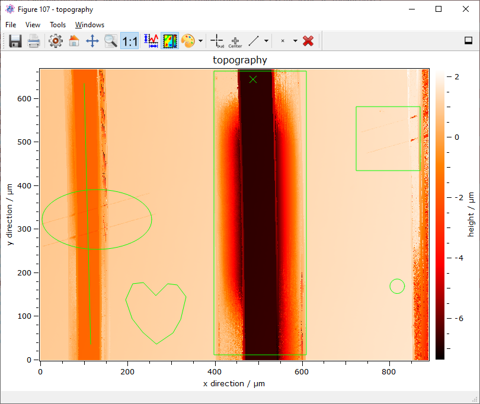

.. include:: ../include/global.inc

.. _primitives:

**Primitives** - Marking and Measuring
==============================================

The plot-widgets itom1DQwtPlot and itom2DQwtPlot supports plotting of geometric primitives by user interaction and script language.
This section will give a short introduction about ploting, read- /write-functions and the correspondig plots and the internal geometric element structure.

At last the evaluateGeomtrics-plugin for direct evaluation of geometric elements is introduced.

Drawing items into a QWT-Plot
----------------------------------------------

The plot functionality can be accessed by three different ways. The first way is the GUI based approach by which the user presses the 
"switch draw mode"-button in the button-bar of the plot. The button represents the current item to be plotted. 
The red X ("clear button") will delete all geometric elements within the plot either drawn by hand or by script.

At the moment "itom" only supports "point", "line", "rectanlge" and "ellipse" but further items, e.g. "circle" and "polygons", are in preparation. 
To draw an item simply click into the image space and left-click the mouse. 
In case of elements with at least more than a marker, you can now set the size of the element by setting the second point by left-clicking again.
During plotting a green lined geometric element appears. After finishing the element color turns to the first inverse 
color of the current color palette with handles (diamonds or sqares) colored with the second inverse color of the current palette.
    

After creation the geometric elements can be editied by left-clicking one of the element handles  which becomes high-lighted (squares) and moving the mouse.
By pressing the "ctrl"-button during mouse-movement the element resize behavior will be changed depending on the element type. 
Lines will be changed to horizontal or vertical alignment.
Rectangles and ellipses will be become squares or circles according to plot coordinates (x/y-space) and not pixel coordinates. 
To avoid confusion with plot aspect, a button for fixed axis aspect ratio ("1:1") was added to the plot bar.

Scipt based pick and plot from / to a QWT-widget
---------------------------------------------------------

To allow more complex user interaction with scripts, e.g. script based element picking, the plot functionality can be started by script either blocking or non-blocking.

.. code-block:: python
    
    myImage = dataObject.randN([200, 200], 'float32')    
    [number, handle] = plot(myImage, "itom2dQwtPlot")
    
    # Blocking access which return the values for a single point in myElement
    # Structure will be dataObject([8, 1], 'float32') with [[idx], [type], [x], [y], [0], [0], [0],[0]]
    myElement = dataObject()
    handle.drawAndPickElements(101, myElement, 1) 
    
    # None blocking plot
    # Structure will be dataObject([1, 11], 'float32') with [idx, type, x, y, 0, 0, 0, 0]
    handle.call("userInteractionStart", 101, True, 1)
    
    # --> Read out later after plot is finished
    myGeometry = handle["geometricElements"]
    
    
The blocking code will wait until the selection is done or the selection was aborted by user and will than return the corresponding object.
The non-blocking code will return directly. To access the geometric elements the corresponding "signal" for userInteractionDone should be used to noticed
the end of the user interaction.

The geometric elements can also be set by script by calling the corresponding slot.

.. code-block:: python
    
    myImage = dataObject.randN([200, 200], 'float32')    
    [number, handle] = plot(myImage, "itom2dQwtPlot") 
    
    # Add the marker to the plot
    # marker is filled according to marker style definition
    marker = dataObject([8,1],'float32', data = [101.0, 1.0, 5.0, 6.0, 0.0, 0.0, 0.0, 0,0])
    handle.call("plotMarkers", marker, "b", "")

    # Delete all marker and than plot new marker
    # marker is filled according to marker style definition
    myGeometry = dataObject([1,11],'float32', data = [101.0, 1.0, 5.0, 6.0, 0.0, 0.0, 0.0, 0,0, 0.0, 0.0, 0.0])
    handle["geometricElements"] = myGeometry
  
The geometric elements can be read any time using the property "geometricElements".

.. code-block:: python
    
    # Reading geometric elements
    myGeometry = handle["geometricElements"]

The object "myGeometry" consists of all geometric elements with in the plot. Each row corresponds to one geometric element while the parameters for each element are align column-wise.
This kind of reading differs from the blocking-variant ("drawAndPickElements"). The blocking-variant returns only the data created during the current function call and ignores old geometric elements.
In this case the elements are aligned column-wise. This means each column corresponds to on element while its data is stored along the rows. 
For the differernt definitions of the geometric elements see section "Indexing of Geometric Elements".

Implemented Functions, Signals and Slots
----------------------------------------------

The Qwt-plot widgets functions had to be updated. The Qwt-Widgets got the folling properties, respectivly setter- / getter-functions related to plotting:

*  "geometricElementsCount",    get the number of geometric elements in this plot, READONLY
*  "keepAspectRatio",           enable or disable a fixed aspect ratio of 1:1 for the plot canvas.
*  "enablePlotting",            enable and disable plotting toolbar
*  "selectedGeometry",          set / get the current selected geometric element

In complete theses the functionality of the drawing interface, the following slots have been added to the widgets:

*  "plotMarkers"                Add markers and geometric elements to plot according to dataObject and style type. For geometric "style is not used", type in "b".
*  "userInteractionStart"       Start a non-blocking user interaction for "multipointpick" ord geometric elements with element count.
*  "clearGeometricElements"     Delete all existing geometric elements within the plot

To register changes in the plot elements and finished user interactions, the following signals where implemented:

*  "userInteractionDone",       Emitted, when user interaction is finished or aborted
*  "plotItemChanged",           Emitted, when a geometric element was changed and changing is finished. Not fully Python-Compatible.
*  "plotItemDeleted",           Emitted, when a specific plot item is deleted
*  "plotItemsDeleted",          Emitted, when all plot items are deleted
*  "plotItemsFinished",         Emmited, when the plotting function is finished, similar to userInteractionDone

For the blocking connection the plotItem-class got the additional function drawAndPickElements(type, dataObject, count), see py:class:`~itom.plotItem`. 

Indexing for Geometric Elements
----------------------------------------------

The definition of the geometric elements depends on the implementation. The "plotMarker" and its corresponding getter- / setter-function uses a Matlab orientated structure.
The structure a dataObject with 8 rows and n columns where n depends on the number of elements. 
Points are defined by their location, while ellipses and rectangles are defined by their diagonal edges.

The "geometricElements"-property uses geometric elements in a more mathematical oriantated description. The dataObject stucture is defined as "float32" with n by 11 elements.
Most setter functions also support "float32" elements. Each of the n rows corresponds to an elements (except polygon-shapes). The indexing follows the geometricPrimitive-struct in c++.

The geometricPrimitive is a struct within the c-Stuctur of the programm designed for exchanging the geometric elements from plots to other elements.
The structur can be used rowise as dataObject or float32-lists

At the moment only tPoint, tLine, tEllipse and tRectangle are supported.

The cells contain:

1. The unique index of the current primitive, castable to int32 with a maximum up to 16bit index values

2. Type flag 0000FFFF and further flags e.g. read&write only FFFF0000

3. First coordinate with x value

4. First coordinate with y value

5. First coordinate with z value
    

All other values depends on the primitiv type and may change between each type.

* A point is defined as idx, flags, centerX0, centerY0, centerZ0
* A line is defined as idx, flags, x0, y0, z0, x1, y1, z1
* A ellipse is defined as idx, flags, centerX, centerY, centerZ, r1, r2
* A circle is defined as idx, flags, centerX, centerY, centerZ, r
* A rectangle is defined as idx, flags, x0, y0, z0, x1, y1, z1, alpha
* A square is defined as idx, flags, centerX, centerY, centerZ, a, alpha
* A polygon is defined as idx, flags, posX, posY, posZ, directionX, directionY, directionZ, idx, numIdx

.. toctree::
   :hidden:

.. doxygenclass:: ito::PrimitiveContainer
	:project: itom
	:members:
    
    
Evaluation of Geometric Elements 
----------------------------------------------

The evaluateGeomtrics-widget is designed to load geometric definition stored in a float32 dataObject with a column-size of >10 elments and a row for each geometric element to display.
Further more it allows the evaluation of geometric relations between the geometric primitives. See section :ref:`listCustomDesignerWidgets` for the widget description.

Demo Scripts and Examples 
----------------------------------------------

- **uiMeasureToolMain.py**
  
  | *Description*: Advanced GUI which enables geometric plotting and measurements within a 2D-QWT-Plot. This file shows how to auto-connect to signals and how to use buttons. The corresponding ui-file is uiMeasureToolMain.ui.

- **demoPickPointsAndMarkers.py**
  
  | *Description*: Demo for picking & plotting points and picking & plotting ellipses.

