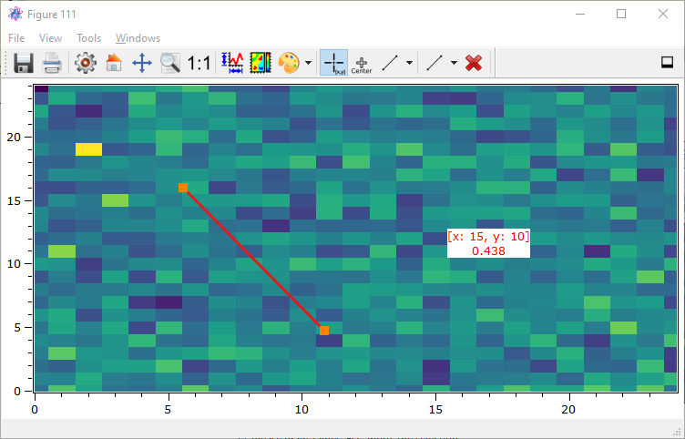
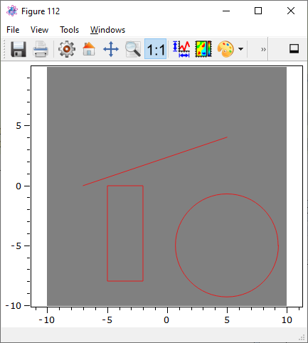

.. include:: ../include/global.inc

.. _plot-shapes:

Geometric shapes in 1D and 2D plots
******************************************

The Qwt-based plot plugins :ref:`itom1dqwtplot <itom1dqwtplot (1D)>` and :ref:`itom2dqwtplot <itom2dqwtplot (2D)>` support drawing
geometric shapes with sub-pixel precision onto the plot canvas. These shapes can be added either by the mouse clicks on the canvas or
by script commands. Each shape is represented by the class :py:class:`~itom.shape`. Depending on optionally flags of each shape, it is
then possible to resize or move it my the mouse, too. The following subset of :py:class:`~itom.shape` is currently supported by both plot types:

* Point or Multipoint
* Line (connecting a start with an end point)
* Rectangle (alignment parallel to plot axes)
* Square (alignment parallel to plot axes, both side lengths are equal)
* Ellipse (alignment parallel to plot axes)
* Circle (alignment parallel to plot axes)

In this section, you will learn about the different possibilities how to put shapes onto the canvas, how to configure this process, how to
modify such shapes and how to get information about the type, position and form of the shapes that are currently drawn.

.. note::
    
    The content of this chapter is only applicable to plots created from the figure classes :ref:`itom1dqwtplot <itom1dqwtplot>` or :ref:`itom2dqwtplot <itom2dqwtplot>`

Add shapes at any time by mouse
======================================

It is possible to add single shapes by mouse clicks. Before adding a new shape, you have to chose the desired shape from the menu in the
toolbar or menu **Tools** of the plot:

Then, click somewhere on the canvas to mark a start point and release the mouse button at the end point. If at least one shape is placed at the canvas,
the button to clear all shapes becomes enabled, such that a click on this button will remove all shapes (independent on their types).

It is possible to disable the ability to add shapes at any time by user interaction. This is controlled by the property **geometricShapesDrawingEnabled** of the plot.
Additionally, it is possible to restrict the allowed types of shapes to few types by setting another bitmask to the property **allowedGeometricShapes**.

In the following example, a new 2D plot is opened and configured such that the user can only draw Squares and Circles to the canvas:

.. code-block:: python
    :linenos:
    
    [id, handle] = plot(dataObject.randN([25,25],'float32'), 'itom2dqwtplot')
    #if the figure class itom2dqwtplot is the default class for static, 
    #2d plots of dataObjects, the argument 'itom2dqwtplot' is not required
    #in the plot command above
    
    handle["geometricShapesDrawingEnabled"] = True
    handle["allowedGeometricShapes"] = "Square;Circle"
    
.. note::
    
    If you add a square or circle to the canvas, it might be, that the shape might seem not to have the same edge lengths, since the coordinate system for shapes
    is always the coordinate system of the plot axes, mainly defined by the physical coordinates of the displayed :py:class:`~itom.dataObject`. This might differ from
    the single pixels in a dataObject if its attributes :py:attr:`~itom.dataObject.axisScales` or :py:attr:`~itom.dataObject.axisOffsets` are unequal to 1.0 and 0.0 respectively.
    
Add shapes by mouse upon script request
============================================

Independent of the method above, it is possible to force a user to draw a given number and given type of geometric shapes onto the canvas.
This is possible even if the property **geometricShapesDrawingEnabled** is set to False, such that no shapes can be added by clicking any option in the toolbar or menu.

There are two different possibilities how to force the user to add new shapes to the canvas:

1. **Modal user interaction**
    
    The user is forced to draw one or more shapes onto the canvas by a specific command in Python. The script execution is blocked until the requested number of shapes
    has been added (or the user interrupted the script or pressed the Esc key). All new shapes are immediately returned to the script for further processing.

2. **Non-modal user interaction**
    
    The user can be forced to draw one or more shapes onto the canvas by a script command. However, the script does not wait and immediately continues with the execution. Once
    the user has finished adding the required number of shapes or aborted it, a signal is emitted from the plot. In the script, a Python method should be connected to that signal before
    starting the user interaction.

The modal implementation is done by the command :py:meth:`~itom.plotItem.drawAndPickElements`. This is a general method of the class :py:class:`~itom.plotItem`, but it is only implemented for some
plot widgets. The returned plot handle of the commands :py:meth:`~itom.plot` or :py:meth:`~itom.liveImage` is always an instance of :py:class:`~itom.plotItem`. However, if the plot widget is
integrated in an user interface, the reference to every widget is only given in terms of the base class :py:class:`~itom.uiItem`. You can however savely cast the given handle to a plot widget
of itom to :py:class:`~itom.plotItem` in oder to get access to the method :py:meth:`~itom.plotItem.drawAndPickElements` (see the demo script *ui/uiShapeDemo.py* for an example about this).

In the following example, the user is forced to draw two rectangles onto the canvas and then a masked dataObject is plotted in a new window:

.. code-block:: python
    :linenos:
    
    image = dataObject.randN([25,25],'float32')
    [id, handle] = plot(image, 'itom2dqwtplot')
    shapes = handle.drawAndPickElements(shape.Rectangle, 2)
    #if the interaction is aborted (e.g. by key Esc), a RuntimeError is thrown
    
    print("Rectangle 1:", shapes[0])
    print("Rectangle 2:", shapes[1])
    maskedObject = image.createMask(shapes)
    plot(maskedObject, properties={"title":"Masked object"})
    
If the script execution should not be blocked after the user has been forced to add some shapes, you have to start the process by the slot **userInteractionStart**. In order to get
informed about added shapes or the process being finished, you have to previously connect to one or multiple signals that are appropriate to your needs. The signal that is emitted
at the end of the user interaction or if the user aborted it by pressing the Esc key on the plot, has the name **userInteractionDone**. In the following example, the user is forced
to draw three lines. At the end, the method **finished** is called:

.. code-block:: python
    :linenos:
    
    def interactionDone(shapeType, aborted, newShapes):
        if aborted:
            print("The user cancelled the creation of new shapes")
        else:
            print("The user added the following shapes:", str(newShapes))

    image = dataObject.randN([25,25],'float32')
    [id, handle] = plot(image, 'itom2dqwtplot')
    handle.connect("userInteractionDone(int,bool,QVector<ito::Shape>)", interactionDone)
    handle.call("userInteractionStart", shape.Line, True, 3)

The plot might look like the following image after having added the first line:

    
It is also possible to abort a non-modal user interaction by the slot **userInteractionStart** with **-1** as first argument. This allows interrupting this process for instance by clicking
a cancel button:

.. code-block:: python
    :linenos:
    
    handle.call("userInteractionStart", -1, False)
    #-1 signifies: no type to draw
    #False signifies: abort an user interaction
    
Add or edit shapes by script
=============================

There are various properties and slots available, that allow setting one or multiple shapes, editing existing shapes, deleting shapes or replace all shapes by a new sequence of shapes.
For most of these operations it is necessary to create the required instances of :py:class:`~itom.shape` before setting a property of calling a slot. The simplest way to set a sequence
of shapes that replace all existing shapes and are displayed in the coordinate system of the plot's axes, is to assign the shapes to the property **geometricShapes**. In the following
example, a rectangle, a line and a circle are placed onto the canvas (the dataObject has got a scaling factor of *0.1* as well as an offset of *100* in both the x- and y-axis):

.. code-block:: python
    :lineos:
    
    data = dataObject.zeros([200,200],'uint8')
    data.axisScales=(0.1,0.1)
    data.axisOffsets = (100,100)
    [idx,handle] = plot(data)

    #rectangle and line are defined by the two opposite corner points
    rectangle = shape(shape.Rectangle, (-5,-8), (-2,0))
    line = shape(shape.Line, (-7,0), (5,4))
    #circle is defined by its center point and the edge length
    circle = shape(shape.Circle, (5,-5), 4.3)
    handle["geometricShapes"] = (rectangle, line, circle)

The result looks like the following image:

.. note::
    
    You can only shapes by script whose type is contained in the bitmask of the property **allowedGeometricShapes**. Per default, all supported shape types are allowed.
    
The current set of shapes, that are placed at the canvas of a plot, is requested by the same property **geometricShapes**:

.. code-block:: python
    
    shapes = handle["geometricShapes"]
    #shapes is a tuple of shape
    plot("There are", len(shapes), "shapes on the canvas")

Every instance of :py:class:`~itom.shape` can have an optional :py:attr:`~itom.shape.index` value. Per default, this is set to **-1** (undefined). Once you place a shape on the canvas,
its index is checked. If the shape has the default index **-1**, an auto-incremented index is assigned to the shape of the plot. This is then obtained in the tuple of shapes, returned
by the property **geometricShapes**. Using this index allows modifying or deleting this single shape. If the assigned shape already has a valid index (>= 0), this index is untouched but still unique.
Whereas the slot **updateGeometricShape** replaces an existing shape with the same index by the given new shape, the slot **addGeometricShape** will raise a RuntimeError if the valid index of
the new shape already exists on the canvas.

To move the rectangle, assigned in the example above, it is possible to use the following snippet:

.. code-block:: python
    :lineos:
    
    shapes = handle["geometricShapes"]
    rectangle = shapes[0]
    print("Rectangle has index", rectangle.index)
    #translate the rectangle by x=6 and y=4.5 in axis coordinates
    rectangle.translate([6, 4.5])
    print("Rectangle has index", rectangle.index)
    print("The corner points are:", rectangle.point1, rectangle.point2)
    handle.call("updateGeometricShape", rectangle)

To clear the rectangle, execute:

.. code-block:: python
    :linenos:
    
    handle.call("deleteGeometricShape", rectangle.index)
    

Signals connected to shape manipulations
=========================================

Whenever a geometric shape is added, modified or removed from the canvas (independent on the method), the plot emits various signals. You can connect methods to
one or multiple signals in order to react on these events. For more information about available signals, see the references for the :ref:`itom1dqwtplot <1D>` and :ref:`itom2dqwtplot <2D>` plot.

Modify or select shapes by mouse
=================================

Per default, you can select a single geometric shape by clicking anywhere on its contour. Then, the line width of the contour becomes thicker and small, active
areas are displayed at some corner points (comparable to shapes in Word, Inkscape,...). See the following image for an example of a select shape:

The index of the currently selected shape can be obtained by the property **selectedGeometricShape**. This is the index of the shape and must not always correspond to the index-position
of the shape in the tuple returned by the property **geometricShapes**.

It is possible to move a shape by clicking somewhere on the contour and releasing the mouse button at the new location. To modifiy the size of the shape, drag one of the active
areas to a new location. 

It is not only possible to modifiy the available shapes, but you can also control whether the user is allowed to do a move or resize operation. This can be done either globally for
the plot and then all existing and future shapes or it can be done selectively for every shape. For the global control, set the bitmask of the plot property **geometryModificationModes**.
In the following example, move operations and resize operations should be globally allowed for all shapes:

.. code-block:: python
    :linenos:
    
    handle["geometryModificationModes"] = "Resize;Move"
    
Besides the global modification settings, every shape can be also controlled with respect to its modification. However, if for instance a move-modification is globally forbidden, no shape
can be moved independently on their settings. The modification settings for every shape are controlled by the attribute :py:attr:`~itom.shape.flags`. It is a bitmask of the three possible
values:

* shape.MoveLock
* shape.ResizeLock
* shape.RotateLock

The following example is the same than above, however the rectangle can only be moved while the circle can only be resized. The line can be both moved and resized:

.. code-block:: python
    :lineos:
    
    data = dataObject.zeros([200,200],'uint8')
    data.axisScales=(0.1,0.1)
    data.axisOffsets = (100,100)
    [idx,handle] = plot(data)

    #rectangle and line are defined by the two opposite corner points
    rectangle = shape(shape.Rectangle, (-5,-8), (-2,0))
    rectangle.flags = shape.ResizeLock | shape.RotateLock

    line = shape(shape.Line, (-7,0), (5,4))
    line.flags = 0 #all allowed

    #circle is defined by its center point and the edge length
    circle = shape(shape.Circle, (5,-5), 4.3)
    circle.flags = shape.MoveLock | shape.RotateLock

    handle["geometricShapes"] = (rectangle, line, circle)

.. note::
    
    Any kind of rotation is currently not supported.