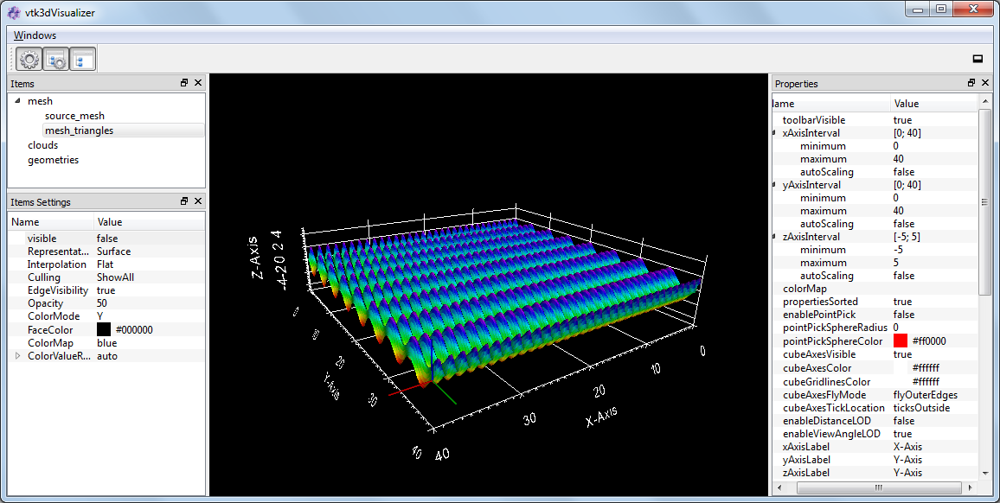

.. _plot-3d:

3D plot
*********************

Vtk3dVisualizer
==========================

The **Vtk3dVisualizer** designer plugin can be used to display arbitrary point clouds, polygonal meshes or geometric shapes like
cylinders, spheres, pyramids, lines or cubes in one 3D plot. The first point cloud or polygonal mesh is plotted using the 
default :py:meth:`~itom.plot` command. Further items are added, updated or removed by several slots that are defined and can be
called using the method :py:meth:`~itom.ui.call`.

Every item on the canvas is listed in a tree view representation using the optional name of each item. Additionally, every item
can be configured independently (for more information see the example **demo/plot/demoVtk3dVisualizer.py** or **demo/plot/cloudAndMeshVisualization.py**.

    
Examples about the Vtk3dVisualizer plot can be found in the folder **demo/plot**.

.. note::
    
    Newer versions of VTK (compiled with OpenGL 2) might not work via a remote desktop connection under Windows, since newer OpenGL
    standards are not supported by remote desktop.

.. BEGIN The following part is obtained by the script plot_help_to_rst_format.py from the designer plugin vtk3dvisualizer
..       Before starting this script, disable the long-line wrap mode in the console / line wrap property page of itom.

Properties
-------------------------

.. py:attribute:: cameraFocalPoint : seq. of 3 floats 
    :noindex:
    
    focal point of the camera

.. py:attribute:: cameraView : seq. of 3 floats 
    :noindex:
    
    view direction of the camera

.. py:attribute:: cameraPosition : seq. of 3 floats 
    :noindex:
    
    position of the camera

.. py:attribute:: coordSysPos : seq. of 3 floats 
    :noindex:
    
    position of the coordinate system

.. py:attribute:: parallelProjection : bool 
    :noindex:
    
    if true a parallel projection is used, else the perspective projection

.. py:attribute:: coordSysVisible : bool 
    :noindex:
    
    sets the visibility of a coordinate system

.. py:attribute:: coordSysScale : float 
    :noindex:
    
    sets the length / scaling of the coordinate axes

.. py:attribute:: stereoType : Stereo 
    :noindex:
    
    sets the stereo type of the canvas
    
    The type 'Stereo' is an enumeration that can have one of the following values (str or int):
    
    * 'No' (0)
    * 'CrystalEyes' (1)
    * 'RedBlue' (2)
    * 'Interlaced' (3)
    * 'Left' (4)
    * 'Right' (5)
    * 'Dresden' (6)
    * 'Anaglyph' (7)
    * 'Checkerboard' (8)

.. py:attribute:: showFPS : bool 
    :noindex:
    
    shows the FPS counter or not

.. py:attribute:: backgroundColor : color str, rgba or hex 
    :noindex:
    
    background color of the canvas

.. py:attribute:: zAxisMinorTickVisibility : bool 
    :noindex:
    
    Sets the visibility of minor ticks along the z-axis.

.. py:attribute:: yAxisMinorTickVisibility : bool 
    :noindex:
    
    Sets the visibility of minor ticks along the y-axis.

.. py:attribute:: xAxisMinorTickVisibility : bool 
    :noindex:
    
    Sets the visibility of minor ticks along the x-axis.

.. py:attribute:: zAxisTickVisibility : bool 
    :noindex:
    
    Sets the visibility of major ticks along the z-axis.

.. py:attribute:: yAxisTickVisibility : bool 
    :noindex:
    
    Sets the visibility of major ticks along the y-axis.

.. py:attribute:: xAxisTickVisibility : bool 
    :noindex:
    
    Sets the visibility of major ticks along the x-axis.

.. py:attribute:: zDrawGridlines : bool 
    :noindex:
    
    Sets the visibility of gridlines along the z-axis.

.. py:attribute:: yDrawGridlines : bool 
    :noindex:
    
    Sets the visibility of gridlines along the y-axis.

.. py:attribute:: xDrawGridlines : bool 
    :noindex:
    
    Sets the visibility of gridlines along the x-axis.

.. py:attribute:: zAxisVisible : bool 
    :noindex:
    
    Sets the visibility of the z-axis.

.. py:attribute:: yAxisVisible : bool 
    :noindex:
    
    Sets the visibility of the y-axis.

.. py:attribute:: xAxisVisible : bool 
    :noindex:
    
    Sets the visibility of the x-axis.

.. py:attribute:: zAxisLabel : str 
    :noindex:
    
    Label of the z-axis.

.. py:attribute:: yAxisLabel : str 
    :noindex:
    
    Label of the y-axis.

.. py:attribute:: xAxisLabel : str 
    :noindex:
    
    Label of the x-axis.

.. py:attribute:: enableViewAngleLOD : bool 
    :noindex:
    
    If enabled the actor will not be visible at a certain view angle

.. py:attribute:: enableDistanceLOD : bool 
    :noindex:
    
    If enabled the actor will not be visible at a certain distance from the camera

.. py:attribute:: cubeAxesTickLocation : TickLocation 
    :noindex:
    
    defines the location of ticks for the cube axes
    
    The type 'TickLocation' is an enumeration that can have one of the following values (str or int):
    
    * 'ticksInside' (0)
    * 'ticksOutside' (1)
    * 'ticksBoth' (2)

.. py:attribute:: cubeAxesFlyMode : FlyMode 
    :noindex:
    
    defines how the cube axes are positioned depending on the current camera
    
    The type 'FlyMode' is an enumeration that can have one of the following values (str or int):
    
    * 'flyOuterEdges' (0)
    * 'flyClostestTriad' (1)
    * 'flyFurthestTriad' (2)
    * 'flyStaticTriad' (3)
    * 'flyStaticEdges' (4)

.. py:attribute:: cubeGridlinesColor : color str, rgba or hex 
    :noindex:
    
    sets the color of the cube gridlines

.. py:attribute:: cubeAxesColor : color str, rgba or hex 
    :noindex:
    
    sets the color of the cube axes

.. py:attribute:: cubeAxesVisible : bool 
    :noindex:
    
    Overall visibility of the cube axes (must be set to True in order to see grids, labels, axes...)

.. py:attribute:: pointPickSphereColor : color str, rgba or hex 
    :noindex:
    
    Color of the possible sphere of the point pick event (see pointPickShereRadius and enablePointPick)

.. py:attribute:: pointPickSphereRadius : float 
    :noindex:
    
    If > 0, a sphere with the given radius is printed around the center point of the point pick event (if enabled)

.. py:attribute:: enablePointPick : bool 
    :noindex:
    
    if True, a click to any point of the canvas emits the signal pointPicked that emits the currently clicked 3d coordinate and the index of the closest point of the cloud / mesh that has been given as pickPointCloud or pickMesh.

.. py:attribute:: propertiesSorted : bool 
    :noindex:
    
    sort the properties of one item in an alphabetical order or not

.. py:attribute:: colorMap : str 
    :noindex:
    
    Color map (string) that should be used to colorize a non-color data object.

.. py:attribute:: zAxisInterval : autoInterval 
    :noindex:
    
    Sets the visible range of the displayed z-axis (in coordinates of the data object) or (0.0, 0.0) if range should be automatically set [default].

.. py:attribute:: yAxisInterval : autoInterval 
    :noindex:
    
    Sets the visible range of the displayed y-axis (in coordinates of the data object) or (0.0, 0.0) if range should be automatically set [default].

.. py:attribute:: xAxisInterval : autoInterval 
    :noindex:
    
    Sets the visible range of the displayed x-axis (in coordinates of the data object) or (0.0, 0.0) if range should be automatically set [default].

.. py:attribute:: polygonMesh : QSharedPointer<ito::PCLPolygonMesh> 
    :noindex:
    
    Sets the input polygon mesh for this plot.

.. py:attribute:: pointCloud : QSharedPointer<ito::PCLPointCloud> 
    :noindex:
    
    Sets the input point cloud for this plot.

.. py:attribute:: dataObject : dataObject 
    :noindex:
    
    Sets the input data object for this plot.

.. py:attribute:: renderLegend : bool 
    :noindex:
    
    If this property is true, the legend are included in pixelmaps renderings.

.. py:attribute:: contextMenuEnabled : bool 
    :noindex:
    
    Defines whether the context menu of the plot should be enabled or not.

.. py:attribute:: toolbarVisible : bool 
    :noindex:
    
    Toggles the visibility of the toolbar of the plot.

Slots
-------------------------

.. py:function:: setPickPointMesh(mesh) [slot]
    :noindex:
    
    
    set mesh for pick point event. The cloud of the mesh is used only (arguments: mesh)
    

.. py:function:: setPickPointCloud(pcl) [slot]
    :noindex:
    
    
    set cloud for pick point event. Nearest point from the position of the cursor (x,y,z) position is searched (arguments: cloud)
    

.. py:function:: setItemProperty(name, property, value) [slot]
    :noindex:
    
    
    set the property of an item (arguments: key, property-name, value)
    

.. py:function:: setGeometriesPosition(names, positions) [slot]
    :noindex:
    
    
    changes the position of various geometries (arguments: list of keys, list of (pos_x, pos_y, pos_z)
    

.. py:function:: setGeometryPose(name, translation, rotation) [slot]
    :noindex:
    
    
    moves and/or rotates a given geometry (arguments: key, (t_x, t_y, t_z), (r_x, r_y, r_z)
    

.. py:function:: deleteGeometry(name) [slot]
    :noindex:
    
    
    delete the geometry with key
    

.. py:function:: deleteMesh(name) [slot]
    :noindex:
    
    
    delete the mesh with key
    

.. py:function:: deletePointCloud(name) [slot]
    :noindex:
    
    
    delete the cloud with key
    

.. py:function:: updateText(text, x, y, fontsize, name, color, rgba or hex, createIfNotExists) [slot]
    :noindex:
    
    
    updates or creates new 2d text (arguments: text, x, y, fontsize, key, color = white, createIfNotExists = false)
    

.. py:function:: addText(text, x, y, fontsize, fullname, color, rgba or hex) [slot]
    :noindex:
    
    
    add a 2d text to a specific position (arguments: text, x, y, fontsize, key, color = white)
    

.. py:function:: addPolygon(points, fullname, color, rgba or hex) [slot]
    :noindex:
    
    
    adds a 2d polygon (arguments: points, key, color = white) where points is a Mx3 data object where each line is the (x,y,z) coordinate of a point of the polygon. The point values will internally be converted to float32.
    

.. py:function:: addSphere(point, radius, fullname, color, rgba or hex) [slot]
    :noindex:
    
    
    add a sphere (arguments: [center_x, center_y, center_z], radius, key, color = red]).
    

.. py:function:: addLines(points, fullname, color, rgba or hex) [slot]
    :noindex:
    
    
    add m lines to the canvas. The coordintates are given by a float32 data object [m x 6] where one row is (x0,y0,z0,x1,y1,z1) (arguments: points, key, color=red).
    

.. py:function:: addCube(size, translation, rotation, fullname, color, rgba or hex) [slot]
    :noindex:
    
    
    add cube (arguments: [size_x, size_y, size_z], [t_x, t_y, t_z], [r_x, r_y, r_z], key, color=white)
    

.. py:function:: addCuboid(points, fullname, color, rgba or hex) [slot]
    :noindex:
    
    
    add cube. The 8 corner points are given in a 3x8 data object (arguments: points, key, color=white)
    

.. py:function:: addPyramid(points, fullname, color, rgba or hex) [slot]
    :noindex:
    
    
    add pyramid. The 5 corner points are given in a 3x5 data object (arguments: points, key, color=white)
    

.. py:function:: addCylinder(point, orientation, radius, fullname, color, rgba or hex) [slot]
    :noindex:
    
    
    add a cylinder (arguments: (center_x, center_y, center_y), (orientation_x, orientation_y, orientation_z), radius, key, color=white)
    

.. py:function:: updatePointCloud(pcl, name, createIfNotExists) [slot]
    :noindex:
    
    
    updates an existing cloud (arguments: cloud, key, createIfNotExists=false)
    

.. py:function:: addPointCloudNormal(pcl, fullname) [slot]
    :noindex:
    
    
    add the given cloud with normal vectors to the tree with a key name (arguments: cloud, key)
    

.. py:function:: addPointCloud(pcl, name) [slot]
    :noindex:
    
    
    add the given cloud to the tree with a key name (arguments: cloud, key)
    

.. py:function:: addMesh(mesh, fullname) [slot]
    :noindex:
    
    
    add the given mesh to the tree with a key name (arguments: mesh, key)
    

.. py:function:: registerModel(mesh, modelName) [slot]
    :noindex:
    
    
    see addMesh
    

.. py:function:: setLinePlot(x0, y0, x1, y1, destID) [slot]
    :noindex:
    
    
    This (virtual) slot can be invoked by python to trigger a lineplot.
    

.. py:function:: refreshPlot() [slot]
    :noindex:
    
    
    Triggers an update of the current plot window.
    

.. py:function:: getPlotID() [slot]
    :noindex:
    
    
    Return window ID of this plot {int}.
    

Signals
-------------------------

.. py:function:: pointPicked(x, y, z, pointIndex) [signal]
    :noindex:
    
    
    signature for connection to this signal: pointPicked(float,float,float,int)
    

.. py:function:: windowTitleModified(windowTitleSuffix) [signal]
    :noindex:
    
    
    signature for connection to this signal: windowTitleModified(QString)
    

.. END plot_help_to_rst_format.py: vtk3dvisualizer