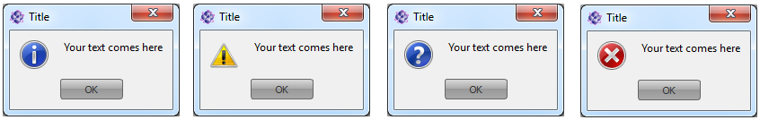
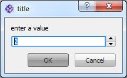
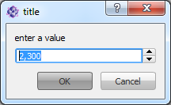
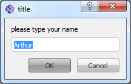

.. include:: /include/global.inc

Show messages, input boxes and default dialogs
************************************************

|itom| gives you the possibility to show the standard message and input boxes as well as standard dialogs per |Python| script command.

Message boxes
=================================

There are three types of message boxes that you can show via a script command. These are divided into the four types **Information**, **Warning**,
**Question** and **Critical**. 

    
    Appearance of the different message boxes on a Windows 7 operating system. From left to right: *Information*, *Warning*, *Question*, *Critical*

The corresponding commands are the following static methods in the class :py:class:`~itom.ui`:

* :py:meth:`~itom.ui.msgInformation`
* :py:meth:`~itom.ui.msgWarning`
* :py:meth:`~itom.ui.msgQuestion`
* :py:meth:`~itom.ui.msgCritical`

All these methods have the same syntax:

.. code-block:: python
    
    (button,buttonText) = msgInformation(title, text [,buttons, defaultButton, parent])

The parameters *title* and *text* are the strings for the titlebar and the content area of the message box respectively. The other three parameters
are optional: *buttons* is an or-combination of button-IDs, denoting the different buttons you want to display at the bottom of the message box. The possible values correspond to the enumeration **QMessageBox::StandardButton** of the *Qt*-framework and are:

=========================== ============
Enumeration                 Value
=========================== ============
ui.MsgBoxOk                 1024
ui.MsgBoxOpen               8192
ui.MsgBoxSave               2048
ui.MsgBoxCancel             4194304
ui.MsgBoxClose              2097152
ui.MsgBoxDiscard            8388608
ui.MsgBoxApply              33554432
ui.MsgBoxReset              67108864
ui.MsgBoxRestoreDefaults    134217728
ui.MsgBoxHelp               16777216
ui.MsgBoxSaveAll            4096
ui.MsgBoxYes                16384
ui.MsgBoxYesToAll           32768
ui.MsgBoxNo                 65536
ui.MsgBoxNoToAll            131072
ui.MsgBoxAbort              262144
ui.MsgBoxRetry              524288
ui.MsgBoxIgnore             1048576
ui.MsgBoxNoButton           0
=========================== ============

For an **or**-combination, use the bar-operator (**|**). The parameter *defaultButton* only accepts one button value of buttons, listed in the parameter *button*. The specific button then becomes the default button that is selectable by simply pressing the return-key. Additionally, you
can let the message box be a child of any other instance of class :py:class`~itom.ui`. This is useful, if you want to make the message box modal with
respect to any :ref:`user defined dialog <qtdesigner>` and not with respect to the main window of |itom|.

The return value is a tuple containing two values. The first is the value of the button that has been pressed to close the message box with respect to the enumeration values stated above. The second value is the text of the pressed button (e.g. "Ok").

An example for a question message box is:

.. code-block:: python
    
    (btn,btnText) = ui.msgQuestion("Silly question","Do you like itom?", \
        ui.MsgBoxYes | ui.MsgBoxNo, ui.MsgBoxYes)
    print("The user pressed the button", btnText, "with ID",btn)
    if(btn == ui.MsgBoxNo):
        print("what can we do in order to change your opinion?")

Input boxes
=================================

The class :py:class`~itom.ui` also contains another group of static methods, that can be used in order to show modal input boxes. These are:

Integer input box
-----------------------------

Use :py:meth:`~itom.ui.getInt` in order to ask the user for a fixed-point number:

.. code-block:: python
    
    (value, accepted) = ui.getInt(title, label, defaultValue, min, max, step=1)

The minimum and maximum value of the input box is set to the values *min* and *max* or to the full integer range, if not otherwise stated. The
step-size *step* defines the iteration value when the arrows are clicked. The return value is a tuple that contains the current value of the input
box and **True** if the dialog has been accepted, otherwise **False**, the value still contains the last value of the spinbox.

Double input box
-----------------------------

Use :py:meth:`~itom.ui.getDouble` in order to ask the user for a double-precision floating-point number:

.. code-block:: python
    
    (value, accepted) = ui.getDouble(title, label, defaultValue, min, max, decimals=1)

The minimum and maximum value of the input box is set to the values *min* and *max* or to the full double range, if not otherwise stated. In this
case you can assign the number of decimals that are shown (default:1). The step size is always set to 1. The return tuple has the same form than for
the integer input box.

Text input box
-----------------------------

Use :py:meth:`~itom.ui.getText` in order to ask the user for a string:

.. code-block:: python
    
    (value, accepted) = ui.getText(title, label, defaultValue)

The default text can be passed as parameter *defaultValue*. The return tuple also returns the current value of the textbox and the boolean variable **True** if the dialog has been accepted, else **False**.

Option selection dialog
-----------------------------

Use :py:meth:`~itom.ui.getItem` in order to let the user select an item from a given list of items:

.. code-block:: python
    
    (value, accepted) = ui.getItem(title, label, stringList [,currentIndex=0, editable=False])

.. figure:: images/getItem.png
    :align: center
    :scale: 70%

Use the parameter *stringList* in order to pass any sequence (tuple or list) of strings that are displayed as options, the user can choose. You can
preselect any item by setting the parameter *currentIndex* to the item's index (zero-based, default:0). Additionally it is possible to keep the
selection dialog editable, hence, the user can also type its own string (if True, default: False).

The returning tuple again contains the current active or typed string value and the boolean variable, that is only **True** if the dialog has been accepted.

Standard dialogs
=================================

|itom| provides access to a standard dialog to indicate an existing directory, to choose an existing file or to indicate a path for saving a file.

Indicate existing directory
-----------------------------

The dialog is wrapped by the static method :py:meth:`~itom.ui.getExistingDirectory`:

.. code-block:: python
    
    ret = ui.getExistingDirectory(caption, startDirectory [, options = 1, parent])

The parameters are as follows:

* **caption** is the title of the dialog
* **startDirectory** is a string containing an absolute path to the default directory
* **options** is an optional or-combination of one of the following options:
    
    | 1. ShowDirsOnly [default], only directories are shown in the dialog
    | 2. DontResolveSymlinks, if indicated symbolic links are not shown
    | other values can be taken from the Qt-enumeration **QFileDialog::Option**
* **parent** can be an instance of :py:class:`~itom.ui`, such that the dialog becomes modal and on top of this user defined dialog

The return value **ret** of this dialog is either **None** if the dialog has been rejected or else the absolute path to the chosen directory.

OpenFileName-Dialog
------------------------

Use the static method :py:meth:`~itom.ui.getOpenFileName` to show this dialog. By this dialog, the user can select one specific existing file in
any directory. This is usually taken for opening files.

.. code-block:: python
    
    ret = ui.getOpenFileName([caption="",startDirectory="",filters="", \
        selectedFilterIndex=0,options=0,parent])

The title of the dialog can be assigned by the parameter *caption*. You can choose a default directory by the string *startDirectory*. If this is not
given or empty, the current working directory is taken. The possible file filters are set by the string **filters**. This is a double-semicolon
separated list of entries. An example is::
    
    Images(*.png *jpg)
    Text Files (*.txt);;Itom Data Collection (*.idc);;Scripts (*.py *pyc)

The selected, default index is given by *selectedFilterIndex*, where 0 selects the first item in *filters*.
You can also pass some additional options to the dialog by the parameter *options*. This basically is an or-combination of the Qt-enumeration
*QFileDialog::Option*. Reasonable values are:

* 0x02, DontResolveSymlinks. If given, symbolic links are not shown in the dialog
* 0x40, HideNameFilterDetails. This only shows the names of the filters, but not the pattern mask.

The return value *ret* is *None*, if the dialog has been rejected, else it is the absolute filename of the selected file.

SaveFileName-Dialog
------------------------

Use the static method :py:meth:`~itom.ui.getSaveFileName` to show a dialog, where the user can select a new filename or an existing file in any directory. This is usually taken for saving files.

.. code-block:: python
    
    ret = ui.getSaveFileName([caption, startDirectory="",filters="", \
        selectedFilterIndex=0,options=0,parent])

The parameters are the same than for the open-file-dialog above. However for options, reasonable values are now:

* 0x02, DontResolveSymlinks. If given, symbolic links are not shown in the dialog
* 0x04, DontConfirmOverwrite. If given, the user don't has to confirm if an existing file has been choosen.
* 0x40, HideNameFilterDetails. This only shows the names of the filters, but not the pattern mask.

For combining different options, use the or-operator **|**.

