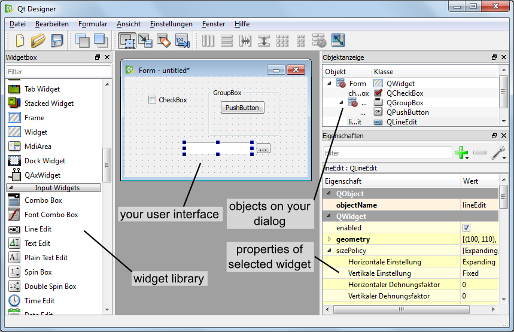
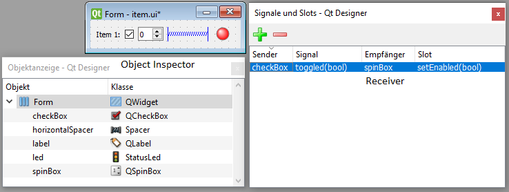
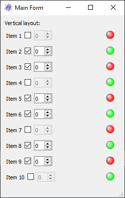

.. include:: ../include/global.inc

.. |qtdesigner-nolayout| image:: images_userGUI/qtdesigner-nolayout.png

.. _qtdesigner:

Creating customized dialogs, windows and dock widgets
******************************************************

With |itom| it is not only possible to add :ref:`menus and toolbar elements <toolbar-start>` to the main GUI of |itom| or 
to use the default set of input and message boxes, but it is also possible to create own user interfaces. These 
interfaces are designed by help of a WYSIWYG ("what you see is what you get") design tool (Qt Designer). The logic behind 
the surfaces is then scripted using |python|. Therefore it is possible to change the appearance of control elements at 
runtime or to connect a signal, emitted when for instance clicking on a button, with a user-defined python method.

In this chapter, the creation of such user interfaces is explained.

General approach
===================

In order to create customized user interfaces in |itom|, several steps have to be done. They are addressed in the course
of this chapter and are as follows:

1. The content and layout of the user interface has to be designed. This is mainly done by the help of the
   software **Qt Designer** and shown in the following :ref:`section <qtdesigner-qtdesigner>`.
2. It is usually desired to provide an user interface that can be displayed on various screen sizes and resolutions.
   Therefore it is always recommended to use the principle of layouts and size policies of the control elements,
   denoted as widgets (in Qt language) or general **uiItems** in |itom|. Both are also set in the **Qt Designer**,
   however it is also possible to add or remove widgets from layouts at runtime 
   (see :ref:`this section <qtdesigner-extentlayouts>`).
3. The **Qt Designer** can further be used to define simple interactions between widgets (e.g. if a check box is
   clicked, a group box should be disabled), denoted as signal-slot connections
   (see https://doc.qt.io/qt-5/designer-connection-mode.html or :ref:`this section <qtdesigner-internalsignalslots>`).
   Additionally, the tab order of all widgets can also be defined (see https://doc.qt.io/qt-5/designer-tab-order.html) 
   or default properties of all widgets can be set.
4. A customized user interface can not only consist of default widgets, like buttons, comboboxes or checkboxes,
   but also of |itom| specific control elements, like various types of :ref:`plots <PlotsAndFigures>` or other
   itom-specific widgets (see also :ref:`this section <listCustomDesignerWidgets>`).
5. All further interaction of the user interface and its control elements is then done in |Python| scripts within
   |itom|. This interaction is mainly divided into three parts:
   
   a. Change properties (like the caption of a button, the text of a label, the current item of a combobox...)
      via a piece of python code (see :ref:`this section <qtdesigner-getsetprops>`).
   b. Call slots (special methods of the control elements, that can be interactively triggered at runtime) via
      the command :py:meth:`~itom.uiItem.call`. Slots are listed in the official Qt help of every widget class.
      There are further methods of the control elements, that are no real slots, however they are specially wrapped
      by |itom|, such that they behave like slots and can be triggered by the same way. See the list of
      :ref:`wrapped slots <qtdesigner-wrappedslots>`.
   c. Every control element (widget) of the user interface provide specific signals, that are triggered if and
      event occurred. This signal consists of a name and optional argument. For instance, a checkbox emits the
      **clicked** signal with a boolean argument **checked**, that is `true` if the checkbox is checked now, else
      `false`. It is possible to connect one or multiple |Python| methods to such a signal, which are called whenever
      their connected signal is emitted (see :ref:`section <qtdesigner-signals>`).
   
   All these interactions between the control elements, provided by the 
   `Qt framework <https://doc.qt.io/qt-5/qtwidgets-module.html>`_ (written in C++) and |Python| code in |itom|
   can be done, if all data types of the involved parameters, properties and return types are among the list of
   :ref:`supported data types <qtdesigner-datatypes>`.

.. _qtdesigner-qtdesigner:

Qt Designer
==============

The **Qt Designer** is used to create a custom user interface, that can be displayed within |itom| and interact with 
|itom| and |Python| code. This software is part of the Qt framework, the platform independent GUI framework that is also 
used to run |itom| itself. For general information about the usage of the **Qt Designer**, one is referred to the 
official documentation under http://doc.qt.io/qt-5/qtdesigner-manual.html

In order to start the **Qt Designer**, click on the corresponding icon in the toolbar of |itom|:

.. figure:: images_userGUI/mainsymbols2.png
    :scale: 100%
    :align: center

or double-click on a corresponding **ui**-file in the file system widget of |itom|. In the first case, **Qt Designer** 
shows an initialization dialog, where you can select the base type of the user interface you want to create.

Basically you have the choice between three different base layouts:

1. **Dialog**. A Dialog is usually displayed on top of the main window and only has got one close-button in its title bar. 
  Often, dialogs are used for configuration dialogs where the user finally closes the dialog using one of the standard 
  buttons (OK, Cancel, Apply...) in order to confirm or reject the current changes in the dialog. A dialog cannot have its 
  own toolbar, menu or status bar. To open and use such a dialog within |itom|, see :ref:`this section <qtdesigner-typewindow>`.
2. **Main Window**. A main window is a fully equipped main window, which can be minimized, maximized, can have toolbars, 
  menus and a status bar. Therefore it is recommended to use this type of user interface for the main window of your 
  measurement system. Like a dialog, it is possible to show the main window on top of |itom| (as sub-window of |itom|) or 
  as independent window, which has its own icon in the windows tray. To open and use such a window within |itom|, see 
  :ref:`this section <qtdesigner-typewindow>`.
3. **Widget**. A widget is the base class for all control elements provided by |Qt|. Therefore a widget does not have any 
  title bar or windows frame. Nevertheless there are three use cases where it makes sense to choose this type
  of base layout:
  
  * |itom| is able to put a widget base layout into a default dialog layout, that can optionally show some default buttons 
    on the right side or at the bottom of the dialog. This is the easiest way the generate a configuration dialog in |itom|,
    since you do not need to script the necessary methods handling clicks on one of these buttons. In this case, |itom| 
    automatically gets full information about the close status and type of closing of the dialog (accepted, rejected...).
    For more information how to use this within |itom|, see :ref:`this section <qtdesigner-typedialog>`.
  * Since **itom 4.0** it is possible to place a customized widget as central widget in the center of the main window
    of itom or as toolbox (denoted as dock widget), in one of the four toolbox areas of the main window of |itom|.
    The toolbox can be docked or undocked and moved from one allowed area to another one. For using a widget as central
    widget, see :ref:`this section <qtdesigner-typecentralwidget>`, for a usage as toolbox see 
    :ref:`here <qtdesigner-typedockwidet`.
  * Since **itom 4.1** it is further possible to add such a customized widget base layout to one **layout** of another
    customized user interface. For more information about this, see :ref:`this section <qtdesigner-extentlayouts>`.

After having chosen one of these base layouts (types), your surface is displayed in the middle of the **Qt Designer** and 
you can start to drag elements from the **widget library panel** onto your surface. If the **Qt Designer** is started 
from |itom| you will even find the sections **itom plugins** and **itom [widgets]** in the **widget library panel** of 
the **Qt Designer**. They contain all loadable designer plugins, directly provided by the |itom| software. The general 
availability of plugins depend on the designer plugins that are currently available in your installation of |itom|.

A common set of |itom| specific widgets are displayed here:

.. figure:: images_userGUI/qtdesigner-itomwidgets.png
    :scale: 100%
    :align: center

The difference between **itom plugins** and **itom [widgets]** is, that the first are designer plugins (single libraries 
each) for |itom| and the latter come from one **itomWidget** library, that is part of the core project of |itom|.

After having placed one widget on the canvas, you will see its properties in the property toolbox of **Qt Designer**. 
Every widget has the common property **objectName**. If you assign a unique object name to any of your control elements, 
it is possible to access and manipulate this widget from a |python| script in |itom| using this name, too. In general many 
of the properties that are visible in the property toolbox can afterwards be read or changed by an appropriate script 
(depending on the data type of the property).

The alignment of control elements on the surface is mainly controlled by so-called layout elements. These layouts together 
with size policies that can be assigned to every widget control the appearance of the entire user interface and provide 
the feature that the dialog can be changed in size whereas all widgets are dynamically repositioned. For more information 
about layouting your user interface, see http://qt-project.org/doc/qt-5/designer-layouts.html.

.. note::
    
    In order to provide an user interface, that can be properly displayed on screens with different sizes and rescaled by the 
    user, try to **always** set layouts. Make sure, that there is no unassigned layout symbol (|qtdesigner-nolayout|) 
    somewhere in the **object inspector panel**. If so, make a right click on such an item and select an appropriate layout. 
    Additionally, avoid to set any minimum or maximum size of any widget. Instead try to solve this by layouts and the 
    principle of size policies (see https://doc.qt.io/qt-5/qsizepolicy.html).

Finally, save your user interface under a convenient filename with the suffix **.ui**.

Widget library panel
---------------------

In principle, you are allowed to place every widget on your user interface that is available in the widget library (widget 
box) of **Qt Designer**. Later, you will learn how you can access properties of any widget (read and/or write) and how you 
can call specific functions provided by any widget. However, you will also learn that you do not have access using 
|python| to all functions a widget has and you are not able to sub-class any widget, like you can it using a native 
**C++** program. Therefore, it is not recommended to place any widget from the group **Item Views (Model-based)** on your 
user interface since only few functions of these widgets are accessible by a |python| script. If you need a list box, use 
the item-based list widget. |itom| also provides some widgets (section **itom widgets**) that can be placed on your user 
interfaces, for instance some plot widgets or the widget for plotting the result of the python module matplotlib (see 
:ref:`pymod-matplotlib`).

Loading user interface in |itom|
=================================

In this section, an introduction is given how to create and load user interfaces in |itom| depending on different 
type-attributes.

.. _qtdesigner-typedialog:

Widget embedded in |itom|-dialog (TYPEDIALOG)
---------------------------------------------

Like described above, the easiest and most comfortable way to load user interfaces in |itom| is to use the type 
**TYPEDIALOG**. In **Qt Creator** you design a widget with your individual content and then when loading this GUI in 
|itom|, the widget is embedded in a dialog provided by |itom|, which optionally adds a horizontal or vertical button bar 
at the right side or at the bottom of the dialog.

Let us create an exemplary user interface. In **Qt Creator** the following widget has been created:

.. figure:: images_userGUI/testWidget.png
    :scale: 100%
    :align: center

On the right side of the widget *testWidget* you see the hierarchical organization of objects that are put on the widget. 
At first, a group box has been placed on the widget. Inside of this group box two radio buttons have been placed using a 
simple drag&drop from the widget library. Both radio buttons are aligned inside of the group box with a vertical layout. 
This is reached by a right-click on the group box and choosing *vertical layout* from the *layout* menu. Below the group 
box, a widget of type *lineedit* and a push button (type *pushbutton*) have been placed. Finally the three main elements 
are also aligned in a vertical layout with respect to the overall widget. This can be achieved by a right click on an 
empty space of the widget or directly in the *object inspector*. If you increase now the size of the overall widget, you 
will see that all sub-elements are resized according to their layout. Since we don't want sub-widgets to be vertically 
stretched and distributed, a vertical spacer element has been placed at the bottom of the vertical layout stack.

The following properties have been directly set in **Qt Creator**:

* group box: *objectName*: groupOption, *title*: 'Please make your choice'
* push button: *objectName*: btnClickMe, *text*: 'click me'
* line edit: *objectName*: txtInput, *text*: 'put here your text...'
* radio buttons: *objectName*: radioOpt1 and radioOpt2, *text*: 'Option 1' and 'Option 2'

The entire widget is saved under the filename *testWidget.ui* in an arbitrary directory.

Then you can load and show the widget in |itom| by creating a python-script in the same directory with the following 
content. You can also directly type these lines into the command line of |itom|, however, you should then assure that the 
current directory is equal to the directory where the user interface has been stored.

.. code-block:: python
    
    dialog = ui("testWidget.ui", ui.TYPEDIALOG)  # loading dialog
    result = dialog.show(1)  # modally show, wait until the dialog has been closed
    print("The dialog has been closed with code", result)

At first, an instance of class :py:class:`itom.ui` is created that is given the name of the user interface file. This 
instance can then be accessed by the name *dialog*. By calling the method :py:meth:`~itom.ui.show`, the dialog is shown. 
Since the parameter has been set to **1**, the dialog is shown in a modal style, such that python waits until the dialog 
has been closed again and |itom| is entirely blocked during that time. However, then it is possible to get informed about 
the way the dialog is closed, such that the variable *result* will be set to *0* if the user closed the dialog using a 
cancel button (not available here) or the close button in the title bar or *1* if the user clicked an **OK**-button.

.. figure:: images_userGUI/testWidgetItom.png
    :scale: 100%
    :align: center

It is also possible to open the dialog in a non-modal version or to open it in a modal style however to immediately force 
python to continue the script execution. This depends on the parameters of :py:meth:`~itom.ui.show`. However only in the 
modal case above, the closing result can be tracked by |python|. Additionally, this is also only possible if a widget is 
embedded in a dialog, given by |itom|, like it is always the case if you create an instance of :py:class:`itom.ui` with 
the second parameter set to **ui.TYPEDIALOG**.

Right now, you don't have the possibility to quit the dialog using any button (**OK**, **Cancel**...). In order to obtain 
a button bar with these buttons, the call to the class :py:class:`itom.ui` needs to be changed. There is the choice 
between two different appearances of a button bar, which can be automatically added to your widget:

.. figure:: images_userGUI/testWidgetButtonBar.png
    :scale: 100%
    :align: center

Next, you need to select which buttons should be included in the button bar. This is done by creating a python dictionary, 
where each elements corresponds to one button. The key-word of the item corresponds to the role of the button (see 
enumeration *QDialogButtonBox::ButtonRole* of the |Qt|-library documentation) and the value is the text of the button. 
Common roles are:

* "AcceptRole": Use this role for an **OK**-button. The dialog is closed and the return value in modal style is 1.
* "RejectRole": Use this role for a **Cancel**-button. The dialog is also closed but the return value is 0.

Finally, the call to :py:class:`itom.ui` must be in the following way, in order to get an auto-generated button bar:

.. code-block:: python
    
    dialog = ui("testWidget.ui", ui.TYPEDIALOG, ui.BUTTONBAR_VERTICAL, \
        {"AcceptRole":"OK", "RejectRole":"Cancel"})
    # or
    dialog = ui("testWidget.ui", ui.TYPEDIALOG, ui.BUTTONBAR_HORIZONTAL, \
        {"AcceptRole":"Yes", "RejectRole":"No"})

.. note::
    
    You can also use a keyword-based call to **ui** since every parameter has its default value such that you can omit 
    parameters beside the first one.     For more details about all parameters, keywords and its default values see 
    :py:class:`itom.ui`.

The dialog is closed and deleted if the variable **dialog** is deleted using the command **del**.

.. _qtdesigner-typewindow:

Main window or dialog (TYPEWINDOW)
----------------------------------

If you are not interested in the exact return value of the dialog but you want to have full control and all available 
functionalities of any dialog or main window, create an user interface based on a **dialog** or **main window** in **Qt 
Designer**.

.. figure:: images_userGUI/testWindow.png
    :align: center
    :scale: 100%

The figure shows an exemplary user interface (**testWindow.ui**) that is based on a main window. On the right side, there 
have been added three buttons, nested in a vertical layout. On the left side, there is a list widget (objectName: 
**listWidget**, type: **List Widget**). Additionally a menu has been added that consists of three items.

This main window can now be shown using the following code snippet:

.. code-block:: python
    
    win = ui("testWindow.ui", ui.TYPEWINDOW)
    win.show()  # this is equal to win.show(0) -> non-modal

Then, the window is shown on top of the main window of |itom|, since it is considered to be a child of |itom|. If you 
don't want this, you can also add the keyword-parameter *childOfMainWindow=False* to the call of :py:class:`itom.ui`:

.. code-block:: python
    
    win = ui("testWindow.ui", ui.TYPEWINDOW, childOfMainWindow=False)

Here, you need to use the keyword, since the parameters *dialogButtonBar* and *dialogButtons* (used for TYPEDIALOG) are 
not given in this case, since they are useless in case of *TYPEWINDOW*. If your window is no child of |itom|, it gets its 
own icon in the Windows tray bar and does not stay on top of |itom|.

.. _qtdesigner-typedockwidget:

Main window or widget as dockable toolbox (TYPEDOCKWIDGET)
-----------------------------------------------------------

It is also possible to integrate user-defined main windows or widgets as dockable toolbox in the main window of |itom|. 
This is done using the type value **ui.TYPEDOCKWIDGET**. Then the widget is registered as dockwidget in the main window of 
|itom| and once it becomes visible, its startup position is at the top-center position. You can define the initial dock 
area using the optional argument *dockWidgetArea* of the class :py:class:`itom.ui`.

.. code-block:: python
    
    win = ui("testWindow.ui", ui.TYPEDOCKWIDGET, dockWidgetArea = ui.RIGHTDOCKWIDGETAREA)
    
Possible values for *dockWidgetArea* are:
    
    * ui.LEFTDOCKWIDGETAREA = 1
    * ui.RIGHTDOCKWIDGETAREA = 2
    * ui.TOPDOCKWIDGETAREA = 4
    * ui.BOTTOMDOCKWIDGETAREA = 8

.. _qtdesigner-typecentralwidget:

Main window or widget as part of the central widget area of itom (TYPECENTRALWIDGET)
-------------------------------------------------------------------------------------

It is also possible to integrate user-defined main windows or widgets as part of the central widget area of the main 
window of |itom|. This is done using the type value **ui.TYPECENTRALWIDGET**. The central widget area can contain several 
widgets which are vertically stacked and whose size can be vertically changed by a splitter layout. Per default, this 
central area only contains the command line. Every new widget that is added to this area is inserted at the top.

The current size of all widgets in the central area (including the command) line, can be changed via 
`itom.setCentralWidgetsSizes`. This method expects a list of integers as argument which correspond to the desired height 
of every widget in pixels (0: the widget is collapsed and can be made visible again with the mouse). If the sum of all 
sizes does not correspond to the current height of the central area, the sizes are distributed based on their relative 
weights.

.. code-block:: python
    
    import itom
    win = itom.ui("testWindow.ui", ui.TYPECENTRALWIDGET)
    itom.setCentralWidgetsSizes([400,300])  # desired height of 400px for the new widget 'win' and 300px for the command line of itom.

.. _qtdesigner-getreference:

Accessing control elements
==========================

Until now, you know how to design an interface and how to show it using |itom|. This and the following sections explain 
how you dynamically interact with the user interface and its elements. One elementary tool for this is to access any 
desired element of the GUI. For instance, if you want to change properties of a button or the text of a lineedit-widget, 
you first need to access these elements.

The accessing is simply done by the unique and specific **objectName** of each element and the dot-operator (**.**). Let's 
take the first example **testWidget.ui** again. The dialog has been assigned the variable **dialog**. Then have the 
following possibilities to access its elements:

.. code-block:: python
    
    elemGroup = dialog.groupOption  # access the group box by its objectName
    
    elemRadioOpt1 = dialog.radioOpt1  # OR
    elemRadioOpt1 = elemGroup.radioOpt1
    
    textfield = dialog.txtInput

Each variable created by the code block above is an instance of :py:class:`itom.uiItem`. It is this class that defines the 
dot-operator. Looking at the example of accessing the first radio button, which is a child of the group-box, it is both 
possible to access the group button by its objectName as child of the entire dialog or as child of the groupbox. This is 
feasible since the class :py:class:`~itom.ui` is derived from :py:class:`~itom.uiItem`, such that the dot-operator not 
only works for entire dialog references but also for accessing sub-elements of other widgets. However, since each 
objectName is unique among all elements of the entire dialog, is doesn't matter how to access any element.

An alternative access to child widgets is provided by the method :py:meth:`~itom.uiItem.getChild` which has the desired 
objectName as argument:

.. code-block:: python
    
    elemGroup = dialog.getChild("groupOption")

This method can for instance be used if the widgetName is created from a formatted string.

But why do we need to access these elements? Why do they returns its own instance of class :py:class:`~itom.uiItem`. These 
questions are answered in the following sections...

.. _qtdesigner-getsetprops:

Getting and setting properties
==============================

As already mentioned, you can read or write most properties of any element that are also listed in the property toolbox of 
**Qt Designer**. Properties are also separately listed in the corresponding |Qt| documentation. In general it makes sense 
to set properties - when offline possible - in the **Qt Designer**. This is a little bit more efficient and keeps your
script tiny. Getting and setting properties is possible if you have an object of type :py:class:`~itom.uiItem`. Therefore 
you need to get this object like described in the section above.

Getting the property value can either be done by using the mapping-operator **[...]** or by using the method 
:py:meth:`~itom.uiItem.getProperty`. For instance, if you want to get the current text and the enabled status of the 
textfield in dialog *testWidget.ui* from the first example, you can use one of the following possibilities:

.. code-block:: python
    
    # 1. possibility
    text = dialog.txtInput["text"]
    enabled = dialog.txtInput["enabled"]
    
    # 2. possibility
    [text,enabled] = dialog.txtInput.getProperty(["text", "enabled"])

.. note::
    
    For accessing single properties, it is shorter and easier to use the mapping-operator **[...]**. However, due to the 
    internal thread-structure of |itom|, it is a little bit faster to     access multiple properties of the same widget 
    using the method :py:meth:`~itom.uiItem.getProperty`.

In order to set one or multiple properties, you can use similar methods. Simply assign a value to the mapping-operator 
**[...]** or use the method :py:meth:`~itom.uiItem.setProperty`.

.. code-block:: python
    
    # 1. possibility
    dialog.txtInput["text"] = "new text for this textfield"
    dialog.txtInput["enabled"] = False
    
    # 2. possibility
    dialog.txtInput.setProperty( {"text":"new text for this textfield", \
        "enabled":False} )

If you use :py:meth:`~itom.uiItem.setProperty`, you always need to pass a dictionary as argument. This dictionary can 
contain one or multiple properties, where the keyword always is the property-name (string) and the value is the 
corresponding new value (type depends on corresponding C++ type). For more information about supported data types, that can 
be accessed by python in |itom| see :ref:`qtdesigner-datatypes`.

If the property is an enumeration or a bitmask (or-combination of enumeration values), you can either pass the integer 
value or a string with the enumeration key name. In case of a flag, pass a semicolon-separated string with all values. The 
return value is always the integer number.

.. _qtdesigner-datatypes:

Supported data types
=====================

The classes :py:class:`itom.ui` and :py:class:`itom.uiItem` are the connection between any python-script in |itom| and 
GUI-elements, written in C++ and provided by |Qt|. Therefore, it is necessary to transform types from python to 
corresponding C++-structures and vice-versa. The following table lists some convenient type casts. In general, it is 
always tried to convert the input type to the desired destination type, such that a number can also be transformed to a 
string, if it is always known, that the destination requires a string.

================= ===========================================================================
C++/Qt-Type       Python-Type  
================= ===========================================================================
QString           str or any type, that has a string representation
QByteArray        unicode or byte type
QUrl              any string that can be interpreted as Url
bool              any type that can be casted to a boolean value (1,0,True,False...)
QStringList       any sequence that only contains values castable to QString
int, short, long  integer, floats are rounded to integer, True=1, False=0
unsigned int ...  integer, floats are rounded to integer, True=1, False=0
float, double     integer, floats, True=1.0, False=0.0
QVector<int>      any sequence whose values are castable to int
QVector<double>   any sequence whose values are castable to float
QList<int>        any sequence whose values are castable to int
QList<double>     any sequence whose values are castable to float
QVector2D         any sequence with two values castable to float (x,y)
QVector3D         any sequence with three values castable to float (x,y,z)
QVector4D         any sequence with four values castable to float (x,y,z,w)
PCLPointCloud     :py:class:`~itom.pointCloud`
PCLPoint          :py:class:`~itom.point`
PCLPolygonMesh    :py:class:`~itom.polygonMesh`
DataObject*       :py:class:`~itom.dataObject` or any type convertible to an array (see numpy)
AddInDataIO*      :py:class:`~itom.dataIO`
AddInActuator*    :py:class:`~itom.actuator`
QVariant          any of the types above can be transformed to QVariant
QVariantMap       a dictionary where keys are strings and values are generally convertible.
QVariantList      any sequence whose items can be convertible.
QRegion           :py:class:`~itom.region`
QColor            string with color name or hex-value or :py:class:`~itom.rgba`
Enumeration       integer with value or string with key (setter only)
QTime             :py:class:`datetime.time` object
QDate             :py:class:`datetime.date` object
QDateTime         :py:class:`datetime.datetime` object
QFont             :py:class:`~itom.font`
Qt::CheckState    int (0: unchecked, 1: partially checked, 2: checked)
Qt::ItemFlags     int, bitmask (see Qt::ItemFlags for definitions)
================= ===========================================================================

If a property or other arguments in |Qt| require other data types, it is possibly to implement a converter for them. It 
only becomes a little bit more difficult for pointers to extended C++ or |Qt| classes. The conversion is mainly done in 
the |itom| class **PythonQtConversion**.

.. _qtdesigner-signals:

Connecting signals
==================

Now, you know how to change properties of dialogs at runtime of |itom| using a small python script snippet. In this 
section, you will learn how you can let |itom| a specific python-method for instance if a button on the user interface is 
clicked. Whenever something is changed in a user interface or the user starts to interact with the interface, any type of 
event is emitted. In |Qt| many of these events are specially handled and called signals. For instance, if an user clicks a 
button, toggles a checkbox, triggers an item in a menu or selects an item in a list widget, a signal is emitted or sent.

The counterpart to a signal is called slot. |Qt| provides the possibility to **connect** a signal with a slot, under the 
only condition, that both have exactly the same order and type of arguments. It is even possible to connect the same 
signal to various slots. Whenever a signal is emitted, all connected slots are executed. |itom| provides you the 
possibility to define slots in form of ordinary python methods or functions and to also connect them to signals of 
widgets on your user interface.

For establishing the connection, you need again a reference to the specific widget on the user interface. This reference 
is any variable of type :py:class:`~itom.uiItem`. Next, you need the name and the arguments of the |Qt| signal, you want 
to connect to. This information can be obtained by the |Qt| documentation. For instance, if you need any signal that a 
widget of type **QPushButton** (the type of our push button, placed in the user interface in file **testWidget.ui**), go 
to https://doc.qt.io/qt-5/qpushbutton.html. Unfortunately, you won't find a headline called **Signals** at this page, 
since **QPushButton** does not directly declare any signal. However, you can see under **Additional Inherited Members**, 
that **QPushButton** inherits signals from its base classes. The most important signals are inherited from 
**QAbstractButton**. Click on its link and you will see the available signals for a push button:

.. code-block:: c++
    
    void clicked ( bool checked = false )
    void pressed ()
    void released ()
    void toggled ( bool checked )

If any argument provides a default value, you can also omit the specific argument. Select the signal that is convenient 
for you and create its string-signature. The signature always contains the following structure::
    
    signature = "signalName(typeName1,typeName2,...)"

For instance, the signatures for the signals above are::
    
    "clicked()" or "clicked(bool)"
    "pressed()"
    "released()"
    "toggled(bool)"

Then, create a python method in your script, which you want to consider to be a slot and that should be connected with 
the signal. This method always requires the same number of arguments than given in the signature. If you want to connect 
a signal to a method that is a bounded method of a class in python, the first argument **self** does not count to the 
number of total arguments, hence, you always need to define the first parameter **self**, like it is the case for 
bounded methods.

Finally, use the method :py:meth:`~itom.uiItem.connect` in order to establish the connection. For instance let us create 
a method, that should show a message when the push button "click me" on the first exemplary dialog (*testWidget.ui*) has 
been clicked:

.. code-block:: python
    
    dialog = ui("testWidget.ui", ui.TYPEDIALOG, ui.BUTTONBAR_VERTICAL, \
        {"AcceptRole":"OK", "RejectRole":"Cancel"})
    
    def showMsg():
        #slot executed in button 'click me' is clicked
        ui.msgInformation("itom","you pressed the button click me")
    
    # connect(signature, method)
    dialog.btnClickMe.connect( "clicked()", showMsg )
    
    # show dialog
    dialog.show()

You have seen that the method :py:meth:`~itom.uiItem.connect` of the element *dialog.btnClickMe* (the push button) has 
been called. Its first argument is the signature of the signal, as second argument the reference to the slot-methods is 
given. If you integrate the dialog within a class and the slot is a member of this class, too, the exemplary code can 
look as follows:

.. code-block:: python
    
    class MyDialog():
        
        def __init__(self):
            self.dialog = ui("testWidget.ui", ui.TYPEDIALOG, ui.BUTTONBAR_VERTICAL, \
                {"AcceptRole":"OK", "RejectRole":"Cancel"})
            self.dialog.btnClickMe.connect("clicked()", self.showMsg)
            self.dialog.show()
        
        def showMsg(self):
            ui.msgInformation("itom","you pressed the button click me")
    
    # instance of class MyDialog
    test = MyDialog()
            

Let us use the second example **testWindow.ui**. If you want a python method to be executed if the user clicks an action 
in the menu of the main window, you should connect the signal **triggered()** of every item in the menu with your 
method. In |Qt| such an item is an instance of *QAction* and is also accessed by its *objectName*.

.. code-block:: python
    
    win = ui("testWindow.ui", ui.TYPEWINDOW)
    
    def addItem():
        print("action addItem clicked")
    
    win.actionAddItem.connect("triggered()", addItem) 
    # actionAddItem is the objectName of the action
    win.show()

.. note::
    
    **New in itom 3.2**
    
    The method :py:meth:`~itom.uiItem.connect` now has the additional optional argument **minRepeatInterval**. If this 
    is given with a value > 0, the connected slot will only be called, if the last call from the same signal 
    happened at least **minRepeatInterval** ms ago. Else, the new call is ignored. This can be used, to avoid that 
    signals, that are fired very often, will jam the incoming event queue of the corresponding Python method.
    
    It is further possible to not only connect signals from widgets to Python slots, but also signals from **dataIO** or 
    **actuator** instances. For this, see the methods :py:meth:`~itom.dataIO.connect` and 
    :py:meth:`itom.actuator.connect`.

.. _qtdesigner-slots:

Calling slots
=============

Widgets on user interfaces not only emit signals but they also have slots defined, such that you can connect other 
signals (e.g. from other widgets) to these slots. Using a python script in |itom| you can also call (*or:* invoke) these 
slots. 

.. note::
    
    With respect to the documentation of |Qt| it is only possible to invoke slots of widgets from python, but it is not 
    possible to call public, protected or private member methods. This is a limitation of |itom|. Other python packages like 
    *pySide* or *PyQt* offer this possibility, however their use is not possible in |itom|, since they require the python 
    interpreter to be executed in the main thread, which is not the case in |itom|, where |python| runs in its own secondary 
    thread.

In order to invoke a slot, call the method :py:meth:`~itom.uiItem.call` of any element on your user interface. For 
instance, in order to clear the list widget (*objectName*: *listWidget*) of **uiWindow.ui**, you can invoke its public 
slot **clear()**:

.. code-block:: python
    
    win = ui("testWindow.ui", ui.TYPEWINDOW)
    listWidget = win.listWidget
    listWidget.call("clear")

Here, the method :py:meth:`~itom.uiItem.call` is only called with one argument, the name of the slot in |Qt|. If this 
slot would have any arguments that can be converted from |python| (see :ref:`qtdesigner-datatypes`), add these arguments 
as further parameters to the call.

.. _qtdesigner-wrappedslots:

Special (wrapped) slots
----------------------------

Unfortunately, there are some methods of important widgets in |Qt|, which are not defined to be a *public slot*. For 
instance, the methods to add item(s) to a list widget are no slots. However, there are some exceptions defined in |itom| 
such that some *public methods* of widgets can also be called with the method :py:meth:`~itom.uiItem.call`. These 
exceptions are contained in the list below. Their call syntax is as follows::

    myWidget: uiItem = gui.objectNameOfWidget
    retVal: retType = myWidget.call("name of slot", arg1: arg1Type, arg2: arg2Type, ...)
    
    # The return value of the wrapped slot is returned
    # The first argument of the call method is the method
    # name of the slot, all other arguments are the arguments
    # to the method (no keyword based arguments allowed).

The class names in the following list corresponds to the Qt class name of the widget, where the slot can be
applied to. It is not part of the call statement in |Python|.

.. py:function:: QWidget.resize(width: int, height: int)

    resizes the widget to width / height.

.. py:function:: QWidget.setGeometry(int x, int y, width: int, height: int)

    changes the geometry of the widget.

.. py:function:: QWidget.setCursor(index: int)
    
    sets the given cursor for this uiItem. The number is a value of the enumeration `Qt::CursorShape 
    <https://doc.qt.io/qt-5/qt.html#CursorShape-enum/>`_. A number < 0 will unset the current cursor.
    
    *New in itom 3.2*

.. py:function:: QWidget.devicePixelRatioF() -> float
    
    Returns the device pixel ratio for the device as a floating point number. Only if **itom** is compiled against Qt >= 
    5.6, else 1.0 is returned always.
    
    *New in itom 3.2*

.. py:function:: QListWidget.addItem(item: str)
    
    adds the item to the list

.. py:function:: QListWidget.addItems(items: Sequence[str])
    
    adds the given items in the given order to the list.

.. py:function:: QListWidget.selectedRows() -> Tuple[int]
    
    returns a tuple of all selected row indices

.. py:function:: Tuple[str] QListWidget.selectedTexts()
    
    returns a tuple of all selected values

.. py:function:: QListWidget.selectRows(indices: Sequence[int])
    
    select the rows with the given indices (ListWidget must be in multi-selection mode)

.. py:function:: QListWidget.takeItem(row: int) -> str
    
    removes and returns the text of the item from the given row in the list widget. Raises an exception if the item does 
    not exist.

.. py:function:: QListWidget.item(row: int) -> str
    
    returns the text of the item from the given row or raises an exception if the item does not exist

.. py:function:: QListWidget.setItemText(row: int, text: str)
    
    sets the text of the item from the given row or raises an exception if the item does not exist
    
    *New in **itom** > 3.2.1*

.. py:function:: QListWidget.checkState(row: int) -> int[Qt.CheckState]
    
    returns the check state of the item from the given row (0: unchecked, 1: partially checked, 2: checked) or raises an 
    exception if the item does not exist. For possible values of flags, see the enumeration `Qt::ItemFlags 
    <https://doc.qt.io/qt-5/qt.html#CheckFlag-enum/>`_.

.. py:function:: QListWidget.setCheckState(row: int, state: Qt.CheckState)
    
    set the check state of the item in the given row (0: unchecked, 1: partially checked, 2: checked) - set the flags 
    properly before changing the state. For possible values of flags, see the enumeration `Qt::ItemFlags 
    <https://doc.qt.io/qt-5/qt.html#CheckFlag-enum/>`_.

.. py:function:: QListWidget.flags(row: int) -> int[Qt.ItemFlags]
    
    returns the flags used to describe this item (e.g. checkable, tristate, editable, selectable...).
    For possible values of flags, see the enumeration `Qt::ItemFlags <https://doc.qt.io/qt-5/qt.html#ItemFlag-enum/>`_.

.. py:function:: QListWidget.setFlags(row: int, flags: Qt.ItemFlags)
    
    set the flags of the item in the given row based on the flags bitmask (use an integer). 
    You have to set the flags properly before changing the state.
    For possible values of flags, see the enumeration `Qt::ItemFlags <https://doc.qt.io/qt-5/qt.html#ItemFlag-enum/>`_.

.. py:function:: QComboBox.addItem(item: str)
    
    appends the given item to the combo box

.. py:function:: QComboBox.addItems(items: Sequence[str])
    
    appends the given items to the combo box

.. py:function:: QComboBox.removeItem(index: int)
    
    remove the item in the combo box given by index

.. py:function:: QComboBox.setItemData(index: int, variant value)
    
    sets the displayed text of the item given by index to the given value.
    *value* can be of any type, that can be converted to a string representation (originally: QVariant).

.. py:function:: QComboBox.insertItem(index: int , item: str)
    
    Inserts the item at the position in the list given by index.
    
.. py:function:: QComboBox.itemText(index: int) -> str
    
    returns the text of the item in the combo box given by index.

.. py:function:: QTabWidget.isTabEnabled(index: int) -> bool
    
    returns True, if the tab, given by index, is enabled; else False
    
.. py:function:: QTabWidget.setTabEnabled(index: int, enabled: bool)
    
    sets the enable state of the tab, given by index.

.. py:function:: QMainWindow.statusBar() -> uiItem
    
    returns a reference to the statusbar widget as :py:class:`~itom.uiItem`.

.. py:function:: QMainWindow.centralWidget() -> uiItem 
    
    returns a reference to the central widget of the mainWindow as :py:class:`~itom.uiItem`.

.. py:function:: QMainWindow.addToolBar(name: str, objectName: str) -> uiItem
    
    adds a new toolbar with the given name to the main window and returns its reference as :py:class:`~itom.uiItem`.
    If objectName is a nonempty string, it is used as internal object name of the new toolbar.
    
    *New in itom 3.2

.. py:function:: QTableWidget.setHorizontalHeaderLabels(labels: Sequence[str])
    
    sets the labels of the horizontal header labels

.. py:function:: QTableWidget.setVerticalHeaderLabels(labels: Sequence[str])
    
    sets the labels of the vertical header labels

.. py:function:: QTableWidget.getItem(row: int, column: int) -> variant
    
    returns the value of the item, given by row and column

.. py:function:: QTableWidget.setItem(row: int, column: int, value: variant)
    
    sets the value of the item, given by row and column, to the given value (any type, castable to QVariant).

.. py:function:: QTableWidget.currentColumn() -> int
    
    returns the index of the currently selected column

.. py:function:: QTableWidget.currentRow() -> int
    
    returns the index of the currently selected row

.. py:function:: QTableWidget.checkState(row: int, column: int) -> int[Qt.CheckState]
    
    returns the check state of the item from the given row and column (0: unchecked, 1: partially 
    checked, 2: checked) or raises an exception if the item does not exist.

.. py:function:: QTableWidget.setCheckState(row: int, column: int, state: Qt.CheckState)
    
    set the check state of the item in the given row and column (0: unchecked, 1: partially checked,
    2: checked) - set the flags properly before changing the state.

.. py:function:: QTableWidget.flags(row: int, column: int) -> int[Qt.ItemFlags]
    
    returns the flags used to describe this item (e.g. checkable, tristate, editable, selectable...).
    For possible values of flags, see the enumeration `Qt::ItemFlags <https://doc.qt.io/qt-5/qt.html#ItemFlag-enum/>`_.

.. py:function:: QTableWidget.setFlags(row: int, column: int, flags: Qt.ItemFlags)
    
    set the flags of the item in the given row and column based on the flags bitmask (use an integer). 
    You have to set the flags properly before changing the state.
    For possible values of flags, see the enumeration `Qt::ItemFlags <https://doc.qt.io/qt-5/qt.html#ItemFlag-enum/>`_.

.. py:function:: QTableView.horizontalHeader() -> uiItem
    
    returns a reference to the horizontal header widget as :py:class:`~itom.uiItem`.

.. py:function:: QTableView.verticalHeader() -> uiItem
    
    returns a reference to the vertical header widget as :py:class:`~itom.uiItem`.

.. py:function:: QSplitter.setStretchFactor(section: int, factor: int)
    
    sets the stretch factor (size policy) for the given section.

.. py:function:: QSplitter.sizes() -> Tuple[int]
    
    returns the sizes (in pixel) of each section as tuple.

.. py:function:: QSplitter.setSizes(sizes: Sequence[int])
    
    sets the sizes of all sections (in pixels). Pass sizes as tuple or list of integers.

.. py:function:: QSplitter.isCollapsible(section: bool) -> bool
    
    returns True if the given section is collapsible, else False

.. py:function:: QSplitter.setCollapsible(section: bool, value: bool)
    
    set if the given section should be collapsible (True) or not (False)

.. py:function:: QStatusBar.addLabelWidget(objectName: str) -> uiItem 
    
    adds an empty label (class: QLabel) to the status bar with the given object name and returns its 
    reference as :py:class:`~itom.uiItem`.
    
    *New in itom 3.2*

.. py:function:: QStatusBar.currentText() -> str 
    
    Returns the temporary message currently shown, or an empty string if there is no such message.
    
    *New in itom 3.2*

.. py:function:: QToolBar.addSeparator() -> uiItem
    
    adds a new separator to the toolbar and returns its reference as :py:class:`~itom.uiItem`.
    
    *New in itom 3.2*

.. py:function:: QToolBar.addAction(label: str, objectName: str) -> uiItem
    
    adds a new action to the toolbar and returns its reference (QAction) as :py:class:`~itom.uiItem`.
    The action has a label text, as well as an optional objectName. No objectName is assigned if it is an empty string.
    
    You can assign an icon to this action, by the following sample code:
    
    .. code-block:: python
        
        # given is the uiItem of the toolbar as 'myToolbar'
        a = myToolbar.call("addAction", "do it", "do_it")
        a.call("setIcon", "C:/temp/icon.png", 1.0)
    
    *New in itom 3.2*

.. py:function:: QAction.setIcon(filename: str, scaleFactor: float)
    
    sets the icon of the action to the given filename and optionally defines a certain scaling factor, which
    is the pixel ratio that is applied to the icon (usually: 1.0).
    
    *New in itom 3.2*

.. py:function:: QLayout.itemAt(index: int) -> uiItem:
    
    Returns the widget or layout at the given ``index`` of the layout.
    
    Raises a ``RuntimeError`` if there is not such an item.
    
    *New in itom 4.1*

.. py:function:: QLayout.count() -> int
    
    Returns the number of items in the layout.
    
    *New in itom 4.1*

.. py:function:: QLayout.removeItemAt(index: int)
    
    Removes the item from the layout, that is at the indicated ``index``.
    
    Raises a ``RuntimeError`` if the ``index`` exceeds the valid range.
    
    *New in itom 4.1*

.. py:function:: QLayout.setContentsMargins(left: int, top: int, right: int, bottom: int)
    
    Sets the content margins of the layout to the given values.
    
    *New in itom 4.1*

.. py:function:: QLayout.addItemFromUiFile(filename: str, objectNameSuffix: str) -> uiItem
    
    Adds a widget to the layout, that is loaded from an UI file. Use the QtDesigner
    to define the UI file (Widget type is recommended) and define a small portion of
    the user interface (e.g. including buddies, signal/slot connections etc.). Then,
    this user interface is loaded and added to your layout.
    
    If you want to add the same UI file multiple times, you will probably have multiple
    widgets with the same objectName. Therefore indicate an ``objectNameSuffix``, that is
    added to all widgets and layouts (all elements derived from QWidget and QLayout), that
    are recursively found in the loaded UI file.
    
    Raises a ``RuntimeError`` if the ``filename`` is no valid Qt UI file.
    
    *New in itom 4.1*

.. py:function:: QLayout.addItem(className: str, objectName: str) -> uiItem
    
    Adds a widget to the layout, where the widget is given by its class name,
    as it is given in the Qt framework (or any other designer plugin class name). 
    Pass an additional ``objectName`` to the widget,
    such that it can be referenced later. The added widget is returned as 
    :py:class:`~itom.uiItem`.
    
    Raises a ``RuntimeError`` if the ``className`` does not exist.
    
    *New in itom 4.1*

.. py:function:: QFormLayout.removeRow(rowIndex: int)
    
    Removes an entire row from the form layout.
    
    **Hint:** This method can only be called if *itom* is compiled with Qt >= 5.8.
    
    Raises a ``RuntimeError`` if the row does not exist.
    
    *New in itom 4.1*

.. py:function:: QFormLayout.rowCount() -> int
    
    Returns the number of rows in the form layout.
    
    *New in itom 4.1*

.. py:function:: QFormLayout.addRow(label: str, fieldClassName: str, fieldObjectName: str) -> uiItem
    
    Adds a new row to the form layout, where the first column is a label with the given `label` text.
    The 2nd column (field) is filled with a user defined widget, given by the class name
    ``fieldClassName`` and the object name ``fieldObjectName``. This widget is returned as
    :py:class:`~itom.uiItem`.
    
    Raises a ``RuntimeError`` if the ``fieldClassName`` does not exist.
    
    *New in itom 4.1*

.. py:function:: QFormLayout.insertRow(rowIndex: int, label: str, fieldClassName: str, fieldObjectName: str) -> uiItem
    
    Inserts a new row at position `rowndex` in this form layout. If the ``rowIndex`` is
    out of bounds, the new row is added at the end.
    
    The row consists of a label (text: `label`) and a field widget in the 2nd column.
    This user defined widget is given by the class name ``fieldClassName`` and the object
    name ``fieldObjectName``. It is returned as :py:class:`~itom.uiItem`.
    
    Raises a ``RuntimeError`` if the ``fieldClassName`` does not exist.
    
    *New in itom 4.1*

.. py:function:: QFormLayout.setItem(rowIndex: int, role: int, className: str, objectName: str) -> uiItem
    
    Adds or replaces a new widget into a row at position ``rowIndex`` and a specific ``role``.
    
    This new widget is given by its Qt class name ``className`` and its ``objectName`` property
    is set to ``objectName``. If the desired position is already occupied, it is removed, first.
    
    The ``role`` can be 
    
    * **0**: The widget is added in the first column (label),
    * **1**: The widget is added in the 2nd column (field),
    * **2**: The widget spans both columns (spanned)
    
    Raises a ``RuntimeError`` if the ``className`` does not exist.
    
    *New in itom 4.1*

.. py:function:: QFormLayout.itemAtPosition(rowIndex: int, role: int) -> uiItem
    
    Returns the item (widget or layout) in this form layout in the row, given
    by its ``rowIndex`` and the specified ``role``.
    
    The ``role`` can be 
    
    * **0**: The widget is added in the first column (label),
    * **1**: The widget is added in the 2nd column (field),
    * **2**: The widget spans both columns (spanned)
    
    Raises a ``RuntimeError`` if the position does not contain a valid widget or layout.
    
    *New in itom 4.1*

.. py:function:: QGridLayout.itemAtPosition(rowIndex: int, columnIndex: int) -> uiItem
    
    Returns the item (widget or layout) in this grid layout at the given ``rowIndex``
    and ``columnIndex``.
    
    Raises a ``RuntimeError`` if the position does not contain a valid widget or layout.
    
    *New in itom 4.1*

.. py:function:: QGridLayout.rowCount() -> int
    
    Returns the number of rows in this grid layout.
    
    *New in itom 4.1*

.. py:function:: QGridLayout.columnCount() -> int
    
    Returns the number of columns in this grid layout.
    
    *New in itom 4.1*
    
.. py:function:: QGridLayout.columnStretch(columnIndex: int) -> int
    
    Returns the current stretch value for the column at index ``columnIndex``.
    The size of all columns are distributed over the available space based
    on their stretch values (can be considered to be weights) as well as
    on the required size and size policies of the widgets in a column.
    The higher the stretch value, the bigger the column. A value of 0
    is the default.
    
    Raises a ``RuntimeError`` if ``columnIndex`` exceeds the valid range.
    
    *New in itom 4.1*
    
.. py:function:: QGridLayout.setColumnStretch(columnIndex: int, stretch: int)
    
    Sets the stretch value for the column at index ``columnIndex`` to the value ``stretch``.
    The size of all columns are distributed over the available space based
    on their stretch values (can be considered to be weights) as well as
    on the required size and size policies of the widgets in a column.
    The higher the stretch value, the bigger the column. A value of 0
    is the default.
    
    Raises a ``RuntimeError`` if ``columnIndex`` exceeds the valid range.
    
    *New in itom 4.1*
    
.. py:function:: QGridLayout.rowStretch(rowIndex: int) -> int
    
    Returns the current stretch value for the row at index ``rowIndex``.
    The size of all rows are distributed over the available space based
    on their stretch values (can be considered to be weights) as well as
    on the required size and size policies of the widgets in a row.
    The higher the stretch value, the bigger the row. A value of 0
    is the default.
    
    Raises a ``RuntimeError`` if ``rowIndex`` exceeds the valid range.
    
    *New in itom 4.1*

.. py:function:: QGridLayout.setRowStretch(rowIndex: int, stretch: int)
    
    Sets the stretch value for the row at index ``rowIndex`` to the value ``stretch``.
    The size of all rows are distributed over the available space based
    on their stretch values (can be considered to be weights) as well as
    on the required size and size policies of the widgets in a row.
    The higher the stretch value, the bigger the row. A value of 0
    is the default.
    
    Raises a ``RuntimeError`` if ``rowIndex`` exceeds the valid range.
    
    *New in itom 4.1*

.. py:function:: QGridLayout.columnMinimumWidth(columnIndex: int) -> int
    
    Returns the minimum width (in px) of the column at position ``columnIndex``.
    
    Raises a ``RuntimeError`` if ``columnIndex`` exceeds the valid range.
    
    *New in itom 4.1*

.. py:function:: QGridLayout.setColumnMinimumWidth(columnIndex: int, width: int)
    
    Sets the minimum width of the column at position ``columnIndex``
    to `width` pixels.
    
    Raises a ``RuntimeError`` if ``columnIndex`` exceeds the valid range.
    
    *New in itom 4.1*

.. py:function:: QGridLayout.rowMinimumHeight(rowIndex: int) -> int
    
    Returns the minimum height (in px) of the row at position ``rowIndex``.
    
    Raises a ``RuntimeError`` if ``rowIndex`` exceeds the valid range.
    
    *New in itom 4.1*

.. py:function:: QGridLayout.setRowMinimumHeight(rowIndex: int, height: int)
    
    Sets the minimum height of the row at position ``rowIndex``
    to `height` pixels.
    
    Raises a ``RuntimeError`` if ``rowIndex`` exceeds the valid range.
    
    *New in itom 4.1*

.. py:function:: QGridLayout.addItemToGrid(className: str, objectName: str, fromRow: int, fromColumn: int, rowSpan: int, colSpan: int) -> uiItem
    
    Adds a widget to this grid layout. The position of the widget is mainly given
    by a certain row and column index, denoted as ``fromRow`` and ``fromColumn``.
    It can however span a number of rows (``rowSpan``) as well as a number of columns
    (``colSpan``).
    
    The widget is defined by its ``className`` and is given the given ``objectName``.
    This new widget is then returned.
    
    Raises a ``RuntimeError`` if the widget class name is unknown or if the row or
    column indices are invalid.
    
    *New in itom 4.1*

.. py:function:: QGridLayout.addItemToGridFromUiFile(filename: str, objectNameSuffix: str, fromRow: int, fromColumn: int, rowSpan: int, colSpan: int) -> uiItem
    
    Adds a widget to this grid layout, that is loaded from an UI file, located
    at the indicated ``filename``. Use the QtDesigner
    to define the UI file (Widget type is recommended) and define a small portion of
    the user interface (e.g. including buddies, signal/slot connections etc.). Then,
    this user interface is loaded and added to your layout.
    
    If you want to add the same UI file multiple times, you will probably have multiple
    widgets with the same objectName. Therefore indicate an ``objectNameSuffix``, that is
    added to all widgets and layouts (all elements derived from QWidget and QLayout), that
    are recursively found in the loaded UI file.
    
    The position of the loaded widget is mainly given
    by a certain row and column index, denoted as ``fromRow`` and ``fromColumn``.
    It can however span a number of rows (``rowSpan``) as well as a number of columns
    (``colSpan``). The loaded main widget is returned by this call.
    
    Raises a ``RuntimeError`` if the ``filename`` is no valid Qt UI file or if the row or
    column indices are invalid.
    
    *New in itom 4.1*

.. py:function:: QGridLayout.removeItemFromGrid(rowIndex: int, columnIndex: int)
    
    Removes the widget or layout from this grid layout at position ``rowIndex`` and
    ``columnIndex``.
    
    Raises a ``RuntimeError`` if ``rowIndex`` or ``columnIndex`` exceed the valid range or
    if the cell in the grid layout does not contain a widget or layout.
    
    *New in itom 4.1*

.. py:function:: QBoxLayout.stretch(index: int) -> int
    
    Returns the current stretch value for the item at index ``index``.
    The size of all cells are distributed over the available space based
    on their stretch values (can be considered to be weights) as well as
    on the required size and size policies of the widgets in each cell.
    The higher the stretch value, the bigger the cell. A value of 0
    is the default.
    
    Raises a ``RuntimeError`` if ``index`` exceeds the valid range.
    
    *New in itom 4.1*

.. py:function:: QBoxLayout.setStretch(index: int, stretch: int)
    
    Sets the stretch value for the item at index ``index`` to the value ``stretch``.
    The size of all items are distributed over the available space based
    on their stretch values (can be considered to be weights) as well as
    on the required size and size policies of the widgets in a cell.
    The higher the stretch value, the bigger the cell. A value of 0
    is the default.
    
    Raises a ``RuntimeError`` if ``index`` exceeds the valid range.
    
    *New in itom 4.1*

.. py:function:: QBoxLayout.insertItemFromUiFile(index: int, filename: str, objectNameSuffix: str) -> uiItem
    
    Inserts a widget to this box layout at the given ``index`` position.
    The widget is loaded from an UI file, located
    at the indicated ``filename``. Use the QtDesigner
    to define the UI file (Widget type is recommended) and define a small portion of
    the user interface (e.g. including buddies, signal/slot connections etc.). Then,
    this user interface is loaded and added to your layout.
    
    If the index is negative, the widget is added at the end.
    
    If you want to add the same UI file multiple times, you will probably have multiple
    widgets with the same objectName. Therefore indicate an ``objectNameSuffix``, that is
    added to all widgets and layouts (all elements derived from QWidget and QLayout), that
    are recursively found in the loaded UI file.
    
    The loaded main widget is returned by this call.
    
    Raises a ``RuntimeError`` if the ``filename`` is no valid Qt UI file.
    
    *New in itom 4.1*

.. py:function:: QBoxLayout.insertItem(index: int, className: str, objectName: str) -> uiItem
    
    Inserts a widget to this box layout at the given ``index`` position.
    The widget is given by its ``className`` and its objectName property is set to
    ``objectName``. The loaded widget is returned.
    
    If the index is negative, the widget is added at the end.
    
    Raises a ``RuntimeError`` if the ``className`` is invalid.
    
    *New in itom 4.1*

Please notice, that every method listed above is also valid for a widget, that is derived from the specific class 
(derived in C++). Therefore the additional slots of *QWidget* hold for every other widget, since every widget is derived 
from *QWidget*.

.. note::
    
    Whenever the return value is of type :py:class:`~itom.uiItem`, the original C++ datatype is a pointer to **QWidget**. 
    This pointer is specially wrapped in a thread-safe process to the corresponding instance of :py:class:`~itom.uiItem`, 
    that represents the specific widget.
    
    The special slots defined in the table above are given in the class **WidgetWrapper** of |itom|.

.. _qtdesigner-internalsignalslots:

Connecting internal signals and slots in **Qt Designer**
========================================================

If you want to connect the signal, emitted by any widget, with a slot from another widget, you will learn in this 
section how to do this. This type of connection can for instance be useful if you want to enable or disable certain 
widgets depending on the status of other ones, like the check-status of a checkbox. The following figure shows an user 
interface with a checkbox and a textfield. Let us define a signal-slot-connection, such that the textfield gets disabled 
if the checkbox is unchecked.

.. figure:: images_userGUI/uiSignalSlot1.png
    :scale: 100%
    :align: center

This type of gui-internal connections are completely done in **Qt Creator**. Therefore chose the "Signal and Slots" 
editing mode, that is obtained by clicking the symbol |qtsignalslotmode| in the toolbar or by pressing *F4*. Then you 
can make a drag&drop connection between the emitting widget and the receiver-widget. After releasing the mouse button, 
the connection dialog, depicted in the following figure becomes visible:

.. figure:: images_userGUI/uiSignalSlot2.png
    :scale: 100%
    :align: center

Here you can choose which signal of the emitting widget should be connected with which slot of the destination. At the 
beginning, only slots and signals of the specific widget classes are visible. However, you can check the checkbox below, 
in order to also show the signals and slots of the inherited classes. Please make sure, that you only choose pairs of 
signals and slots which have the same parameter types. In our case, we connect the signal *toggled(bool)* with the slot 
*setEnabled(bool)*, which is the setter-method of the property *enabled*.

This example has also shown, that not only slots defined in the slot-section can be called as slots, but also every 
setter-method of any property can be called like every slot. However, in this case it is more convenient the property 
like described in section :ref:`qtdesigner-getsetprops`.

Auto-connecting signals using python decorators
===============================================

|itom| provides an optional approach to directly connect methods with a specific signal of a widget. An example for this 
approach is for instance given in the demo script **autoConnectDemo.py** in the **demo/ui** subfolder of the itom 
installation.

The concept is as follows:

1. import the class **ItomUi** from the module **itomUi** (located in the subfolder **itom_packages** that is part of 
   the Python search path::
    
    from itomUi import ItomUi
    
2. Create a class that is derived from **ItomUi**
3. In the constructor (method __init__) of your class call the constructor of the base class **ItomUi**. This 
   constructor has the same arguments than the class :py:class:`itom.ui`. This is where you create the GUI from the ui file.
4. The :py:class:`~itom.ui` is accessible via the member variable **gui** of your class, hence, within a member method 
   write **self.gui** to access the user interface and its widgets.
5. You can now connect one or multiple signals from one widget to one member method of your class.
6. The name of the member method must be::
    
    def on_ObjectNameOfWidget_SignalName(self, [arg1, arg2, ...]):
        pass
    
7. The argument is **self** (like it is always the case in object-oriented Python programming) followed by a series of 
   arguments. The number of these arguments must correspond to the number of arguments the signal has.
8. Write one or multiple decorators above the method signature, to establish the connection. The decorator looks like 
   this::
    
    @ItomUi.autoslot("args")
    
    Hereby, *args* corresponds to a comma separated list of all type names (in C++) the Qt signal is emitting.
    
As an example, we want to connect the **valueChanged** signal of a spin box (object-name: spinTestBox, argument obtained 
from Qt  help: one **int**)::
    
    @ItomUi.autoslot("int")
    def on_spinTestBox_valueChanged(self, value):
        print("The value of the spin box changed to", value)

Debugging user interfaces and slot-methods
==========================================

If you established a signal-slot-connection between an element of the GUI and a |python|-method, you probably want to 
debug this method once the signal has been emitted. This is obtained by setting any breakpoint into the specific line 
and toggling the button *Run python code in debug mode* in the menu **Script** of |itom|.

.. figure:: images_userGUI/runPyCodeInDebug.png
    :scale: 100%
    :align: center
    
Access the status bar of a main window
=======================================

If one wants to access and modify the content of the status bar of a main window, the following steps need to be done:

Let's assume the main window is accessible via Python by the variable name **gui**, then

.. code-block:: python
    
    statusbar = gui.call("statusBar")

returns an instance of :py:class:`~itom.uiItem` representing the status bar widget (Qt class QStatusBar). Check the Qt 
help to see that QStatusBar has the following slots (among others):

* **clearMessage()** clears the current text of the status bar
* **showMessage(const QString &message)** displays *message* in the status bar
* **showMessage(const QString &message, int timeout)** displays *message* in the status bar and hides it after the *timeout* given in milliseconds.

.. _qtdesigner-extentlayouts:

Add or remove widgets from existing layouts in a custom user interface
========================================================================

Layouts in user interfaces are used to group and align several widgets or control elements, as well as define the
overall layout of all items within the available space of the parent window.

Usually, you will set all layouts of all control elements within **Qt Designer**, with the goal that there are
no unassigned layouts any more in the Object Inspector panel of the **Qt Designer**. There are two possible ways how
to add layouts to the canvas: There are either single layout items (see the first items in the widget box panel),
or all container class widgets (the outer base widget, a group box, a tool box or other widgets from the **container**
section in the widget box) provide the possibility to align all contained sub-widgets within one layout.

An example for such layouts including an unassigned layout is displayed in the following image:

In this example, you can see that the group box and the button are aligned in a vertical layout of the outer
main window. To set this layout either make a right click on the main window in the Object Inspector panel and select
the desired layout type from the layout menu or make a right click on an empty space of the canvas of the main window.

Inside of the group box, there is one horizontal layout (currently selected), that aligns two further layouts in
two columns. The margins of this horizontal layout have been set to 3 (instead of its default 0; therefore the entries
are bold in the property panel). The left column consists of three radio buttons and a spacer, aligned in a vertical
layout. The right column is filled with a form layout, that is usually used to display a form, that contains 
a combination of label and field widget, row by row.

If we look at the Object Inspector panel, we can see that all parent nodes of the tree (these are the nodes, that contain
child items) have a layout symbol, instead of the groupBox. This special symbol indicates that no layout has currently
been set to the group box, hence, the layout system cannot align the content of the group box and can also not
derive the minimum, optimal or maximum size of the group box due to its content. If you have at least one missing
layout in the custom user interface, there will likely be problems to properly display the user interface (try the
preview function of the **Qt Designer** in the menu **forms >> preview**.

This section will now explain, how you can change the content of a layout at runtime via specific |Python| script commands.

For this, at first, we need to get a reference to the desired layout in |Python|. This is obtained in the same way
than getting a reference to a widget using the widget's ``objectName`` (see section :ref:`qtdesigner-getreference`).
The ``objectName`` of a layout is represented by the property ``layoutName`` in the property panel of **Qt Designer**.

As an example, the reference to the selected horizontal layout in the GUI displayed in the image above is obtained
via::
    
    from itom import ui, uiItem
    
    gui: ui = ui("filename.ui", ui.TYPEWINDOW)
    horLayout: uiItem = gui.horizontalLayout
    print(f"{horLayout['objectName']}, spacing: {horLayout['spacing']}")
    # --> prints: horizontalLayout, spacing: 6

You can already see from the type hints, that such a layout reference returns an object of type :py:class:`itom.uiItem`,
like any reference to a widget. This allows using the known functions of this class to get or set properties of this
layout, to call slots or to connect to signals of this layout.

One is referred to the Qt standard documentation about default properties, slots and signals of layouts. These are:

* **Horizontal layout** stacks widgets horizontally, Qt class `QHBoxLayout <https://doc.qt.io/qt-5/qhboxlayout.html>`_, 
  derived from `QBoxLayout <https://doc.qt.io/qt-5/qboxlayout.html>`_ and 
  `QLayout <https://doc.qt.io/qt-5/qlayout.html>`_.
* **Vertical layout**, stacks widgets vertically, Qt class `QVBoxLayout <https://doc.qt.io/qt-5/qvboxlayout.html>`_, 
  derived from `QBoxLayout <https://doc.qt.io/qt-5/qboxlayout.html>`_ and 
  `QLayout <https://doc.qt.io/qt-5/qlayout.html>`_.
* **Grid layout**, stacks widgets in a table layout, Qt class `QGridLayout <https://doc.qt.io/qt-5/qgridlayout.html>`_, 
  derived from `QLayout <https://doc.qt.io/qt-5/qlayout.html>`_.
* **Form layout**, layout with two columns with a label in the first column of each row and a form field in the 2nd
  column, Qt class `QFormLayout <https://doc.qt.io/qt-5/qformlayout.html>`_, 
  derived from `QLayout <https://doc.qt.io/qt-5/qlayout.html>`_.

Since many important methods, that are necessary to insert, add or remove widgets from an existing layout, are not
exported as slots, they are all wrapped in |itom|, such that they can be called using the default
:py:meth:`~itom.uiItem.call` method. A list of all these methods can be found :ref:`here <qtdesigner-wrappedslots>`.

The most important features will be explained in the following with respect to the different types of layouts.
Extended examples can be found in the folder **demo/ui/dynamicLayouts** of the |itom| installation directory.

Accessing widgets in a layout
-------------------------------

Widgets in a layout can always be accessed by means of their ``objectName``, like stated in :ref:`the section above 
<qtdesigner-getreference>`. However, if there is a need to dynamically access, remove or add widgets to layouts, it 
would maybe be necessary to also access them with respect to their index or position within a layout.

In order to to do this, we first need to access the layout itself. For this step, two different approaches
must be used, depending on the type of layout. The following image shows the different ways, how a layout
can be added to a custom user interface:

.. figure:: images_userGUI/layoutExample.png
    :scale: 100%
    :align: center

On the one hand, a layout element can always be dragged&dropped from the widget box panel to the canvas. An example 
for this is the red, horizontal layout, that contains the three radio buttons. This layout is an independent entry 
in the object inspector. Its properties are displayed in the properties panels on the right side of the image. Such 
a layout can easily be accessed by passing it a unique ``layoutName``. This ``layoutName`` is then the ``objectName`` of 
this control element, such that it can be accessed using the known mechanisms :ref:`this section 
<qtdesigner-getreference>`. The layout is then referenced by an instance of the known class 
:py:class:`~itom.uiItem`::
    
    from itom import ui, uiItem
    
    gui: ui = ui("layoutExample.ui", type=ui.TYPEWINDOW)
    
    hlayout: uiItem = gui.horLayout  # access the layout item
    # alternatively:
    hlayout: uiItem = gui.getChild("horLayout")
    
    print(hlayout.getClassName())  # --> returns QHBoxLayout

On the other hand, all container widgets (group box, tool box, tab widget) as well as the top level control
element (here: a simple widget) have the ability to display child widgets. Therefore, each container widget
can always provide a layout, that is responsible for the alignment and distribution of all child widgets.
In the example above, there are two more layouts in the object inspector, that are directly part of their
container widgets (visible by the layout symbol and their collapsible child widgets). If you click such an
item in the object inspector, a property page like shown on the left side (here: for the group box) appears.
This is mainly the property page for the container widget itself, however at the bottom, the layout properties
of this container appear IF a layout has been applied to the container widget.

If you don't see the layout properties of a container widget (or top level widget), no layout has been assigned
yet and the icon in the object inspector looks like this: |qtdesigner-nolayout|.

To get the reference to such a layout of a container widget, get a reference to this widget and call the method 
:py:meth:`~itom.uiItem.getLayout`. It will return the reference to the layout as instance of 
:py:meth:`~itom.uiItem` or raises a ``RuntimeError`` if no layout is available::
    
    from itom import ui, uiItem
    
    gui: ui = ui("layoutExample.ui", type=ui.TYPEWINDOW)
    
    group: uiItem = gui.groupBox  # access the group box item
    groupLayout: uiItem = group.getLayout()  # access its layout
    print(groupLayout.getClassName())  # --> returns QGridLayout
    print(groupLayout["objectName"])  # --> returns gridLayout

From the example, you can also see, that the returned layout object also has an ``objectName`` property, that
is the ``layoutName`` as given in the object inspector panel (see again image above).

We now know, how get a reference to a layout. Then we can discuss how the widgets (or sub-layouts) of a layout can 
be accessed. Like stated in section :ref:`qtdesigner-getreference`, it is always possible to get a reference to a 
certain child widget or layout of a layout by its ``objectName``. However, since a layout provided an ordered list or 
grid of items, there are further methods to directly reference an item at a specific index position. As usual every 
index starts with 0 for the first item.

A **vertical and horizontal (box) layout** always arrange all widgets in one row or column, such that only one ``index``
value is sufficient to reference a child item.

The **grid layout** always consists of a regular grid with *M* rows and *N* columns. Every cell has then a certain row index
and column index. There can also be empty cells. If you try to reference such an empty cell, a ``RuntimeError``
is usually raised (see detailed explanation of the wrapped methods in :ref:`section <qtdesigner-wrappedslots>`.

The **form layout** mainly consists of rows. Every row contains two widgets, that are aligned in two columns. 
Usually the widget in the left column is reserved for a label, but can also be another widget. The widget in the 
right column is denoted as field and can be any kind of widget. There is also the possibility to have a row with 
one widget, that spans both columns. In many functions of the form layout class, there is a ``row index`` and a 
``role`` value, that indicates whether you want to access the ``label`` widget (0), the ``field`` widget (1) or a 
``spanned`` widget (2).

Horizontal or vertical box layout
----------------------------------

In the example **layoutExample.ui**, shown above, there is one vertical box layout for the top level widget
and one horizontal layout ``horLayout``, that groups the three radio buttons.

Let us first change some settings of this horizontal layout ``horLayout``. It is possible to change the available
space for each widget in this layout, by changing their ``stretch`` values. This can either be done by setting
the property ``layoutStretch`` to a comma-separated list with `N` integer values for ``N`` widgets. The higher a single
value is, the more space this widget is assigned. In order to change the stretch value of one widget at runtime,
use the wrapped slot :py:func:`QBoxLayout.setStretch` and :py:func:`QBoxLayout.stretch`::
    
    from itom import ui, uiItem
    
    gui: ui = ui("layoutExample.ui", type=ui.TYPEWINDOW)
    hlayout: uiItem = gui.horLayout  # access the layout item
    
    # set the stretch value of the center radio button to 2
    hlayout.call("setStretch", 1, 2)  # the index is 1
    print(hlayout.call("stretch", 1))  # returns 2
    
    gui.show()  # show the user interface

The following example shows how to remove the center radio button, then add a new radio button at the end and
insert a spin box (class **QSpinBox**) with the ``objectName`` **mySpinBox** as second widget in this horizontal
Layout::
    
    from itom import ui, uiItem
    
    gui: ui = ui("filename.ui", type=ui.TYPEWINDOW)
    hlayout: uiItem = gui.horLayout  # access the layout item
    
    # remove the 2nd widget at index position 1
    hlayout.call("removeItemAt", 1)
    
    # add a new radio button at the end
    className: str = "QRadioButton"
    objName: str = "newRadioButton"
    radioBtn: uiItem = hlayout.call("addItem", className, objName)
    radioBtn["text"] = "new option"
    radioBtn["checked"] = True
    
    # insert a spin box at index position 1
    idx: int = 1  # insert at this position
    className: str = "QSpinBox"
    objName: str = "mySpinBox"
    spinBox: uiItem = hlayout.call("insertItem", idx, className, objName)
    spinBox["value"] = 7
    
    gui.show()  # show the user interface

The result of this dynamic change of the user interface at runtime can be seen here:

.. figure:: images_userGUI/qtdesigner-dynamicboxlayout.png
    :scale: 100%
    :align: center

In order to insert or add a widget, you always need to know the class name of this widget. This is either visible 
at the top of the object inspector in the **Qt Designer** or a list of available class names for widgets can be 
obtained in |itom| via the command :py:meth:`~itom.ui.availableWidgets`.

As last option, it is also possible to fully insert a custom user interface, defined as **ui** file in the **Qt Designer**
with base type **widget**, into a layout. For more information about this, see the section 
:ref:`qtdesigner-layout-insertuifile`.

Form layout
------------

On the right side of the user interface draft in the image above (section :ref:`qtdesigner-extentlayouts`), there
is a form layout (``objectName``: *formLayout*). A form layout is similar to a grid layout with two columns and
a certain number of rows. The widgets in the first column are usually one label per row, the 2nd column is
denoted as `field` and contains widgets like *line edits*, *spinboxes* etc.

At first, we want to request some things about the current situation::
    
    from itom import ui, uiItem
    
    gui: ui = ui("filename.ui", type=ui.TYPEWINDOW)
    flayout: uiItem = gui.formLayout  # access the layout item
    print("number of rows", flayout.call("rowCount"))
    
    # get a reference to the label in the first row:
    rowIndex: int = 0
    lblRole: int = 0  # role for the widget in column 0
    lbl: uiItem = flayout.call("itemAtPosition", rowIndex, lblRole)
    
    # get a reference to the spinbox in row 1
    rowIndex: int = 1
    fieldRole: int = 1  # role for the field widget (col. 1)
    spin: uiItem = flayout.call("itemAtPosition", rowIndex, fieldRole)

To remove the entire first row, use::
    
    rowIndex: int = 0
    flayout.call("removeRow", rowIndex)
    print("number of rows", flayout.call("rowCount"))

It is also possible to change an existing widget. In the following example we exchange the label in the 
first column of the first row by a line edit (Qt class name **QLineEdit**) widget and the spin box in the 
field column by a double spin box (Qt class name *QDoubleSpinBox*)::
    
    rowIndex = 0
    role = 0  # label, 1st column
    className = "QLineEdit"
    objectName = "myLineEdit"
    lineEdit: uiItem = flayout.call("setItem", rowIndex, role, className, objectName)
    lineEdit["text"] = "hello"
    
    role = 1  # field, 2nd column
    className = "QDoubleSpinBox"
    objectName = "mySpinBox"
    spinBox: uiItem = flayout.call("setItem", rowIndex, role, className, objectName)
    spinBox["value"] = 2.0

To add or insert new rows, see the following example::
    
    # add a new row with a label and a spin box
    lbl = "label string"
    
    # the new field widget (spin box) is returned
    mySpinBox: uiItem = flayout.call("addRow", lbl, "QSpinBox", "mySpinBox")
    mySpinBox["value"] = 5
    
    # insert at the top in row 0 a checkBox
    flayout.call("insertRow", 0, "first row", "QCheckBox", "objName")

Grid layout
---------------

A grid layout aligns its widgets in a regular grid with ``M`` rows and ``N`` columns.

For the basic size arrangements of the columns and rows, it is possible to set single stretch factors
for every row and column by using the slots :py:func:`QGridLayout.setColumnStretch` and
:py:func:`QGridLayout.setRowStretch`. Additionally, you can define a minimum width or height
of certain columns or rows using the slots: :py:func:`QGridLayout.setColumnMinimumWidth` and
:py:func:`QGridLayout.setRowMinimumHeight`.

To access the widget in a certain row and column (by means of an instance of :py:class:`~itom.uiItem`,
use the slot :py:func:`QGridLayout.itemAtPosition`::
    
    myGridLayout: uiItem = myGui.nameOfGridLayout
    rowIdx: int = 0  # first row
    colIdx: int = 1  # 2nd column
    myItem: uiItem = myGridLayout.call("itemAtPosition", rowIdx, colIdx)

It is also possible to remove items from a grid layout using the slot 
:py:func:`QGridLayout.removeItemFromGrid`, however one has to know that the grid layout will never reduce 
its number of rows and columns by this operation.

If you want to add a new widget or even content of another ui file (see also the next section 
:ref:`qtdesigner-layout-insertuifile`) into a grid, you always have to define a certain start row
and column index as well as the number of columns and rows, that the new widget should span. This
means, that every widget cannot only occupy one cell in the grid but a range of adjacent cells.
Usually the ``span`` values are 1.

If an added widget occupies a row or column, that is bigger than the current number of rows or columns in 
the grid layout, the layout is automatically extended to that new required number. The slots to insert 
such widgets are :py:func:`QGridLayout.addItemToGrid` and :py:func:`QGridLayout.addItemToGridFromUiFile`.

.. _qtdesigner-layout-insertuifile:

Insert a custom user interface from an ui-file into another layout
-------------------------------------------------------------------

In |itom|, it is also possible (since itom version 4.1) to put the content of one **Qt Designer** **ui file** one
or multiple times into an existing layout of another loaded **ui** file.

This can for instance be useful, if you want to re-use a layouted custom user interface multiple times within different
contexts or if you want to add / insert a group of widgets (e.g. also having spacers, horizontal or vertical lines,
further layouts...) multiple times in a grid, form or any other kind of layout. The inserted ui file is then like
a template, that is inserted whenever needed.

To do this, create a new **ui** file in **Qt Designer** (recommended is the base template type **Widget**).

The necessary methods (slots) to insert such another ui file into a layout depend on the type of main layout and are:

1. All kind of layouts: :py:func:`QLayout.addItemFromUiFile`
2. Horizontal or vertical layouts only: :py:func:`QBoxLayout.insertItemFromUiFile`
3. Grid layout: :py:func:`QGridLayout.addItemToGridFromUiFile`
4. There is no such a specific functionality for form layouts, yet.

To call these methods, use the method :py:meth:`~itom.uiItem.call` (see section :ref:`qtdesigner-wrappedslots`).

As an example, we want dynamically stack the following template multiple times in a vertical widget:

This template is stored in an **ui** file with the filename **item.ui**. It consists of a horizontal layout with a label 
(``objectName``: *label*), a checkbox, a spinbox, a spacer element and on the right side a status LED widget. The checkbox 
is checked per default. An automatic signal-slot connection between the *triggered(bool)* signal of the checkbox and the 
*setEnabled(bool)* slot of the spinbox was added in the **Qt Designer** (see also 
:ref:`qtdesigner-internalsignalslots`). The objective is, that the spinbox is enabled only if the checkbox is clicked. 
The *margin* properties of the *horizontalLayout* are set to *3* in order to make the layout a little bit more tight.

Now, we create another ui file **mainForm.ui** (based on a main window) with a label and an **empty** vertical 
layout (``objectName``: *vlayout*). This empty layout should later be filled with a certain number of **item.ui**
widgets:

.. figure:: images_userGUI/qtdesigner-mainUiTemplate.png
    :scale: 100%
    :align: center

The exemplary code is then::
    
    from itom import ui, uiItem

    gui: ui = ui("mainForm.ui", type=ui.TYPEWINDOW)
    vlayout: uiItem = gui.vlayout

    # add 10 items from item.ui
    for i in range(0, 10):
        # all object names of the added widget including
        # its child widgets and layouts are modified by
        # the following suffix:
        objNameSuffix: str = f"_{i}"
        
        # ctrlItem is the reference to the newly added outer widget
        ctrlItem: uiItem = vlayout.call("addItemFromUiFile", "item.ui", objNameSuffix)
        
        # print the name of all newly added child widgets
        print(ctrlItem.children())
        
        # access the newly added label
        lbl: uiItem = ctrlItem.getChild("label" + objNameSuffix)
        lbl["text"] = f"Item {i+1}"
        
        # alternate the check state of the LedStatus
        led: uiItem = ctrlItem.getChild("led" + objNameSuffix)
        led["checked"] = i % 2
        
        # change the checkstate of some checkboxes
        # the enable state of the corresponding spinboxes
        # is automatically changed due to the signal/slot 
        # connection, created in QtDesigner.
        checkbox: uiItem = ctrlItem.getChild("checkBox" + objNameSuffix)
        checkbox["checked"] = i % 3

    # show the gui
    gui.show()

The result looks like this:

The print-out from the print command above is::
    
    {'checkBox_0': 'QCheckBox',
     'horizontalLayout_0': 'QHBoxLayout',
     'label_0': 'QLabel',
     'led_0': 'StatusLed',
     'spinBox_0': 'QSpinBox'}
    {'checkBox_1': 'QCheckBox',
     'horizontalLayout_1': 'QHBoxLayout',
     'label_1': 'QLabel',
     'led_1': 'StatusLed',
     'spinBox_1': 'QSpinBox'}
    ...

If you do not want to append an ui template to a layout, you can use the other methods, stated above,
to insert such an ui file at a desired position in a given layout.

Hints and limitations
==========================================

All methods described in this chapter explain how to create and use user-defined dialogs and windows using |python| 
scripts in |itom|. Internally all these dialogs are created using the |Qt|-framework. The classes :py:class:`itom.ui` and 
:py:class:`itom.uiItem` are wrappers for the C++ classes of |Qt| (basically classes that are derived from **QWidget**
or **QLayout**. 

Using pure python, similar things can also be obtained with the famous packages **PyQt** or **PySide**.
However, it is not possible to use these packages within |itom|! There are two reasons for this: On the one side,
code of these packages tries to initialize its own instance of the |Qt| application. This might fail, since itom also
uses Qt and has initialized its own Qt application and it is only allowed to have one of these instances in one process.
Additionally, it is very likely that itom is build against another version of |Qt|, such that a binary compatibility issue 
will occur.

On the other side, all |python| code is executed within |itom| in a secondary thread, however all GUI related commands
must always be run in the main thread of an application (this is a restriction of |Qt|). If you use the itom internal
classes :py:class:`itom.ui` and :py:class:`itom.uiItem`, both problems are properly handled. All methods in 
:py:class:`itom.ui` and :py:class:`itom.uiItem` have thread-safe implementations and communicate with an organization 
structure, that runs in the main thread of |itom|, in order to interact with all dialogs.
