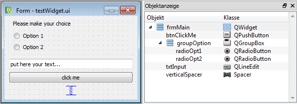

.. include:: ../include/global.inc

.. _qtdesigner:

Creating advanced dialogs and windows
**************************************

With |itom| it is not only possible to add menus and toolbar elements to the main GUI of |itom| or to use the default set of input and message boxes, but
it is also possible to create own user interfaces. These interfaces are designed by help of a WYSIWYG ("what you see is what you get") design tool (Qt Designer).
The logic behind the surfaces is then scripted using |python|. Therefore it is possible to change the appearance of control elements at runtime or to connect
a signal, emitted when for instance clicking on a button, with a user-defined python method.

In this chapter, the creation of such user interfaces is explained.

Qt Designer
==============

| The Qt Designer can be used to create a GUI for interaction with the |itom| software.
| For details see the Qt Designer documentation under http://doc.qt.io/qt-5/qtdesigner-manual.html

In order to start the **Qt Designer**, click on the corresponding icon in the toolbar of |itom|:

.. figure:: images_userGUI/mainsymbols2.png
    :scale: 100%
    :align: center

or double-click on a corresponding **ui**-file in the file system widget of |itom|. In the first case, **Qt Designer** shows an initialization dialog, where you
can choose the base type of the user interface you want to create.

.. figure:: images_userGUI/designerNew.png
    :scale: 100%
    :align: center
    
.. note::
    
    There is a known issue in the setup 1.4.0 (or earlier) concerning an unsuccessful startup of the external Qt designer. If you want to open
    the designer using the button in the toolbox of the itom main window, the startup may fail. This bug is known and will be fixed
    in future releases. Until then, please open the designer either by starting the **designer.exe** in the application folder of itom
    or open an existing ui-file (e.g. in the demo folder of itom). This issue only affects setup versions (32bit and 64bit) for Windows.

In principle you have the possibility to choose between three different base layouts:

1. **Dialog**. A Dialog is usually displayed on top of the main window and only has got one close-button in its title bar. Often, dialogs are used for configuration dialogs where the
user finally closes the dialog using one of the standard buttons (OK, Cancel, Apply...) in order to confirm or reject the current changes in the dialog. A dialog cannot have its
own toolbar, menu or status bar.
2. **Main Window**. A main window is a fully equipped main window, which can be minimized, maximized, can have toolbars, menus and a status bar. Therefore it is recommended to use this
type of user interface for the main window of your measurement system. Like a dialog, it is possible to show the main window on top of |itom| (as sub-window of |itom|) or as independent
window, which has its own icon in the windows tray.
3. **Widget**. A widget is the base class for all control elements provided by |Qt|. Therefore a widget does not have any title bar or windows frame. Nevertheless you can choose a widget
for your user interface, since |itom| provides the possibility to stack this widget into a default dialog which can optionally show some default buttons on the right side or at the
bottom of the dialog. This is the easiest way the generate a configuration dialog in |itom|, since you do not need to script the necessary methods handling clicks on one of these buttons.
In this case, |itom| automatically gets full information about the close status and type of closing of the dialog (accepted, rejected...).

After having chosen one of these base layouts (types), your surface is displayed in the middle of the **Qt Designer** and you can start to drag elements from the widget library
on your surface. If the **Qt Designer** is started from |itom| you will even find a section **ITOM Plugins** in the library list, which contains all loadable designer plugins that are
provided by |itom| and can also be placed on your surface. The choice of these plugins depend on the designer plugins that are currently available in your installation of |itom|.

.. figure:: images_userGUI/qtdesigner1.png
    :scale: 100%
    :align: center

After having placed one widget on the canvas, you will see its properties in the property toolbox of **Qt Designer**. Every widget has the common property **objectName**. If you assign
a unique object name to any of your control elements, it is possible to access and manipulate this widget from a |python| script in |itom| using this name, too. In general many of the
properties that are visible in the property toolbox can afterwards be read or changed by an appropriate script (depending on the data type of the property).

The alignment of control elements on the surface is mainly controlled by so-called layout elements. These layouts together with size policies that can be assigned to every widget 
control the appearance of the entire user interface and provide the feature that the dialog can be changed in size whereas all widgets are dynamically repositioned. For more information
about layouting your user interface, see http://qt-project.org/doc/qt-5/designer-layouts.html.

Finally, save your user interface under a convenient filename with the suffix **.ui**.

Widget Library
---------------

In principle, you are allowed to place every widget on your user interface that is available in the widget library (widget box) of **Qt Designer**. Later, you will learn how you can
access properties of any widget (read and/or write) and how you can call specific functions provided by any widget. However, you will also learn that you do not have access using |python|
to all functions a widget has and you are not able to sub-class any widget, like you can it using a native **C++** program. Therefore, it is not recommended to place any widget from the
group **Item Views (Model-based)** on your user interface since only few functions of these widgets are accessible by a |python| script. If you need a list box, use the item-based list
widget. |itom| also provides some widgets (section **ITOM widgets**) that can be placed on your user interfaces, for instance some plot widgets or the widget for plotting the result of
the python module matplotlib (see :ref:`pymod-matplotlib`).

Loading user interface in |itom|
=================================

In this section, an introduction is given how to create and load user interfaces in |itom| depending on different type-attributes.

Widget embedded in |itom|-dialog (TYPEDIALOG)
---------------------------------------------

Like described above, the easiest and most comfortable way to load user interfaces in |itom| is to use the type **TYPEDIALOG**. In **Qt Creator** you design a widget with your
individual content and then when loading this GUI in |itom|, the widget is embedded in a dialog provided by |itom|, which optionally adds a horizontal or vertical button bar
at the right side or at the bottom of the dialog.

Let us create an exemplary user interface. In **Qt Creator** the following widget has been created:

On the right side of the widget *testWidget* you see the hierarchical organization of objects that are put on the widget. At first, a group box has been placed on the widget. Inside of
this group box two radio buttons have been placed using a simple drag&drop from the widget library. Both radio buttons are aligned inside of the group box with a vertical layout. This
is reached by a right-click on the group box and choosing *vertical layout* from the *layout* menu. Below the group box, a widget of type *lineedit* and a push button (type *pushbutton*)
have been placed. Finally the three main elements are also aligned in a vertical layout with respect to the overall widget. This can be achieved by a right click on an empty space of
the widget or directly in the *object inspector*. If you increase now the size of the overall widget, you will see that all sub-elements are resized according to their layout. Since
we don't want sub-widgets to be vertically stretched and distributed, a vertical spacer element has been placed at the bottom of the vertical layout stack.

The following properties have been directly set in **Qt Creator**:

* group box: *objectName*: groupOption, *title*: 'Please make your choice'
* push button: *objectName*: btnClickMe, *text*: 'click me'
* line edit: *objectName*: txtInput, *text*: 'put here your text...'
* radio buttons: *objectName*: radioOpt1 and radioOpt2, *text*: 'Option 1' and 'Option 2'

The entire widget is saved under the filename *testWidget.ui* in an arbitrary directory.

Then you can load and show the widget in |itom| by creating a python-script in the same directory with the following content. You can also directly type these lines into the command line of |itom|, however, you should then assure that the current directory is equal to the directory where the user interface has been stored.

.. code-block:: python
    
    dialog = ui("testWidget.ui", ui.TYPEDIALOG) #loading dialog
    result = dialog.show(1) #modally show, wait until the dialog has been closed
    print("The dialog has been closed with code", result)

At first, an instance of class :py:class:`itom.ui` is created that is given the name of the user interface file. This instance can then be accessed by the name *dialog*.
By calling the method :py:meth:`~itom.ui.show`, the dialog is shown. Since the parameter has been set to **1**, the dialog is shown in a modal style, such that python waits
until the dialog has been closed again and |itom| is entirely blocked during that time. However, then it is possible to get informed about the way the dialog is closed, such
that the variable *result* will be set to *0* if the user closed the dialog using a cancel button (not available here) or the close button in the title bar or *1* if the user
clicked an **OK**-button.

.. figure:: images_userGUI/testWidgetItom.png
    :scale: 100%
    :align: center

It is also possible to open the dialog in a non-modal version or to open it in a modal style however to immediately force python to continue the script execution. This depends
on the parameters of :py:meth:`~itom.ui.show`. However only in the modal case above, the closing result can be tracked by |python|. Additionally, this is also only possible if 
a widget is embedded in a dialog, given by |itom|, like it is always the case if you create an instance of :py:class:`itom.ui` with the second parameter set to **ui.TYPEDIALOG**.

Right now, you don't have the possibility to quit the dialog using any button (**OK**, **Cancel**...). In order to obtain a button bar with these buttons, the call to the class
:py:class:`itom.ui` needs to be changed. There is the choice between two different appearances of a button bar, which can be automatically added to your widget:

.. figure:: images_userGUI/testWidgetButtonBar.png
    :scale: 100%
    :align: center

Next, you need to select which buttons should be included in the button bar. This is done by creating a python dictionary, where each elements corresponds to one button. The
key-word of the item corresponds to the role of the button (see enumeration *QDialogButtonBox::ButtonRole** of the |Qt|-library documentation) and the value is the text of the
button. Common roles are:

* "AcceptRole": Use this role for an **OK**-button. The dialog is closed and the return value in modal style is 1.
* "RejectRole": Use this role for a **Cancel**-button. The dialog is also closed but the return value is 0.

Finally, the call to :py:class:`itom.ui` must be in the following way, in order to get an auto-generated button bar:

.. code-block:: python
    
    dialog = ui("testWidget.ui", ui.TYPEDIALOG, ui.BUTTONBAR_VERTICAL, \
        {"AcceptRole":"OK", "RejectRole":"Cancel"})
    #or
    dialog = ui("testWidget.ui", ui.TYPEDIALOG, ui.BUTTONBAR_HORIZONTAL, \
        {"AcceptRole":"Yes", "RejectRole":"No"})

.. note::
    
    You can also use a keyword-based call to **ui** since every parameter has its default value such that you can omit parameters beside the first one.
    For more details about all parameters, keywords and its default values see :py:class:`itom.ui`.

The dialog is closed and deleted if the variable **dialog** is deleted using the command **del**.

Main window or dialog (TYPEWINDOW)
----------------------------------

If you are not interested in the exact return value of the dialog but you want to have full control and all available functionalities of any dialog or main window,
create an user interface based on a **dialog** or **main window** in **Qt Designer**.

.. figure:: images_userGUI/testWindow.png
    :align: center
    :scale: 100%

The figure shows an exemplary user interface (**testWindow.ui**) that is based on a main window. On the right side, there have been added three buttons, nested in a vertical layout.
On the left side, there is a list widget (objectName: **listWidget**, type: **List Widget**). Additionally a menu has been added that consists of three items.

This main window can now be shown using the following code snippet:

.. code-block:: python
    
    win = ui("testWindow.ui", ui.TYPEWINDOW)
    win.show() #this is equal to win.show(0) -> non-modal

Then, the window is shown on top of the main window of |itom|, since it is considered to be a child of |itom|. If you don't want this, you can also add the keyword-parameter
*childOfMainWindow=False* to the call of :py:class:`itom.ui`:

.. code-block:: python
    
    win = ui("testWindow.ui", ui.TYPEWINDOW, childOfMainWindow=False)

Here, you need to use the keyword, since the parameters *dialogButtonBar* and *dialogButtons* (used for TYPEDIALOG) are not given in this case, since they are useless in case of
*TYPEWINDOW*. If your window is no child of |itom|, it gets its own icon in the Windows tray bar and does not stay on top of |itom|.

Main window or widget as dockable toolbox (TYPEDOCKWIDGET)
-----------------------------------------------------------

It is also possible to integrate user-defined main windows or widgets as dockable toolbox in the main window of |itom|. This is done using the type value **ui.TYPEDOCKWIDGET**. Then the
widget is registered as dockwidget in the main window of |itom| and once it becomes visible, its startup position is at the top-center position. You can define the initial dock area using
the optional argument *dockWidgetArea* of the class :py:class:`itom.ui`.

.. code-block:: python
    
    win = ui("testWindow.ui", ui.TYPEDOCKWIDGET, dockWidgetArea = ui.RIGHTDOCKWIDGETAREA)
    
Possible values for *dockWidgetArea* are:
    
    * ui.LEFTDOCKWIDGETAREA = 1
    * ui.RIGHTDOCKWIDGETAREA = 2
    * ui.TOPDOCKWIDGETAREA = 4
    * ui.BOTTOMDOCKWIDGETAREA = 8

Main window or widget as part of the central widget area of itom (TYPECENTRALWIDGET)
-------------------------------------------------------------------------------------

It is also possible to integrate user-defined main windows or widgets as part of the central widget area of the main window of |itom|. This is done using the type value **ui.TYPECENTRALWIDGET**. 
The central widget area can contain several widgets which are vertically stacked and whose size can be vertically changed by a splitter layout.
Per default, this central area only contains the command line. Every new widget that is added to this area is prepended to the top.

The current size of all widgets in the central area (including the command) line, can be changed via `itom.setCentralWidgetsSizes`. This method
expects a list of integers as argument which correspond to the desired height of every widget in pixels (0: the widget is collapsed and can be
made visible again with the mouse). If the sum of all sizes does not correspond to the current height of the central area, the sizes are distributed
based on their relative weights.

.. code-block:: python
    
    import itom
    win = itom.ui("testWindow.ui", ui.TYPECENTRALWIDGET)
    itom.setCentralWidgetsSizes([400,300]) #desired height of 400px for the new widget 'win' and 300px for the command line of itom.

Accessing control elements
==========================

Until now, you know how to design an interface and how to show it using |itom|. This and the following sections explain how you dynamically interact with the user interface and
its elements. One elementary tool for this is to access any desired element of the GUI. For instance, if you want to change properties of a button or the text of a lineedit-widget,
you first need to access these elements.

The accessing is simply done by the unique and specific **objectName** of each element and the dot-operator (**.**). Let's take the first example **testWidget.ui** again. The
dialog has been assigned the variable **dialog**. Then have the following possibilities to access its elements:

.. code-block:: python
    
    elemGroup = dialog.groupOption # access the group box by its objectName
    
    elemRadioOpt1 = dialog.radioOpt1 # OR
    elemRadioOpt1 = elemGroup.radioOpt1
    
    textfield = dialog.txtInput

Each variable created by the code block above is an instance of :py:class:`itom.uiItem`. It is this class that defines the dot-operator. Looking at the example of accessing the first radio
button, which is a child of the group-box, it is both possible to access the group button by its objectName as child of the entire dialog or as child of the groupbox. This is feasible
since the class :py:class:`~itom.ui` is derived from :py:class:`~itom.uiItem`, such that the dot-operator not only works for entire dialog references but also for accessing sub-elements 
of other widgets. However, since each objectName is unique among all elements of the entire dialog, is doesn't matter how to access any element.

An alternative access to child widgets is provided by the method :py:meth:`~itom.uiItem.getChild` which has the desired objectName as argument:

.. code-block:: python
    
    elemGroup = dialog.getChild("groupOption")

This method can for instance be used if the widgetName is created from a formatted string.

But why do we need to access these elements? Why do they returns its own instance of class :py:class:`~itom.uiItem`. These questions are answered in the following sections...

.. _qtdesigner-getsetprops:

Getting and setting properties
==============================

As already mentioned, you can read or write most properties of any element that are also listed in the property toolbox of **Qt Designer**. Properties are also separately listed in the
corresponding |Qt| documentation. In general it makes sense to set properties - when offline possible - in the **Qt Designer**. This is a little bit more efficient and keeps your
script tiny. Getting and setting properties is possible if you have an object of type :py:class:`~itom.uiItem`. Therefore you need to get this object like described in the section above.

Getting the property value can either be done by using the mapping-operator **[]** or by using the method :py:meth:`~itom.uiItem.getProperty`. For instance, if you want to get the current text 
and the enabled status of the textfield in dialog *testWidget.ui* from the first example, you can use one of the following possibilities:

.. code-block:: python
    
    #1. possibility
    text = dialog.txtInput["text"]
    enabled = dialog.txtInput["enabled"]
    
    #2. possibility
    [text,enabled] = dialog.txtInput.getProperty(["text", "enabled"])

.. note::
    
    For accessing single properties, it is shorter and easier to use the mapping-operator **[]**. However, due to the interal thread-structure of |itom|, it is a little bit faster to
    access multiple properties of the same widget using the method :py:meth:`~itom.uiItem.getProperty`.

In order to set one or multiple properties, you can use similar methods. Simply assign a value to the mapping-operator **[]** or use the method :py:meth:`~itom.uiItem.setProperty`.

.. code-block:: python
    
    #1. possibility
    dialog.txtInput["text"] = "new text for this textfield"
    dialog.txtInput["enabled"] = False
    
    #2. possibility
    dialog.txtInput.setProperty( {"text":"new text for this textfield", \
        "enabled":False} )

If you use :py:meth:`~itom.uiItem.setProperty`, you always need to pass a dictionary as argument. This dictionary can contain one or multiple properties, where the keyword
always is the property-name (string) and the value is the corresponding new value (type depends on corresponding C++ type).
For more information about supported datatypes, that can be accessed by python in |itom| see :ref:`qtdesigner-datatypes`.

If the property is an enumeration or a bitmask (or-combination of enumeration values), you can either pass the integer value or a string with the enumeration key name.
In case of a flag, pass a semicolon-separated string with all values. The return value is always the integer number.

.. _qtdesigner-datatypes:

Supported datatypes
===================

The classes :py:class:`itom.ui` and :py:class:`itom.uiItem` are the connection between any python-script in |itom| and GUI-elements, written in C++ and provided by |Qt|.
Therefore, it is necessary to transform types from python to corresponding C++-structures and vice-versa. The following table lists some convenient type casts. In general,
it is always tried to convert the input type to the desired destination type, such that a number can also be transformed to a string, if it is always known, that the destination
requires a string.

================= ===========================================================================
C++/Qt-Type       Python-Type  
================= ===========================================================================
QString           str or any type, that has a string representation
QByteArray        unicode or byte type
QUrl              any string that can be interpreted as Url
bool              any type that can be casted to a boolean value (1,0,True,False...)
QStringList       any sequence that only contains values castable to QString
int, short, long  integer, floats are rounded to integer, True=1, False=0
unsigned int ...  integer, floats are rounded to integer, True=1, False=0
float, double     integer, floats, True=1.0, False=0.0
QVector<int>      any sequence whose values are castable to int
QVector<double>   any sequence whose values are castable to float
QList<int>        any sequence whose values are castable to int
QList<double>     any sequence whose values are castable to float
QVector2D         any sequence with two values castable to float (x,y)
QVector3D         any sequence with three values castable to float (x,y,z)
QVector4D         any sequence with four values castable to float (x,y,z,w)
PCLPointCloud     :py:class:`~itom.pointCloud`
PCLPoint          :py:class:`~itom.point`
PCLPolygonMesh    :py:class:`~itom.polygonMesh`
DataObject*       :py:class:`~itom.dataObject` or any type convertable to an array (see numpy)
AddInDataIO*      :py:class:`~itom.dataIO`
AddInActuator*    :py:class:`~itom.actuator`
QVariant          any of the types above can be transformed to QVariant
QVariantMap       a dictionary where keys are strings and values are generally convertable.
QVariantList      any sequence whose items can be convertable.
QRegion           :py:class:`~itom.region`
QColor            string with color name or hex-value or :py:class:`~itom.rgba`
Enumeration       integer with value or string with key (setter only)
QTime             datetime.time object
QDate             datetime.date object
QDateTime         datetime.datetime object
QFont             :py:class:`~itom.font`
Qt::CheckState    int (0: unchecked, 1: partially checked, 2: checked)
Qt::ItemFlags     int, bitmask (see Qt::ItemFlags for definitions)
================= ===========================================================================

If a property or other arguments in |Qt| require other datatypes, it is possibly to implement a converter for them. It only becomes a little bit more difficult for pointers to
extended C++ or |Qt| classes. The conversion is mainly done in the |itom| class **PythonQtConversion**.

Connecting signals
==================

Now, you know how to change properties of dialogs at runtime of |itom| using a small python script snippet. In this section, you will learn how you can let |itom| a specific python-method 
for instance if a button on the user interface is clicked. Whenever something is changed in a user interface or the user starts to interact with the interface, any type of event is emitted.
In |Qt| many of these events are specially handled and called signals. For instance, if an user clicks a button, toggles a checkbox, triggers an item in a menu or selects an item in a list
widget, a signal is emitted or sent.

The counterpart to a signal is called slot. |Qt| provides the possibility to **connect** a signal with a slot, under the only condition, that both have exactly the same order and type
of arguments. It is even possible to connect the same signal to various slots. Whenever a signal is emitted, all connected slots are executed. |itom| provides you the possibility to
define slots in form of ordinary python methods or functions and to also connect them to signals of widgets on your user interface.

For establishing the connection, you need again a reference to the specific widget on the user interface. This reference is any variable of type :py:class:`~itom.uiItem`. Next, you need the
name and the arguments of the |Qt| signal, you want to connec to. This information can be obtained by the |Qt| documentation. For instance, if you need any signal that a widget of type
**QPushButton** (the type of our push button, placed in the user interface in file **testWidget.ui**), go to https://doc.qt.io/qt-5/qpushbutton.html. Unfortunately, you won't find
a headline called **Signals** at this page, since **QPushButton** does not directly declare any signal. However, you can see under **Additional Inherited Members**, that **QPushButton**
inherits signals from its base classes. The most important signals are inherited from **QAbstractButton**. Click on its link and you will see the available signals for a push button:

.. code-block:: c++
    
    void clicked ( bool checked = false )
    void pressed ()
    void released ()
    void toggled ( bool checked )

If any argument provides a default value, you can also omit the specific argument. Select the signal that is convenient for you and create its string-signature. The signature always
contains the following structure::
    
    signature = "signalName(typeName1,typeName2,...)"

For instance, the signatures for the signals above are::
    
    "clicked()" or "clicked(bool)"
    "pressed()"
    "released()"
    "toggled(bool)"

Then, create a python method in your script, which you want to consider to be a slot and that should be connected with the signal. This method always requires the same number of
arguments than given in the signature. If you want to connect a signal to a method that is a bounded method of a class in python, the first argument **self** does not count to the
number of total arguments, hence, you always need to define the first parameter **self**, like it is the case for bounded methods.

Finally, use the method :py:meth:`~itom.uiItem.connect` in order to establish the connection. For instance let us create a method, that should show a message when the push button "click me"
on the first exemplary dialog (*testWidget.ui*) has been clicked:

.. code-block:: python
    
    dialog = ui("testWidget.ui", ui.TYPEDIALOG, ui.BUTTONBAR_VERTICAL, \
        {"AcceptRole":"OK", "RejectRole":"Cancel"})
    
    def showMsg():
        #slot executed in button 'click me' is clicked
        ui.msgInformation("itom","you pressed the button click me")
    
    #connect(signature, method)
    dialog.btnClickMe.connect( "clicked()", showMsg )
    
    #show dialog
    dialog.show()

You have seen that the method :py:meth:`~itom.uiItem.connect` of the element *dialog.btnClickMe* (the push button) has been called. Its first argument is
the signature of the signal, as second argument the reference to the slot-methods is given. If you integrate the dialog within a class and the slot is a member of this class, too,
the exemplary code can look as follows:

.. code-block:: python
    
    class MyDialog():
        
        def __init__(self):
            self.dialog = ui("testWidget.ui", ui.TYPEDIALOG, ui.BUTTONBAR_VERTICAL, \
                {"AcceptRole":"OK", "RejectRole":"Cancel"})
            self.dialog.btnClickMe.connect("clicked()", self.showMsg)
            self.dialog.show()
        
        def showMsg(self):
            ui.msgInformation("itom","you pressed the button click me")
    
    #instance of class MyDialog
    test = MyDialog()
            

Let us use the second example **testWindow.ui**. If you want a python method to be executed if the user clicks an action in the menu of the main window, you should connect
the signal **triggered()** of every item in the menu with your method. In |Qt| such an item is an instance of *QAction* and is also accessed by its *objectName*.

.. code-block:: python
    
    win = ui("testWindow.ui", ui.TYPEWINDOW)
    
    def addItem():
        print("action addItem clicked")
    
    win.actionAddItem.connect("triggered()", addItem) 
    #actionAddItem is the objectName of the action
    win.show()

.. note::
    
    **New in itom 3.2**
    
    The method :py:meth:`~itom.uiItem.connect` now has the additional optional argument **minRepeatInterval**. If this is given with a value > 0,
    the connected slot will only be called, if the last call from the same signal happened at least **minRepeatInterval** ms ago. Else, the new
    call is ignored. This can be used, to avoid that signals, that are fired very often, will jam the incoming event queue of the corresponding Python method.
    
    It is further possible to not only connect signals from widgets to Python slots, but also signals from **dataIO** or **actuator** instances. For this, see
    the methods :py:meth:`~itom.dataIO.connect` and :py:meth:`itom.actuator.connect`.

.. _qtdesigner-slots:

Calling slots
=============

Widgets on user interfaces not only emit signals but they also have slots defined, such that you can connect other signals (e.g. from other widgets) to these slots. Using a python
script in |itom| you can also call (*or:* invoke) these slots. 

.. note::
    
    With respect to the documentation of |Qt| it is only possible to invoke slots of widgets from python, but it is not possible
    to call public, protected or private member methods. This is a limitation of |itom|. Other python packages like *pySide* or *PyQt* offer this possibility, however their use is not
    possible in |itom|, since they require the python interpreter to be executed in the main thread, which is not the case in |itom|, where |python| runs in its own secondary thread.

In order to invoke a slot, call the method :py:meth:`~itom.uiItem.call` of any element on your user interface. For instance, in order to clear the list widget (*objectName*: *listWidget*) 
of **uiWindow.ui**, you can invoke its public slot **clear()**:

.. code-block:: python
    
    win = ui("testWindow.ui", ui.TYPEWINDOW)
    listWidget = win.listWidget
    listWidget.call("clear")

Here, the method :py:meth:`~itom.uiItem.call` is only called with one argument, the name of the slot in |Qt|. If this slot would have any arguments that can be converted from |python| (see
:ref:`qtdesigner-datatypes`), add these arguments as further parameters to the call.

Unfortunately, there are some methods of important widgets in |Qt|, which are not defined to be a *public slot*. For instance, the methods to add item(s) to a list widget are no slots.
However, there are some exceptions defined in |itom| such that some *public methods* of widgets can also be called with the method :py:meth:`~itom.uiItem.call`. These exceptions are 
contained in the following table:

.. py:function:: QWidget::resize(int width, int height) -> None

    resizes the widget to width / height.

.. py:function:: QWidget::setGeometry(int x, int y, int width, int height) -> None

    changes the geometry of the widget.

.. py:function:: QWidget::setCursor(int index) -> None
    
    sets the given cursor for this uiItem. The number is a value of the enumeration `Qt::CursorShape <https://doc.qt.io/qt-5/qt.html#CursorShape-enum/>`_. A number < 0 will unset the current cursor.
    
    *New in **itom** 3.2*

.. py:function:: QWidget::devicePixelRatioF() -> float
    
    Returns the device pixel ratio for the device as a floating point number. Only if **itom** is compiled against Qt >= 5.6, else 1.0 is returned always.
    
    *New in **itom** 3.2*

.. py:function:: QListWidget::addItem(str item) -> None
    
    adds the item to the list

.. py:function:: QListWidget::addItems(Sequence[str] items) -> None
    
    adds the given items in the given order to the list.

.. py:function:: QListWidget::selectedRows() -> Tuple[int]
    
    returns a tuple of all selected row indices

.. py:function:: QListWidget::selectedTexts() -> Tuple[str]
    
    returns a tuple of all selected values

.. py:function:: QListWidget::selectRows(Sequence[int] indices) -> None
    
    select the rows with the given indices (ListWidget must be in multi-selection mode)

.. py:function:: QListWidget::takeItem(int row) -> str
    
    removes and returns the text of the item from the given row in the list widget. Raises an exception if the item does not exist.

.. py:function:: QListWidget::item(int row) -> str
    
    returns the text of the item from the given row or raises an exception if the item does not exist

.. py:function:: QListWidget::setItemText(int row, str text) -> None
    
    sets the text of the item from the given row or raises an exception if the item does not exist
    
    *New in **itom** > 3.2.1*

.. py:function:: QListWidget::checkState(int row) -> int (Qt::CheckState)
    
    returns the check state of the item from the given row (0: unchecked, 1: partially checked, 2: checked) or raises an exception if the item does not exist.
    For possible values of flags, see the enumeration `Qt::ItemFlags <https://doc.qt.io/qt-5/qt.html#CheckFlag-enum/>`_.

.. py:function:: QListWidget::setCheckState(int row, Qt::CheckState state) -> None
    
    set the check state of the item in the given row (0: unchecked, 1: partially checked, 2: checked) - set the flags properly before changing the state.
    For possible values of flags, see the enumeration `Qt::ItemFlags <https://doc.qt.io/qt-5/qt.html#CheckFlag-enum/>`_.

.. py:function:: QListWidget::flags(int row) -> int (Qt::ItemFlags)
    
    returns the flags used to describe this item (e.g. checkable, tristate, editable, selectable...).
    For possible values of flags, see the enumeration `Qt::ItemFlags <https://doc.qt.io/qt-5/qt.html#ItemFlag-enum/>`_.

.. py:function:: QListWidget::setFlags(int row, Qt::ItemFlags flags) -> None
    
    set the flags of the item in the given row based on the flags bitmask (use an integer). You have to set the flags properly before changing the state.
    For possible values of flags, see the enumeration `Qt::ItemFlags <https://doc.qt.io/qt-5/qt.html#ItemFlag-enum/>`_.

.. py:function:: QComboBox::addItem(str item) -> None
    
    appends the given item to the combo box

.. py:function:: QComboBox::addItems(Sequence[str] items) -> None
    
    appends the given items to the combo box

.. py:function:: QComboBox::removeItem(int index) -> None
    
    remove the item in the combo box given by index

.. py:function:: QComboBox::setItemData(int index, variant value) -> None
    
    sets the displayed text of the item given by index to the given value.
    *value* can be of any type, that can be converted to a string representation (originally: QVariant).

.. py:function:: QComboBox::insertItem(int index , str item) -> None
    
    Inserts the item at the position in the list given by index.
    
.. py:function:: QComboBox::itemText(int index) -> str
    
    returns the text of the item in the combo box given by index.

.. py:function:: QTabWidget::isTabEnabled(int index) -> bool
    
    returns True, if the tab, given by index, is enabled; else False
    
.. py:function:: QTabWidget::setTabEnabled(int index, bool enabled) -> None
    
    sets the enable state of the tab, given by index.

.. py:function:: QMainWindow::statusBar() -> uiItem
    
    returns a reference to the statusbar widget as :py:class:`~itom.uiItem`.

.. py:function:: QMainWindow::centralWidget() -> uiItem 
    
    returns a reference to the central widget of the mainWindow as :py:class:`~itom.uiItem`.

.. py:function:: QMainWindow::addToolBar(str name, str objectName) -> uiItem
    
    adds a new toolbar with the given name to the main window and returns its reference as :py:class:`~itom.uiItem`.
    If objectName is a nonempty string, it is used as internal object name of the new toolbar.
    
    *New in **itom** 3.2*

.. py:function:: QTableWidget::setHorizontalHeaderLabels(Sequence[str] labels) -> None
    
    sets the labels of the horizontal header labels

.. py:function:: QTableWidget::setVerticalHeaderLabels(Sequence[str] labels) -> None
    
    sets the labels of the vertical header labels

.. py:function:: QTableWidget::getItem(int row, int column) -> variant (QVariant)
    
    returns the value of the item, given by row and column

.. py:function:: QTableWidget::setItem(int row, int column, variant value) -> None
    
    sets the value of the item, given by row and column, to the given value (any type, castable to QVariant).

.. py:function:: QTableWidget::currentColumn() -> int
    
    returns the index of the currently selected column

.. py:function:: QTableWidget::currentRow() -> int
    
    returns the index of the currently selected row

.. py:function:: QTableWidget::checkState(int row, int column) -> int (Qt::CheckState)
    
    returns the check state of the item from the given row and column (0: unchecked, 1: partially checked, 2: checked) or raises an exception if the item does not exist.

.. py:function:: QTableWidget::setCheckState(int row, int column,Qt::CheckState state) -> None
    
    set the check state of the item in the given row and column (0: unchecked, 1: partially checked, 2: checked) - set the flags properly before changing the state.

.. py:function:: QTableWidget::flags(int row, int column) -> int (Qt::ItemFlags)
    
    returns the flags used to describe this item (e.g. checkable, tristate, editable, selectable...).
    For possible values of flags, see the enumeration `Qt::ItemFlags <https://doc.qt.io/qt-5/qt.html#ItemFlag-enum/>`_.

.. py:function:: QTableWidget::setFlags(int row, int column, Qt::ItemFlags flags) -> None
    
    set the flags of the item in the given row and column based on the flags bitmask (use an integer). You have to set the flags properly before changing the state.
    For possible values of flags, see the enumeration `Qt::ItemFlags <https://doc.qt.io/qt-5/qt.html#ItemFlag-enum/>`_.

.. py:function:: QTableView::horizontalHeader() -> uiItem
    
    returns a reference to the horizontal header widget as :py:class:`~itom.uiItem`.

.. py:function:: QTableView::verticalHeader() -> uiItem
    
    returns a reference to the vertical header widget as :py:class:`~itom.uiItem`.

.. py:function:: QSplitter::setStretchFactor(int section, int factor) -> None
    
    sets the stretch factor (size policy) for the given section.

.. py:function:: QSplitter::sizes() -> Tuple[int]
    
    returns the sizes (in pixel) of each section as tuple.

.. py:function:: QSplitter::setSizes(Sequence[int] sizes) -> None
    
    sets the sizes of all sections (in pixels). Pass sizes as tuple or list of integers.

.. py:function:: QSplitter::isCollapsible(int section) -> bool
    
    returns True if the given section is collapsible, else False

.. py:function:: QSplitter::setCollapsible(int section, bool value) -> None
    
    set if the given section should be collapsible (True) or not (False)

.. py:function:: QStatusBar::addLabelWidget(str objectName) -> uiItem 
    
    adds an empty label (class: QLabel) to the status bar with the given object name and returns its reference as :py:class:`~itom.uiItem`.
    
    *New in **itom** 3.2*

.. py:function:: QStatusBar::currentText() -> str 
    
    Returns the temporary message currently shown, or an empty string if there is no such message.
    
    *New in **itom** 3.2*

.. py:function:: QToolBar::addSeparator() -> uiItem
    
    adds a new separator to the toolbar and returns its reference as :py:class:`~itom.uiItem`.
    
    *New in **itom** 3.2*

.. py:function:: QToolBar::addAction(str label, str objectName) -> uiItem
    
    adds a new action to the toolbar and returns its reference (QAction) as :py:class:`~itom.uiItem`.
    The action has a label text, as well as an optional objectName. No objectName is assigned if it is an empty string.
    
    You can assign an icon to this action, by the following sample code:
    
    .. code-block:: python
        
        #given is the uiItem of the toolbar as 'myToolbar'
        a = myToolbar.call("addAction", "do it", "do_it")
        a.call("setIcon", "C:/temp/icon.png", 1.0)
    
    *New in **itom** 3.2*

.. py:function:: QAction::setIcon(str filename, float scaleFactor) -> None
    
    sets the icon of the action to the given filename and optionally defines a certain scaling factor, which
    is the pixel ratio that is applied to the icon (usually: 1.0).
    
    *New in **itom** 3.2*

Please notice, that every method listed above is also valid for a widget, that is derived from the specific class (derived in C++). Therefore the additional slots of *QWidget*
hold for every other widget, since every widget is derived from *QWidget*.

.. note::
    
    Whenever the return value is of type :py:class:`~itom.uiItem`, the original C++ datatype is a pointer to **QWidget**. This pointer is specially wrapped in a thread-safe process to the
    corresponding instance of :py:class:`~itom.uiItem`, that represents the specific widget.
    
    The special slots defined in the table above are given in the class **WidgetWrapper** of |itom|.

Connecting internal signals and slots in **Qt Designer**
========================================================

.. |qtsignalslotmode| image:: images_userGUI/designer-connection-tool.png

If you want to connect the signal, emitted by any widget, with a slot from another widget, you will learn in this section how to do this. This type of connection can for instance
be useful if you want to enable or disable certain widgets depending on the status of other ones, like the check-status of a checkbox. The following figure shows an user interface
with a checkbox and a textfield. Let us define a signal-slot-connection, such that the textfield gets disabled if the checkbox is unchecked.

.. figure:: images_userGUI/uiSignalSlot1.png
    :scale: 100%
    :align: center

This type of gui-internal connections are completely done in **Qt Creator**. Therefore chose the "Signal and Slots" editing mode, that is obtained by clicking the symbol |qtsignalslotmode|
in the toolbar or by pressing *F4*. Then you can make a drag&drop connection between the emitting widget and the receiver-widget. After releasing the mouse button, the connection dialog,
depicted in the following figure becomes visible:

.. figure:: images_userGUI/uiSignalSlot2.png
    :scale: 100%
    :align: center

Here you can choose which signal of the emitting widget should be connected with which slot of the destination. At the beginning, only slots and signals of the specific widget classes are
visible. However, you can check the checkbox below, in order to also show the signals and slots of the inherited classes. Please make sure, that you only choose pairs of signals and
slots which have the same parameter types. In our case, we connect the signal *toggled(bool)* with the slot *setEnabled(bool)*, which is the setter-method of the property *enabled*.

This example has also shown, that not only slots defined in the slot-section can be called as slots, but also every setter-method of any property can be called like every slot. However,
in this case it is more convenient the property like described in section :ref:`qtdesigner-getsetprops`.

Auto-connecting signals using python decorators
===============================================

|itom| provides an optional approach to directly connect methods with a specific signal of a widget. An example for this approach is for instance given in the demo script **autoConnectDemo.py**
in the **demo/ui** subfolder of the itom installation.

The concept is as follows:

1. import the class **ItomUi** from the module **itomUi** (located in the subfolder **itom_packages** that is part of the Python search path::
    
    from itomUi import ItomUi
    
2. Create a class that is derived from **ItomUi**
3. In the constructor (method __init__) of your class call the constructor of the base class **ItomUi**. This constructor has the same arguments than the class :py:class:`itom.ui`. This is where you create the GUI from the ui file.
4. The :py:class:`~itom.ui` is accessible via the member variable **gui** of your class, hence, within a member method write **self.gui** to access the user interface and its widgets.
5. You can now connect one or multiple signals from one widget to one member method of your class.
6. The name of the member method must be::
    
    def on_ObjectNameOfWidget_SignalName(self, [arg1, arg2, ...]):
        pass
    
7. The argument is **self** (like it is always the case in object-oriented Python programming) followed by a series of arguments. The number of these arguments must correspond to the number of arguments the signal has.
8. Write one or multiple decorators above the method signature, to establish the connection. The decorator looks like this::
    
    @ItomUi.autoslot("args")
    
    Hereby, *args* corresponds to a comma separated list of all type names (in C++) the Qt signal is emitting.
    
As an example, we want to connect the **valueChanged** signal of a spin box (object-name: spinTestBox, argument obtained from Qt  help: one **int**)::
    
    @ItomUi.autoslot("int")
    def on_spinTestBox_valueChanged(self, value):
        print("The value of the spin box changed to", value)

Debugging user interfaces and slot-methods
==========================================

If you established a signal-slot-connection between an element of the GUI and a |python|-method, you probably want to debug this method once the signal has been emitted. This
is obtained by setting any breakpoint into the specific line and toggling the button *Run python code in debug mode* in the menu **Script** of |itom|.

.. figure:: images_userGUI/runPyCodeInDebug.png
    :scale: 100%
    :align: center
    
Access the status bar of a main window
=======================================

If one wants to access and modify the content of the status bar of a main window, the following steps need to be done:

Let's assume the main window is accessible via Python by the variable name **gui**, then

.. code-block:: python
    
    statusbar = gui.call("statusBar")

returns an instance of :py:class:`~itom.uiItem` representing the status bar widget (Qt class QStatusBar). Check the Qt help to see that QStatusBar has the following slots (among others):

* **clearMessage()** clears the current text of the status bar
* **showMessage(const QString &message)** displays *message* in the status bar
* **showMessage(const QString &message, int timeout)** displays *message* in the status bar and hides it after the *timeout* given in milliseconds.

Hints and limitations
==========================================

All methods described in this chapter explain how to create and use user-defined dialogs and windows using |python| scripts in |itom|. Finally, all dialogs are created using the
|Qt|-framework. The classes :py:class:`itom.ui` and :py:class:`itom.uiItem` finally are wrappers for the underlying |Qt|-system. Using pure python, similar things can also be
obtained with the famous packages **PyQt** or **PySide**. However, in |itom| you must not use these packages. The reason is, that create a new main instance of the |Qt|-engine, that
needs to be created in the main thread. This is the case, if **PyQt** or **PySide** is executed directly in |python|. However using |itom| |python| is embedded as scripting language, such
that |itom| is executed in the main thread while |python| is moved to its own additional thread. The reason is to enable the execution of longer scripts, while the main application |itom|
still keeps reactive. Therefore, |python| does not have access to the real main thread and it is forbidden to explicitly execute some GUI-related stuff in secondary threads. Therefore
all methods in :py:class:`itom.ui` and :py:class:`itom.uiItem` have thread-safe implementations and communicate with an organization structure, that runs in the main thread of |itom|, in
order to interact with all dialogs.
