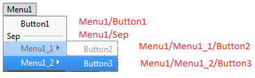
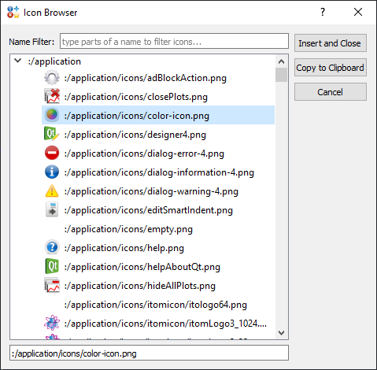

.. include:: ../include/global.inc

.. _toolbar-start:

Customize the menu and toolbars of |itom|
******************************************

In this section, it is shown how you can add user-defined toolbars and menus to the main window of |itom|. Clicks to these
execute arbitrary python code or methods. The creation of the toolbars, buttons and menus is done using python code, too.

.. _toolbar-addtoolbar:

Add toolbars and buttons
=========================

Using the embedded scripting language in |itom|, you can add own toolbars and buttons in order to automatically execute specific
|python|-commands or -methods. Every button is related to a toolbar defined by its toolbar-name. If a toolbar-name
does not already exist, a new toolbar with this name is created and the button is added to this toolbar. Every toolbar can be arbitrarily
positioned in |itom| or undocked to any floating position on your screen.

A single button in a toolbar is created using the command :py:func:`~itom.addButton`, vice-versa the button is removed with :py:func:`~itom.removeButton`. The syntax for both is:

.. code-block:: python
    
    buttonHandle = addButton(toolbarName, buttonName, code [, icon, argtuple])
    removeButton(toolbarName, buttonName)
    #or
    removeButton(buttonHandle)

Your button is accessed by its name **buttonName**, which is also printed on the button if no icon is defined. The toolbar, where the button
is displayed, is defined by its name **toolbarName**. You can either provide a python code snippet as string or a reference to any method or function.
If this method requires parameters, you can add these parameters as tuple to the keyword-parameter *argtuple*. Additionally, it is possible to
assign an icon to the button. Therefore you give the absolute path of the icon to the parameter *icon*. See the :ref:`icon section <toolbar-icons>` 
below about the different possibilities how to assign a valid filename.

In the following example, three different buttons which link to either a python code snippet or functions (with or without further arguments) are created:

.. code-block:: python
    
    def test1():
        print("The button test1 has been clicked")
    
    def test2(a,b):
        print("The result of a+b is",a+b)
    
    addButton("myToolbar","HelloWorld","print('Hello World')")
    addButton("myToolbar","BtnTest1",test1, ":/application/icons/itomicon/curAppIcon.png")
    addButton("myToolbar","BtnTest2",test2, argtuple=(4,7))

.. note::
    
    In this example, it is assumed that the module :py:mod:`itom` has been globally and totally imported by::
        
        from itom import *
    
    If this is not the case, you can also import :py:mod:`itom` and call *itom.addButton(...)*.
    Additionally, if you create a button in a toolbar, whose name already exists, the previous button will be deleted first.
    If you assign a code-snippet to the **code**-parameter that includes quotation marks, make sure that the quotation mark around
    the code-snippet is different to the quotation marks within the code snippet or escape your inner quotation marks by a backslash.
    
    .. code-block:: python
        
        addButton("myToolbar","QuotExample","print('different quotation mark')")
        addButton("myToolbar","QuotExample","print(\"escaped quotation mark\")")

All these buttons are removed by the following lines of code:

.. code-block:: python
    
    removeButton("myToolbar","HelloWorld")
    removeButton("myToolbar","BtnTest1")
    removeButton("myToolbar","BtnTest2")
    
As an alternative approach to delete a button, use its handle, returned by the :py:func:`~itom.addButton` method and pass it to :py:func:`~itom.removeButton`.
Its advantage is, that exactly the button, that has been created is deleted and not a button with the same name that has been created
by another instance and is for example connected with another code snippet.

.. code-block:: python
    
    handle = addButton("myToolbar", "HelloWorld", "print('Hello World')")
    try:
        removeButton(handle)
    except RuntimeError:
        #button did not exist any more (e.g. has been overwritten 
        #by another addButton command with the same button and toolbar name)
        pass
    
.. note::
    
    If the last button of a toolbar has been removed, the toolbar is removed as well.

.. _toolbar-createmenu:
    
Create menus
=====================

You can not only add buttons to the toolbar of |itom|'s main window but also create your menu and sub-menu structure. Therefore the commands
:py:func:`~itom.addMenu` and :py:func:`~itom.removeMenu` are available.

There are three types of menu items, that can be created:

* MENU (constant *itom.MENU* [2]) creates a menu-item, having any possible sub-item. This item cannot be connected to any code. Every menu always starts with an item of this type.
* BUTTON (constant *itom.BUTTON* [0]) creates a real menu-item as leaf node of the menu item tree. Only a click to these items can execute code.
* SEPARATOR (constant *itom.SEPARATOR* [1]) creates a separator-item in the menu or submenu. It is also not connected to any code.

Any menu-item is defined by its key. The key is a slash-separated list, where the single items stand for the path one has to walk through the menu-tree in order to access the 
desired item. If an item with a complex-tree structure is created where some of the parent-nodes do not already
exist, they are iteratively created (type MENU) in order to finally create the desired node-element.

The call to :py:func:`~itom.addMenu` is as follows:

.. code-block:: python
    
    menuHandle = addMenu(type, key [,name, code, icon, argtuple])

Hereby *type* is the item's type like stated above and *key* denotes the absolute key to the item, which also indicates the tree-structure, where the
item should be added. The name of your item is given by *name*, while *code*, *icon* and *argtuple* have the same meaning like in the case of adding
a button to the toolbar (:ref:`see above <toolbar-addtoolbar>`).

Here are some examples for creating a menu:

.. code-block:: python
    :linenos:
    
    def btn2(arg=None):
        print("button 2 clicked:",arg)

    menuHandle1 = addMenu(itom.BUTTON, "Menu1/Button1","Button1","print('button1 pressed')")
    menuHandle2 = addMenu(itom.SEPARATOR, "Menu1/Sep")
    addMenu(itom.MENU, "Menu1/Menu1_1")
    addMenu(itom.BUTTON, "Menu1/Menu1_1/Button2","Button2",btn2)
    addMenu(itom.BUTTON, "Menu1/Menu1_2/Button3","Button3",btn2,argtuple=[2])

In line 4, the *Button1* is created. Since its parent node *Menu1* does not exist, it will be created (type *MENU*). Next, in line 5 a separator
is added as subitem of *Menu1*. Hence, it is appended to *Button1*. Afterwards two sub-nodes *Menu1_1* and *Menu1_2* are added which both have
a children respectively, called *Button2* and *Button3*.

.. note::
    
    Please consider, that in line 8 an *argtuple* is appended to the function-call to *btn2*.
    Altough only one argument is passed, it must be included in a tuple. Usually a tuple is created by the brace operator *(2)*. However, since only
    one argument is given, python is interpreting this brace-operator as mathematical expression and it is reduced to *2* only. 
    Therefore, we use the square bracket in order to create a list, that is implicitely converted to a tuple or append a comma to the brace operator *(2,)*.

In order to remove any menu item including its sub-item, call :py:func:`~itom.removeMenu`. This method has one argument which is either the
handle of the menu item or its key-word. For instance, the
removal of all menus created above, is done by:

.. code-block:: python
    
    removeMenu("Menu1")

The only argument of the command :py:func:`~itom.removeMenu` is only the key of the menu-item to delete.

.. _toolbar-icons:

Icons in user-defined toolbars and menus
==============================================

Both for toolbar-buttons as well for menu-entries you can assign an arbitrary icon. Usually it is recommended to have an icon file with a size
of 24x24 Px or below (will be automatically resized) in any image format (*png* recommended, available is *bmp*, *gif*, *jpg*, *tiff*...). The
argument **icon** of the commands :py:func:`~itom.addButton` and :py:func:`~itom.addMenu` must be a string with the absolute or relative filename
of the icon-file. The relative filename is always considered to be relative with respect to the current working directory, as it is printed at the
right bottom side of |itom|'s main window (or use the command :py:func:`~itom.getCurrentPath`). Besides that, you can also pass an absolute path
to your icon-file. The command :py:func:`~itom.getAppPath` returns the absolute path of the |itom|-application. Additionally you can use methods
from the |python|-module :py:mod:`os.path` in order to create valid absolute paths.

Besides assigning an external icon-file to the **icon** parameter, |itom| also gives you access to any icons that are compiled as resources within
the |itom| application. All icons, that are included in these resources are listed in the **icon browser**:

The icon browser is accessible in any script window by its menu **edit >> icon browser** (or Ctrl+B). If you found your desired icon, double click
on the entry in order to copy the appropriate string to the clipboard and paste it afterwards into your script. Resource locations always start witha colon (:) sign.
