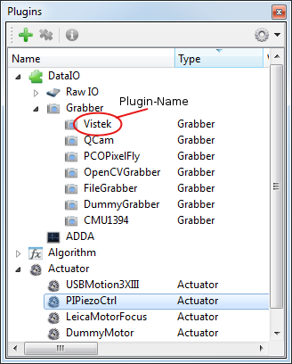

.. include:: ../../include/global.inc

How to start and use a plugin
================================

Hardware Plugins
------------------

In this section you will learn how to create one instance of any hardware plugin (actuator, dataIO...) by a python script or the GUI of |itom|.

Hardware plugins are mainly divided into the following main categories:

* **DataIO** contains all plugins that are related with any data input/output operation. Short, these are mainly 
    
    * cameras and framegrabbers (organized in the subcategory **Grabber**),
    * AD or DA converters (subcategory **ADDA**) or
    * further input / output devices (subcategory **Raw IO**) like the serial port plugin

* **Actuator** contains all motor stages, piezo actuators or further actuator devices

All valid plugins are listed in the plugin toolbox of |itom|

Script-based startup
~~~~~~~~~~~~~~~~~~~~~

In order to start a new instance of any hardware plugin using the python scripting language, search the plugin toolbox for the desired plugin and remember
its plugin-name (case sensitive). Every plugin instance usually needs some mandatory and optional parameters for creating a new instance. Use the command :py:func:`itom.pluginHelp`
in order to get information about a plugin including descriptions of its mandatory and optional parameters:

.. code-block:: python
    
    pluginHelp("pluginName")

The information is then printed out in the command line of |itom|.

Every hardware plugin is either represented by the class :py:class:`itom.dataIO` or :py:class:`itom.actuator`. By creating a new instance of one of these classes, a new instance of
the corresponding plugin is created. The syntax of the constructor is:

.. code-block:: python
    
    myVar = dataIO("pluginName", mandatoryParameters, optionalParameters)
    #or
    myVar = actuator("pluginName", mandatoryParameters, optionalParameters)

where **mandatoryParameters** are all mandatory parameters (just place one value after the other one separated by commas) followed by the optional parameters. If you only want to
indicate some of the optional parameters use the keyword-based argument passing of python:

.. code-block:: python

    
    serial = dataIO("SerialIO", 1, 9600, "\n", parity = 1)
    # opens a serial port device at COM1 with 9600 bauds, 
    # an endline character '\n' and an odd parity as single optional parameters

Once an instance of a plugin is created, the corresponding entry in the plugin toolbox obtains a new child item. In |python|, the variable you used for creating the plugin, is created and
can now be used for controlling the plugin. As long as any variable(s) in |python| still hold a reference to this plugin, its background color in the plugin toolbox is yellow.

In order to close/delete an instance of a plugin you need to delete all variables in |python| that are referencing this plugin, using the command :py:func:`del`:

.. code-block:: python
    
    del serial

.. note::
    
    Since |python| has a garbage collection mechanism it is not assured that any object is immediately deleted once you delete the corresponding variable(s) in the |python| workspace. It is
    really done if the garbage collection process is started which happens in periodical steps. You can force it using the method :py:func:`gc.collect` from the builtin module :py:mod:`gc`.

GUI-based startup
~~~~~~~~~~~~~~~~~~

TODO