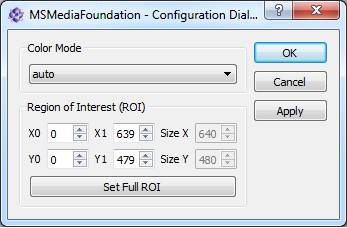
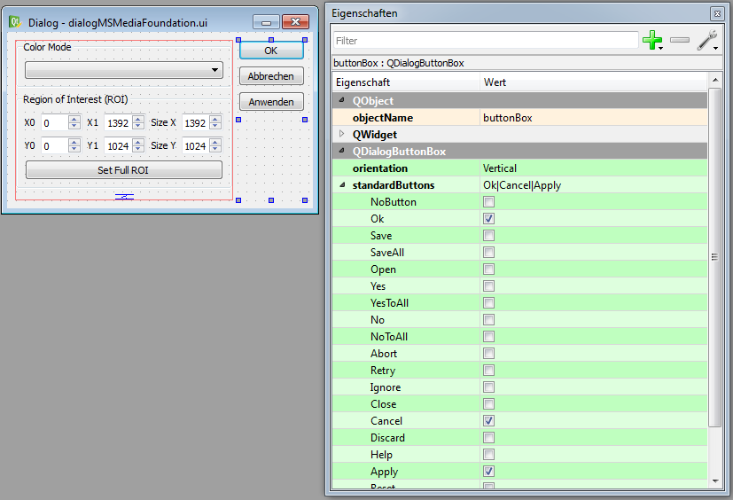

.. include:: ../../include/global.inc

.. sectionauthor:: Marc Gronle

.. _plugin-class-configDialog:

Optional configuration dialog for hardware plugins
####################################################

Every hardware plugin (actuator, dataIO) can provide one configuration dialog that can be shown as a modal dialog (if shown, the remaining application is blocked until the dialog is closed). Using this dialog the user can configure the plugin's instance without need of scripting. An example for the configuration dialog of a USB camera device of the plugin *MSMediaFoundation* looks like:

In difference to the optional :ref:`toolboxes <plugin-class-dockWidget>`, the parameter is not directly changed once the user changes the value of any widget, but the configuration dialog should provide an OK, cancel and optional apply button. By clicking OK, all currently changed values are applied and sent to the plugin via multiple calls to **setParam**. Apply has the same behaviour but the dialog is not closed. By clicking cancel or closing the dialog, no changes are applied.

Usually, the configuration dialog can be opened by the menu or context menu of the plugin toolbox of |itom|. Alternatively, the plugin classes in Python provide the methods:

.. code-block:: python
    
    cam.showConfiguration()

This section describes a possibility to generate such a toolbox.

Base idea behind the config dialog
========================================

Before you start programming the dialog, read the documentation about how to program a :ref:`toolbox <plugin-class-dockWidget>` and consider the following specific hints:

* Although the plugin is always executed in its own thread, the configuration dialog always runs in the main thread of |itom|. Qt has a general restriction that GUI related things must always be executed in the main thread.
* Therefore the communication between config dialog and plugin must be implemented via a thread-safe signal/slot mechanism.
* |itom| provides the base class **ito::AbstractAddInConfigDialog** in order to unify and simplify this process. This base class is contained in the SDK.
* Usually you will design the config dialog with the **Qt Designer** and implement the specific code within a class that is inherited from **ito::AbstractAddInConfigDialog**.
* As last step, you need to add some lines of code in the plugin class such that the plugin and itom know about the existence of the config dialog.
* Since the configuration dialog usually does not provide functionalities to move any actuator axes, the programming for dataIO and actuator devices is the same (in difference to the :ref:`toolboxes <plugin-class-dockWidget>`).

User Interface Design
=========================================

The base design of the config dialog is done in **Qt Designer**. The user is referred to the documentation about creating :ref:`toolboxes <plugin-class-dockWidget>` in order to learn how to create the user interface. The dialog is not created as widget but as dialog. As you see in the following screenshot

it is convenient to realize the OK, Cancel and Apply buttons as widget **QDialogButtonBox**. Click the Ok, Cancel and Apply items of the **standardButtons** property in order to show the desired buttons. It is also allowed to use single buttons for the same behaviour. However, in the following, the dialog button box is used.
    
Necessary Source Code
======================================

After having created the basic user interface in Qt Creator, the config consists of a header and source file. Create the two files in the source directory of the plugin and insert them in the list of header and source files in the plugin's **CMakeLists.txt**. The header file should look like this:

.. code-block:: c++
    
    #ifndef DIALOGYOURPLUGIN_H
    #define DIALOGYOURPLUGIN_H

    #include "common/param.h"
    #include "common/retVal.h"
    #include "common/sharedStructuresQt.h"
    #include "common/abstractAddInConfigDialog.h"

    #include "ui_nameOfTheDialogUiFile.h" //TODO

    #include <qstring.h>
    #include <qmap.h>
    #include <qabstractbutton.h>

    namespace ito
    {
        class AddInBase; //forward declaration
    }

    class DialogYourPlugin : public ito::AbstractAddInConfigDialog 
    {
        Q_OBJECT

        public:
            DialogYourPlugin(ito::AddInBase *pluginInstance);
            ~DialogYourPlugin() {};

            ito::RetVal applyParameters();

        private:
            bool m_firstRun;
            Ui::ObjectNameOfTheUIDialog ui; //TODO

        public slots:
            void parametersChanged(QMap<QString, ito::Param> params);

        private slots:
            //auto-connected slot called if ok, apply or cancel is clicked
            void on_buttonBox_clicked(QAbstractButton* btn);
            
            /*Since all parameters are only evaluated and sent
              if one of the buttons are clicked, you usually don't
              need to connect to the specific signals of all widgets.
              However, if you need to implement special interactive
              functionalities, define some further slots here.
            */
    };

    #endif

The header file has an easier structure than the class of a toolbox, since parameters are only evaluated and sent if one of the buttons
are clicked. Some words about this header file:

* The constructors obtains the pointer to the plugin itself as argument. 
* The member **ui** is a reference to the auto-created class of the **ui**-file. By this member you get access to all widgets added in Qt Creator.
* The member **m_firstRun** can be used to check if the parameters (m_params) of the plugin are send to the config dialog for the first time in order to initialize/configure some widgets at the first run.
* The slot **parametersChanged** is called if some parameters of the plugin are (externally) changed and is called after the creation of the config dialog (see *firstRun*).
* The method **applyParameters()** is responsible for sending all changed parameters to the plugin. This method is automatically called if the dialog is closed using the **apply**-signal (done by the plugin). If the apply button has been clicked, the programmer should call this method as well.
* adapt the lines marked with **//TODO**.

Now, some hints about the implementation of the different methods in the source file.

The constructor passes the pluginInstance pointer to the constructor of the super class **AbstractAddInDockWidget** and initializes the ui-file:

.. code-block:: c++
    
    DialogYourPlugin::DialogYourPlugin(ito::AddInBase *pluginInstance) :
        AbstractAddInConfigDialog(pluginInstance),
        m_firstRun(true)
    {
        ui.setupUi(this);
    }

Initialize the widgets depending on the parameters of the plugin and change their current value if the parameters of the plugin changed (e.g. by a python script):

.. code-block:: c++

    void DialogYourPlugin::parametersChanged(QMap<QString, ito::Param> params)
    {
        //use params (identical to m_params of the plugin)
        //and initialize all widgets (e.g. min, max values, labels, enable some,...)
        
        //if you use two range widgets (class RangeWidget from itomWidgets) for visualizing the ROI,
        //you can directly pass the contraints of the width and height in terms of a ito::RectMeta structure, assigned
        //to the plugin parameter 'roi' to the RangeWidgets:
        /*ito::RectMeta *rm = static_cast<ito::RectMeta*>(params["roi"].getMeta());
        ui.rangeX01->setLimitsFromIntervalMeta(rm->getWidthRangeMeta());
        ui.rangeY01->setLimitsFromIntervalMeta(rm->getHeightRangeMeta());*/
        
        //change the current value of all widgets to the value given in the params map
        
        m_currentParameters = params;
    }
    
.. note::
    
    In difference to the **parametersChanged** method of the toolboxes, the current set of parameters is saved in the member **m_currentParameters**, defined in **ito::AbstractAddInConfigDialog**. This can then be used to check if a parameter has been changed or not. Only changed parameters should be sent back to the plugin in the **applyParameters** method.

Here is the code for a click on any button of the button box (the objectName of the button box in Qt Designer is **buttonBox**:

.. code-block:: c++
    
    void DialogYourPlugin::on_buttonBox_clicked(QAbstractButton* btn)
    {
        ito::RetVal retValue(ito::retOk);

        QDialogButtonBox::ButtonRole role = ui.buttonBox->buttonRole(btn);
        
        //cancel button, emit reject() -> dialog is closed
        if (role == QDialogButtonBox::RejectRole)
        {
            reject(); //close dialog with reject
        }
        //ok button, emit accept() -> dialog is closed
        else if (role == QDialogButtonBox::AcceptRole)
        {
            accept(); //AcceptRole
        }
        else //apply button, only call applyParameters
        {
            applyParameters(); //ApplyRole
        }
    }
    
The most important function of these configuration dialogs is the method **applyParameters**. In the following example, these things are mainly done:

* A vector of **QSharedPointer<ito::ParamBase>**, called *values* is created
* Every parameter that has been changed is added to this vector with its right name, type and new value
* The vector is sent to the plugins instance using the method **setPluginParameters**, defined in **ito::AbstractAddInConfigDialog**.
* The method usually shows a message box if an error or warning occurs during the *setParam* process (see value *msgLevelWarningAndError*).

.. code-block:: c++
    
    ito::RetVal DialogYourPlugin::applyParameters()
    {
        ito::RetVal retValue(ito::retOk);
        QVector<QSharedPointer<ito::ParamBase> > values;
        bool success = false;

        //only send parameters which are changed
        
        //example for 'colorMode', shown as comboBox in the configDialog
        if (QString::compare(m_currentParameters["colorMode"].getVal<char*>(), ui.comboColorMode->currentText()) != 0)
        {
            values.append(QSharedPointer<ito::ParamBase>(new ito::ParamBase("colorMode", ito::ParamBase::String, \
                ui.comboColorMode->currentText().toLatin1().data())));
        }
        
        //check further parameters...

        retValue += setPluginParameters(values, msgLevelWarningAndError);

        return retValue;
    }

    
Implement the config dialog in the plugin
==========================================

In order to add the configuration dialog in the plugin class, two things need to be done.

1. Overload the method **hasConfDialog** in the public domain of the plugin class (e.g. header file) and return 1 in order to indicate that this plugin has a configuration dialog and define the method **showConfDialog**:
    
    .. code-block:: c++
        
        class YourPlugin : public ...
        {
            ...
            public:
                const ito::RetVal showConfDialog(void);
                int hasConfDialog(void) { return 1; }
        ...

2. Implement **showConfDialog** in the plugin's source file:
    
    .. code-block:: c++
        
        const ito::RetVal YourPlugin::showConfDialog(void)
        {
            return apiShowConfigurationDialog(this, new DockWidgetYourPlugin(this));
        }

The api method in the **showConfDialog** method mainly connects the **parametersChanged** signal of the plugin with the same slot in the configuration dialog and sends the current set of parameters (*m_params*) of the plugin to the dialog. Next, the dialog is executed as modal dialog. The function waits until either the **apply** or **reject** signal of the dialog is sent and the dialog is closed. If the **apply** signal is sent, **applyParametes** of the dialog is called such that the parameters of the dialog are set in the plugin. Last but not least, the dialog is destroyed.