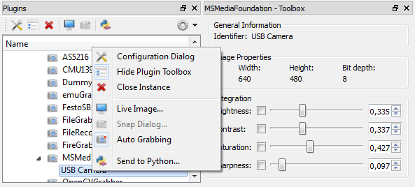
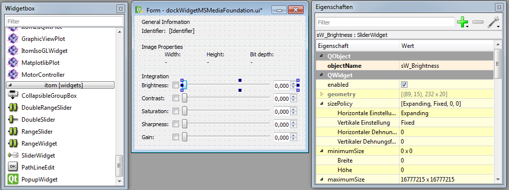
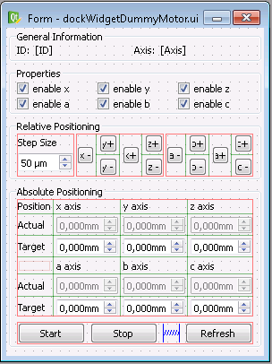

.. include:: ../../include/global.inc

.. sectionauthor:: Marc Gronle

.. _plugin-class-dockWidget:

Optional dock widget (toolbox) for hardware plugins
####################################################

Every hardware plugin (actuator, dataIO) can provide one toolbox (alternatively called *dockWidget*) that can be docked into the main window of |itom| and provide fast access to commonly used parameters and settings of the plugin. An example for the toolbox of a USB camera device of the plugin *MSMediaFoundation* looks like:

Usually, the toolbox can be opened by the menu or context menu of the plugin toolbox of |itom|. Alternatively, the plugin classes in Python provide the methods:

.. code-block:: python

    cam.showToolbox()
    motor.hideToolbox()

This section describes a possibility to generate such a toolbox.

Base idea behind the toolbox
========================================

Before you start programming the toolbox, consider the following hints:

* Although the plugin is always executed in its own thread, the toolbox always runs in the main thread of |itom|. Qt has a general restriction that GUI related things must always be executed in the main thread.
* Therefore the communication between toolbox and plugin must be implemented via a thread-safe signal/slot mechanism.
* |itom| provides the base class **ito::AbstractAddInDockWidget** in order to unify and simplify this process. This base class is contained in the SDK.
* Usually you will design the toolbox with the **Qt Designer** and implement the specific code within a class that is inherited from **ito::AbstractAddInDockWidget**.
* As last step, you need to create one instance of the toolbox class within the constructor of the plugin itself and register the toolbox such that |itom| knows about its existence.

User Interface Design
=========================================

The base design of the toolbox is done in the **Qt Designer**. Its output is a **ui**-file, that is integrated in your plugin project. Within this
**ui**-file it is possible to use specific widgets from the **itomWidgets** project. For instance there exist sliders for double values or sliders with two bar such that a minimum and maximum value can be adjusted using the slider. If you want to have access to these widgets (besides the common Qt widgets like buttons, checkboxes,...), open the **Qt Designer** from |itom|.

Then create a new form of type **Widget** (you are asked this when clicking the new button in Qt Designer). Next you can design the widget using items from the widgetbox. Don't forget to set appropriate layouts in order to have a nice, re-scalable widget. Furthermore, you should try to design a small widget, since it should fit inside the main window of |itom| (e.g. use tabs, ...).

The following image shows the example of the toolbox from the **MSMediaFoundation** plugin where the double sliders from the **itomWidgets** component is used.

Don't forget to give all widgets a suitable object name and configure their properties as far as you can do this at that moment. The final configuration is done later in the C++ class and can therefore be adjusted at runtime, e.g. depending on the specific device. One last thing to remember is to give the overall widget a suitable object name as well (like **DockWidgetMSMediaFoundation** in the example). Then save the **ui**-file in the source folder of your plugin. In the example the filename is **dockWidgetMSMediaFoundation.ui**.

The **ui**-file can only be used and interpreted in your plugin source code if it is inserted into the **CMakeLists.txt** file of the plugin in the right way. The most important things, that are necessary therefore are contained in the following CMake snippet. For more information see the documented template **CMakeLists.txt** files in the *pluginTemplates* folder of the itom source code.

.. code-block:: cmake

    #... somewhere in the area where the header and source files are inserted

    set(plugin_UI
        #add absolute paths to any *.ui files
        ${CMAKE_CURRENT_SOURCE_DIR}/dockWidgetMSMediaFoundation.ui
    )

    #parses the ui-file and generates the corresponding C++ moc-file
    if (QT5_FOUND)
        QT5_WRAP_UI(plugin_UI_MOC ${plugin_UI})
    else (QT5_FOUND)
        QT4_WRAP_UI_ITOM(plugin_UI_MOC ${plugin_UI})
    endif (QT5_FOUND)

    #...

    ADD_LIBRARY(${target_name} ... ${plugin_UI_MOC} ...)

Necessary Source Code
======================================

After having created the basic user interface in Qt Creator, the toolbox now consists of another header and source file. Create the two files in the source directory of the plugin and insert them in the list of header
and source files in the plugin's **CMakeLists.txt**. The header file should look like this:

.. code-block:: c++

    #ifndef DOCKWIDGETYOURPLUGIN_H
    #define DOCKWIDGETYOURPLUGIN_H

    #include "common/abstractAddInDockWidget.h"
    #include "common/addInInterface.h"

    #include <qmap.h>
    #include <qstring.h>

    #include "ui_filenameOfTheToolboxUiFile.h" //TODO

    class DockWidgetYourPlugin : public ito::AbstractAddInDockWidget
    {
        Q_OBJECT

        public:
            DockWidgetYourPlugin(ito::AddInBase *pluginInstance);
            ~DockWidgetYourPlugin() {};

        private:
            Ui::ObjectNameOfTheUserInterface ui; //TODO
            bool m_inEditing;
            bool m_firstRun;

        public slots:
            void parametersChanged(QMap<QString, ito::Param> params);
            void identifierChanged(const QString &identifier);

            //!< for actuators add the following two lines
            //void actuatorStatusChanged(QVector<int> status, QVector<double> actPosition);
            //void targetChanged(QVector<double> targetPositions);

        private slots:
            /*define slots that are called if values of the widgets
              are changed. The connection of the valueChanged, clicked...
              signals to these slots can automatically be done using the
              Qt's auto-connection syntax.

              Example for a slot invoked if the value of the slider sW_Brightness
              changed:
            */
            //  void on_sW_Brightness_valueChanged(double d);
    };

    #endif

Some words about this header file:

* The constructors obtains the pointer to the plugin itself as argument.
* The member **ui** is a reference to the auto-created class of the **ui**-file. By this member you get access to all widgets added in Qt Creator.
* The member **m_inEditing** is used to avoid a never ending ring of "widget value changed" -> "change parameter in plugin" -> "inform toolbox about change" -> "change widget"...
* The member **m_firstRun** can be used to check if the parameters (m_params) of the plugin are send to the toolbox for the first time in order to initialize/configure some widgets at the first run.
* The slot **parametersChanged** should be connected to the plugin's signal with the same name in the **dockWidgetVisibilityChanged** method of the plugin. It is called whenever a parameter of the plugin has been changed.
* The slot **identifierChanged** is invoked if the identifier of the plugin has been changed using **ito::AddInBase::setIdentifier(...)** (e.g. in the init method of the plugin).
* The slots **actuatorStatusChanged** and **targetChanged** (actuators only) should be connected to the signals with the same name of the plugin identical to **parametersChanged**. They are invoked if the status, current position or target position of an actuator axis changed.
* adapt the lines marked with **//TODO**.

Now, some hints about the implementation of the different methods in the source file.

The constructor passes the pluginInstance pointer to the constructor of the super class **AbstractAddInDockWidget** and initializes the ui-file:

.. code-block:: c++

    DockWidgetYourPlugin::DockWidgetYourPlugin(ito::AddInBase *pluginInstance) :
        AbstractAddInDockWidget(pluginInstance),
        m_inEditing(false),
        m_firstRun(true)
    {
        ui.setupUi(this); //initialize ui-file and auto-connect slots

        //for slider widgets it is convenient to set their
        //tracking property to false, such that valueChanged
        //is only emitted if the input ends and not after every
        //single character (e.g. 3 emits for the input of '100')
        //Example:
        //ui.sW_Brightness->setTracking(false);
    }

Initialize the widgets depending on the parameters of the plugin and change their current value if the parameters of the plugin changed (e.g. by a python script):

.. code-block:: c++

    void DockWidgetYourPlugin::parametersChanged(QMap<QString, ito::Param> params)
    {
        if (m_firstRun)
        {
            //use params (identical to m_params of the plugin)
            //and initialize all widgets (e.g. min, max values, labels, enable some,...)
            m_firstRun = false;
        }

        if (!m_inEditing)
        {
            m_inEditing = true;

            //change the current value of all widgets to the value given in the params map

            m_inEditing = false;
        }
    }

In the **identifierChanged** slot, the current string identifier of the plugin instance is passed (usually one time). If you have a label for this,
adjust the text property of this label widget to the given string. Example:

.. code-block:: c++

    void DockWidgetYourPlugin::identifierChanged(const QString &identifier)
    {
        ui.lblIdentifier->setText(identifier);
    }

Finally, you only need to implement the slots invoked if the user changes any values of the widgets. In a toolbox, there is no Apply or OK button like in a configuration dialog.
Therefore, the plugin should immediately react on changes of the widgets. An example for the brightness slider is:

.. code-block:: c++

    void DockWidgetYourPlugin::on_sW_Brightness_valueChanged(double d)
    {
        //d is the new value

        if (!m_inEditing) //only send the value to the plugin if not inEditing mode
        {
            m_inEditing = true;
            QSharedPointer<ito::ParamBase> p(new ito::ParamBase("brightness",ito::ParamBase::Double,d));
            setPluginParameter(p, msgLevelWarningAndError);
            m_inEditing = false;
        }
    }

In this function, a QSharedPointer of ito::ParamBase is created with a new instance of the brightness parameter, that contains the value **d**.
This parameter *p* is then passed to the plugin instance (via signal/slot connection). All this is done in the method **setPluginParameter**, defined in the base class **AbstractAddInDockWidget**.
See the documentation there for more information and further methods, e.g. for passing multiple parameters. If the second argument is set to **msgLevelWarningAndError**, all warnings and
errors from the **setParam** method of the plugin instance are observed and a message box appears. **setPluginParameter** finishes if the result of **setParam** of the plugin is received.

Special functions for actuators
=======================================

Usually, the toolboxes of actuators should contain methods to relatively move single axes by a certain distance or to set the target positions of all axes and start the movement by a start button.
Once the start button is clicked, a stop button can appear whose click signal forces the interrupt of the plugin. The following image shows the ui-file of the plugin **DummyMotor**:

In difference to the implementation given above, you need to learn

* how to start an axis movement
* how to abort the movement
* how to change the appearance of the widgets depending on the state of the axes (e.g. yellow background if moving, red background in case of error and default, white background else)

Lets start with interrupting the movement of all active axes. Simply call the method

.. code-block:: c++

    setActuatorInterrupt();

defined in **AbstractAddInDockWidget**.

For relatively or absolutely moving one or multiple axes, directly call the method

.. code-block:: c++

    setActuatorPosition(QVector<int> axes, QVector<double> positions, \
        bool relNotAbs, MessageLevel msgLevel = msgLevelWarningAndError)
    //or
    setActuatorPosition(int axis, double position, bool relNotAbs, \
        MessageLevel msgLevel = msgLevelWarningAndError)

also defined in **AbstractAddInDockWidget**. They invoke the slots **setPosAbs** or **setPosRel** of the actuator plugin, wait for the release of the semaphore. **relNotAbs** decides whether the
movement is absolute or relative. Use the **msgLevel** to let a message box appear if the movement failed or returned a warning. The default value does both.

Finally, you should implement and connect the slot **targetChanged** and **actuatorStatusChanged** (see header file above). In **targetChanged**, set the value of the related widgets of the user
interface to the new target values (in *mm* or *degree*). The slot **actuatorStatusChanged** is used to update the current positions as well as to analyze the status of all axes.

A dummy implementation changes the background color of the current-value spin boxes for all axes depending on their state. It looks somehow like this:

.. code-block:: c++

    void DockWidgetYourPlugin::actuatorStatusChanged(QVector<int> status, QVector<double> positions)
    {
        bool running = false;
        QString style;

        for (int i = 0; i < status.size(); i++)
        {
            if (status[i] & ito::actuatorMoving)
            {
                style = "background-color: yellow";
                running = true;
            }
            else if (status[i] & ito::actuatorInterrupted)
            {
                style = "background-color: red";
            }
            /*else if (status[i] & ito::actuatorTimeout)
            {
                style = "background-color: green";
            }*/
            else
            {
                style = "background-color: ";
            }

            //here: m_spinCurrentPos is a member pointing to different spin boxes
            // displaying the current position of a specific axis. Do it like it is
            // convenient for you
            m_spinCurrentPos[i]->setStyleSheet(style);
        }

        //in the demo plugin, a method 'enableWidget' with a boolean
        //argument is implemented to en/disable all moving related widgets
        //depending if the motor is running or not (and hides/shows the
        //start and stop buttons.
        enableWidget(!running);

        for (int i = 0; i < positions.size(); i++)
        {
            m_spinCurrentPos[i]->setValue(positions[i]);
        }
    }

Prepare the plugin for the toolbox
=======================================

One last thing needs to be done in order to register the toolbox in the plugin class itself.

At first, insert the following lines at the end of the constructor of the plugin class in order to create one instance of the toolbox class and register the toolbox
within a dockable toolbox of the main window of itom:

.. code-block:: c++

    DockWidgetYourPlugin *toolbox = new DockWidgetYourPlugin(this);

    Qt::DockWidgetAreas areas = Qt::AllDockWidgetAreas; //areas where the toolbox can be positioned (see Qt documentation)

    //define some features, saying if the toolbox can be closed, can be undocked (floatable) and moved...
    QDockWidget::DockWidgetFeatures features = QDockWidget::DockWidgetClosable | \
        QDockWidget::DockWidgetFloatable | QDockWidget::DockWidgetMovable;

    //register the toolbox
    createDockWidget(QString(m_params["name"].getVal<char *>()), features, areas, toolbox);

The last thing: Overload and implement the slot **dockWidgetVisibilityChanged** of the plugin, originally defined in **ito::AddInBase**. This is called whenever
the plugin gets visible or is hidden. If it is visible, connect the signal/slot **parametersChanged** as well as **targetChanged** and **actuatorStatusChanged** in case of an actuator.
This reduced the things to do if the toolbox is not connected. If it gets connected again, forces the resubmission of the current set of parameters, target positions... See the
following example how to do this:

.. code-block:: c++

    void YourPlugin::dockWidgetVisibilityChanged(bool visible)
    {
        if (getDockWidget())
        {
            QWidget *w = getDockWidget()->widget(); //your toolbox instance
            if (visible)
            {
                QObject::connect(this, SIGNAL(parametersChanged(QMap<QString, ito::Param>)), w, \
                    SLOT(parametersChanged(QMap<QString, ito::Param>)));
                emit parametersChanged(m_params); //send current parameters

                //actuators only
                QObject::connect(this, SIGNAL(actuatorStatusChanged(QVector<int>,QVector<double>)), w, \
                    SLOT(actuatorStatusChanged(QVector<int>,QVector<double>)));
                QObject::connect(this, SIGNAL(targetChanged(QVector<double>)), w, \
                    SLOT(targetChanged(QVector<double>)));
                requestStatusAndPosition(true,true); //send current status, positions and targets
            }
            else
            {
                QObject::disconnect(this, SIGNAL(parametersChanged(QMap<QString, ito::Param>)), w, \
                    SLOT(parametersChanged(QMap<QString, ito::Param>)));

                //actuators only
                QObject::disconnect(this, SIGNAL(actuatorStatusChanged(QVector<int>,QVector<double>)), w, \
                    SLOT(actuatorStatusChanged(QVector<int>,QVector<double>)));
                QObject::disconnect(this, SIGNAL(targetChanged(QVector<double>)), w, \
                    SLOT(targetChanged(QVector<double>)));
            }
        }
    }
