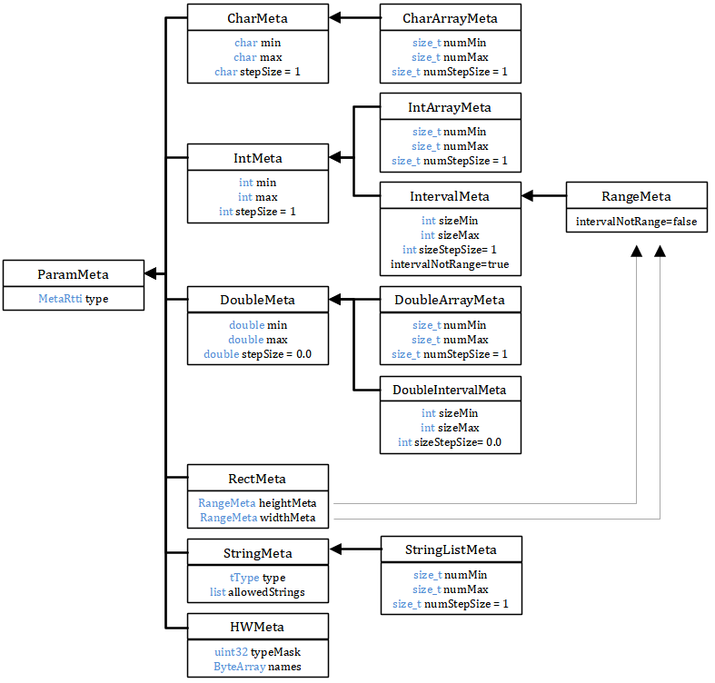

.. include:: ../../include/global.inc

.. sectionauthor:: Marc Gronle

.. _plugin-ParamsMeta:

Parameters - Meta Information
=============================

Every parameter of type ito::Param can contain meta information that describe some boundary values, value ranges, allowed values... of the
parameter. Once a parameter has its valid meta information, itom is able to check given input values with respect to the meta information as well
as adapt any auto-created input masks to simplify the input with respect to the given constraints.

Most possible types of class ito::Param have their respective meta information structure.

.. _plugin-paramMeta-scheme:

The base class of all kind of meta information classes is the class :ref:`ito::ParamMeta <classParamMeta>`. Any instance of class :ref:`ito::ParamMeta <classParamMeta>` can
contain a pointer to an instance of this base class. If you know the type of parameter (e.g. char, string or int), you can savely cast this :ref:`ito::ParamMeta <classParamMeta>`
base instance to the right meta information class that fits to the type.

.. _classParamMeta:

Class ParamMeta
-----------------

The class **ParamMeta** is the base class for all meta information classes. Parameters of class **Param** may
contain pointers of that class, which then must be cast to the final implementation.

.. doxygenclass:: ito::ParamMeta
    :project: itom
    :members:

Class CharMeta, IntMeta and DoubleMeta
------------------------------------------

The classes **CharMeta**, **IntMeta** and **DoubleMeta** provide meta information for parameters of single numeric types.

.. doxygenclass:: ito::CharMeta
    :project: itom
    :members:

.. doxygenclass:: ito::IntMeta
    :project: itom
    :members:

.. doxygenclass:: ito::DoubleMeta
    :project: itom
    :members:
    
Class CharArrayMeta, IntArrayMeta and DoubleArrayMeta
--------------------------------------------------------

The classes **CharArrayMeta**, **IntArrayMeta** and **DoubleArrayMeta** provide meta information for array-based parameters of numeric types.
These classes are derived from **CharArray**, **IntArray** or **DoubleArray**, such that the minimum and maximum value as well as the step size
for each single value is given by the features of their base class. Additionally, it is possible to set a min, max and stepSize constraint concerning
the number of elements of the arrays.

.. doxygenclass:: ito::CharArrayMeta
    :project: itom
    :members:

.. doxygenclass:: ito::IntArrayMeta
    :project: itom
    :members:

.. doxygenclass:: ito::DoubleArrayMeta
    :project: itom
    :members:

Class StringMeta
------------------

By this meta information you can give information about restrictions of strings to different strings. These strings can be interpreted as pure
strings, as wildcard-expressions or regular expressions. The corresponding checks must be defined manually. If a string-parameter has an enumeration defined,
where the strings are interpreted as strings, and if this parameter will automatically be parsed by any input mask in the GUI, the corresponding input text
box becomes a drop-down menu with the given enumeration elements.

.. doxygenclass:: ito::StringMeta
    :project: itom
    :members:

Class DObjMeta
----------------

This meta information class provides further information about allowed types and boundaries concerning the dimension of a data object.

.. doxygenclass:: ito::DObjMeta
    :project: itom
    :members:

Class HWMeta
--------------

By that implementation of a meta information class you can provide information about references to other instantiated plugins.
Every plugin is defined by a bitmask of enumeration **ito::tPluginType** (defined in **addInActuator.h**). You can either add a minimum bitmask, that is required,
to the **HWMeta**-instance or you can define an exact name of a plugin, which must be met.

.. doxygenclass:: ito::HWMeta
    :project: itom
    :members:

