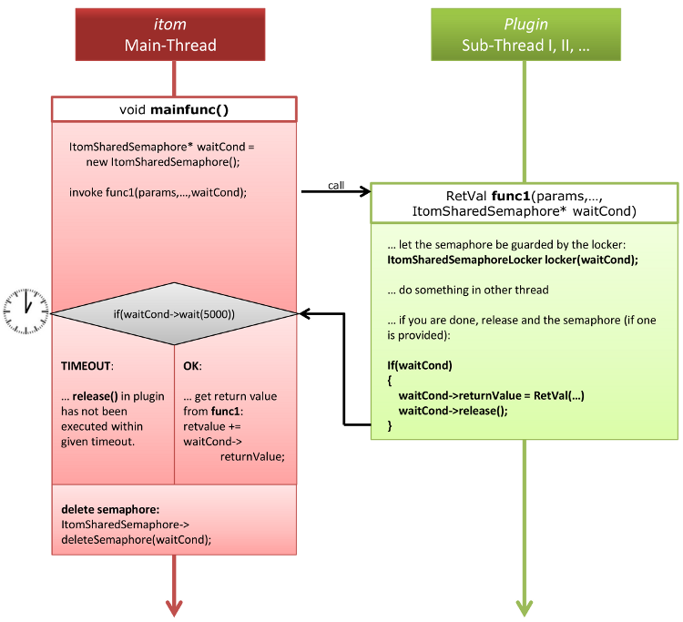

.. include:: ../../include/global.inc

.. sectionauthor:: Marc Gronle

.. _plugin-sharedSemaphore:

ItomSharedSemaphore
===================

In |itom| different main components are executed in different threads.

.. note::
    
    **What is a thread**
    
    In a modern operating system, different programs can run simultaneously. Then, every program is executed in its own process and the operating system is responsible such that each process continuously gets some processing-time on the processor. If your computer has multiple processors, than the operating system can assign processing time of different processes to different processing units.
    
    Every program itself can now run different components of its own software in different threads. Thread are comparable to processes on operating system level, however threads can share memory, such that every thread can have access to a common set of global variables, instances... The advantage is, that a thread can execute a time-consuming calculation while the other thread is responsible for the graphical user interfaces, which now is not blocked while the calculation thread is working. 
    
    For more information about threads see `Wikipedia (english) <http://en.wikipedia.org/wiki/Thread_%28computing%29>`_ or `Wikipedia (german) <http://de.wikipedia.org/wiki/Thread_%28Informatik%29>`_

In |itom|, the following components run into a different thread:

1. Main programm including all graphical user interface components (this is a restricting of windows operating systems). This thread is called "main thread".
2. Python scripting engine. All python scripts are executed in a second thread. Therefore you should not directly use any 3rd-party python modules which open any graphical user interface (like *PyQt*, *tkInter* ...).
3. Every *DataIO* or *Actuator*-plugin is executed in its own thread. Every algorithm is executed in the thread of the calling instance (e.g. main thread or python thread). All widgets provided by any *Algo*-plugin are always executed in the *main thread* (see restricting of point 1).

.. _plugin-sharedSemaphore-scheme:

    
    Figure: Scheme of a communication between |itom| (main thread) and any plugin-method (plugin is running in another thread)

In figure :ref:`plugin-sharedSemaphore-scheme`, a common communcation between a method **mainfunc** which is executed in |itom|'s main thread (e.g. in *AddInManager* and another method **func1** of a plugin is depicted. The plugin is of type *actuator* or *dataIO* and therefore runs in its own thread. **mainfunc** is calling the method **func1**. Usually the calling method has to wait until the called method (**func1**) has been finished (or until the most important parts of **func1** have been executed). In order to consider cases where the plugin-method is not answering within a certain timeout, |itom| has integrated a mechanism such that the waiting-process in the main-function can be stopped after that the timeout time expired. This mechanism is realized by the class **ItomSharedSemaphore**, which is definined in the file *sharedStructuresQt.h* (folder *common*).

**ItomSharedSemaphore** consists of the following elements:

.. c:member:: QSemaphore *m_pSemaphore
    
    ItomSharedSemaphore internally contains an instance of *QSemaphore*, the platform independent semaphore provided by |Qt|. A semaphore can been considered as set of *gaming piece*. Any method executed within different threads can take one or more *gaming pieces* from the common semaphore. If there are not enough *gaming piece* in the storage, the method has to wait until the necessary number of *gaming pieces* become available. Any method which exits some "critical sections" in the code release their previously picked *gaming pieces*, such that other instances can repick them. In most cases in the communcation between |itom| and a plugin-method, the semaphore contains one *gaming piece*, since only two partners are participating in the communication: the method in the main thread and the called method in the plugin-thread. The method in the plugin-thread is picking the *gaming piece* and the calling method has to wait until the *gaming piece* gets back to the storage of the semaphore. This is achieved by *releasing* the *gaming piece* in the called method.
    
.. c:member:: int m_numOfListeners
    
    This is the number of participants at a communcation process (without the calling method). Usually only one method is called, therefore this value is usually equal to 1. This value usually is automatically set.
    
.. c:member:: int m_instCounter
    
    This value indicates how many *gaming pieces* are out of the storage. If the called method is still executing, this value is equal to one. If the called method already release the semaphore, hence *gaming piece*, the value drops to zero.

.. c:member:: bool isCallerStillWaiting()
    
    This method returns true if the calling method (*here*: the method in main thread) is still waiting that the called method has released the semaphore, else the method returns false.

.. c:member:: ito::RetVal returnValue
    
    The called method in the plugin-thread can set that globally accessible return value and the calling method can read its value. That return value is the single way to return the success or error message to the calling method, since no return value of the called method (slot) can directly be returned.
    
Scheme of the inter-thread communication
----------------------------------------

1. The calling method **mainfunc** creates an instance of *ItomSharedSemaphore*:
    
    .. code-block:: c++
        
        ItomSharedSemaphore *waitCond = new ItomSharedSemaphore();

2. Method **func1** is called in the plugin-thread. This can only be done if **func1** is declared as **slot** (*signal-slot-system* of |Qt|). The call is executed using the method **invokeMethod** of *QMetaObject*:
    
    .. code-block:: c++
        
        QMetaObject::invokeMethod(instance-of-plugin,"func1",Q_ARG(paramType1, paramValue1),...,Q_ARG(ItomSharedSemaphore*,waitCond))
    
    For the use of the macros **Q_ARG** and the method **invokeMethod**, see also the documentation of |Qt|.
    
3. Then **func1** is executing and their last parameter *waitCond* contains the pointer to the instance of *ItomSharedSemaphore*.

4. If **func1** has been finished, you should write the return value to the instance of *waitCond* and release the semaphore, hence, return the *gaming piece* to the global storage of the semaphore:
    
    .. code-block:: c++
        
        if(waitCond) //can also be NULL, therefore check it
        {
            waitCond->returnValue = ito::RetVal(ito::retOk)
            waitCond->release()
        }

5. The caller has to wait until the semaphore has been released or a timeout expired. This is done by the member **wait** of **ItomSharedSemaphore**. The single argument of that method is the timeout in milliseconds. Usually you can use the global variable **PLUGINWAIT**, which is set to **5 seconds**. The *wait*-method returns *true* if the semaphore has been released within the timeout, else it returns false:
    
    .. code-block:: c++
        
        if(!waitCond->wait(PLUGINWAIT))
        {
            //timeout occurred
        }

5. Finally all participants at the communcation process (*here*: caller and called method) have to delete the semaphore. Be careful: This can not be done by simply **deleting the pointer to waitCond**. Instead both the caller and the called method have to execute the following command, hence, call the method **deleteSemaphore** of the semaphore pointer:
    
    .. code-block:: c++
        
        waitCond->deleteSemaphore()

6. After that the last participant at the communcation process deleted the semaphore, it is really deleted by |itom|. Then you don't have access to the semaphore any more, hence, you also don't have access to the internal return value.

In order to simplify the process of deleting the semaphore, both the caller and the calling method can also create a variable of type **ItomSharedSemaphoreLocker**, where the pointer to **waitCond** has to be given as constructor-argument. If this variable finally is destroyed, which is automatically done if the method is finished - even after that the *return* command has been executed - it calles the *deleteSemaphore*-method of *ItomSharedSemaphore* with *waitCond* as argument. 

Then the scheme of the caller is:

.. code-block:: c++

    ItomSharedSemaphoreLocker locker(new ItomSharedSemaphore())
    QMetaObject::invokeMethod(plugin-instance,"func1",Q_ARG(paramType1,paramValue1),...,Q_ARG(ItomSharedSemaphore*, locker.getSemaphore())
    
    if(!locker.getSemaphore()->wait(PLUGINWAIT))
    {
        //timeout
        retvalue += ito::RetVal(ito::retError,0,"timeout while executing method");
    }
    else
    {
        retvalue += locker.getSemaphore()->returnValue;
    }
    
and the scheme of the called method **func1** is:

.. code-block:: c++
    
    void func1(type1 param1, ..., ItomSharedSemaphore* waitCond)
    {
        ItomSharedSemaphoreLocker locker(waitCond)
        ... do some calculation ...
        
        if(waitCond)
        {
            waitCond->returnValue = ito::retOk;
            waitCond->release();
        }
        
        return
    }
            

.. note::
    
    For more information about the implementation of class **ItomSharedSemaphore** see :ref:`plugin-ItomSharedSemaphore-Ref` or the doxygen documentation for |itom|.

.. toctree::
   :hidden:

   plugin-sharedSemaphore-Ref.rst