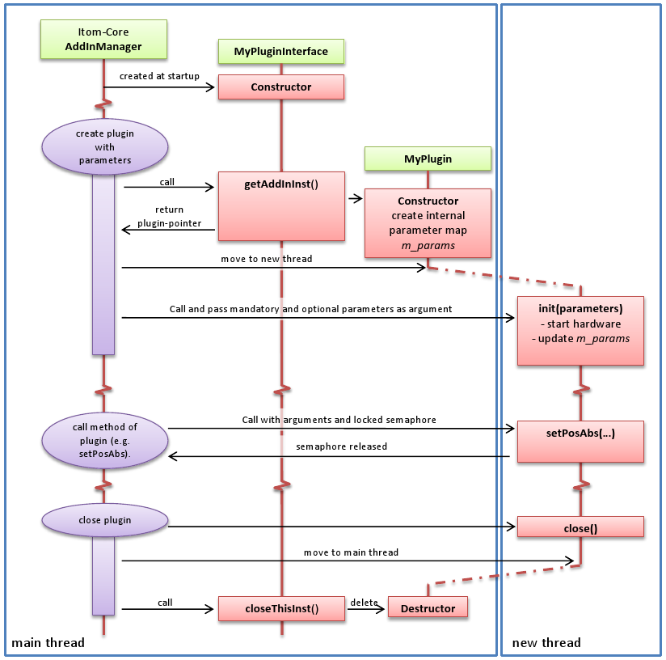

.. include:: ../../include/global.inc

.. toctree::
    :hidden:
    
    plugin-AddInBase-Ref.rst

.. _plugin-class:

Plugin class - Basic information
================================

All plugins, especially hardware-related ones (derived from **AddInActuator**, **AddInDataIO**, ...), have some similar or identical base components. These are described in this chapter. Therefore
it is recommended to read this chapter before continuing with the specific documentation about the type of plugin you want to create. The information given in this chapter is mainly important
for plugins finally derived from classes **AddInActuator** (actuator-plugins) or **AddInDataIO** (displays, cameras, AD-converter, ...). Algorithm or filter-plugins behave a little bit different, however
it remains worth to read this document first.

Common components for actuator and dataIO plugins
-------------------------------------------------

The following components and structures are equal for all plugins of type *actuator* or *dataIO* (including grabbers):

#. Every plugin has an internal set of parameters, that can can be read or changed by the method **getParam** and **setParam** (class **AddInBase**).
#. These parameters are saved in the map **m_params**, member of class **AddInBase**.
#. Each parameter is an instance of class **ito::Param**.
#. The plugin itself is responsible if the new input to any parameter is valid or if the parameter is readonly as has to reject wrong input. For this purpose the parameters' meta information or flags can be used.
#. Every plugin executes its methods mainly in an own thread.
#. The communcation between the plugin and its GUI-components (Config-Dialog, Dock-Widget in main window) must therefore be done using a signal-slot-connection or a simple invoke, that allows to call methods in another thread.
#. The plugin's **init** method is called with the mandatory and optional parameters, those default is set the in the plugin's interface and which are updated by the user input.

The basic scheme of the live-cycle of any plugin is depicted in the following figure:

.. _plugin-plugincall-scheme1:

At startup of |itom|, one single instance (singleton) of each plugin interface class is created and managed by the **AddInManager**. Later, an instance of the real plugin can be requested, for instance in a python-script or by
a C-function call. The arguments to this request are two vectors of mandatory and optional parameters (instances of class **ParamBase**), that are passed to the initialization of the plugin. The default state of these vectors is
obtained by the corresponding interface class (vectors **m_initParamsMand** and **m_initParamsOpt**). These default values have or can be replaced by the values, e.g. indicated in the python script (this is automatically done by |itom|).

Then **AddInManager** calls **getAddInInst()** of the plugin interface, that is creating a new instance of the plugin by calling its constructor. Please consider, that the mandatory and optional parameters are not passed to the
constructor yet. Then, the pointer to the plugin is passed back to the **AddInManager**, that now moves the plugin to a newly created thread. From that point on, methods of the plugin should only be called using a
thread-communcation technique, provided by |Qt|, e.g. using the method **invokeMethod** or the signal-slot-system of |Qt|. Then the method **init** of the plugin is "invoked" by the **AddInManager** and the mandatory and
optional initialization parameters are passed as arguments.

Next, the plugin can be used. Whenever a method of the plugin is called, either by python or any C-method, this call has to be executed again by an "over-thread" communcation technique (**invokeMethod** or signal-slot).
The last argument of such a call always is a locked instance of **ItomSharedSemaphore**. The caller then waits until the semaphore will be released in the plugin's method or a timeout occurred. Please make sure, that
you release the semaphore in your plugin's method only at the point, when you don't need any parameters given by the caller any more. Usually it is released at the bottom of your method. Only in special cases (like
method **waitForDone** (for actuators) it makes sense to release it earlier. For more information about the semaphore see :ref:`plugin-sharedSemaphore`.

Finally, if the plugin should be closed, the inverse function calls with respect to the initialization are executed. That means, the **AddInManager** is at first invoking the method **call** of the plugin (still in its own thread). Then the plugin is moved back to the main thread and then **AddInManager** forces the deletion of the plugin by the method **closeThisInst** of the corresponding interface class.

.. _plugin-class-callInitThread:

.. note::
    
    In some cases, it is not possible to initialize the hardware (some cameras) in another thread than the main thread. Since this initialization should be done in the **init** method of the plugin, |itom| provides a
    possibility to call **init** before moving the plugin to the new thread. Hence, those both steps in :ref:`this scheme <plugin-plugincall-scheme1>` are switched. This can be done by setting the member **m_callInitInNewThread**
    of the plugin interface class from its default value **true** to **false**. However, only use this possibility if there is no other chance, since the GUI is completely blocked during an initialization executed in the
    main thread (see also :ref:`plugin-interface-class`).
    
Plugin-Framework
----------------

The bare framework of any plugin-class of type **DataIO**, **Actuator**, ... (but not **Algo**), looks like this:

.. code-block:: c++
    :linenos:
    
    #include "common/addInInterface.h"
    
    class MyPlugin : public ito::AddInActuator OR public ito::AddInDataIO OR public ito::AddInGrabber 
    {
        Q_OBJECT

        public:
            friend class MyPluginInterface;

        protected:
            ~MyPlugin(){};
            MyPlugin();

        public slots:
            ito::RetVal init(QVector<ito::ParamBase> *paramsMand, QVector<ito::ParamBase> *paramsOpt, ItomSharedSemaphore *waitCond = NULL);
            ito::RetVal close(ItomSharedSemaphore *waitCond);
            
            ito::RetVal getParam(QSharedPointer<ito::Param> val, ItomSharedSemaphore *waitCond = NULL);
            ito::RetVal setParam(QSharedPointer<ito::ParamBase> val, ItomSharedSemaphore *waitCond = NULL);
            
            ito::RetVal execFunc(const QString funcName, QSharedPointer<QVector<ito::ParamBase> > paramsMand, ...
                ... QSharedPointer<QVector<ito::ParamBase> > paramsOpt, QSharedPointer<QVector<ito::ParamBase> > paramsOut, ...
                ... ItomSharedSemaphore *waitCond = NULL);

        private slots:
            void dockWidgetVisibilityChanged(bool visible);
    };

In the corresponding source file you need to write two defines before including the header file above:

.. code-block:: c++
    :linenos:
    
    #define ITOM_IMPORT_API
    #define ITOM_IMPORT_PLOTAPI
    
    #include "myPluginHeaderFromAbove.h"
    
    //implement your code here

In this chapter, hints about implementing the methods in the definitions above are given. In the detailed chapters about every type of plugin, these class definitions will then be extended by the type-specific methods.

At first, your plugin class must be derived from class **ito::AddInActuator** if you want to create an actuator plugin, from class **ito::AddInGrabber** if you want to create a camera or grabber plugin and finally
class **ito::AddInDataIO** for other hardware-related plugins. All those classes are derived from **AddInBase**. Next, the plugin's class must have the macro **Q_OBJECT** defined, such that the plugin is able to participate at the signal-slot-system of |Qt|. That is necessary for a multi-thread-communcation with the plugin.

The constructor and destructor of the plugin are defined in the **protected** section. Only the interface class is able to call these methods, since the interface class is declared as friend of the plugin in line 6.

Then, there are five methods in the **public slots** section, which should be overwritten from their base definition in the class **AddInBase**. The methods **init** and **close** are important for the startup and shutdown
of an instance of the plugin. **getParam** and **setParam** provide read and/or write access to parameters of the plugin, that are usually stored in the member-map **m_params** (however you can also use **getParam** and **setParam** to read and write other parameters. In some special cases, it is necessary to add further, arbitrary functions to the plugin, for instance in order to start an extra calibration process. These calls are
executed by the general method **execFunc**, those first argument is the name of the function. You only have to implement this function, if you need this feature. Until now, this has only been necessary for a low amount of
plugins.

Before the details about the implementation for these methods are explained, let us also take a look at the definition of the class **AddInBase** itself. Only few public or protected member functions of this class must be
overwritten by the plugin (those, that have been described above). However, there are still a lot of further member methods which can be overwritten or useful for the functionality of your plugin. The description of the accessible
member functions and attributes (public, protected, signals, public slots) is described in :ref:`plugin-AddInBase-Ref`.

Now, let us give some hints about the implementation of the methods, that have to be overwritten:

Constructor
+++++++++++

The constructor is a protected member method and should usually only be called by the corresponding interface class. A exemplary implementation is:

.. code-block:: c++
    :linenos:
    
    MyPlugin::MyPlugin(... further parameters ...) : 
        AddInActuator()
    {
        //create internal parameter map
        ito::Param paramVal("name", ito::ParamBase::String | ito::ParamBase::Readonly, "MyPluginName", NULL);
        m_params.insert(paramVal.getName(), paramVal);
        //... add further parameters to map   

        //now create dock widget for this plugin (if available)
        MyPluginDockWidget *myDockWidget = new MyPluginDockWidget(this);
        
        //here: connect signals from the dock widget to the plugin
        // connections that inform the dock widget about changes in parameters, status... should be created
        // and destroyed in the method 'dockWidgetVisibilityChanged'.
        
        //if you can and want, you can assign the unique identification string for this plugin here:
        //m_identifier = QString("my unique plugin nr: %1").arg(yourSerialNumber)
        //you can also set this in the init-method.
        
        Qt::DockWidgetAreas areas = Qt::LeftDockWidgetArea | Qt::RightDockWidgetArea;
        QDockWidget::DockWidgetFeatures features = QDockWidget::DockWidgetClosable | QDockWidget::DockWidgetFloatable | QDockWidget::DockWidgetMovable;
        createDockWidget("MyDockWidgetName", features, areas, myDockWidget);
    }

For the constructor consider the following remarks:

#. The constructor is executed in the main thread and therefore is able to create widgets like the dock widget.
#. The constructor can have an arbitrary amount and type of parameters; the method **getAddInInst** of the interface class must be adapted to them.
#. Call the constructor of the base class (e.g. **AddInActuator**, **AddInDataIO**, **AddInGrabber**) in your constructor.
#. The constructor does not get the mandatory and optional parameters given by to user for initializing the plugin.
#. Create all internal parameters that are part of the parameter-map **m_params** and provide some default values.
#. If your plugin should provide a dock widget (that can be shown as dockable toolbox in the main window of |itom|), follow the snippet from the example above.
#. If your dock widget should be visible at initialization of the plugin or should be undocked as default state, overwrite and change the method **dockWidgetDefaultStyle** of class **AddInBase**.
#. See the specific documentation of each plugin to see which internal parameters must be available and which conventions exist for some specific parameters, that can be created.
#. If you want, set the unique identification string **m_identifier** in this constructor. You can also set it later in the **init**-method. If you don't set it, the auto-assigned unique ID is used for identifying your instance.

Destructor
++++++++++

Use the destructor (executed in main thread) for some final deletion work. Usually an empty body of the destructor is sufficient.

.. code-block:: c++
    
    MyPlugin::~MyPlugin() {}
    

Init
++++

The method **init** has the following bare framework:

.. code-block:: c++
    :linenos:
    
    ito::RetVal MyPlugin::init(QVector<ito::ParamBase> *paramsMand, QVector<ito::ParamBase> *paramsOpt, ItomSharedSemaphore *waitCond)
    {
        ItomSharedSemaphoreLocker locker(waitCond);
        ito::RetVal retValue;
        
        //use the content of paramsMand and paramsOpt (order and type
        // with respect to m_initParamsMand and m_initParamsOpt of
        // interface class) in order to initialize the hardware and
        // change values of the m_params-map if necessary.
        
        //if you want you can set the unique identification string here:
        //m_identifier = QString("IAmAUniqueStringDescribingThisPlugin")
        
        // emit signal about changed parameters
        emit parametersChanged(m_params);     
        
        //release the wait condition and set its returnValue before
        if (waitCond)
        {
            waitCond->returnValue = retValue;
            waitCond->release();
        }
            
        setInitialized(true); //plugin is initialized
        return retValue;
    }

Consider the following hints for the implementation of the **init**-method:

#. Usually it is executed in a new thread (see :ref:`here <plugin-class-callInitThread>`)
#. The parameters are the filled mandatory and optional parameter vectors, those default implementation has been given in the constructor of the interface class.
#. You can be sure, that both the order and type of those plugins remains invariant.
#. Initialize the plugin with respect to these parameters.
#. If necessary change the value of the internal parameters **m_params**.
#. If so, emit the signal **parametersChanged(m_params)**.
#. At the end of the method release the wait condition.
#. Afterwards call **setInitialized(true)** in order to confirm the initialization of the plugin.
#. See the specific documentation of each plugin to see, what else has to be done in the method **init**.

Close
+++++

The method **close** is always executed as last method in the plugin thread. Disconnect your hardware in this method. A simple exemplary implementation is:

.. code-block:: c++
    :linenos:
    
    ito::RetVal MyPlugin::close(ItomSharedSemaphore *waitCond)
    {
        ItomSharedSemaphoreLocker locker(waitCond);
        ito::RetVal retValue;
        
        //your code comes here

        if (waitCond)
        {
            waitCond->release();
            waitCond->returnValue = retValue;
        }
        return retValue;
    }

getParam
++++++++

This method is the getter-method for reading the current value of internal parameters, that usually are an item of the map **m_params**. In this
method (like in others, too) methods provided by the |itom| API are used. Therefore, you need to include the API header in your source file, e.g. by

.. code-block:: c++
    
    #include "common/apiFunctionsInc.h"

The prototype for the method *getParam* then looks like this:

.. code-block:: c++
    :linenos:
    
    ito::RetVal MyPlugin::getParam(QSharedPointer<ito::Param> val, ItomSharedSemaphore *waitCond)
    {
        ItomSharedSemaphoreLocker locker(waitCond);
        ito::RetVal retValue;
        QString key;
        bool hasIndex = false;
        int index;
        QString suffix;
        QMap<QString,ito::Param>::iterator it;
        
        //parse the given parameter-name (if you support indexed or suffix-based parameters)
        retValue += apiParseParamName(val->getName(), key, hasIndex, index, suffix);
        
        if(retValue == ito::retOk)
        {
            //gets the parameter key from m_params map (read-only is allowed, since we only want to get the value).
            retValue += apiGetParamFromMapByKey(m_params, key, it, false);
        }

        if(!retValue.containsError())
        {
            //put your switch-case.. for getting the right value here
            
            //finally, save the desired value in the argument val (this is a shared pointer!)
            *val = it.value();
        }

        if (waitCond) 
        {
            waitCond->returnValue = retValue;
            waitCond->release();
        }

        return retValue;
    }

The **getParam** is either called directly, by changing the thread or by the |Python| script execution, if the appropriate method
**getParam** in |Python| is called. For guaranteeing a thread-safe implementation, the first argument is a shared pointer to a
value of class **ito::Param**. In case of success, the requested value must be saved into this given parameter. The second argument
is a string containing the parameter name. 

It is possible to pass a single parameter name or to follow a given string-syntax in order to
also give a certain array index as well as an additional suffix string. Rules for this syntax are given in the section :ref:`plugin-class-paramname`.
In order to split the given raw name into its possible components **name**, **index** and **suffix**, the method **parseParamName** defined in **helperCommon.h**
can be used. In the exemplary implementation above, the parameter-name is finally searched in the map **m_params** and if found, the value of this parameter
is copied to the given argument **val**. However, this implementation is the most basic one and you can also implement further lines of code.

Since this method can also be called from another thread, an instance of **ItomSharedSemaphore** is passed, that finally needs to be released. The destruction of the
pointer **waitCond** is done by the locker-instance **locker**.

setParam
++++++++

The method **getParam** is the analog method to **setParam**. However, in **setParam** you will not only passed a parametername but also the new value for this parameter.
Then you need to implement the following checks:

* Check whether your internal parameter is **read-only** and if so, reject the set-command.
* Verify the compatibility of the parameter-type of the new and internal parameter.
* Consider further restrictions given by a possible meta information that is appended to the internal parameter and check if the new value fits to these restrictions.
* If any internal parameter changed, emit the signal **parametersChanged** with **m_params** as argument. This signal is globally defined in the base class **AddInBase** and is for instance connected with GUI-elements like the possible dock-widget (toolbox) of this plugin.

Finally, an exemplary (simplified) version for the method **setParam** is:

.. code-block:: c++
    :linenos:
    
    ito::RetVal MyPlugin::setParam(QSharedPointer<ito::ParamBase> val, ItomSharedSemaphore *waitCond)
    {
        ItomSharedSemaphoreLocker locker(waitCond);
        ito::RetVal retValue(ito::retOk);
        QString key;
        bool hasIndex;
        int index;
        QString suffix;
        QMap<QString, ito::Param>::iterator it;
        
        //parse the given parameter-name (if you support indexed or suffix-based parameters)
        retValue += apiParseParamName( val->getName(), key, hasIndex, index, suffix );
        
        if(isMotorMoving()) //this if-case is for actuators only.
        {
            retValue += ito::RetVal(ito::retError, 0, tr("any axis is moving. Parameters cannot be set").toAscii().data());
        }
        
        if(!retValue.containsError())
        {
            //gets the parameter key from m_params map (read-only is not allowed and leads to ito::retError).
            retValue += apiGetParamFromMapByKey(m_params, key, it, true);
        }

        if(!retValue.containsError())
        {
            //here the new parameter is checked whether its type corresponds or can be cast into the
            // value in m_params and whether the new type fits to the requirements of any possible
            // meta structure.
            retValue += apiValidateParam(*it, *val, false, true);
        }
        
        if(!retValue.containsError())
        { 
            if(key == "async")
            {
                //check the new value and if ok, assign it to the internal parameter
                retValue += it->copyValueFrom( &(*val) );
            }
            else if(key == "demoKey")
            {
                //check the new value and if ok, assign it to the internal parameter
                retValue += it->copyValueFrom( &(*val) );
            }
            else
            {
                //all parameters that don't need further checks can simply be assigned
                //to the value in m_params (the rest is already checked above)
                retValue += it->copyValueFrom( &(*val) );
            }
        }
        
        if(!retValue.containsError())
        {
            emit parametersChanged(m_params); //send changed parameters to any connected dialogs or dock-widgets
        }

        if (waitCond) 
        {
            waitCond->returnValue = retValue;
            waitCond->release();
        }

        return retValue;
    }
    
In this base implementation, the parametername is firstly searched in the **m_params**-map. If found, the internal parameter is checked for the
**read-onlyness**. Next, the method distinguishes between numeric and non-numeric parameters, since the numeric-ones can possibly be casted from one
numeric type to another one. If these pre-requisites are met, you should then check the new value for certain restrictions and if this is met, too, 
the internal parameter can be filled with the content of the given, new value. Else, appropriate error messages should be returned and the semaphore **waitCond**
must finally be released.

If you want to set multiple parameters in an uninterrupted sequence, you can also call or invoke the method **setParamVector** defined in **AddInBase**. You don't have to
implement this method, since this is already done. For more infos about this method, see the definition of **AddInBase** (:ref:`plugin-AddInBase-Ref`).

Extend your plugin by registering further functions
-----------------------------------------------------

As already mentioned above, you can extend the set of methods of each plugin, defined by their base classes, by registering further functions. This is for instance
useful, if you want to provide methods for starting a gamma correction, starting a specific calibration, ...

Each such method has the same arguments than the **init**-method of the plugin:

* A vector of mandatory parameters (class **ParamBase**)
* A vector of optional parameters (class **ParamBase**)
* A Vector of out-only parameters (class **ParamBase**)

In the constructor of your plugin, you need to register each of those methods by also predefining the default set of all parameter-vectors (mandatory, optional, out).
Only, if this step has been done, the corresponding method can be called, for instance by using the method **exec** in the |Python| scripting language. The call to this method finally
leads to a call of the method **execFunc**, defined in the class **AddInBase**, which has to be overwritten in your plugin, if you want to provide at least one additional method.

The first parameter of **execFunc** is the name of the additional method. Therefore you need to check for this name and then execute the corresponding algorithm.

An exemplary implementation of the method **execFunc** is

.. code-block:: c++
    :linenos:
    
    ito::RetVal MyPlugin::execFunc(const QString funcName, QSharedPointer<QVector<ito::ParamBase> > paramsMand, ...
        ...QSharedPointer<QVector<ito::ParamBase> > paramsOpt, QSharedPointer<QVector<ito::ParamBase> > paramsOut, ItomSharedSemaphore *waitCond)
    {
        ito::RetVal retValue = ito::retOk;
        ito::ParamBase *param1 = NULL;
        ito::ParamBase *param2 = NULL;

        if(funcName == "saveXMLParams")
        {
            param1 = ito::getParamByName(&(*paramsMand), "filename", &retValue);
            param2 = ito::getParamByName(&(*paramsOpt), "overwriteIfExists", &retValue);

            if(!retValue.containsError())
            {
                retValue += XmlParameter::saveXmlParams( param1->getVal<char*>(), m_xmlParams, static_cast<bool>(param2->getVal<int>()));
            }
        }
        else
        {
            retValue += ito::RetVal::format(ito::retError,0,tr("function name '%s' does not exist").toAscii().data(), funcName.toAscii().data());
        }

        if(waitCond)
        {
            waitCond->returnValue = retValue;
            waitCond->release();
            waitCond->deleteSemaphore();
            waitCond = NULL;
        }

        return retValue;
    }

In this method, one additional function (name **saveXMLParams**) is integrated, which only is called with one mandatory and optional parameter and no further
output parameter. The corresponding registration of this method is integrated in the constructor of your plugin:

.. code-block:: c++
    :linenos:
    
    //register exec functions
    QVector<ito::Param> pMand;
    pMand << ito::Param("filename", ParamBase::String | ParamBase::In, NULL, tr("absolute filename to xml-parameter file").toAscii().data());
    QVector<ito::Param> pOpt;
    pOpt << ito::Param("overwriteIfExists", ParamBase::Int | ParamBase::In, 0, 1, 1, tr("parameter description").toAscii().data());
    QVector<ito::Param> pOut;
    registerExecFunc("saveXMLParams", pMand, pOpt, pOut, tr("description"));

.. _plugin-class-paramname:

Possible parameter names for parameter-map **m_params**
-------------------------------------------------------

The parameters which you add to the **m_params** map, must have a name which fits to the following rules:

* The name starts with a lower or upper case character, hence a value between *a-z* or *A-Z*
* The first character of the name can be followed by an infinite number of alpha-numerical characters (including characters like *_* or *-*).

If the user tries to get or set a parameter e.g. using the python-commands **setParam** or **getParam**, the parameter name firstly is checked if it exists in the **m_params** vector before the corresponding getter or setter methods in the plugin are called. However not the full given parameter string has to match any available key-name in the **m_params** map, since there are further information which can be encoded in the parameter name:

Sometimes it is useful to create a parameter as integer or double array, e.g. for the speed values of every single axis. In this case you will create a parameter with the name **speed** having a type **typeDoubleArray**. Then the user can either access the whole array using the real parameter name **speed**, or the user can access one single value of the array by appending the index within brackets at the parameter name. In this case, it is the programmers task to parse the given parameter string and separate the parameter's real name (here: speed) and the index. Then the index has to be checked with respect to its lower and upper bound.

As further possibility, it is also allowed to append further information to a parameter. This is done by appending a colon-character to the parameter name followed by any string, which is the additional information string. 

To sum this description up, let us assume that the parameter in **m_params** has the name **PARAMNAME**, which fits to the rules above. Then |itom| will accept parameter names, which correspond to the following rules:

* PARAMNAME
* PARAMNAME[INDEX]
* PARAMNAME[INDEX]:ADDITIONALTAG
* PARAMNAME:ADDITIONALTAG

**INDEX** has to be any fixed-pointer number, the **ADDITIONALTAG** can be any string.

It is the programmer's responsibility to split the given parameter name in the three components **PARAMNAME**, **INDEX** and **ADDITIONALTAG** if the corresponding parameter has the ability to handle indexed-values or even additional information (encoded in **ADDITIONALTAG**).

In order to execute this split you can use the method

.. code-block:: c++
    
    ito::RetVal parseParamName(const QString &name, QString &paramName, bool &hasIndex, int &index, QString &additionalTag)
    
defined in **helperCommon.h** and **helperCommon.cpp**.

Furthermore you can use the following regular expression:

.. code-block:: c++
    :linenos:
    
    QString regularExpression = "^([a-zA-Z]+\\w*)(\\[(\\d+)\\]){0,1}(:(.*)){0,1}$";
    QRegExp rx(regularExpression)
    if(rx.indexIn(yourString) == -1)
    {
        //yourString does not match the regular expression
    }
    else
    {
        QStringList components = rx.capturedTexts();
        //components consists of the following sub-strings:
        /*
        [0] full string
        [1] PARAMNAME
        [2] [INDEX] or empty-string if no index is given
        [3] INDEX or empty-string if no index is given
        [4] :ADDITIONALTAG or empty-string if no tag is given
        [5] ADDITIONALTAG or empty-string if no tag is given
        */
    }

