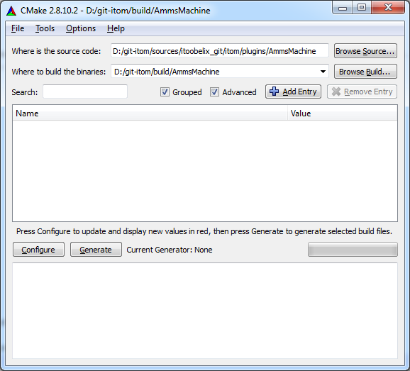
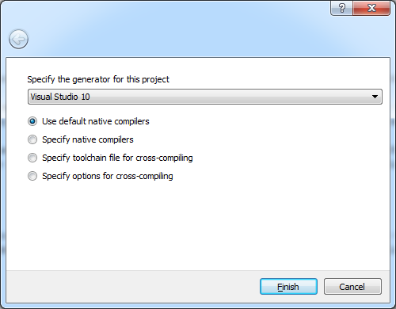
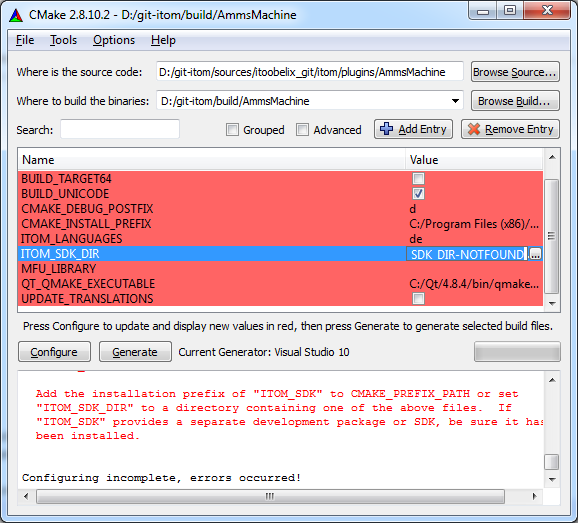
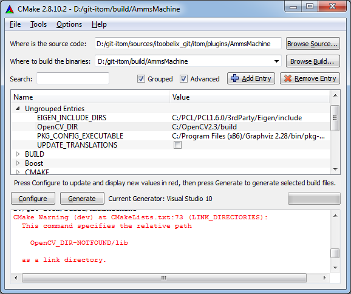

.. include:: ../../include/global.inc

.. sectionauthor:: Marc Gronle

Create a new plugin via CMake
==============================

Plugins for |itom| are also created using **CMake**. Therefore the sources and the project files of the plugins will also be separated, like it is also the case for |itom|, the designer plugins
and all other plugins. You can either put your source files in any subfolder of the location where all sources of your plugins lie or you can put it at any arbitrary location on your harddrive.

The source folder of your plugin mainly consists of these files:

#. **CMakeLists.txt**. This is the project file of your plugin, where you insert the files that are included in your plugin or libraries, the plugin should link with. This file is finally interpreted by **CMake** in order to create the real project files, adapted to your generator (e.g. Visual Studio).
#. **yourPlugin.h** and **yourPlugin.cpp**. This are the main header and source files of your plugin.
#. **dialogYourPlugin.h** and **dialogYourPlugin.cpp** (optional, not for algorithms). Use these files if you want to provide a configuration dialog for your plugin (can also be added later).
#. **dockWidgetYourPlugin.h** and **dockWidgetYourPlugin.cpp** (optional, not for algorithms). Use these files if you want to provide a dock widget of your plugin that is inserted into |itom|'s main window (can also be added later).
#. **pluginVersion.h** (optional). This header contains some defines for your current plugin version. It sould be included in **yourPlugin.cpp** and under MSVC / windows in **version.rc**.
#. **version.rc** (optional, only under MSVC / windows). Under windows the content of this file will be automatically added to the meta-Data of your DLL.

Templates
----------

You will find templates for the most important files needed for creating a new plugin in the folder **pluginTemplates** of the SDK-directory of |itom|.

Copy the file **CMakeLists.txt** from this template-directory and copy it to the source directory of your plugin. Open this file with an arbitrary editor. The commands, starting with #, give you hints where you need to adapt this file. Further details about the syntax of these files can be found under http://www.cmake.org/cmake/help/documentation.html.

Furthermore, you will find template implementations of an actuator, algorithm and camera plugin in the **pluginTemplates** folder. Copy the corresponding header and source file of your type into your source directory and start replacing the template strings by your versions, e.g. you need to change the name of your plugin hence the class names.

Generate project
------------------

If you placed the source files of your plugin into a subdirectory of an existing multi-plugin project, then you need to add the subfolder of your plugin into the file **CMakeLists.txt** of the parent-folder.
This file usually already contains a lot of subdirectories, added by the CMake-command **ADD_SUBDIRECTORY** and has the following form::

    project(itom_plugins) #name of the overall project

    cmake_minimum_required(VERSION 2.8)

    OPTION(BUILD_UNICODE "Build with unicode charset if set to ON, else multibyte charset." ON)
    OPTION(BUILD_SHARED_LIBS "Build shared library." ON)
    OPTION(BUILD_TARGET64 "Build for 64 bit target if set to ON or 32 bit if set to OFF." OFF)
    SET(ITOM_DIR "" CACHE PATH "base path to itom") 

    # Insert the following section for your plugin
    
    # by this option, the plugin can be unchecked in order to
    # avoid its generation in cmake.
    OPTION(PLUGIN_YOURNAME "Build with this plugin." ON)
    if (PLUGIN_YOURNAME)
        ADD_SUBDIRECTORY(YOURSUBDIRECTORY)
    endif (PLUGIN_YOURNAME)

Then, reconfigure and regenerate the overall plugin project or simply run the project **ZERO_CHECK** of your overall plugin solution such that the new plugin is generated and added to the overall solution.
If you have no idea about configuring and generating a **CMake** project, continue reading or check the big :ref:`CMake-section <install-cmake>` about generating |itom| itself.

In order to generate your plugin as single solution, open the **CMake GUI** and choose the source directory of your plugin as source directory and any arbitrary folder as build directory. The solution
and project files are then generated in this build directory.

Then click the configure button to start the configuration. At first, you will be asked for a generator. See :ref:`install-cmake` for more information about generators.
    

    
Then, another configuration process is started. Usually, it is now necessary to set the variable **ITOM_SDK_DIR** to the directory of |itom|'s SDK, usually located in |itom|'s build directory. Then click **configure**
again.
    

Next, you probably need to indicate the location of the build-directory of **OpenCV** on your harddrive (variable **OpenCV_DIR** in the group **OpenCV** or **Ungrouped Entries** if you activated the **Grouped** checkbox).
    

    
Continue clicking **configure** until there are no more warnings. Then you can press **Generate** in order to build the project files.
Change then to the build-directory and open the recently build solution file. In you afterwards change the **CMakeLists.txt**-file, you don't need to explicitly run the CMake-GUI again, since Visual Studio is also
able to directly run CMake and update its project files.