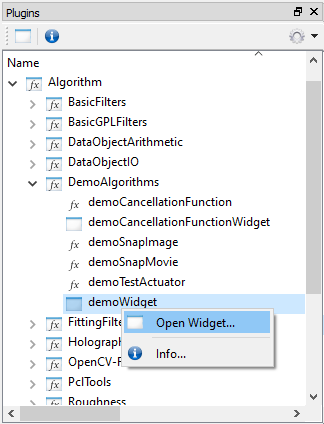

.. include:: /include/global.inc

.. _getStartFilter:

Getting started with algorithm plugins (denoted as filters)
************************************************************

Introduction
===============

Algorithm plugins can contain both specialised algorithms, that work faster if implemented in C++ (including further
3rd party libraries or technologies) rathen than in Python, and / or methods, that provide complex, C++ programmed,
GUIs. The algorithms as well as the GUIs can then be accessed via Python and integrated into ordinary Python scripts.
However, it is also possible to call such algorithms from other plugins of itom.

While single algorithms, implemented in an algorithm plugin, are called **filters** in |itom| (due to historical reasons),
the method to create and return / open an user interface are called **widgets**.

Obtaining help for filters and widgets
==========================================

A list of **filters** and **widgets**, that are contained in one algorithm plugin, can be seen in the 
:ref:`plugin toolbox <gui-plugins>`. Additional information about each filter and widget is gained by selecting 
**Info...** from the context menu of each specific entry in the plugin toolbox or directly by opening the help viewer
of |itom| (menu **Help** >> **Plugin Help Viewer**).

Additionally, there are few Python methods in the :py:mod:`itom` module, that allow a Python-based access to information
about each filter and widget. These information is obtained by the methods :py:meth:`itom.filterHelp` for **filters**
and :py:meth:`itom.widgetHelp` for **widgets**. If these methods are called without further arguments, a list of
all available filters or widget methods including a short info string are printed to the command line.

It is also possible to filter the output by giving a string as first argument. If this string does exactly match one
filter or widget method, detailed information about this filter or widget are printed. Else, all filters and / or
widget methods are displayed, whose name contains the given string. 

.. code-block:: python
    :linenos:
    
    filterHelp()            # list of all available filters
    filterHelp('mean')      # list shortened to filters containing 'mean'
    filterHelp('calcMeanZ') # detailed information on 'calcMeanZ'

.. _filter_interruptible:

Interruptible filters and progress information
================================================

For itom 3.2.1 and older, it was not possible to interrupt calls to filters or to get progress information about
the current state of the algorithm (e.g. if it is a long operation). This has changed from itom 3.3 on,
such that selected filters have both the possibility to be interrupted (via the **Stop Python Script Execution** button)
and / or provide information about their current progress.

Filters, that might have these feature, need to be programmed based on an alternative filter interface (see 
:ref:`documentation about FilterDefExt <plugin-class-algo-filterDefExt>`). The programmer can then indicate in the
algorithm plugin which feature (cancellation ability, progress information) is implemented in a corresponding filter method.

Use the method :py:meth:`itom.filterHelp` or the plugin help viewer of itom to see if a filter has these 
features implemented. If a filter can be cancelled and the user stops the script execution (KeyboardInterrupt),
the current filter is notified about this via an interrupt-flag. As soon as the executed algorithm checks the active
state of this flag, the algorithm is stopped and an interrupt error is returned. However, it is a matter of the
specific implementation of the algorithm, how fast this check and interruption can be executed. Of course, the
further Python script execution is also stopped after having clicked the button or raised the KeyboardInterrupt
execption.

It is also possible to provide a user defined instance of the class :py:class:`itom.progressObserver` to the call
of filters, that support these new features. Then, a parameterless signal (e.g. **clicked()**) of a widget of a user-defined
user interface can be directly connected to the interrupt flag of this observer. Then, the click to this widget
will immediately set the interrupt flag of this observer, which is then checked by the underlying, long-running, 
algorithm (see the example **demo/algoCancelAndProgressWidget.py** for an example in Python or open the widget 
**demoCancellationFunctionWidget** from the **demoAlgorithms** plugin for the C++ demo).

If the filter method provide information about its current progress, it is possible to both provide a progress bar
and / or a label widget to this filter (via the class :py:class:`itom.progressObserver`), such that the filter can
regularily update the integer value of the progress bar (must have a slot **setValue(int)**) and / or the text of
the label (via a slot **setText(QString)**). The progress will be changed from a user-defined minimum value up to
a user-defined maximum value (if the algorithm is finished).

For itom 4.1 or younger, it is also possible to connect to different signals of :py:class:`itom.progressObserver`
via the method :py:meth:`itom.progressObserver.connect`, such that user defined callback methods can be created
in Python, that are called for instance if the current progress value or progress text have changed.

Usage of filters
=======================

Once you know the name of the filter you want to use, you can call it by use of the :py:meth:`itom.filter` command.

If you want to call a default filter without cancellation or progress information features, pass the name of the
filter as first argument (string), followed by the mandatory and optional parameters of the filter itself.
All arguments can be passed as positional arguments and / or keyword arguments.

.. code-block:: python
    :linenos:
    
    filter("filtername", *args, **kwds) #mandatory parameters must be given, optional can be given

If the called filter has optional features, like the cancellation or progress information, an optional instance
of the class :py:class:`itom.progressObserver` can additionally be passed as keyword-based argument **_observer**.
Always pass this parameter with its name (see also the example **demo/algoCancelAndProgressWidget.py**):

.. code-block:: python
    :linenos:
    
    #create an observer, that updates a progressBar (name: myProgressBar)
    #to the current progress value of the called filter.
    observer = itom.pythonObserver(progressBar = myProgressBarHandle)
    
    #connect the clicked() signal of a button (name: btn) to the cancellation feature of the observer
    btn.invokeProgressObserverCancellation("clicked()", observer)
    
    filter("filtername", *args, **kwds, _observer = observer)

.. note::
    
    Most filters require some sort of destination dataObject. Make sure to provide suitable dimensions and datatype.

Usage of widgets
=======================

Every widget method, that is contained in an algorithm plugin (indicated by the small window icon in the plugin toolbox),
returns an initialized widget or window, that can then be displayed as single child window of itom. The content and
interaction of this widget has to be implemented in the algorithm plugin.

There are two ways to initialize such a widget:

**Access via itom GUI / plugin toolbox**

Use the action **Open Widget** of the context menu of the corresponding widget method to initialize and open the 
desired widget. If the widget method does not require further mandatory or optional parameter, the widget is opened
immediately, else the default initialization dialog, known from other plugins like cameras or actuators, is displayed
such that the user can set the configuration before the widget is initialized itself.

**Access via Python script**

Widgets or windows, contained in algorithm plugins, can also be initialized via Python. For this purpose, use one
of the two possible static methods :py:meth:`~itom.ui.createNewPluginWidget` or :py:meth:`~itom.ui.createNewPluginWidget2`.
Both methods return in case of a successful initialization an instance of the class :py:class:`itom.ui`.

The difference between these both static methods is, that the first can only create the widget with its required
mandatory (and optional) parameters, but without further parameterization of the type of window. The latter method
however provides these extended parameters, similar to the default constructor of the class :py:class:`itom.ui`.