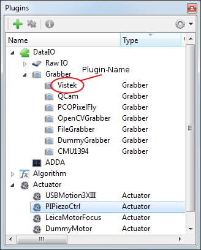
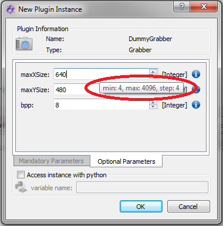
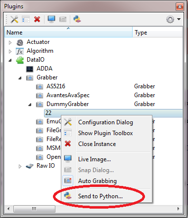

.. include:: /include/global.inc

.. moduleauthor:: T. Boettcher, J. Krauter
.. sectionauthor:: T. Boettcher

.. _getStartHardware:

How to use hardware plugins
***********************************

Introduction
====================

In this section you will learn how to create one instance of any hardware plugin (actuator, dataIO...) by a python script or the GUI of |itom|.

Hardware plugins are mainly divided into the following main categories:

* :py:class:`itom.dataIO` contains all plugins that are related with any data input/output operation. Short, these are mainly

    * cameras and framegrabbers (organized in the subcategory **Grabber**),
    * AD or DA converters (subcategory **ADDA**) or
    * further input / output devices (subcategory **Raw IO**) like the serial port plugin

* :py:class:`itom.actuator` contains all motor stages, piezo actuators or further actuator devices

All valid plugins are listed in the plugin toolbox of |itom|

Many steps below can be done via |python| scripting, or by GUI interaction.

.. note::

    This tutorial is similar to the corresponding sections of the :ref:`getting started tutorial <gettingStarted>`, but describes the use of hardware plugins (:py:class:`~itom.actuator` and :py:class:`~itom.dataIO`) in more detail.

Getting information on plugins
========================================
In order to start a new instance of any hardware plugin using the python scripting language, search the plugin toolbox for the desired plugin and remember its plugin-name (case insensitive).
Before we can start using a hardware plugin, we need to know how to use it.
You can use the :py:func:`itom.pluginHelp` command in |python| to get the necessary information:

.. code-block:: python
    :linenos:

    pluginHelp("[your plugin name]") # e.g. "dummyGrabber"

Or you can use the GUI. Therefore, select **Info...** from the context menu of your plugin in order to show the help page about the plugin:

.. figure:: ./images/dummyGrabberHelp.png
    :align: center
    :scale: 100%

.. note::

    If you don't see the help page, go to the properties dialog of |itom| (menu **File >> Properties**) and select the checkbox **Show DataIO and Actuator** in the tab **General >> Help Viewer**.

Here, most important for us is to learn about the init parameters, especially the mandatory ones.
A more detailed description of the plugin may be found in the plugin documentation.
The fastest way to obtain the command used for initialisation is to drag the plugin into the command line or into the script editor.

Once you got an instance of your plugin running, you can get an even more detailed class description including all member functions via |python|:

.. code-block:: python
    :linenos:

    mygrabber = ("dummyGrabber")
    help(mygrabber)

.. _initHardware:

Initializing hardware plugins
========================================

Instances of :py:class:`~itom.dataIO` or :py:class:`~itom.actuator` can be initialized either by calling the constructor in |python| or through GUI interaction. You may have multiple instances of the same plugin running.

.. note::

    If you want to access an instance in |python|, you have to assign a handle. This can be done later, too.

.. note::

    Most plugins can be initialized with parameters, some of them may be mandatory (just place one value after the other one separated by commas).
    Optional parameter follow after the mandatory ones. Parameters can be assigned in designated order or using keyword notation.

The pythonic way
-------------------------------------

.. code-block:: python
    :linenos:

    firstgrabber = dataIO("dummyGrabber", bpp = 8)   # open first instance of plugin, bpp is assigned using keyword notation
    secondgrabber = dataIO("dummyGrabber", 100, 1, 16)  # open second instance of same plugin using all mandatory parameters in designated order

The GUI way
-------------------------------------

First, select **New Instance** from the context menu of your plugin.

.. figure:: ./images/openDummyGrabber.png
    :align: center
    :scale: 100%

Now, decide if and how your instance should be known to |python|:

.. figure:: ./images/openDummyGrabber2.png
    :align: center
    :scale: 100%

This window also gains access to the mandatory and optional parameters. Detailed information on the parameters and their value range are obtained by mouse hovering over the spinboxes or the blue info symbols.

If you first initialised your plugin without assigning a |python| handle, but decide to do so later, select *Send to Python* from the context menu and choose the variable name.

Deleting a plugin instance
-------------------------------------

Once an instance of a plugin is created, the corresponding entry in the plugin toolbox obtains a new child item. In |python|, the variable you used for creating the plugin, is created and
can now be used for controlling the plugin. As long as any variable(s) in |python| still hold a reference to this plugin, its background color in the plugin toolbox is yellow.

In order to close or delete an instance of a plugin, you have to known by which way this instance has been created, namely by the GUI-based approach or a script command. Even if you
created the instance by the GUI and sent this instance to a Python handle, this instance has originally be created by the GUI. If the instance has been created by the GUI, the background
color of its entry in the plugins toolbox is gray, however, if at least one python handle (variable) is still referencing to this instance, the background color turns to yellow.

In order to close/delete an instance of a plugin you need to delete all variables in |python| that are referencing this plugin, using the command :py:func:`del`:

.. code-block:: python
    :linenos:

    del serial

Additionally, if the instance has been created by the GUI, you need to call the **Close Instance** option from the context menu of the instance entry in the plugins toolbox.

.. note::

    Since |python| has a garbage collection mechanism it is not assured that any object is immediately deleted once you delete the corresponding variable(s) in the |python| workspace. It is
    really done if the garbage collection process is started which happens in periodical steps. You can force it using the method :py:func:`gc.collect` from the builtin module :py:mod:`gc`.

Configuration dialog and dock widget
========================================

Most plugins should provide configuration dialogs. The modal dialogs give access to the most important parameters of a plugin. Also, most plugins come with a dock widget named plugin toolbox, which is non-modal and allows not only for parameter tuning (as the config dialog does), but also live monitoring (for example motor position). Which parameters are actually available in the config dialog and/or the toolbox, is strongly dependent on the actual hardware and its implementation in the plugin.

.. figure:: ./images/openconfigdialog2.png
    :align: center
    :scale: 100%

.. figure:: ./images/showtoolbox2.png
    :align: center
    :scale: 100%

.. _hardwareParameters:

Usage of hardware plugins
========================================

As a major advantage of the plugin concept, different actual devices can be interchanged easily. The class :py:class:`~itom.dataIO` can be of type **rawIO**, **grabber** and **adda**.
You can get the type of the plugin by the command **getType()**, which returns the c++ enumeration value. If different types are true at the same time, their enum value is linked via bitwise and:

    +----------------+---------------------+---------------+----------------+
    |plugin type     |return value {int}   |c++ enum       |remark          |
    +================+=====================+===============+================+
    |dataIO          |1                    |0x1            |                |
    +----------------+---------------------+---------------+----------------+
    |actuator        |2                    |0x2            |                |
    +----------------+---------------------+---------------+----------------+
    |algorithm       |4                    |0x4            |                |
    +----------------+---------------------+---------------+----------------+
    |grabber         |129 = (128+1)        |0x80 + 0x1     |also dataIO     |
    +----------------+---------------------+---------------+----------------+
    |adda            |257 = (256+1)        |0x100 + 0x1    |also dataIO     |
    +----------------+---------------------+---------------+----------------+
    |rawIO           |513 = (512+1)        |0x200 + 0x1    |also dataIO     |
    +----------------+---------------------+---------------+----------------+

:py:class:`~itom.actuator` is the class to use actuator plugins. Each provides a destinctive set of member functions and parameters, which are described in the respective sections below.
Special hardware functionality that is not easily mapped to these member functions and parameters, may be called by the **exec()** member functions.

While you get a detailed class description using the **help()** command (see above), the functions **getParamList()** and **getParamListInfo()** give access to a detailed description of the plugin's parameters.

.. code-block:: python
    :linenos:

    mygrabber = dataIO("dummyGrabber")
    mygrabber.getParamListInfo()

Once you know the name of the desired parameter, the function **getParam()** tells you the actual state and **setParam()** changes it.

.. code-block:: python
    :linenos:

    mygrabber = dataIO("dummyGrabber")
    mygrabber.setParam('integration_time', 0.1)
    mygrabber.getParam('integration_time')

For more information about possible additional functions, call the member method :py:meth:`~itom.dataIO.getExecFuncsInfo` or :py:meth:`~itom.actuator.getExecFuncsInfo` and optionally pass
the name or a part of the name of an **exec**-function. These functions are then called based on mandatory and optional parameters using the methods :py:meth:`~itom.dataIO.exec` or :py:meth:`~itom.actuator.exec`.

The most important functions and parameters of :py:class:`~itom.dataIO` grabber, adda and :py:class:`~itom.actuator` are described in the sections below:

* :ref:`getStartGrabber`
* :ref:`getStartADDA`
* :ref:`getStartActuator`
