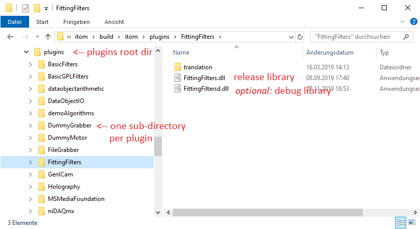
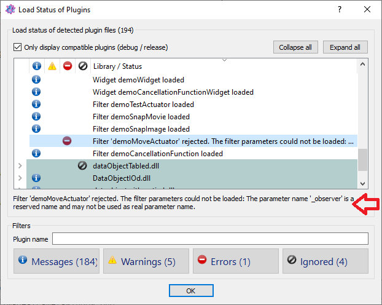

.. include:: /include/global.inc

.. _plugins-loading:

Loading plugins
**************************************

itom plugins are dynamically linked libraries (Windows: DLL files, Linux: SO files), based on the Qt plugin
mechanism (see :ref:`the plugin programming section <plugins-dev>` of this documentation for more information).

At startup of |itom|, the subdirectory **plugins** of the |itom| root directory is recursively scanned for all
available library files. Usually the folder structure of the **plugins** directory is like the following example
(Windows):

Usually, each plugin project automatically creates a subfolder in the **plugins** base directory. This subfolder
then contains optional translation, documentation or sample files as well as at least one library (DLL). Usually
libraries with the file suffix **d.dll** correspond to debug built versions of the libraries and *dll* files
without the suffix *d* are the release versions. Of course, the debug versions are usually not contained in
default versions of |itom|.

When |itom| detects any kind of library in any subfolder of the **plugins** base directory, it is tested with
respect to different rules, before it is accepted as |itom| plugin and loaded.

All plugins of |itom| can make use of commonly used libraries of |itom|, located in the SDK subfolder of the
|itom| root directory. Plugins can only be successfully loaded by |itom|, if they where compiled with binary
compatible versions of all common libraries (e.g. dataObject, commonLib, commonLibQt...) than the current version
of |itom|. To ensure this, the major interface to all plugins, denoted as **ito::AddInInterface**, is eqipped
with a version number, following the scheme of semantic versioning (semver.org). Hence, a core developer of
|itom| has to increment the major version number of this interface (see file **addInInterfaceVersion.h**)
if at least one of the commonly used libraries are changed in a binary-incompatible way. If methods are
added to one of these libraries, the minor version number of the add-in interface has to be incremented...

At the startup of |itom|, the application recursively scans the **plugins** folder and looks for any *DLL*-file on
Windows machines or *so*-file on a Linux operating system. Then each DLL is tried to be loaded using the plugin
system provided by the |Qt|-framework. The *DLL* can successfully be loaded if the following prerequisites are fulfilled:

* The plugin is a release version if |itom| is started in release mode OR
* The plugin is a debug version (this can for example be seen if the DLL-name ends with *...d.dll*) if |itom| is started in debug mode
* The plugin is compiled using the same major and minor version of |Qt| than |itom|
  (it is possible to load a plugin compiled with |Qt| 5.9.6 with |itom| compiled with 5.9.3)
* The plugin is compiled with the same compiler and the same bitness level (x86/x64) than |itom| (e.g. MSVC 2015, x64)
* If the plugin is dependent on other shared libraries which are not linked using a delay-load mechanism, the plugin
  can only be loaded if every necessary shared library can be found and successfully be loaded. If the dependency
  could not be loaded, the plugin-load fails with an error message *module could not be loaded*.
* The remarks contained in the plugin with respect to a minimum and maximum version number of |itom| must correspond
  to the version number of your |itom|
* The add-in interface number, that was used to compile a plugin, has to be compatible to the current add-in interface
  number of |itom|. The compatibility is given if the major part of the version number is equal and if the minor
  version number of the plugin is greater or equal than the minor number, contained in |itom|.

Finally, every successfully loaded plugin is included in the :ref:`plugins toolbox <gui-plugins>` of |itom|.

.. note::

    The version number of the add-in interface has nothing to do with the version number of |itom|. This
    add-in interface version number is contained in the file **common/addInInterfaceVersion.h** and can also
    be seen in the property dialog of any plugin library (under Windows).

The load status of all plugins can be seen in the **loaded plugins** dialog of |itom| (menu **file >> loaded plugins...**):

In this dialog, you can see all detected libraries including their load status. Whenever a plugin could not be loaded,
expand the major entry and click the subentry. Then you can read the full error message below the tree view.

Here is a list of common error messages in this dialog:

1. **Could not load library '...': Module could not be loaded**: It is likely, that the plugin library depends on further
   3rd party libraries, which could not be detected (in the itom root directory, in the subdirectory *lib** or in any
   paths, contained in the PATH environment variable of the operating system). Under Windows, it is recommended to
   use the *dependency walker* tool to check the dependencies of the corresponding plugin library.
2. **AddIn '...' fits to the obsolete interface 3.3.2. The AddIn interface of this version of 'itom' is 4.0.0.**: This
   indicates that the plugin is compiled with an older version of the itom SDK. Please re-compile the plugin with the
   current version of the SDK.
3. **AddIn '...' fits to a new addIn-interface, which is not supported by this version of itom.
   The AddIn interface of this version of 'itom' is 4.0.0.**: The plugin is likely to be compiled with a newer version
   of the itom SDK than used by this version of |itom|.
4. **The plugin '...' uses an incompatible Qt library**: The plugin has been compiled with an incompatible version of
   Qt, also with respect to the release / debug match between itom and its plugins.
5. **The file '...' is not a valid Qt plugin.**: This library is no Qt / itom plugin at all. Maybe it is a 3rd party
   library, used by any other plugin.
6. **AddIn '...' does not fit to the general interface AddInInterfaceBase**: This library seems to be a Qt library,
   but does not implement the required interface of |itom| plugins (*ito.AddIn.InterfaceBase/major-version-number*).

Please consider, that the loaded plugins dialog also displays the load status of additional designer plugins
(located in the subfolder *designer* of |itom|). These designer plugins contain plots or additional widgets, that
can be included in user defined GUIs of |itom|. They follow another interface system. For more information see
:ref:`PlotsAndFigures` or :ref:`listCustomDesignerWidgets`.
