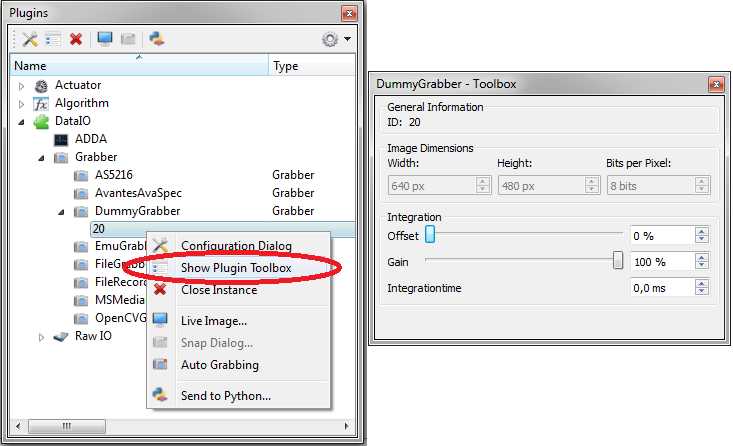

.. include:: /include/global.inc

.. moduleauthor:: T. Boettcher, J. Krauter
.. sectionauthor:: T. Boettcher

.. _getStartHardware:

How to use hardware plugins
#############################

Introduction
*************

This tutorial is similar to the corresponding sections of the :ref:`getting started tutorial <gettingStarted>`, but describes the use of hardware plugins (:py:class:`~itom.actuator` and :py:class:`~itom.dataIO`) in more detail.
Many steps below can be done via |python| scripting, or by GUI interaction.

Getting informations on plugins
*******************************

Before we can start using a hardware plugin, we need to know how to use it. 
You can use the **pluginHelp()** command in |python| to get the neccessary information:

.. code-block:: python
    :linenos:
    
    pluginHelp("dummyGrabber")
    
Or you can use the GUI. Therefore, select **Info...** from the context menu of your plugin in order to show the help page about the plugin:

.. figure:: ../03_gettingStarted/images/dummyGrabberHelp.png
    :align: center
    :scale: 100%

.. note::
    
    If you don't see the help page, go to the properties dialog of |itom| (menu **File >> Properties**) and select the checkbox **Show DataIO and Actuator** in the tab **General >> Help Viewer**.

Here, most important for us is to lern about the init paramaters, especially the mandatory ones.
A more detailed description of the plugin may be found in the plugin documentation. 

Once you got an instance of your plugin running, you can get an even more detailed class description including all member functions via |python|:

.. code-block:: python
    :linenos:
    
    mygrabber = dataIO("[your plugin name]") # i.e. "dummyGrabber"
    help(mygrabber)

.. _initHardware:
Initialising hardware plugins
*****************************

Instances of :py:class:`~itom.dataIO` or :py:class:`~itom.actuator` can be initialised either by calling the constructor in |python| or through GUI interaction. You may have multiple instances of the same plugin running. 

.. note::
    
    If you want to access an instance in |python|, you have to assign a handle. This can be done later, too. 

.. note::
    
    Most plugins can be initialised with paramaters, some of them may be mandatory. Parameters can be assigned in designated order or using keyword notation.

The pythonic way
===================

.. code-block:: python
    :linenos:
    
    firstgrabber = dataIO("dummyGrabber", bpp = 8)   # open first instance of plugin, bpp is assigned using keyword notation
    secondgrabber = dataIO("dummyGrabber", 100, 1, 16)  # open second instance of same plugin using all mandatory parameters in designated order

    
The GUI way
===================    
First, select **New Instance** from the context menu of your plugin.

.. figure:: ../08_scriptLanguage/getStart/openDummyGrabber.png
    :align: center
    :scale: 100%

Now, decide if and how your instance should be known to |python|:

.. figure:: ../08_scriptLanguage/getStart/openDummyGrabber2.png
    :align: center
    :scale: 100%

This window also gains access to the mandatory and optional parameters. Detailed information on the parameters and their value range are obtained by mouse hovering over the spinboxes or the blue info symbols.

.. figure:: ../08_scriptLanguage/getStart/openDummyGrabber3.png
    :align: center
    :scale: 100%

If you first initialised your plugin without assigning a |python| handle, but decide to do so later, select *Send to Python* from the context menu and choose the variable name. 
    
.. figure:: ../08_scriptLanguage/getStart/sendtopython.png
    :align: center
    :scale: 100%

    
Configuration dialog and dock widget
************************************

Most plugins should provide configuration dialogs. The modal dialogs give access to the most important parameters of a plugin. Also, most plugins come with a dock widget named plugin toolbox, which is non-modal and allows not only for parameter tuning (as the config dialog does), but also live monitoring (for example motor position). Which parameters are actually available in the config dialog and/or the toolbox, is strongly dependent on the actual hardware and its implementation in the plugin.

.. figure:: ../08_scriptLanguage/getStart/openconfigdialog2.png
    :align: center
    :scale: 100%

.. _hardwareParameters:
Usage of hardware plugins
*****************************

As a major advantage of the plugin concept, different actual devices can be interchanged easily. The class :py:class:`~itom.dataIO` can be of type **rawIO**, **grabber** and **adda**. 
You can get the type of the plugin by the command **getType()**, which returns the c++ enumeration value. If different types are true at the same time, their enum vaule is linked via bitwise and:

    +----------------+---------------------+---------------+----------------+
    |plugin type     |return value {int}   |c++ enum       |remark          |
    +================+=====================+===============+================+
    |dataIO          |1                    |0x1            |                |
    +----------------+---------------------+---------------+----------------+
    |actuator        |2                    |0x2            |                |
    +----------------+---------------------+---------------+----------------+
    |algorithm       |4                    |0x4            |                |
    +----------------+---------------------+---------------+----------------+
    |grabber         |129 = (128+1)        |0x80 + 0x1     |also dataIO     |
    +----------------+---------------------+---------------+----------------+
    |adda            |257 = (256+1)        |0x100 + 0x1    |also dataIO     |
    +----------------+---------------------+---------------+----------------+
    |rawIO           |513 = (512+1)        |0x200 + 0x1    |also dataIO     |
    +----------------+---------------------+---------------+----------------+

:py:class:`~itom.actuator` is the class to use actuator plugins. Each provides a destinctive set of member functions and parameters, which are described in the respective sections below. 
Special hardware funtionality that is not easily mapped to these member functions and parameters, may be called by the so called **exec_funcs()**.
While you get a detailed class description using the **help()** command (see above), the functions **getParamList()** and **getParamListInfo()** give access to a detailed description of the plugin's parameters.

.. code-block:: python
    :linenos:
    
    mygrabber = dataIO("dummyGrabber") 
    mygrabber.getParamListInfo()

Once you know the name of the desired parameter, the function **getParam()** tells you the actual state and **setParam()** changes it.

.. code-block:: python
    :linenos:
    
    mygrabber = dataIO("dummyGrabber")
    mygrabber.setParam('integration_time', 0.1)
    mygrabber.getParam('integration_time')

The most important functions and parameters of :py:class:`~itom.dataIO` grabber, adda and :py:class:`~itom.actuator` are described in the sections below.
    
.. toctree::
    :maxdepth: 1
    
    getstart-grabber.rst
    getstart-adda.rst
    getstart-actuator.rst