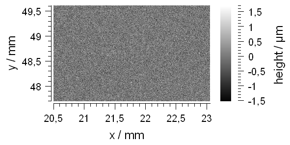
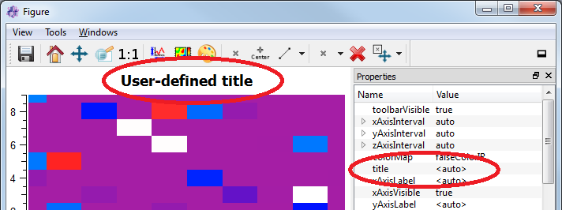

.. include:: ../../include/global.inc

.. _itomDataObject:

DataObject 
==========

.. moduleauthor:: ITO
.. sectionauthor:: ITO

Introduction
------------

In |itom|, the class :py:class:`~itom.dataObject` is the main array object. Arrays in |itom| can have the following properties:

* unlimited number of dimensions
* each dimension can have an arbitrary size
* possible data types:
    .. code-block:: python
        
        "uint8"      #unsigned integer, 8 bit [0,255]
        "int8"       #signed integer, 8 bit [-128,127]
        "uint16"     #unsigned integer, 16 bit [0,65536]
        "int16"      #signed integer, 16 bit [-32768,32767]
        "uint32"     #unsigned integer, 32 bit
        "int32"      #signed integer, 32 bit
        "float32"    #floating point, 32 bit single precision
        "float64"    #floating point, 64 bit double precision
        "complex64"  #complex number with two float32 components
        "complex128" #complex number with two float64 components

Before giving a short tutorial about how to use the class :py:class:`~itom.dataObject`, the base idea and concept of the array structure should be explained. If you already now the huge |python| module **Numpy** with its base array class **numpy.array**, one will ask why another similar array class is provided by |itom|. The reasons for this are as follows:

* The python class :py:class:`~itom.dataObject` is just a wrapper for the |itom| internal class **DataObject**, written in C++. This array structure is used all over |itom| and also passed to any plugin instances of |itom|. Internally, the C++ class **DataObject** is based on OpenCV-matrices, such that functionalities provided by the open-source Computer-Vision Library (OpenCV) can be used by |itom|.
* The class **dataObject** should also be used to store real measurement data. Therefore it is possible to add tags and other meta information to every dataObject (like axis descriptions, scale and offset values, protocol entries...).
* Usually, array classes (like the class **Numpy.array**) store the whole matrix in one continuous block in memory. Due to the working principle of every operating system, it is sometimes difficult to allocate a huge block in memory. Therefore, **dataObject** only stores the sub-matrices of the last two-dimensions in single blocks in memory, while the first **n-2** dimensions of the array are represented by one vector in memory, where every cell is pointing to the corresponding sub-matrix (called plane). Using this concept, huger arrays can be allocated without causing a memory error.

Creating a dataObject
---------------------

In general, a :py:class:`~itom.dataObject` is created like any other class instance in |python|, hence the constructor of class :py:class:`~itom.dataObject` is called. For a full reference of the constructor of class **dataObject**, type

.. code-block:: python
    
    help(dataObject)

In the following example, some dataObjects of different size and types are created. Using these constructors, the content of the created array is arbitrary at initialization:

.. code-block:: python
    :linenos:
    
    #1. empty dataObject, dimensions: 0, size: []
    a = dataObject()
    
    #2. one dimensional dataObject
    #  a one dimensional dataObject already is
    #  allocated as an array of size [1 x n]
    b = dataObject([5], "float32") #size [1x5]
    
    #3. 5 x 3 array, type: int8
    c = dataObject([5,3], "int8")
    
    #4. 2 x 5 x 10 array, type: complex128
    #  here two planes of size [5x10] are created and a vector with two items points to them
    d = dataObject([2,5,10], "complex128")
    
    #5. 2 x 5 x 10 array, type: complex128, continuous
    #  This matrix has the same size and type than matrix
    #  'd' above. However, the continuous keyword indicates,
    #  that python should already allocate all planes in
    #  one block. Then the data object can be converted in
    #  a numpy.array without the need of copying the data block
    #  in memory. It is useful to use this keyword, if you
    #  often want to switch between dataObject and numpy.arrays.
    #  However consider that this is not recommended for huge
    #  matrices.
    e = dataObject([2,5,10], "complex128", continuous = True)
    
    #6. create a 2x3, uint16 dataObject filled with [[1,2,3],[4,5,6]]
    f = dataObject([2,3], "uint16", data = (1,2,3,4,5,6))

You can also use the copy constructor of class **dataObject** in order to create
a dataObject from another array-like object or a sequence of numbers (tuple, list...).
In |python| it is usual, that different objects share their memory (for arrays the memory
is mainly the data block(s)) as long as possible, such that memory and execution time is saved. This is also the case when using the copy constructor. See the **Numpy** documentation for more information about this. The main thing you should know is, that if you change the value of any cell of an array, the corresponding value is also changed in all arrays, that share their memory with the dataObject.

.. code-block:: python
    :linenos:
    
    #1. create dataObject from any array-like object (e.g. Numpy array)
    import numpy as np
    a = np.ndarray([5,7])
    b = dataObject(a) #b has the continuous flag set
    
    #2. create dataObject from a tuple of values
    #  any object, that python can interpret as sequence can be used
    #  in order to initialize the data object. The dataObject can have
    #  an arbitrary size or number of dimensions, if the total number
    #  of elements fits to the length of the given input sequence.
    #  In this case, the sequence is totally copied into the data object.
    #  The values are filled row-by-row into the array, also called as
    #  c-continuous creation.
    c = (2,7,4,3,8,9,6,2) #8 values
    d = dataObject([2,4], data = c)
    
    #3. create a dataObject as shallow copy of another dataObject
    e = dataObject(d)
    
Static constructors for dataObjects
------------------------------------

If a **dataObject** is created using one of the default constructors (without keyword *data*), the matrix is allocated to the right 
side but the values usually have no defined content. The values are even not randomly distributed. In order to generate a pre-filled
**dataObject**, there exist some special static methods. These are:

* Use :py:meth:`~itom.dataObject.eye` to create a 2D, square, eye matrix.
* :py:meth:`~itom.dataObject.ones` is used to created a n-dimensional dataObject filled with ones.
* :py:meth:`~itom.dataObject.zeros` is used to created a n-dimensional dataObject filled with zeros.
* :py:meth:`~itom.dataObject.rand` is used to created a n-dimensional dataObject filled with uniformly distributed random values: range [0,1) for floating point values, else the values are taken from the entire value range of the data type.
* :py:meth:`~itom.dataObject.randN` is used to created a n-dimensional dataObject filled with gaussian distributed random values.

.. code-block:: python
    
    a = dataObject.ones([3,4], 'uint8')
    a.data()
    #returns:
    #dataObject(size=[3x4], dtype='uint8'
    #    [[  1,   1,   1,   1],
    #     [  1,   1,   1,   1],
    #     [  1,   1,   1,   1]])

Print content of dataObject
-----------------------------

If you type the variable name of a **dataObject** into the command line of |itom| and press return, the short string representation with all important
facts of the dataObject are printed in one line. This is the same result than using the :py:meth:`print` command of Python. If you want to obtain
the full content of a **dataObject** in the command line, use the method :py:meth:`~itom.dataObject.data`:

.. code-block:: python
    
    a = dataObject.ones([3,4], 'uint8')
    print(a)
    #returns:
    #dataObject('uint8', [3 x 4], continuous: 1, owndata: 1)
    
    a.data()
    #returns:
    #dataObject(size=[3x4], dtype='uint8'
    #    [[  1,   1,   1,   1],
    #     [  1,   1,   1,   1],
    #     [  1,   1,   1,   1]])
    
.. note::
    
    The string representation (using the :py:meth:`print` method) of a numpy array will print the full or cropped content of the numpy array
    to the command line (cropped if it is too big). For **dataObjects**, the content is only print using the :py:meth:`~itom.dataObject.data` method.
    
Basic attributes of a dataObject
-------------------------------------

Any created **dataObject** provides some basic attributes that describe the corresponding array:

* The attribute :py:attr:`~itom.dataObject.ndim` or :py:attr:`~itom.dataObject.dims` return the number of dimensions of the  **dataObject**.
* The attribute :py:attr:`~itom.dataObject.shape` returns a tuple with the size for every axis. The size of the tuple corresponds to the number of dimensions. Remember, that the order is always (y,x), (z,y,x)...
* The attribute :py:attr:`~itom.dataObject.dtype` returns a string with the type of the **dataObject** (e.g. uint8, float32 or complex64).
* The attribute :py:attr:`~itom.dataObject.continuous` returns True if the data block lies continuously in memory or not (False). False is only possible for 3 or higher dimensional dataObjects. Then, the memory of the single planes lies distributed at different locations in the memory allowing to save bigger matrices in the available memory. While a continuous dataObject can share its memory with a numpy array, a non-continuous dataObject has to be converted in the continuous version before being transmitted to a numpy array (this is implicitely done).

Examples:

.. code-block:: python
    
    a = dataObject.ones([5,4,3,2], 'uint16')
    print("dims:", a.ndim, "shape:", a.shape, "type:", a.dtype)
    #returns:
    #dims: 4 shape: (5, 4, 3, 2) type: uint16

Value and axes descriptions, units, scaling and offset
-------------------------------------------------------

Usually, **dataObjects** and numpy arrays are quite similar and very compatible to each other. They can even share memory (if continuous) and dataObjects can usually be
used whenever a function requires an **array-like** input type (the class :py:class:`~itom.dataObject` implements the **array-like** interface definitions). However, the
**dataObject** has been made in order to also save protocol information, meta information as well as the physical meaning of the matrix. As one powerful feature, it is possible
to set an arbitrary description, unit, scaling and offset to all axes as well as a description and unit to the values. If a **dataObject** is plot (e.g. by :py:meth:`itom.plot`), 
these properties are read and considered in the plot. 

In detail:

* Every axis as well as the value axis can have a description (e.g. 'length')
* Every axis as well as the value axis can have a unit (e.g. 'mm', 'm', 'nm'...). Some algorithms consider these units for special calculations.
* Every axis (but not the value axis) can have a scaling (default: 1.0)
* Every axis (but not the value axis) can have an offset (default: 0.0)

Scaling and offset transform the pixel coordinate in the matrix (beginning with 0 in all axes) into a physical coordinate. While the values in a matrix are always addressed
by their pixel coordinate (in integer values), the physical units are displayed in the plots (e.g. designer widget type *itom1dqwtplot* or *itom2dqwtplot*). The following
example should explain the advantage of the scaling and offset values:

Lets assume that a white-light interferometer records a 2.5D topography of an object. The distance between two adjacent pixels in 2.5 µm in both directions. Additionally, the
start position of the x-y-stage is (20.5 mm and 47.7 mm in x and y direction, respectively). These values can then be considered in the obtained **dataObject** by the following code:

.. code-block:: python
    
    # coding=iso-8859-15
    # the coding is important due to the micron sign below
    
    record = dataObject.randN([768, 1024], 'float32')
    #record is assumed to be a dataObject
    record.axisScales = (0.0025, 0.0025)
    record.axisOffsets = (-47.7 / 0.0025, -20.5 / 0.0025) #offset is given in pixel
    record.axisUnits = ('mm', 'mm')
    record.axisDescriptions = ('y', 'x')
    record.valueUnit = ('µm')
    record.valueDescription = 'height'
    plot(record)
    
The output is then:

    
The relation between pixel coordinates and the physical coordinates is:

phys = (pix - offset) * scaling
pix = phys / scaling + offset

These transformations can be done using the methods :py:meth:`~itom.dataObject.physToPix` and :py:meth:`~itom.dataObject.pixToPhys`.
    
    
Meta tags and protocol
----------------------------------

It is often required to store further meta information together with a dataObject. For this purpose, the dataObject provides arbitrary meta tags (either string or double values) or a
string based protocol list. While the first can be used to store timestamps, system configurations, calibration states, ... the latter can be used to document filter chains that have
already be executed.

Tags are always a mapping between a string-keyword and either a double or string value. The class :py:class:`itom.dataObject` provides several functions and attributes in order
to set or read tags:

.. code-block:: python
    :linenos:
    
    obj = dataObject([10,10], 'float32')
    #add new tags:
    obj.setTag("sensor", "confocal sensor v1.0")
    obj.setTag("aperture", 0.6)
    
    #get tags:
    print("aperture:", obj.tags["aperture"])
    print("sensor:", obj.tags["sensor"])
    print("num tags:", len(obj.tags))
    
    if obj.existTag("manufacturer"):
        print("The tag 'manufacturer' exists")
    else:
        print("The tag 'manufacturer' does not exist")
    
    #delete tag
    success = obj.deleteTag("aperture")
    print("success:", success)
    
The output will be:

.. code-block:: python
    
    aperture: 0.6
    sensor: confocal sensor v1.0
    num tags: 2
    success: 1.0
    
One special tag is the 'title'-tag. If you plot a dataObject with a string-based 'title'-tag (e.g. with *itom1dqwtplot* or *itom2dqwtplot*), the title tag
will be used as title for the plot (if the property *title* of the plot is set to **<auto>**):

.. code-block:: python
    :linenos:
    
    obj.setTag("title", "User-defined title")
    plot(obj, "2D")
    
This code will lead to the following plot (under the assumption, that the designer plugin **itom2dqwtplot** is set as default 2D plot in the :ref:`properties dialog <gui-default-plots>`
of |itom|):

    
The attribute :py:attr:`~itom.dataObject.tags` returns a mapping object to a dictionary. This has to be considered to be a read-only dictionary, where no item can be deleted, appended
or changed. However, it is possible to assign a new dictionary to this attribute. Then, all current tags are deleted and the new dictionary items are considered to be the new tags.
    

The protocol of a dataObject is a list of strings. Use the method :py:meth:`~itom.dataObject.addToProtocol` in order to add a new entry to the protocol. If the dataObject is
a slice of another object, the string **ROI[...]** with the current slice parameters is prepended to each new protocol entry. Finally, the protocol is stored as tag **protocol**
and can be requested and deleted using the methods described above.    

.. note::
    
    It is not possible to set tags or protocol entries for empty dataObjects. Tags and the protocol is shared between two shallow copies, hence, if two dataObjects share the same
    data, they also share their tags and protocol.

For a detailed methods-summery of the *dataObject* see :ref:`ITOM-Script-Reference`.